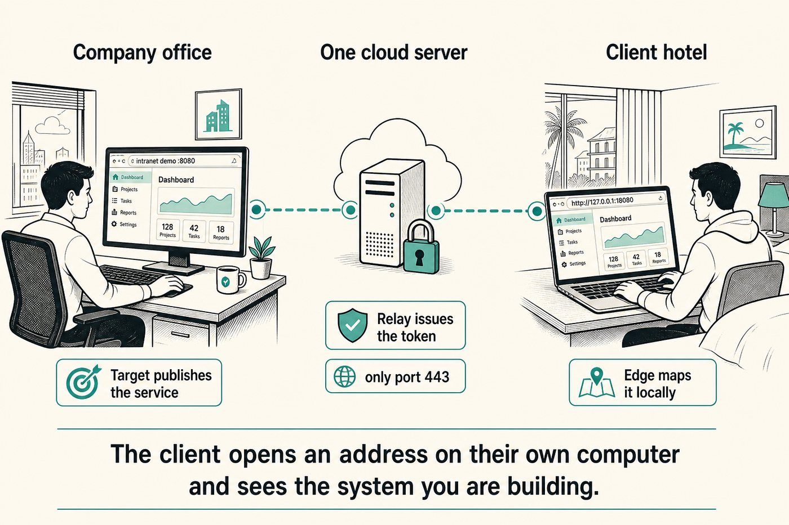
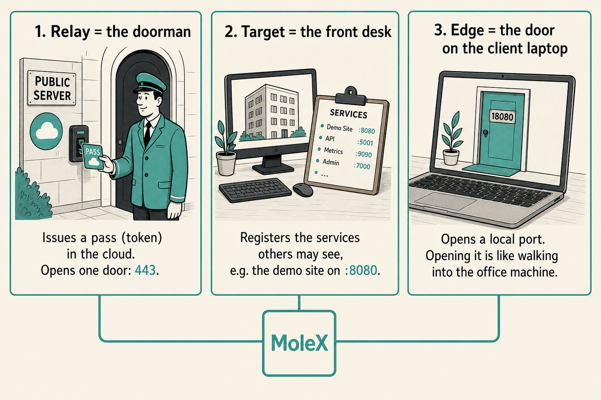
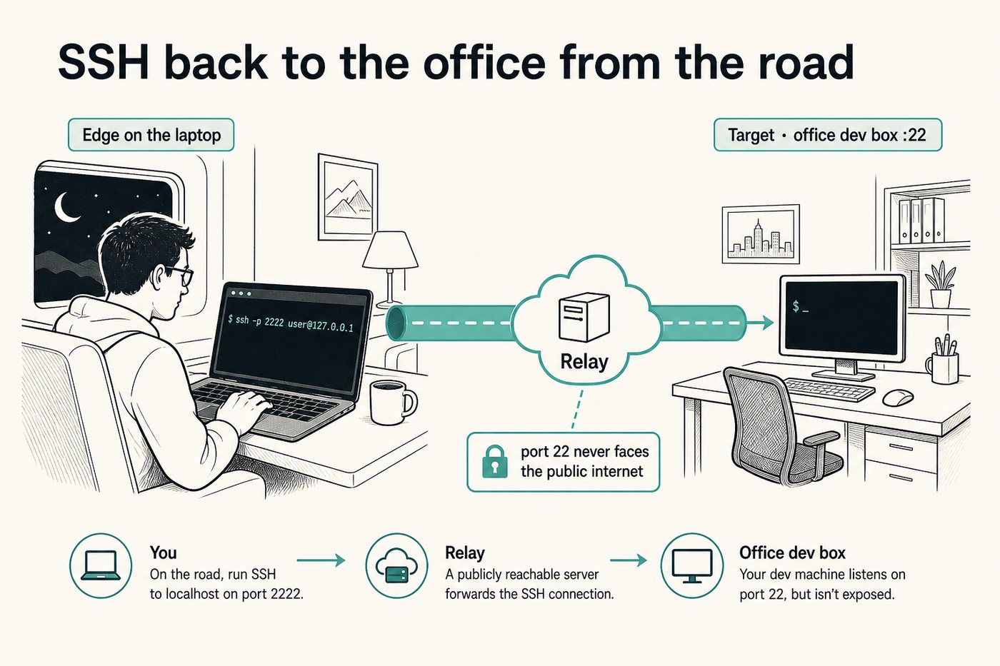
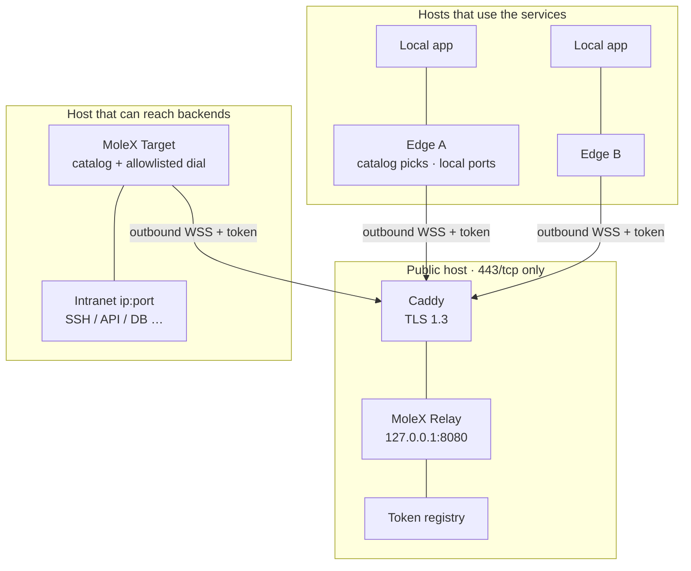
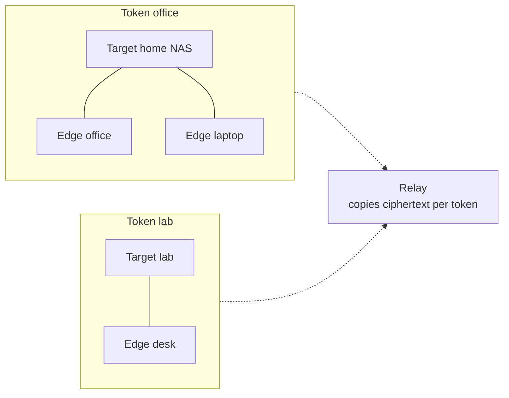
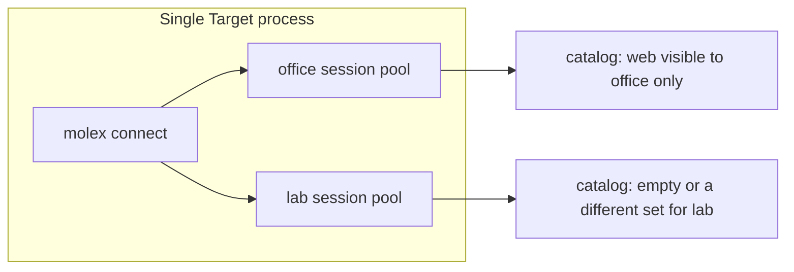
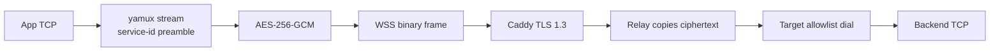
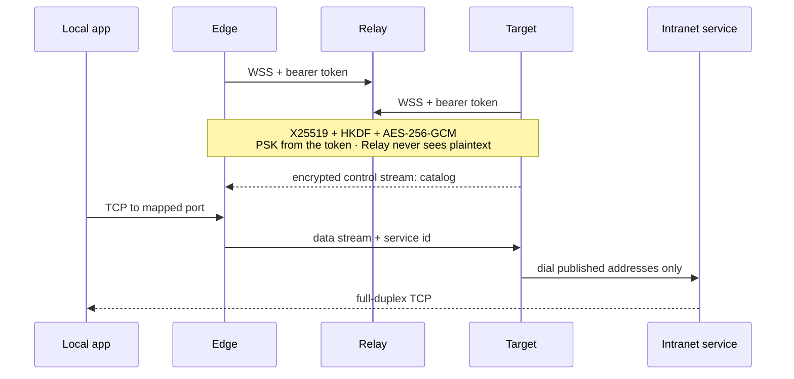

<p align="center">
  
  &nbsp;<strong>MoleX</strong>
  &nbsp;·&nbsp;
  English · <a href="README.md">简体中文</a>
  &nbsp;·&nbsp;
  <a href="https://github.com/suifei/molex/releases/tag/v0.4.0"></a>
</p>

# The system is in the office. The people are not. You cannot put that machine on the internet.

The usual stuck point in R&D: the demo, the SSH box, the intranet API live only on an office computer. A remote client needs to click through it. A teammate on a train needs a shell. A frontend in another city needs the model.

Opening a public port is dangerous. A full VPN is heavy, and they see more than they should. Standing up a cloud staging copy is slow, and it is not “the box we are actually building on.”

**MoleX lets them open a local address on their own computer and reach exactly the intranet service you named. The public internet gets `443` only. When you are done, you take the pass back and the group drops.**

<p align="center">
  
</p>

They open `http://127.0.0.1:18080` and see the unfinished system on the office `:8080`. They never join the office LAN. You never publish `:8080`.

**Do this, left to right in the picture:**

1. Start **Relay** (the doorman) in the cloud and mint a token.
2. Start **Target** (the front desk) on the office box and register `127.0.0.1:8080`.
3. Send the token. They start **Edge** (the door on their laptop) and check the demo.
4. They use the local port. When the demo ends, disable the token.

<p align="center">
  
</p>

One pass reaches **one Target**. Edges can be many. Another laptop means another Edge — not the whole office network.

### Same problem, different room

**You are away and need the office Linux box — without publishing port 22.**

<p align="center">
  
</p>

```bash
ssh -p 2222 user@127.0.0.1
```

Remote Desktop is the same: the office registers `3389`, you connect to `127.0.0.1:13389`.

**A remote frontend needs one office API — not the whole intranet.**

Register that one `ip:port`. Point `baseURL` at `http://127.0.0.1:18080/v1`. One service, not the LAN.

### What it solves — and what it does not

| You are stuck because | The usual fix is awkward | MoleX |
| --- | --- | --- |
| Remote people cannot see an unfinished system | Public ports, a full VPN, a rushed cloud staging | They open a local address; public `443` only |
| You need SSH / RDP from the road | `22` / `3389` on the internet | You connect to localhost; the office port stays private |
| Remote code must hit one intranet API | You hand over the LAN or the whole machine | You register that one service |
| The demo ended but access did not | Ports still open, VPN accounts still live | Disable the token; the group drops |
| Several clients need the same demo | One public mapping each | One pass, many Edges |

Not for UDP games, voice, or HTTP/3. Not an anonymity network. SSH and Windows still own login. MoleX only moves TCP.

<p align="center">
  <a href="https://github.com/suifei/molex/actions/workflows/ci.yml"></a>
  <a href="https://github.com/suifei/molex/releases/latest"></a>
  <a href="https://github.com/suifei/molex/stargazers"></a>
  <a href="LICENSE"></a>
  <a href="#quick-start">Quick start</a> ·
  <a href="#architecture">Architecture</a> ·
  <a href="docs/user-guide.md">User guide</a>
</p>

## Architecture

One token is one trust group. Groups are fully isolated: they cannot see or reach each other.



The relay does **not** open a public port per tunnel. Every group shares Caddy's `/ws/session`. A second Target on the same token is rejected. A crashed Target can rejoin after server keepalive (20s ping / 75s read deadline) frees the slot.

### Groups stay isolated



An office Edge never sees the lab catalog. A crafted service-id preamble is still rejected by the Target allowlist.

### One process, several groups



Empty `services[].groups` means every group this process joined. A listed set is the only groups that can see or dial that service. When an Edge joins more than one group, each mapping needs `group`.

### Three roles

| `mode` | Where | Duty | Console |
| --- | --- | --- | --- |
| `relay` | Public hostname | Admit tokens, pair 1 Target + N Edges, copy ciphertext | Password login: create / rotate / disable / delete, audit, peers, kick |
| `target` | Host that reaches backends | Publish the catalog; dial only published addresses | Login-free loopback: `wss` + token, live service and visibility edits |
| `edge` | Host that uses the services | Map published services to local ports | Login-free loopback: catalog picks, ports, LAN toggle |

The management listener is loopback-only (prefers `127.0.0.1:9090`). Reach it with an HTTPS reverse proxy or SSH forward. Target / Edge also require a local Host header (anti DNS-rebinding).

## How traffic moves

Local apps speak plain TCP to an Edge mapping. Past the public edge, everything is an encrypted record:



```text
app TCP
  → Edge mapping listener
  → yamux (control stream = catalog / data stream = service id)
  → AES-256-GCM record
  → WebSocket binary frame
  → TLS 1.3 (Caddy :443)
  → Relay ciphertext copy
  → Target allowlist dial
  → intranet service
```



- End-to-end key: `PSK = HKDF-SHA256(token, "molex/v2/e2e-psk")`, plus ephemeral X25519 for forward secrecy.
- Catalog and addressing stay inside ciphertext. The relay sees metadata, timing, and frame sizes.
- Each Edge gets its own encrypted session. The Target grows an adaptive pool (one hot standby, cap 65,535) so keys and yamux state never mix.
- At most 256 concurrent streams per process / session. WebSocket compression stays off for tunnel records.

Full handshake and trust boundary: [architecture](docs/architecture.md).

## Quick start

### 1. Download or build

Prebuilt `amd64` / `arm64` packages for Windows, macOS, and Linux are on [GitHub Releases](https://github.com/suifei/molex/releases/latest), each with `SHA256SUMS`.

From source (Go 1.25+, Node.js 20+):

```bash
cd frontend
npm ci
npm run build
cd ..
go build -trimpath -ldflags "-s -w -X main.version=0.4.0" -o bin/molex .
```

Build the frontend first so current Web assets are embedded.

### 2. Public relay

```bash
molex config init --mode relay --config relay.json
molex web --config relay.json --password-file ./web-password --autostart
```

Data plane `127.0.0.1:8080`, console prefers `127.0.0.1:9090` (advances if busy). Sign in, create a token, reveal and copy it. Publish `/ws/session` and the console with the [Caddy example](examples/Caddyfile) and the [deployment guide](docs/deployment-caddy.md).

### 3. Intranet target

On a machine that can reach the backends:

```bash
molex web
```

Choose **Target**, paste `wss://…/ws/session` and the token, start, then add services (for example `10.188.200.16:30927`). Saving publishes immediately; live edits apply without a restart.

### 4. Local edges (any number)

```bash
molex web
```

Choose **Edge**, paste the same WSS URL and token. Check services when the catalog appears; the console suggests a free port. Turn on **LAN visible** (`0.0.0.0`) only when other devices on that network must connect. When a mapping shows **Listening**:

```bash
ssh -p 2222 user@127.0.0.1
```

### 5. Reach a console remotely

```bash
ssh -N -L 9090:127.0.0.1:9090 user@molex-host
```

The Relay console uses session cookies, CSRF, same-origin checks, and login rate limits. Target / Edge skip login but accept loopback peers only.

## Configuration

Unknown fields are rejected. Each role keeps a small surface:

```json
{
  "mode": "relay",
  "listen": "127.0.0.1:8080",
  "tokens": [
    { "id": "tok-example", "token": "mx2_generated-value", "note": "office" }
  ]
}
```

```json
{
  "mode": "target",
  "remote": "wss://molex.example.com/ws/session",
  "token": "mx2_generated-value",
  "name": "home-target",
  "services": [
    { "id": "svc-web", "name": "web", "address": "10.188.200.16:30927" }
  ]
}
```

```json
{
  "mode": "edge",
  "remote": "wss://molex.example.com/ws/session",
  "token": "mx2_generated-value",
  "name": "office-edge",
  "mappings": [
    { "service": "svc-web", "port": 28080, "lan": false }
  ]
}
```

| Field | Roles | Meaning |
| --- | --- | --- |
| `mode` | all | `relay` / `target` / `edge` |
| `listen` | relay | Loopback data plane, behind Caddy |
| `remote` | target / edge | `wss://`; plain `ws://` is loopback-only |
| `token` | target / edge | Single-group token (`mx2_` prefix). Exclusive with `tokens[]` |
| `name` | target / edge | Console label; defaults to hostname |
| `tokens[]` | all | Relay: issued records (including rotation grace). Clients: `{id, token}` |
| `services[]` | target | `id` / `name` / `address`; optional `groups` |
| `mappings[]` | edge | `service` / `port` / `lan`; `group` required when several groups are joined |

Verified starting points live in [`examples/`](examples/).

## CLI

```text
molex serve   --config ./relay.json
molex connect --config ./target.json
molex connect --config ./edge.json --remote wss://molex.example.com/ws/session --token "$MOLEX_TOKEN"
molex web     --config ./molex.json --password-file ./web-password --autostart
molex config init  --config ./molex.json --mode relay|target|edge
molex config check --config ./molex.json
molex version
```

The Relay password may also come from `MOLEX_WEB_PASSWORD`. Never put tokens in node names, logs, or screenshots.

## Migrating from v1

v2 does not auto-migrate. `mode: "punch"` and `role` / `secret` / `tunnel` fail at startup and point to the [upgrade guide](docs/upgrade-guide.md).

1. Relay: `molex config init --mode relay --force`, then create one token per trust group.
2. Former Target: `molex config init --mode target --force`, add each old `tunnel.local` (and every rule `local`) as a published service.
3. Former Edges: `molex config init --mode edge --force`, map the published services to the ports you used before.
4. Discard v1 `secret` and `channel`. Mixed v1/v2 fleets do not interoperate.

## Stability and recovery

- Retry: about 1s → 15s, ±20% jitter, reset after 30s healthy.
- Mapping listeners exist only while the route is ready and the service is published; they close when the Target drops or withdraws a service and reopen on recovery.
- An occupied port affects only that mapping and recovers about 3 seconds after it is freed.
- Disabled tokens, duplicate Targets, and kicks name the next operator action.
- Shutdown is bounded: listeners and sessions first, then tracked local connections, then admitted work.
- Linux: `deploy/molex-relay.service`; without systemd: `deploy/molex-keepalive.sh`.

## Security notes

1. Unknown token → HTTP 401; disabled → 403. The URL must be `/ws/session`.
2. Hello is a fixed 128 bytes with no literal token or product marker.
3. The relay pre-computes the route from the token and enforces one Target instance via the metadata instance id.
4. Catalog, service ids, and dial status stay inside AES-256-GCM; the relay has no payload-decrypt path.
5. The Target refuses every unpublished address.
6. Remote WSS needs a valid certificate.

See the [security model](docs/security.md) for credentials and vulnerability reporting.

## Public documentation

| Document | Purpose |
| --- | --- |
| [v0.4.0 release notes](docs/release-v0.4.0.md) | Breaking change, required role upgrades, verification |
| [User guide](docs/user-guide.md) | 12 languages: five-minute deploy, console, recipes, troubleshooting |
| [Upgrade guide](docs/upgrade-guide.md) | Clean break from ≤v0.3.1, rollback, acceptance |
| [Architecture and protocol](docs/architecture.md) | Topology, catalog, handshake, records, reconnection |
| [Security model](docs/security.md) | Trust boundary, credentials, allowlist, reporting |
| [Caddy deployment](docs/deployment-caddy.md) | Production WSS, loopback, systemd, health checks |
| [Testing and release checks](docs/testing.md) | Go / race / frontend / real sockets |
| [v2 acceptance checklist](docs/v2-acceptance.zh-CN.md) | Item-by-item acceptance record |
| [Examples](examples/) | Minimal Relay / Target / Edge / Caddy files |

## Verification

```bash
go test -count=1 ./...
go test -race -count=1 ./...
go vet ./...
cd frontend && npm test && npm run check && npm run build
```

Integration tests cover concurrent multi-edge traffic, catalog publish/withdraw, duplicate-Target rejection, allowlist enforcement, token disable/kick recovery, cross-token isolation, Target restart, occupied mapping-port recovery, bounded shutdown, and ciphertext tampering rejection.

## Name and license

**MoleX** joins the tunnel-digging mole with an **X** for transfer, cross, and exchange: forward TCP services you own through an encrypted rendezvous.

Source and in-repo docs are under the [MIT license](LICENSE). The license covers the code; it does not grant the project name, logo, or trademarks.
