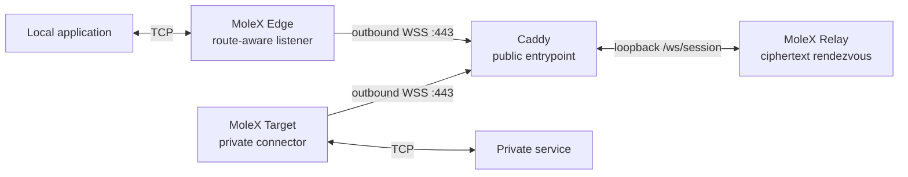

<p align="center">
  
</p>

<h1 align="center">MoleX</h1>

<p align="center"><strong>Secure TCP transit through one public WSS entrypoint.</strong><br>Relay, Edge, and Target in one Go binary, managed from the browser or CLI.</p>

<p align="center">
  <a href="https://github.com/suifei/molex/actions/workflows/ci.yml"></a>
  <a href="https://github.com/suifei/molex/releases/latest"></a>
  
  
  <a href="LICENSE"></a>
</p>

<p align="center">
  <a href="https://github.com/suifei/molex/stargazers"></a>
  <a href="https://github.com/suifei/molex/forks"></a>
  <a href="https://github.com/suifei/molex/issues"></a>
  <a href="https://github.com/suifei/molex/pulls"></a>
  <a href="https://github.com/suifei/molex/graphs/contributors"></a>
  <a href="https://github.com/suifei/molex/releases"></a>
</p>

<p align="center">
  <a href="#quick-start"><strong>Quick start</strong></a> ·
  <a href="docs/user-guide.md"><strong>Illustrated guide</strong></a> ·
  <a href="#how-it-works">How it works</a> ·
  <a href="#documentation">Documentation</a> ·
  <a href="docs/security.md">Security</a>
</p>

<p align="center"><sub><strong>README:</strong> English · <a href="README.md">简体中文</a></sub></p>

<p align="center"><sub><strong>Illustrated guide:</strong>
<a href="docs/user-guide.md"><strong>English</strong></a> ·
<a href="docs/user-guide.zh-CN.md">简体中文</a> ·
<a href="docs/user-guide.zh-TW.md">繁體中文</a> ·
<a href="docs/user-guide.es.md">Español</a> ·
<a href="docs/user-guide.pt-BR.md">Português (Brasil)</a> ·
<a href="docs/user-guide.fr.md">Français</a> ·
<a href="docs/user-guide.de.md">Deutsch</a> ·
<a href="docs/user-guide.ja.md">日本語</a> ·
<a href="docs/user-guide.ko.md">한국어</a> ·
<a href="docs/user-guide.ru.md">Русский</a> ·
<a href="docs/user-guide.ar.md">العربية</a> ·
<a href="docs/user-guide.hi.md">हिन्दी</a></sub></p>

<p align="center">
  <a href="docs/user-guide.md"></a>
</p>

<p align="center"><sub>Relay console: router-style peer inventory, route state, endpoints, pairing, and ciphertext traffic counters.</sub></p>

---

MoleX connects a local TCP listener to a service on a private network through a public WebSocket relay. Edge and Target both initiate outbound connections to the same `wss://` endpoint, so the public host normally exposes only HTTPS `443` through Caddy.

The Relay pairs peers and forwards opaque binary frames. It never receives the end-to-end payload secret and cannot decrypt tunneled TCP data.

## Why MoleX

| Design choice | Operational result |
| --- | --- |
| **One public entrypoint** | Concurrent TCP streams share WSS through yamux, and one channel may hold multiple Edge/Target sessions without a public port per service. |
| **Ciphertext-only Relay** | Edge and Target use X25519, HKDF-SHA256, and AES-256-GCM inside TLS; Relay forwards authenticated ciphertext. |
| **One binary, three roles** | The same cross-platform Go binary runs as Relay, Edge, or Target with a small JSON configuration. |
| **Browser-managed everywhere** | Relay and both client roles use the same authenticated English/Simplified Chinese Web console; CLI operation remains available. |
| **Route-aware lifecycle** | Edge listens only while an authenticated peer route is ready, closes stale listeners on disconnect, and returns automatically after pairing. |
| **Actionable recovery** | Capped exponential backoff, randomized jitter, bounded socket workers, and operator-focused errors make failures diagnosable. |

MoleX works with OpenAI-compatible APIs, SSH, RDP, HTTP services, databases, and other TCP applications. The [complete illustrated guide](docs/user-guide.md) includes deployment recipes and screenshots for common scenarios.

> [!IMPORTANT]
> MoleX currently transports TCP only. It does not provide native UDP, anonymity, traffic-analysis resistance, or permission to bypass laws, service terms, or network policy.

## How it works



Both clients dial outward. Relay keeps per-route FIFO Edge/Target queues and pairs each Edge with the oldest waiting Target as an independent encrypted session. Node names are reusable display labels; peer IDs distinguish connections. After pairing, application data moves full duplex through this stack:

```text
TCP stream -> yamux stream -> AES-256-GCM record -> WebSocket binary frame -> TLS 1.3
```

Relay can still observe connection metadata, timing, frame sizes, and which opaque route identifiers are paired. See the [architecture](docs/architecture.md) and [security model](docs/security.md) for the complete trust boundary.

## Roles and modes

| Configuration | Runtime responsibility | Listener and connection behavior |
| --- | --- | --- |
| `mode: "relay"` | Public rendezvous and opaque frame forwarding. | Listens on loopback behind Caddy; never receives the payload secret. |
| `mode: "punch"`, `role: "edge"` | Accepts local application TCP connections and opens one yamux stream per connection. | Dials Relay over WSS; exposes its local listener only while a route is authenticated and ready. |
| `mode: "punch"`, `role: "target"` | Accepts yamux streams and connects each one to `tunnel.local`. | Dials Relay over WSS; initiates a private-service TCP connection for each stream. |

`tunnel.remote` is a shared logical channel name, not a public TCP port. A numeric value such as `"2222"` is valid if port-like channel names are convenient. Publishing another ordinary TCP port on the Relay would break strict single-port operation.

## Quick start

> [!TIP]
> For a production walkthrough with screenshots, Caddy, OpenAI/API examples, TCP service recipes, troubleshooting, and security checks, start with the [complete illustrated user guide](docs/user-guide.md).

### 1. Download or build

Prebuilt archives for Windows, macOS, and Linux on `amd64` and `arm64` are available from [GitHub Releases](https://github.com/suifei/molex/releases/latest). Every release includes `SHA256SUMS`; verify the downloaded archive before extracting it.

To build from source, use Go 1.25 or newer and Node.js 20 or newer:

```bash
cd frontend
npm ci
npm run build
cd ..
go build -trimpath -ldflags "-s -w -X main.version=0.3.1" -o bin/molex .
```

The frontend build must run before the Go build so the current Web assets are embedded in the binary.

### 2. Start the public Relay

Create `relay.json` from [examples/relay.json](examples/relay.json), replace its token, and create a protected password file containing at least 12 characters. Then start the Web console and Relay runtime together:

```bash
molex web --config relay.json --password-file ./web-password --autostart
```

The Relay data plane listens on `127.0.0.1:8080`. The management console prefers `127.0.0.1:9090`, advances to a free loopback port when it is occupied, prints the selected URL, and opens the default browser after listening succeeds. Server and reverse-proxy deployments should pin it with `--listen 127.0.0.1:9090 --open-browser=false`. Configure Caddy to publish `/ws/session` and the authenticated console through HTTPS. Use the audited [Caddy example](examples/Caddyfile) and [deployment guide](docs/deployment-caddy.md).

### 3. Start the private Target

On the machine that can reach the private service:

```bash
molex web --config target.json --password-file ./web-password --autostart
```

Target establishes an outbound WSS connection and waits for streams. Its management listener remains loopback-only.

### 4. Start the local Edge

On the machine where the application runs:

```bash
molex web --config edge.json --password-file ./web-password --autostart
```

Connect the application to the Edge listener after the console reports `Encrypted route is ready`. With the included SSH example:

```bash
ssh -p 2222 user@127.0.0.1
```

### 5. Open the Web console

Use an SSH tunnel for private management access:

```bash
ssh -N -L 9090:127.0.0.1:9090 user@molex-host
```

This command assumes the remote WebUI was explicitly pinned to `127.0.0.1:9090`. Then open `http://127.0.0.1:9090`. On a public Relay, a dedicated HTTPS Caddy hostname is more convenient. MoleX rejects non-loopback management listeners, so remote access must use an HTTPS reverse proxy or SSH forwarding. The console uses secure session cookies, CSRF protection, same-origin checks, and rate-limited login attempts.

The Web console controls the selected runtime in-process; it does not spawn another MoleX process. Relay presents connected clients like a router table, including node identity, trusted source IP, endpoints, pairing, platform, uptime, and live ciphertext counters.

## Configuration

```json
{
  "mode": "punch",
  "role": "edge",
  "secret": "mx1_replace-with-a-generated-secret",
  "token": "mx1_replace-with-the-relay-token",
  "listen": "127.0.0.1:2222",
  "remote": "wss://molex.example.com/ws/session",
  "tunnel": {
    "local": "127.0.0.1:22",
    "remote": "home-ssh",
    "name": "office-edge"
  }
}
```

| Field | Required for | Meaning |
| --- | --- | --- |
| `mode` | Every role | `relay` or `punch`. |
| `role` | Clients | `edge` or `target`. |
| `secret` | Clients | End-to-end PSK shared by Edge and Target. Use a generated 32-byte value. |
| `token` | Optional | Relay admission token shared by Relay and both clients. It is separate from the payload secret. |
| `listen` | Relay and Edge | Relay HTTP listener or local Edge TCP listener. |
| `remote` | Clients | Relay `wss://` endpoint. Plain `ws://` is restricted to loopback. |
| `tunnel` | Clients | `local` is the Target service, `remote` is the shared channel, and optional `name` labels the node. The OS hostname is used when `name` is empty. |
| `tunnel.pool` | Target clients | Target session pool. Default `0` enables demand-driven growth: after a slot pairs with an Edge, Target opens the next independent WSS session, up to 65,535; fixed values 1–65,535 are also accepted. |

Unknown JSON fields are rejected. Client secrets must contain at least 16 characters; `molex config init` generates 32 random bytes encoded as URL-safe Base64.

## CLI reference

```text
molex serve   --config ./relay.json
molex connect --config ./edge.json
molex connect --remote wss://molex.example.com/ws/session \
  --role edge --name office-edge --listen 127.0.0.1:2222 --channel home-ssh \
  --secret "$MOLEX_SECRET" --token "$MOLEX_RELAY_TOKEN"
molex web     --config ./molex.json --password-file ./web-password --autostart
molex config init  --config ./molex.json --mode punch --role edge
molex config check --config ./molex.json
molex version
```

The Web password can also be supplied through `MOLEX_WEB_PASSWORD`. Prefer `--password-file` for services so the password is not stored in a unit file or shell history. Payload secrets and Relay tokens come from JSON or explicit CLI flags; never put them in node names, endpoint labels, logs, or screenshots.

## Operational resilience

Edge and Target reconnect automatically with capped exponential backoff from about one second to at most fifteen seconds. Every delay includes 20% randomized jitter, and a session that remains healthy for 30 seconds resets the delay.

The Edge listener exists only while an authenticated Edge/Target route is ready. If Relay or Target disconnects, Edge closes and clears the old listener, reports `Not listening`, and reopens it after pairing succeeds. An interrupted local application connection must be retried after the route is ready again.

Runtime messages identify the likely next action for Relay-token, `/ws/session`, Caddy-upstream, DNS, TLS, pairing, occupied-listener, and Target-service failures. Transient client failures keep retrying until the runtime is stopped.

Each route admits at most 256 active yamux streams. Excess connections fail closed with guidance. Shutdown closes the listener and encrypted session before waiting for admitted workers, preventing abandoned socket goroutines.

Relay keeps one reader per WebSocket from registration through forwarding. A waiting-client disconnect immediately removes it from the FIFO queue. Frame writes have a 30-second deadline, and competing timeout, disconnect, bridge, and shutdown paths converge on one idempotent close operation.

## Security and protocol

1. Each client establishes TLS and upgrades to a binary WebSocket through Caddy.
2. A client may send fixed-size authenticated, encrypted WebSocket ping payloads containing Relay-visible operational metadata. Older Relays acknowledge and ignore these standard control frames.
3. The 128-byte hello contains an opaque route identifier, role, ephemeral X25519 public key, nonce, and PSK proof. It contains no literal product marker, channel, or secret.
4. Relay pairs complementary roles with the same opaque route identifier and exchanges their hello frames.
5. Peers authenticate the transcript, derive directional keys with HKDF-SHA256, and confirm the session key.
6. yamux frames become independent AES-256-GCM records carried in binary WebSocket frames. Compression stays disabled for encrypted tunnel records.
7. Relay copies ciphertext without decrypting it and counts only encrypted frame sizes.

Read [Architecture and protocol](docs/architecture.md) for the full lifecycle and [Security model](docs/security.md) for guarantees, metadata visibility, TLS assumptions, non-goals, credential handling, and responsible disclosure.

## Documentation

MoleX publishes the material needed to deploy, inspect, verify, and reuse the project without treating the implementation as a black box.

| Document | Use it for |
| --- | --- |
| [Complete illustrated user guide](docs/user-guide.md) | Relay/Edge/Target setup, WebUI screenshots, OpenAI/API and TCP recipes, UDP boundaries, operations, troubleshooting, and MIT terms. Available in 12 languages from its header. |
| [Upgrade guide](docs/upgrade-guide.md) | Differences from `v0.1.0` through `v0.3.1`, compatibility, role upgrade order, configuration migration, rollback, and acceptance checks. |
| [v0.3.1 release notes](docs/release-v0.3.1.md) | Standby Target, handshake deadline, socket growth, automatic WebUI ports, required role upgrades, and verification scope. |
| [Architecture and protocol](docs/architecture.md) | Topology, management plane, encrypted records, rendezvous, handshake, yamux lifecycle, reconnection, concurrency, and trust boundaries. |
| [Caddy deployment](docs/deployment-caddy.md) | Production WSS routing, loopback listeners, HTTPS management, systemd, firewall rules, health checks, and guided diagnostics. |
| [Security model](docs/security.md) | Security goals and non-goals, credential separation, metadata visibility, TLS assumptions, local exposure, rotation, and disclosure. |
| [Testing and release checks](docs/testing.md) | Go, race, frontend, cross-platform, real-socket, recovery, protocol, WebUI, and manual release verification. |
| [Tahoe-inspired WebUI specification](docs/macos-tahoe-webui-style-guide.zh-CN.md) | Reusable Chinese design reference for system fonts, semantic tokens, light/dark materials, controls, responsiveness, accessibility, and visual acceptance. |
| [Configuration and Caddy examples](examples/) | Minimal Relay, Edge, Target, and Caddy files to use as reviewed starting points rather than copying real credentials from documentation. |

## Community and human value

### v0.3.1 latest fixes

- Relay retains unmatched Targets as long-lived hot standby, removing periodic connect/disconnect churn from `pool: 0` spare sessions.
- Encrypted-session setup responds immediately to cancellation instead of waiting for a peer-hello read deadline.
- Each adaptive Target slot expands the pool only once, preventing repeated reconnects from accumulating spare sockets.
- WebUI prefers `9090`, advances to another loopback port when occupied, and opens the default browser only after listening succeeds.
- Added four-Edge concurrency, standby timeout, connection refusal, latency, abrupt disconnect, and repeated network-flap recovery tests.

### v0.3.0

- Supports `Edge * -> Relay 1 -> Target 1`: one Target process can serve Edges from many locations.
- `tunnel.pool: 0` enables demand-driven session growth. After an Edge is paired, Target opens the next independent WSS session, up to 65,535 sessions.
- Every session keeps independent X25519, AES-GCM, and yamux state, preventing cross-Edge stream or key mixing.
- Added real-socket single-Target/multiple-Edge queue, FIFO pairing, disconnect recovery, and race coverage.

MoleX contributes inspectable engineering foundations rather than unverifiable networking claims:

- **Open-source community:** an MIT-licensed reference for ciphertext rendezvous, end-to-end encrypted TCP transit, bounded socket lifecycles, and actionable reconnection behavior.
- **Reviewers and learners:** public protocol, threat-model, metadata, concurrency, and real-socket test documentation that states both guarantees and non-goals.
- **Operators and small teams:** a single-binary, browser-managed way to reach services they own without publishing every private service directly to the Internet.
- **Global participation:** a bilingual WebUI and illustrated documentation in 12 languages lower language and platform barriers to learning, deployment, review, and contribution.
- **Other projects:** reusable configuration examples, testing patterns, error-guidance patterns, and a documented Tahoe-inspired WebUI design system under permissive terms.
- **People:** safer access to personally or organizationally controlled systems can support remote work, self-hosting, education, research, and maintenance while reducing unnecessary public exposure.

That value depends on transparent limits, informed consent, legitimate use, and responsible operation.

## Verification

```bash
go test -count=1 ./...
go test -race -count=1 ./...
go vet ./...
cd frontend
npm test
npm run check
npm run build
```

The integration suite starts a real HTTP/WebSocket Relay, a Target-side TCP echo service, and both clients, then verifies concurrent independent streams. Lifecycle coverage includes Target restart, occupied Edge-listener recovery, bounded shutdown, waiting-client replacement, connection churn, pairing-timeout boundaries, late-event suppression, plaintext-marker absence, and ciphertext-tamper rejection.

## Name and license

**MoleX** combines the mole's tunnel-building character with **X** as transfer, cross, and exchange: a compact name for moving owned TCP services through an encrypted rendezvous path.

The source code and included documentation are available under the [MIT License](LICENSE). MIT permits use, modification, distribution, and commercial reuse subject to its notice and warranty terms; it does not automatically grant rights to project names, logos, or trademarks.
