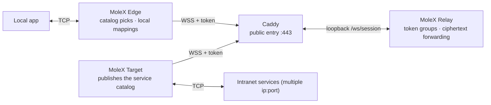

<p align="center">
  
</p>

<h1 align="center">MoleX</h1>

<p align="center"><strong>One token delivers your intranet services to every device that needs them.</strong><br>Relay, Target, and Edge share one Go binary, managed from a browser or the CLI.</p>

<p align="center">
  <a href="https://github.com/suifei/molex/actions/workflows/ci.yml"></a>
  <a href="https://github.com/suifei/molex/releases/latest"></a>
  
  
  <a href="LICENSE"></a>
</p>

<p align="center">
  <a href="#quick-start"><strong>Quick start</strong></a> ·
  <a href="#how-it-works">How it works</a> ·
  <a href="#migrating-from-v1">Migrating from v1</a> ·
  <a href="#public-documentation">Public documentation</a> ·
  <a href="docs/security.md">Security model</a>
</p>

<p align="center"><sub><strong>README:</strong> English · <a href="README.md">简体中文</a></sub></p>

---

MoleX v2 organizes the whole network around **token groups**: the relay administrator creates tokens in the Web console; **one Target** holding a token publishes the intranet services it can reach (multiple `ip:port` entries), and **any number of Edges** with the same token pick services from the live catalog in their browser and map them to local ports. Both Target and Edges dial out to the same `wss://` address, so the public host usually exposes only HTTPS `443` through Caddy.

The relay handles admission, grouping, and opaque binary-frame forwarding. The data-plane implementation never decrypts tunneled content and counts ciphertext only. The v2 trust model is stated honestly: tokens are issued and stored by the relay administrator, so **the relay operator is inside the trust boundary** (see the [security model](docs/security.md)).

## Why MoleX

| Design choice | What it means in practice |
| --- | --- |
| **One token connects everything** | Target and Edge only need the `wss://` address plus a token. No key exchange, no channel naming. |
| **Live service catalog** | When the Target publishes or withdraws a service, every online Edge's catalog and local mappings follow instantly, no restarts. |
| **1 Target + N Edges** | Each token accepts exactly one Target instance (duplicates are rejected with a clear reason); Edges are unlimited. One Target or Edge process can join several token groups. |
| **Single public entry** | Concurrent TCP streams share the WSS through yamux; no per-service public ports. |
| **Allowlisted forwarding** | The Target dials only addresses it published itself; an Edge cannot craft a request outside the catalog. |
| **One binary, three roles** | The same cross-platform Go program runs Relay, Target, or Edge selected by `mode`, with one small JSON file. |
| **Browser management on all three ends** | The relay console has password login; Target/Edge local consoles are login-free (loopback + same-origin + CSRF protected), bilingual, light/dark. |
| **Actionable recovery** | Capped exponential backoff, explicit token-disable/kick messages, automatic recovery from occupied ports, bounded shutdown. |

MoleX works for OpenAI-compatible APIs, SSH, RDP, HTTP services, databases, and other TCP applications.

> [!IMPORTANT]
> MoleX currently transports TCP only. It does not provide native UDP, anonymity, or traffic-analysis resistance, and it does not grant any right to bypass laws, terms of service, or network policy.

## How it works



1. The relay administrator creates a token and hands it to the Target and the Edges.
2. The Target joins with the token and publishes its configured service catalog over an end-to-end encrypted control stream.
3. Each Edge joins with the same token, sees the catalog, checks services, and assigns local ports (random by default, editable; loopback by default with an optional LAN toggle).
4. Local applications connect to the mapped ports and traffic flows full duplex:

```text
TCP stream -> yamux logical stream (with a service-id preamble) -> AES-256-GCM record -> WebSocket binary frame -> TLS 1.3
```

End-to-end keys are derived from the token via HKDF; ephemeral X25519 keys provide forward secrecy. The relay observes connection metadata, timing, and frame sizes; see [architecture](docs/architecture.md) and the [security model](docs/security.md) for the full trust boundary.

## Modes and responsibilities

| Configuration | Runtime duty | Management |
| --- | --- | --- |
| `mode: "relay"` | Public rendezvous, token admission and grouping, ciphertext forwarding. | Web console (password login): token CRUD, rotation with a grace window, audit log, per-token online summary, disconnect, live activity. |
| `mode: "target"` | Publishes the service catalog and dials allowlisted backends per stream. | Local Web console (login-free): `wss` plus one or more tokens, per-service group visibility, live catalog edits. |
| `mode: "edge"` | Opens local mapping listeners and forwards connections to published services. | Local Web console (login-free): `wss` plus one or more tokens, grouped catalog picks, port assignment, state and traffic. |

## Quick start

### 1. Download or build

Prebuilt `amd64`/`arm64` packages for Windows, macOS, and Linux are on [GitHub Releases](https://github.com/suifei/molex/releases/latest), each with `SHA256SUMS`.

Building from source needs Go 1.25+ and Node.js 20+:

```bash
cd frontend
npm ci
npm run build
cd ..
go build -trimpath -ldflags "-s -w -X main.version=0.4.0" -o bin/molex .
```

Build the frontend first so the current Web assets are embedded into the Go binary.

### 2. Start the public relay

```bash
molex config init --mode relay --config relay.json   # generates the config with a first token
molex web --config relay.json --password-file ./web-password --autostart
```

The relay data plane listens on `127.0.0.1:8080`; the management console prefers `127.0.0.1:9090` (advancing automatically if busy). Sign in to create, annotate, disable, or delete tokens; values are masked until revealed for copying. Publish `/ws/session` and the console over HTTPS with the verified [Caddy example](examples/Caddyfile) and the [deployment guide](docs/deployment-caddy.md).

### 3. Start the intranet target

On a machine that can reach the backend services:

```bash
molex web
```

Choose "Target" in the local console, enter the `wss://` address and token, start, then add the intranet addresses to publish (for example `10.188.200.16:30927`). Saving publishes immediately — edits while running apply live.

### 4. Start edges (any number of devices)

On every machine that needs the services:

```bash
molex web
```

Choose "Edge", enter the same `wss://` address and token, and start. Once the catalog loads, check the services you need: the console suggests a free local port (editable), and each mapping has its own "LAN visible" toggle (binds `0.0.0.0`). When a mapping shows "Listening", local applications can connect, for example:

```bash
ssh -p 2222 user@127.0.0.1
```

### 5. Reach a console remotely

Management listeners are loopback-only. Use an HTTPS reverse proxy for the relay console, or SSH forwarding:

```bash
ssh -N -L 9090:127.0.0.1:9090 user@molex-host
```

Consoles use secure session cookies, CSRF protection, same-origin checks, and login rate limiting; the login-free Target/Edge consoles additionally require loopback peers and local host names (anti DNS-rebinding).

## Configuration

Each role uses only a few fields (unknown fields are rejected):

```json
{
  "mode": "relay",
  "listen": "127.0.0.1:8080",
  "tokens": [
    { "id": "tok-example", "token": "mx2_generated-value", "note": "office", "disabled": false }
  ]
}
```

```json
{
  "mode": "target",
  "remote": "wss://molex.example.com/ws/session",
  "token": "mx2_generated-value",
  "name": "home-target",
  "services": [
    { "id": "svc-web", "name": "web", "address": "10.188.200.16:30927" }
  ]
}
```

```json
{
  "mode": "edge",
  "remote": "wss://molex.example.com/ws/session",
  "token": "mx2_generated-value",
  "name": "office-edge",
  "mappings": [
    { "service": "svc-web", "port": 28080, "lan": false }
  ]
}
```

| Field | Roles | Meaning |
| --- | --- | --- |
| `mode` | all | `relay`, `target`, or `edge`. |
| `listen` | relay | Relay data-plane listen address (loopback, behind Caddy). |
| `remote` | target / edge | Relay `wss://` address; plain `ws://` is loopback-only. |
| `token` | target / edge | Single-group access token (≥16 chars, `mx2_` prefix). Mutually exclusive with `tokens[]`. |
| `name` | target / edge | Display name in consoles; defaults to the hostname. |
| `tokens[]` | relay / target / edge | Relay: issued records, including `previousToken` during rotation. Clients: `{id, token}` group memberships. |
| `services[]` | target | Published services: stable `id`, `name`, `address`; optional `groups` restricts visibility. |
| `mappings[]` | edge | Local mappings: `service`, `port`, `lan`; `group` is required when several groups are joined. |

## CLI reference

```text
molex serve   --config ./relay.json
molex connect --config ./target.json
molex connect --config ./edge.json --remote wss://molex.example.com/ws/session --token "$MOLEX_TOKEN"
molex web     --config ./molex.json --password-file ./web-password --autostart
molex config init  --config ./molex.json --mode relay|target|edge
molex config check --config ./molex.json
molex version
```

The relay's Web password can also come from `MOLEX_WEB_PASSWORD`; Target/Edge consoles need no password. Pass tokens only through the relay console or configuration files — never in node names, logs, or screenshots.

## Migrating from v1

v2 is a clean break: `mode: "punch"` and the `role`/`secret`/`tunnel` fields are no longer supported, and legacy files fail at startup with explicit migration guidance.

1. Relay: `molex config init --mode relay --force`, then create one token per Target/Edge group in the console.
2. Former Target machine: `molex config init --mode target --force`, enter `wss` + token, and add each old `tunnel.local` (and every rule's `local`) as a published service.
3. Former Edge machines: `molex config init --mode edge --force`, enter the same token, check the services, and reuse the old local ports.
4. The old `secret` and `channel` concepts are replaced by token groups and can be retired.

## Stability and recovery

Edges and Targets reconnect with capped exponential backoff from about 1 second up to 15 seconds, with 20% jitter, resetting after 30 seconds of healthy session time.

Mapping listeners exist only while the encrypted route is ready and the service is still published: when the Target drops or withdraws a service, the port closes immediately with a reason and reopens automatically on recovery. An occupied local port affects only that mapping and recovers within about 3 seconds of being freed. Disabled tokens, duplicate Targets, and administrative kicks all produce messages that name the next operator action.

Each Edge process handles at most 256 concurrent yamux streams; connections beyond the bound close safely with advice. Shutdown closes listeners and encrypted sessions first, then tracked local connections, then waits for admitted workers — no leftover socket goroutines. The relay's server-side keepalive (20 s ping / 75 s read deadline) clears dead connections promptly so a crashed Target can rejoin fast. On Linux, keep the data plane up with `deploy/molex-relay.service`; elsewhere use `deploy/molex-keepalive.sh`. Token rotation keeps the previous value valid for 1–30 days (3 by default), and administrative actions are written to a JSONL audit log beside the configuration.

## Security and protocol

1. Every client establishes TLS through Caddy and upgrades to a binary WebSocket with a bearer token; unknown tokens get 401 and disabled tokens get 403.
2. The end-to-end PSK is derived from the token via HKDF-SHA256 with domain separation; the 128-byte hello carries an opaque route id, role, ephemeral X25519 key, nonce, and PSK proof.
3. The relay pre-computes each token's route, rejects mismatched hellos, and enforces one Target instance per token via the metadata instance id.
4. Peers verify the handshake, derive directional keys, and confirm them; the service catalog and per-stream service addressing travel inside AES-256-GCM records, invisible to the relay.
5. The Target allowlists every forwarding request against its own published services and reports refusals.
6. WebSocket compression stays disabled for tunnel records; the relay copies ciphertext only and its counters are ciphertext-based.

See [architecture and protocol](docs/architecture.md) for the full lifecycle and the [security model](docs/security.md) for the trust model, credentials, and vulnerability reporting.

## Public documentation

| Document | Purpose |
| --- | --- |
| [Architecture and protocol](docs/architecture.md) | Topology, token groups, catalog protocol, handshake, records, reconnection, trust boundary. |
| [Security model](docs/security.md) | The v2 trust model (trusting the relay operator), credentials, allowlist, metadata, operations. |
| [Caddy deployment](docs/deployment-caddy.md) | Production WSS routing, loopback listeners, HTTPS management, systemd, firewall, health checks. |
| [Testing and release checks](docs/testing.md) | Go, race, frontend, cross-platform, real sockets, recovery, protocol, manual acceptance. |
| [User guide](docs/user-guide.md) | Illustrated guide in 12 languages: roles, five-minute deploy, console, recipes, troubleshooting. |
| [Upgrade guide](docs/upgrade-guide.md) | Clean break from v1 (≤v0.3.1) to v2, rollback, and acceptance. |
| [v0.4.0 release notes](docs/release-v0.4.0.md) | v2 clean break, required role upgrades, verification scope. |
| [v2 acceptance checklist](docs/v2-acceptance.zh-CN.md) | Item-by-item acceptance record for this architecture version. |
| [Configuration and Caddy examples](examples/) | Verified minimal starting points for Relay, Target, Edge, and Caddy. |
| [Tahoe-style WebUI guide](docs/macos-tahoe-webui-style-guide.zh-CN.md) | Reusable system fonts, semantic tokens, light/dark materials, responsive rules. |

## The v2 architecture

- **Token groups**: the relay manages many tokens; each is strictly 1 Target instance + N Edges, fully isolated across tokens.
- **Service catalog**: the Target maintains multiple `ip:port` entries locally and publishes them live; Edges map with suggested ports and optional LAN visibility.
- **Operable observability**: the relay console aggregates per-token presence and ciphertext traffic, supports disabling a token (disconnects the group) and kicking single connections.
- **Login-free client consoles**: Target/Edge pages accept loopback only, verify origin and local host, and use a per-boot CSRF token.
- **Clean break**: v1 punch configurations fail fast with migration guidance instead of silent conversion.

## Verification

```bash
go test -count=1 ./...
go test -race -count=1 ./...
go vet ./...
cd frontend
npm test
npm run check
npm run build
```

Integration tests start a real HTTP/WebSocket relay, target-side TCP test services, and multiple clients, covering concurrent multi-edge traffic, catalog publish/withdraw sync, duplicate-Target rejection, allowlist refusal, token disable/re-enable, kick self-healing, cross-token isolation, Target restart recovery, occupied mapping-port recovery, bounded shutdown, and ciphertext tampering rejection.

## Name and license

**MoleX** combines the tunnel-digging mole with an **X** for **transfer, cross, exchange** — forwarding TCP services you own through an encrypted rendezvous path.

Source code and in-repo documentation are under the [MIT license](LICENSE). MIT allows use, modification, distribution, and commercial reuse with the license and disclaimer retained; the software license does not automatically grant rights to the project name, logo, or trademarks.
