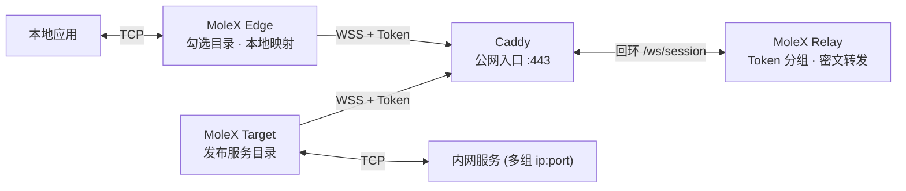

<p align="center">
  
</p>

<h1 align="center">MoleX</h1>

<p align="center"><strong>一个 Token，把内网服务安全交付给每一台需要它的设备。</strong><br>Relay、Target、Edge 共用一个 Go 单二进制，通过浏览器或 CLI 管理。</p>

<p align="center">
  <a href="https://github.com/suifei/molex/actions/workflows/ci.yml"></a>
  <a href="https://github.com/suifei/molex/releases/latest"></a>
  
  
  <a href="LICENSE"></a>
</p>

<p align="center">
  <a href="https://github.com/suifei/molex/stargazers"></a>
  <a href="https://github.com/suifei/molex/forks"></a>
  <a href="https://github.com/suifei/molex/issues"></a>
  <a href="https://github.com/suifei/molex/pulls"></a>
  <a href="https://github.com/suifei/molex/graphs/contributors"></a>
  <a href="https://github.com/suifei/molex/releases"></a>
</p>

<p align="center">
  <a href="#快速开始"><strong>快速开始</strong></a> ·
  <a href="#工作原理">工作原理</a> ·
  <a href="#从-v1-迁移">从 v1 迁移</a> ·
  <a href="#公开文档">公开文档</a> ·
  <a href="docs/security.md">安全模型</a>
</p>

<p align="center"><sub><strong>README：</strong><a href="README.en.md">English</a> · 简体中文</sub></p>

---

MoleX v2 用「Token 分组」组织整个网络：Relay 管理员在 Web 控制台创建 Token；持有同一 Token 的**一个 Target** 发布它可达的多组内网服务（`ip:port`），**任意数量的 Edge** 在浏览器里勾选想要的服务，映射到本机端口即可访问。Edge 与 Target 都主动连接同一个 `wss://` 地址，公网主机通常只需要由 Caddy 暴露 HTTPS `443`。

Relay 只负责准入、分组和转发不透明二进制帧。数据面实现永不解密隧道内容，流量统计只基于密文；v2 的信任模型如实声明：Token 由 Relay 管理员签发保存，因此 **Relay 运营者属于信任边界之内**（详见[安全模型](docs/security.md)）。

## 为什么选择 MoleX

| 设计选择 | 实际效果 |
| --- | --- |
| **一个 Token 连接一切** | Target 和 Edge 只需填 `wss://` 地址 + Token。无需交换密钥、无需约定通道名。 |
| **服务目录实时同步** | Target 发布或下架服务，所有在线 Edge 的目录与本地映射即时跟随，无需重启。 |
| **1 Target + N Edge** | 每个 Token 严格一个 Target 实例（重复接入被拒绝并提示），Edge 数量不限。一台 Target 或 Edge 机器可用单个进程加入多组 Token。 |
| **单公网入口** | 多条并发 TCP 流通过 yamux 共用 WSS；不需要为每个服务开放公网端口。 |
| **白名单转发** | Target 只拨号自己发布过的地址；Edge 构造不出目录之外的转发请求。 |
| **单二进制、三种角色** | 同一个跨平台 Go 程序按 `mode` 运行 Relay、Target 或 Edge，配置是一份小型 JSON。 |
| **三端浏览器管理** | Relay 控制台带密码登录；Target/Edge 本地控制台免登录（仅回环 + 同源 + CSRF 防护），中英双语、明暗主题。 |
| **可操作的故障恢复** | 有上限指数退避、Token 停用/踢下线的明确提示、端口占用自动恢复、有界停机。 |

MoleX 可用于 OpenAI 兼容 API、SSH、RDP、HTTP 服务、数据库和其他 TCP 应用。

> [!IMPORTANT]
> MoleX 当前只传输 TCP，不提供原生 UDP、匿名性或抗流量分析能力，也不赋予绕过法律、服务条款或网络策略的权利。

## 工作原理



1. Relay 管理员创建 Token，分发给 Target 与各 Edge。
2. Target 携带 Token 接入，把本地配置的服务目录（多组 `ip:port`）通过端到端加密控制流发布出去。
3. Edge 携带同一 Token 接入后即可看到目录，勾选服务并分配本地端口（默认随机可改，默认仅回环、可选局域网可见）。
4. 本地应用连接 Edge 的映射端口，数据经 `yamux 流 → AES-256-GCM 记录 → WSS` 全双工到达内网服务：

```text
TCP 流 -> yamux 逻辑流（携带服务寻址头）-> AES-256-GCM 记录 -> WebSocket 二进制帧 -> TLS 1.3
```

端到端密钥由 Token 经 HKDF 派生，X25519 临时密钥提供前向保密。Relay 能观察连接元数据、时序与帧长度；完整信任边界见[架构与协议](docs/architecture.md)和[安全模型](docs/security.md)。

## 模式与职责

| 配置 | 运行职责 | 管理方式 |
| --- | --- | --- |
| `mode: "relay"` | 公网会合、Token 准入与分组、密文帧转发。 | Web 控制台（密码登录）：Token 增删改、轮换（新旧并行宽限）、启停用、审计落盘、在线分组、踢下线、实时活动。 |
| `mode: "target"` | 发布服务目录，为每条流按白名单拨号内网服务。 | 本地 Web 控制台（免登录）：填 `wss` + 一组或多组 Token，按组勾选服务可见性（运行中可热更新）。 |
| `mode: "edge"` | 按映射开放本地端口，把连接转发到远端已发布服务。 | 本地 Web 控制台（免登录）：填 `wss` + 一组或多组 Token，按组勾选目录、分配端口、查看状态与流量。 |

## 快速开始

### 1. 下载或编译

Windows、macOS 和 Linux 的 `amd64`、`arm64` 预编译包可从 [GitHub Releases](https://github.com/suifei/molex/releases/latest) 下载。每个版本都附带 `SHA256SUMS`，解压前应先核对下载文件。

从源码编译需要 Go 1.25 或更新版本，以及 Node.js 20 或更新版本：

```bash
cd frontend
npm ci
npm run build
cd ..
go build -trimpath -ldflags "-s -w -X main.version=0.4.0" -o bin/molex .
```

必须先构建前端，再构建 Go 程序，确保当前 Web 资源被嵌入二进制。

### 2. 启动公网 Relay

```bash
molex config init --mode relay --config relay.json   # 生成含首个 Token 的配置
molex web --config relay.json --password-file ./web-password --autostart
```

Relay 数据面监听 `127.0.0.1:8080`，管理控制台优先使用 `127.0.0.1:9090`（端口占用时自动后移）。登录控制台后即可创建、备注、停用或删除 Token；Token 值默认遮罩，可显示并复制分发。通过 Caddy 使用 HTTPS 发布 `/ws/session` 和带认证的控制台，参考 [Caddy 示例](examples/Caddyfile)与[部署指南](docs/deployment-caddy.md)。

### 3. 启动内网 Target

在能够访问目标服务的机器上运行：

```bash
molex web
```

浏览器打开的本地控制台里选择「Target」，填入 `wss://` 地址和 Token 并启动，然后在「已发布服务」中添加要转发的内网地址（例如 `10.188.200.16:30927`），保存即发布——运行中修改同样即时生效。

### 4. 启动本地 Edge（可多台设备）

在需要使用内网服务的每台机器上运行：

```bash
molex web
```

选择「Edge」，填入同一个 `wss://` 地址和 Token 并启动。目录加载后勾选需要的服务：控制台会自动分配空闲本地端口（可手改），每条映射可单独开启「局域网可见」（绑定 `0.0.0.0`）。状态变为「监听中」后，本地应用即可直接访问，例如：

```bash
ssh -p 2222 user@127.0.0.1
```

### 5. 远程访问控制台

管理监听强制回环。远程访问 Relay 控制台请使用 HTTPS 反向代理，或 SSH 转发：

```bash
ssh -N -L 9090:127.0.0.1:9090 user@molex-host
```

控制台使用安全会话 Cookie、CSRF 防护、同源检查和登录限速；免登录的 Target/Edge 控制台额外强制回环来源与本机 Host 校验（防 DNS 重绑定）。

## 配置

三种角色各自只使用少量字段（解析拒绝未知字段）：

```json
{
  "mode": "relay",
  "listen": "127.0.0.1:8080",
  "tokens": [
    { "id": "tok-example", "token": "mx2_generated-value", "note": "office", "disabled": false }
  ]
}
```

```json
{
  "mode": "target",
  "remote": "wss://molex.example.com/ws/session",
  "token": "mx2_generated-value",
  "name": "home-target",
  "services": [
    { "id": "svc-web", "name": "web", "address": "10.188.200.16:30927" }
  ]
}
```

```json
{
  "mode": "edge",
  "remote": "wss://molex.example.com/ws/session",
  "token": "mx2_generated-value",
  "name": "office-edge",
  "mappings": [
    { "service": "svc-web", "port": 28080, "lan": false }
  ]
}
```

| 字段 | 适用角色 | 含义 |
| --- | --- | --- |
| `mode` | 全部 | `relay`、`target` 或 `edge`。 |
| `listen` | Relay | Relay 数据面监听地址（回环，位于 Caddy 之后）。 |
| `remote` | Target / Edge | Relay `wss://` 地址；明文 `ws://` 仅允许回环。 |
| `token` | Target / Edge | 单组接入时的 Token（≥16 字符，`mx2_` 前缀）。与 `tokens[]` 互斥。 |
| `name` | Target / Edge | 控制台展示的节点名称，留空时使用主机名。 |
| `tokens[]` | Relay / Target / Edge | Relay：签发记录（含 `previousToken` 轮换宽限）。客户端：多组 `{id, token}`，`id` 为本地组名。 |
| `services[]` | Target | 发布的服务：稳定 `id`、`name`、`address`；可选 `groups` 限制对哪些 Token 组可见。 |
| `mappings[]` | Edge | 本地映射：`service`、`port`、`lan`；多组时需填 `group`。 |

## CLI 参考

```text
molex serve   --config ./relay.json
molex connect --config ./target.json
molex connect --config ./edge.json --remote wss://molex.example.com/ws/session --token "$MOLEX_TOKEN"
molex web     --config ./molex.json --password-file ./web-password --autostart
molex config init  --config ./molex.json --mode relay|target|edge
molex config check --config ./molex.json
molex version
```

Relay 的 Web 管理密码也可通过 `MOLEX_WEB_PASSWORD` 提供；Target/Edge 控制台无需密码。Token 请只通过 Relay 控制台或配置文件传递，不要写入节点名称、日志或截图。

## 从 v1 迁移

v2 是一次干净切换：不再支持 `mode: "punch"` 与 `role`/`secret`/`tunnel` 字段，旧配置启动时会收到指向迁移步骤的明确错误。

1. Relay：`molex config init --mode relay --force`，在控制台为每组 Target/Edge 创建一个 Token。
2. 原 Target 机器：`molex config init --mode target --force`，填 `wss` + Token，把旧 `tunnel.local`（以及多条 rules 的各个 `local`）逐条添加为服务。
3. 原 Edge 机器：`molex config init --mode edge --force`，填同一 Token，勾选服务并沿用原本地端口。
4. 旧的 `secret` 与 `channel` 概念已被 Token 分组取代，可安全废弃。

## 稳定性与恢复

Edge 与 Target 会使用有上限指数退避自动重连，等待时间从约 1 秒增长到最多 15 秒，带 20% 随机抖动，会话连续健康运行 30 秒后重置。

映射监听只在加密路由就绪且服务仍在目录中时开放：Target 掉线或服务下架时对应端口立即关闭并显示原因，恢复后自动重开；本地端口被占用只影响该条映射，释放后约 3 秒内自动恢复。Token 被停用、被顶替（重复 Target）或被管理员踢下线时，客户端都会收到指向下一步操作的明确提示。

每个 Edge 进程最多同时处理 256 条活跃 yamux 流，超出上限的连接会安全关闭并给出处理建议。停止时先关闭监听与加密会话，再关闭被追踪的本地连接，最后等待已接纳的任务结束，不遗留 Socket 协程。Relay 通过服务端心跳（20 秒 ping / 75 秒读超时）及时清理死连接，让崩溃后的 Target 快速重新入场。Linux 上用 `deploy/molex-relay.service` 保活数据面；无 systemd 的环境用 `deploy/molex-keepalive.sh`。Token 轮换会把旧值保留 1–30 天（默认 3 天），管理操作写入配置旁的 JSONL 审计日志。

## 安全与协议

1. 每个客户端通过 Caddy 建立 TLS，并携带 Bearer Token 升级为二进制 WebSocket；未知 Token 返回 401，已停用 Token 返回 403。
2. 端到端 PSK 由 Token 经 HKDF-SHA256 域分隔派生；128 字节握手帧包含不透明路由标识、角色、临时 X25519 公钥、随机数和 PSK 证明。
3. Relay 按 Token 预计算路由并校验握手帧归属，同时依据元数据中的实例标识强制「每 Token 一个 Target」。
4. 双方验证握手记录，派生双向独立密钥并完成密钥确认；服务目录与服务寻址头全部在 AES-256-GCM 记录内传输，Relay 不可见。
5. Target 对每个转发请求执行白名单校验，目录之外的地址一律拒绝并上报。
6. 加密隧道记录始终禁用 WebSocket 压缩；Relay 只复制密文，流量统计只基于密文帧尺寸。

完整生命周期见[架构与协议](docs/architecture.md)；信任模型、凭据管理和漏洞报告方式见[安全模型](docs/security.md)。

## 公开文档

| 文档 | 用途 |
| --- | --- |
| [架构与协议](docs/architecture.md) | 组件拓扑、Token 分组、目录协议、握手、加密记录、重连与信任边界。 |
| [安全模型](docs/security.md) | v2 信任模型（信任 Relay 运营者）、凭据、白名单、元数据可见性、运维建议。 |
| [Caddy 部署](docs/deployment-caddy.md) | 生产 WSS 路由、回环监听、HTTPS 管理、systemd、防火墙与健康检查。 |
| [测试与发布检查](docs/testing.md) | Go、race、前端、跨平台、真实 Socket、恢复、协议与人工发布验收。 |
| [使用手册](docs/user-guide.zh-CN.md) | 12 语种图文手册：角色、五分钟部署、控制台、场景菜谱、排障。 |
| [升级指南](docs/upgrade-guide.zh-CN.md) | v1（≤v0.3.1）到 v2 的干净切换、回滚与验收。 |
| [v0.4.0 发行说明](docs/release-v0.4.0.zh-CN.md) | v2 干净切换、必须同时升级的角色、验证范围。 |
| [v2 验收清单](docs/v2-acceptance.zh-CN.md) | 本次架构版本的逐项验收记录。 |
| [配置与 Caddy 示例](examples/) | 经过核对的 Relay、Target、Edge 和 Caddy 最小起点。 |
| [Tahoe 风格 WebUI 设计规范](docs/macos-tahoe-webui-style-guide.zh-CN.md) | 可跨项目复用的系统字体、语义 token、明暗材质与响应式规范。 |

## v2 架构

- **Token 分组**：Relay 管理多组 Token；每个 Token 严格 1 个 Target 实例 + 任意数量 Edge，跨 Token 完全隔离。
- **服务目录**：Target 本地维护多组 `ip:port` 并实时发布；Edge 勾选映射、随机/手动分配端口、可选局域网可见。
- **运维可观测**：Relay 控制台按 Token 汇总在线状态与密文流量，支持停用 Token（整组断开）与单连接踢下线。
- **免登录客户端控制台**：Target/Edge 页面仅回环访问、同源与本机 Host 校验、每次启动独立 CSRF 令牌。
- **干净切换**：v1 punch 配置启动即报错并附迁移指引，不做静默转换。

## 验证

```bash
go test -count=1 ./...
go test -race -count=1 ./...
go vet ./...
cd frontend
npm test
npm run check
npm run build
```

集成测试会启动真实 HTTP/WebSocket Relay、Target 侧 TCP 测试服务和多端客户端，覆盖多 Edge 并发、目录发布与下架同步、重复 Target 拒绝、白名单拒绝、Token 停用与恢复、踢下线自愈、跨 Token 隔离、Target 重启恢复、映射端口占用恢复、有界停止与密文篡改拒绝。

## 名称与许可证

**MoleX** 把鼹鼠构建隧道的特征与代表 **transfer、cross、exchange** 的 **X** 结合起来，用一个简洁名称表达"通过加密会合路径转发自己拥有的 TCP 服务"。

源代码和仓库内文档采用 [MIT 许可证](LICENSE)。MIT 允许在保留许可与免责声明的前提下使用、修改、分发和商业复用；软件许可证不会自动授予项目名称、图标或商标的使用权。
