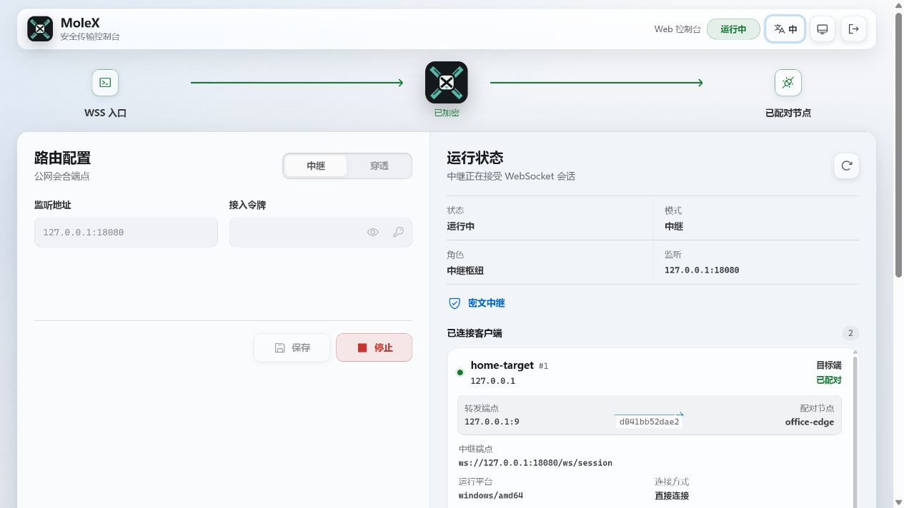
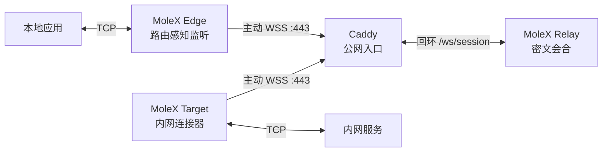

<p align="center">
  
</p>

<h1 align="center">MoleX</h1>

<p align="center"><strong>通过一个公网 WSS 入口安全转发 TCP。</strong><br>Relay、Edge、Target 共用一个 Go 单二进制，通过浏览器或 CLI 管理。</p>

<p align="center">
  <a href="https://github.com/suifei/molex/actions/workflows/ci.yml"></a>
  <a href="https://github.com/suifei/molex/releases/latest"></a>
  
  
  <a href="LICENSE"></a>
</p>

<p align="center">
  <a href="https://github.com/suifei/molex/stargazers"></a>
  <a href="https://github.com/suifei/molex/forks"></a>
  <a href="https://github.com/suifei/molex/issues"></a>
  <a href="https://github.com/suifei/molex/pulls"></a>
  <a href="https://github.com/suifei/molex/graphs/contributors"></a>
  <a href="https://github.com/suifei/molex/releases"></a>
</p>

<p align="center">
  <a href="#快速开始"><strong>快速开始</strong></a> ·
  <a href="docs/user-guide.zh-CN.md"><strong>完整图文手册</strong></a> ·
  <a href="#工作原理">工作原理</a> ·
  <a href="#公开文档">公开文档</a> ·
  <a href="docs/security.md">安全模型</a>
</p>

<p align="center"><sub><strong>README：</strong><a href="README.en.md">English</a> · 简体中文</sub></p>

<p align="center"><sub><strong>图文手册：</strong>
<a href="docs/user-guide.md">English</a> ·
<a href="docs/user-guide.zh-CN.md"><strong>简体中文</strong></a> ·
<a href="docs/user-guide.zh-TW.md">繁體中文</a> ·
<a href="docs/user-guide.es.md">Español</a> ·
<a href="docs/user-guide.pt-BR.md">Português (Brasil)</a> ·
<a href="docs/user-guide.fr.md">Français</a> ·
<a href="docs/user-guide.de.md">Deutsch</a> ·
<a href="docs/user-guide.ja.md">日本語</a> ·
<a href="docs/user-guide.ko.md">한국어</a> ·
<a href="docs/user-guide.ru.md">Русский</a> ·
<a href="docs/user-guide.ar.md">العربية</a> ·
<a href="docs/user-guide.hi.md">हिन्दी</a></sub></p>

<p align="center">
  <a href="docs/user-guide.zh-CN.md"></a>
</p>

<p align="center"><sub>中继控制台：像路由器一样查看节点、路由状态、端点、配对关系和密文流量统计。</sub></p>

---

MoleX 通过公网 WebSocket 中继，把本地 TCP 监听端口连接到远端内网服务。Edge 和 Target 都主动连接同一个 `wss://` 地址，因此公网主机通常只需要由 Caddy 暴露 HTTPS `443`。

Relay 只负责会合节点和转发不透明二进制帧。它不会收到端到端载荷密钥，也无法解密隧道内的 TCP 数据。

## 为什么选择 MoleX

| 设计选择 | 实际效果 |
| --- | --- |
| **单公网入口** | 多条并发 TCP 流通过 yamux 共用 WSS；同一通道可容纳多个 Edge/Target 会话，不需要为每个服务开放公网端口。 |
| **中继只见密文** | Edge 与 Target 在 TLS 内使用 X25519、HKDF-SHA256 和 AES-256-GCM；Relay 只转发经过认证的密文。 |
| **单二进制、三种职责** | 同一个跨平台 Go 程序可作为 Relay、Edge 或 Target 运行，只需要一份小型 JSON 配置。 |
| **三端统一 Web 管理** | Relay 与两种客户端共用带认证的中英文浏览器控制台，同时保留 CLI 运行方式。 |
| **路由感知生命周期** | 只有加密路由就绪时 Edge 才监听；断线后清理旧监听，重新配对后自动恢复。 |
| **可操作的故障恢复** | 有上限指数退避、随机抖动、有界 Socket 任务和带解决步骤的错误提示，让故障能够定位和处理。 |

MoleX 可用于 OpenAI 兼容 API、SSH、RDP、HTTP 服务、数据库和其他 TCP 应用。[完整图文使用手册](docs/user-guide.zh-CN.md)提供常见场景的部署步骤与截图。

> [!IMPORTANT]
> MoleX 当前只传输 TCP，不提供原生 UDP、匿名性或抗流量分析能力，也不赋予绕过法律、服务条款或网络策略的权利。

## 工作原理



两端客户端都主动向外连接。Relay 为同一不透明路由维护 Edge/Target FIFO 等待队列，将每个 Edge 与最早等待的 Target 配成独立加密会话；Node name 只是可重复的展示标签，连接由 peer ID 区分。配对后，应用数据通过以下协议栈全双工传输：

```text
TCP 流 -> yamux 逻辑流 -> AES-256-GCM 记录 -> WebSocket 二进制帧 -> TLS 1.3
```

Relay 仍能观察连接元数据、时序、帧长度以及哪些不透明路由标识发生配对。完整信任边界见[架构与协议](docs/architecture.md)和[安全模型](docs/security.md)。

## 模式与职责

| 配置 | 运行职责 | 监听与连接行为 |
| --- | --- | --- |
| `mode: "relay"` | 公网会合和不透明帧转发。 | 在 Caddy 后方监听回环地址，不接收载荷密钥。 |
| `mode: "punch"`、`role: "edge"` | 接收本地应用 TCP 连接，每条连接打开一条 yamux 流。 | 主动通过 WSS 连接 Relay；只有路由认证并就绪时才开放本地监听。 |
| `mode: "punch"`、`role: "target"` | 接收 yamux 流，并为每条流连接 `tunnel.local`。 | 主动通过 WSS 连接 Relay；按流建立到内网服务的 TCP 连接。 |

`tunnel.remote` 是两端共享的逻辑通道名称，不是公网 TCP 端口。为了保留类似端口号的习惯，可以使用 `"2222"` 作为通道名。在 Relay 上另行开放普通 TCP 端口会破坏严格的单公网端口设计。

## 快速开始

> [!TIP]
> 生产部署请从[完整图文使用手册](docs/user-guide.zh-CN.md)开始，其中包含三端截图、Caddy、OpenAI/API、TCP 服务示例、故障排查和安全检查。

### 1. 下载或编译

Windows、macOS 和 Linux 的 `amd64`、`arm64` 预编译包可从 [GitHub Releases](https://github.com/suifei/molex/releases/latest) 下载。每个版本都附带 `SHA256SUMS`，解压前应先核对下载文件。

从源码编译需要 Go 1.25 或更新版本，以及 Node.js 20 或更新版本：

```bash
cd frontend
npm ci
npm run build
cd ..
go build -trimpath -ldflags "-s -w -X main.version=0.2.0" -o bin/molex .
```

必须先构建前端，再构建 Go 程序，确保当前 Web 资源被嵌入二进制。

### 2. 启动公网 Relay

参考 [examples/relay.json](examples/relay.json) 创建 `relay.json`，替换其中的令牌，并创建一个仅允许服务账户读取、内容不少于 12 个字符的密码文件。然后同时启动 Web 控制台和 Relay 运行时：

```bash
molex web --config relay.json --password-file ./web-password --autostart
```

Relay 数据面监听 `127.0.0.1:8080`，管理控制台单独监听 `127.0.0.1:9090`。通过 Caddy 使用 HTTPS 发布 `/ws/session` 和带认证的控制台。请使用已经核对的 [Caddy 示例](examples/Caddyfile)和[部署指南](docs/deployment-caddy.md)。

### 3. 启动内网 Target

在能够访问目标服务的机器上运行：

```bash
molex web --config target.json --password-file ./web-password --autostart
```

Target 主动建立 WSS 连接并等待流量，其管理监听仍然只绑定本机回环地址。

### 4. 启动本地 Edge

在需要使用内网服务的机器上运行：

```bash
molex web --config edge.json --password-file ./web-password --autostart
```

控制台显示“加密路由已就绪”后，再让应用连接 Edge 监听端口。使用仓库内的 SSH 示例时：

```bash
ssh -p 2222 user@127.0.0.1
```

### 5. 打开 Web 控制台

可以通过 SSH 转发安全访问私有管理端口：

```bash
ssh -N -L 9090:127.0.0.1:9090 user@molex-host
```

然后打开 `http://127.0.0.1:9090`。公网 Relay 更适合使用独立的 Caddy HTTPS 管理域名。MoleX 会拒绝非回环管理监听，因此远程访问必须经过 HTTPS 反向代理或 SSH 转发。控制台使用安全会话 Cookie、CSRF 防护、同源检查和登录限速。

Web 控制台在当前进程内控制所选运行时，不会创建另一个 MoleX 进程。Relay 会像路由器连接表一样显示节点身份、可信来源 IP、端点、配对关系、运行平台、在线时长和实时密文计数。

## 配置

```json
{
  "mode": "punch",
  "role": "edge",
  "secret": "mx1_replace-with-a-generated-secret",
  "token": "mx1_replace-with-the-relay-token",
  "listen": "127.0.0.1:2222",
  "remote": "wss://molex.example.com/ws/session",
  "tunnel": {
    "local": "127.0.0.1:22",
    "remote": "home-ssh",
    "name": "office-edge"
  }
}
```

| 字段 | 必填范围 | 含义 |
| --- | --- | --- |
| `mode` | 所有职责 | `relay` 或 `punch`。 |
| `role` | 客户端 | `edge` 或 `target`。 |
| `secret` | 客户端 | Edge 与 Target 共享的端到端 PSK，应使用生成的 32 字节随机值。 |
| `token` | 可选 | Relay 与两端客户端共享的中继准入令牌，它与载荷密钥相互独立。 |
| `listen` | Relay 和 Edge | Relay HTTP 监听地址或 Edge 本地 TCP 监听地址。 |
| `remote` | 客户端 | Relay `wss://` 地址；明文 `ws://` 仅允许回环地址。 |
| `tunnel` | 客户端 | `local` 是 Target 服务，`remote` 是共享通道，可选的 `name` 用于标记节点；留空时使用操作系统主机名。 |
| `tunnel.pool` | Target 客户端 | Target 会话池。默认 `0` 表示按需扩容：每配对一个 Edge 就补充下一条独立 WSS 会话，最多 65,535 条；也可显式填写 1–65,535。 |

配置解析会拒绝未知字段。客户端密钥至少需要 16 个字符；`molex config init` 默认生成 32 字节随机值并使用 URL 安全 Base64 编码。

## CLI 参考

```text
molex serve   --config ./relay.json
molex connect --config ./edge.json
molex connect --remote wss://molex.example.com/ws/session \
  --role edge --name office-edge --listen 127.0.0.1:2222 --channel home-ssh \
  --secret "$MOLEX_SECRET" --token "$MOLEX_RELAY_TOKEN"
molex web     --config ./molex.json --password-file ./web-password --autostart
molex config init  --config ./molex.json --mode punch --role edge
molex config check --config ./molex.json
molex version
```

Web 管理密码也可通过 `MOLEX_WEB_PASSWORD` 提供。作为系统服务运行时优先使用 `--password-file`，避免把密码写入服务文件或 shell 历史。载荷密钥和 Relay 令牌可由 JSON 或明确的 CLI 参数提供；不要把它们写入节点名称、端点标签、日志或截图。

## 稳定性与恢复

Edge 与 Target 会使用有上限指数退避自动重连，等待时间从约 1 秒增长到最多 15 秒。每次等待带 20% 随机抖动，会话连续健康运行 30 秒后重置退避。

只有经过认证的 Edge/Target 路由就绪时，Edge 才会开放本地监听。Relay 或 Target 断开后，Edge 会关闭并清理旧监听，显示“未监听”，重新配对后再自动开放端口。中断的本地应用连接需要在路由恢复后重试。

运行提示会指出 Relay 令牌、`/ws/session`、Caddy 上游、DNS、TLS、配对、监听端口占用和 Target 服务故障的下一步操作。除非运行时被停止，客户端会持续重试临时故障。

每条路由最多同时处理 256 条活跃 yamux 流，超出上限的连接会安全关闭并给出处理建议。停止时先关闭监听和加密会话，再等待已经接纳的任务结束，避免遗留 Socket 协程。

从注册到转发，Relay 为每条 WebSocket 始终只保留一个读取者。等待中的客户端断开后会立即从 FIFO 队列移除；单帧写入最长等待 30 秒；超时、断线、转发结束和停止等竞争路径最终都会进入同一个幂等关闭操作。

## 安全与协议

1. 每个客户端通过 Caddy 建立 TLS，并升级为二进制 WebSocket。
2. 客户端可以发送固定长度、经过认证加密的 WebSocket Ping 载荷，上报 Relay 可见的运维元数据；旧版 Relay 会按标准控制帧确认后忽略。
3. 128 字节握手帧包含不透明路由标识、角色、临时 X25519 公钥、随机数和 PSK 证明，不包含明文产品标记、通道名或密钥。
4. Relay 按不透明路由标识配对角色互补的节点，并交换双方握手帧。
5. 两端验证握手记录，通过 HKDF-SHA256 派生双向独立密钥并完成密钥确认。
6. yamux 帧被封装成独立的 AES-256-GCM 记录，再由 WebSocket 二进制帧承载；加密隧道记录始终禁用 WebSocket 压缩。
7. Relay 只复制密文，不做解密，流量统计也只基于密文帧尺寸。

完整生命周期见[架构与协议](docs/architecture.md)；保证范围、元数据可见性、TLS 假设、非目标、凭据管理和漏洞报告方式见[安全模型](docs/security.md)。

## 公开文档

MoleX 公开部署、检查、验证和复用所需的资料，不把实现包装成无法审阅的黑盒。

| 文档 | 用途 |
| --- | --- |
| [完整图文使用手册](docs/user-guide.zh-CN.md) | Relay、Edge、Target 三端配置，WebUI 截图，OpenAI/API 与 TCP 场景，UDP 边界，运维、排障和 MIT 条款；顶部可切换 12 种语言。 |
| [架构与协议](docs/architecture.md) | 组件拓扑、管理面、加密记录、会合、握手、yamux 生命周期、重连、并发和信任边界。 |
| [Caddy 部署](docs/deployment-caddy.md) | 生产 WSS 路由、回环监听、HTTPS 管理、systemd、防火墙、健康检查和指导性诊断。 |
| [安全模型](docs/security.md) | 安全目标与非目标、凭据分离、元数据可见性、TLS 假设、本地暴露、轮换和漏洞报告。 |
| [测试与发布检查](docs/testing.md) | Go、race、前端、跨平台、真实 Socket、恢复、协议、WebUI 和人工发布验收。 |
| [Tahoe 风格 WebUI 设计规范](docs/macos-tahoe-webui-style-guide.zh-CN.md) | 可跨项目复用的系统字体、语义 token、明暗材质、控件、响应式、无障碍和视觉验收规范。 |
| [配置与 Caddy 示例](examples/) | 经过核对的 Relay、Edge、Target 和 Caddy 最小起点，避免从文档中复制真实凭据。 |

## 对社区与人类的价值

MoleX 希望贡献可检查的工程基础，而不是无法验证的网络能力宣传：

- **对开源社区：**提供 MIT 许可的密文会合、端到端加密 TCP 转发、有界 Socket 生命周期和可操作重连机制参考实现。
- **对安全审阅者和学习者：**公开协议、威胁模型、元数据、并发和真实 Socket 测试资料，同时明确保证范围与非目标。
- **对运维者和小团队：**用单二进制和浏览器管理访问自己拥有的服务，避免把每个内网服务直接暴露到公网。
- **对全球参与者：**中英文 WebUI 与 12 语种图文手册降低学习、部署、审阅和参与贡献的语言及平台门槛。
- **对其他项目：**以宽松许可提供可复用的配置示例、测试模式、错误引导方式和 Tahoe 风格 WebUI 设计体系。
- **对人的实际帮助：**在减少不必要公网暴露的同时，为远程工作、自托管、教育、研究和设备维护提供更安全的访问路径。

这些价值建立在限制透明、知情同意、合法用途和负责任运维之上。

## 验证

```bash
go test -count=1 ./...
go test -race -count=1 ./...
go vet ./...
cd frontend
npm test
npm run check
npm run build
```

集成测试会启动真实 HTTP/WebSocket Relay、Target 侧 TCP Echo 服务和两端客户端，再验证多条相互独立的并发流。生命周期测试还覆盖 Target 重启、Edge 监听端口占用恢复、有界停止、等待客户端替换、连接抖动、配对超时边界、迟到事件抑制、明文标记不可见和密文篡改拒绝。

## 名称与许可证

**MoleX** 把鼹鼠构建隧道的特征与代表 **transfer、cross、exchange** 的 **X** 结合起来，用一个简洁名称表达“通过加密会合路径转发自己拥有的 TCP 服务”。

源代码和仓库内文档采用 [MIT 许可证](LICENSE)。MIT 允许在保留许可与免责声明的前提下使用、修改、分发和商业复用；软件许可证不会自动授予项目名称、图标或商标的使用权。
