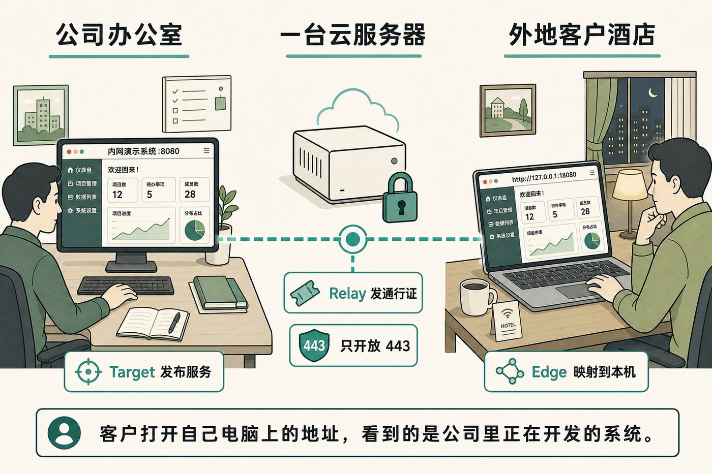
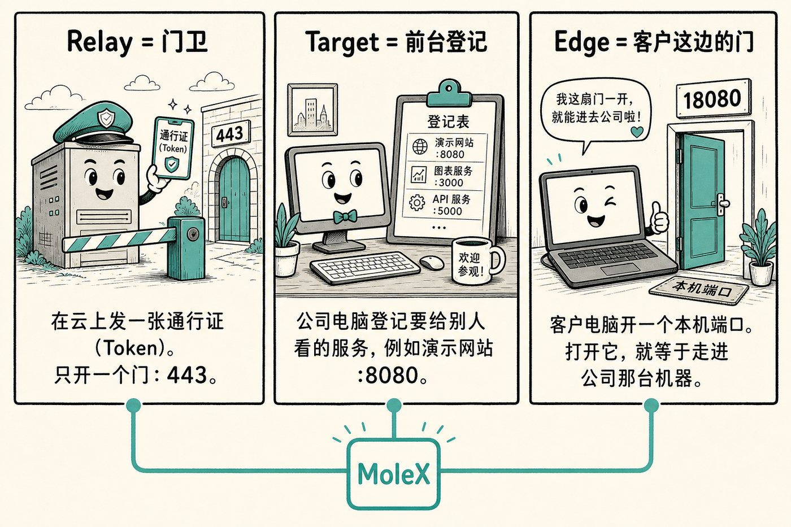
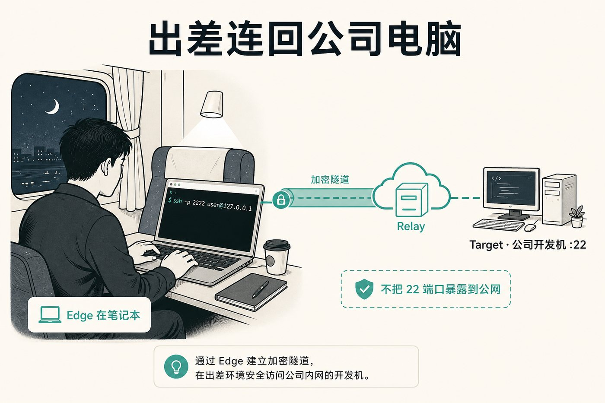
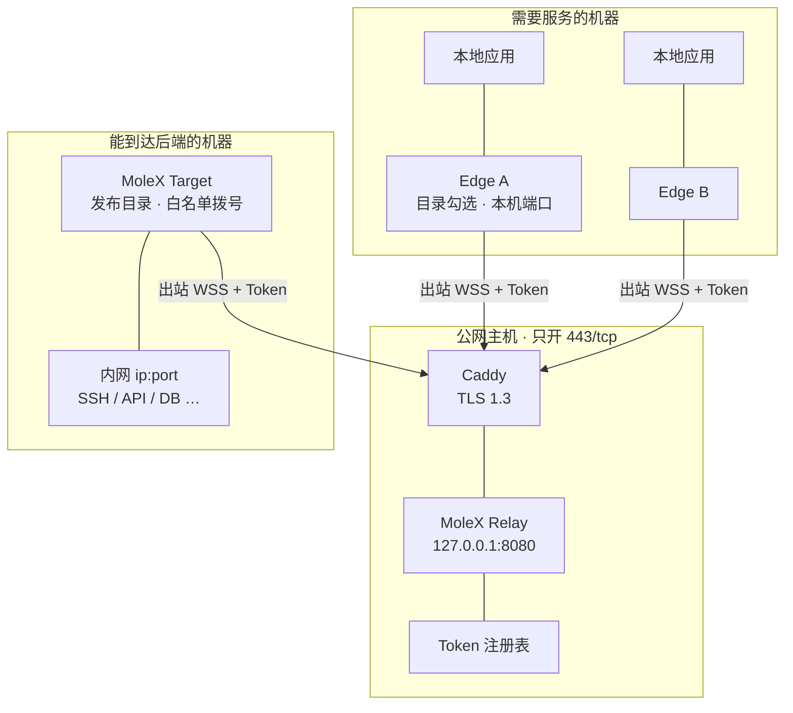
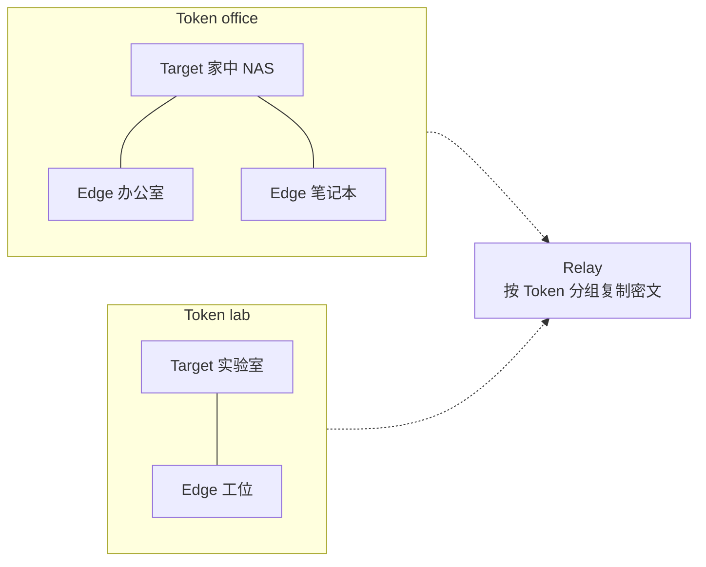
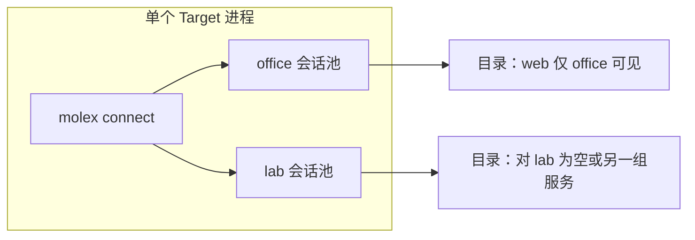
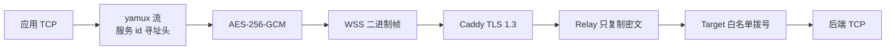
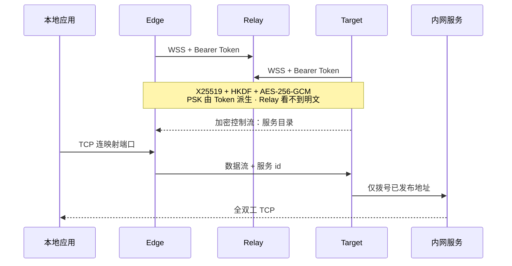

<p align="center">
  
  &nbsp;<strong>MoleX</strong>
  &nbsp;·&nbsp;
  <a href="README.en.md">English</a> · 简体中文
  &nbsp;·&nbsp;
  <a href="https://github.com/suifei/molex/releases/tag/v0.4.0"></a>
</p>

# 系统在公司里，人在外面——又不能把机器裸露到公网

研发里最常见的卡点：演示站、SSH、内网 API 只活在公司电脑上。外地客户要看效果，出差同事要改配置，前端要联调模型。

开公网端口危险。拉整网 VPN 太重，对方还看到不该看的东西。搭一套云上测试环境，往往来不及、也不等于「正在开发的那台」。

**MoleX 让对方打开自己电脑上的一个本机地址，加密走到你指定的那一条内网服务。公网只开 `443`。看完，收回通行证，整组断开。**

<p align="center">
  
</p>

客户打开 `http://127.0.0.1:18080`，看到的是公司开发机 `:8080` 上还没上线的系统。他进不了公司网，你也没有把 `8080` 映射到公网。

**对着上图做完这件事：**

1. 云上开 **Relay**（门卫），生成一张 Token。
2. 公司开发机开 **Target**（前台），登记 `127.0.0.1:8080`。
3. 把 Token 发给客户。客户电脑开 **Edge**（自己这边的门），勾选演示站。
4. 客户访问本机端口。演示结束，停用 Token。

<p align="center">
  
</p>

同一张通行证只通向 **一个 Target**，Edge 可以有很多台。对方多一台电脑，就多开一份 Edge，不会把整段内网掏过去。

### 同一类问题，换个现场

**人在外面，要登公司那台 Linux——又不能把 22 暴露出去。**

<p align="center">
  
</p>

```bash
ssh -p 2222 user@127.0.0.1
```

Windows 远程桌面一样：公司登记 `3389`，自己电脑连 `127.0.0.1:13389`。

**外地要调公司里的模型 / API——又不想开整段内网。**

把那一个 `ip:port` 登记出去，前端 `baseURL` 改成 `http://127.0.0.1:18080/v1`。只这一条服务，不是整网。

### 它解决什么，不解决什么

| 你卡住的地方 | 常见做法哪里别扭 | MoleX 怎么收 |
| --- | --- | --- |
| 外地看还没上线的系统 | 映射公网端口、拉整网 VPN、另搭云环境 | 对方打开本机地址；公网只开 `443` |
| 出差要 SSH / 远程桌面 | `22` / `3389` 暴露在公网 | 本机连本地端口，公司端口不出网 |
| 外地联调一条内网 API | 把整段内网或整台机器交给对方 | 只登记这一条服务 |
| 演示结束收不干净 | 端口还开着、VPN 账号还在 | 停用 Token，整组立刻断开 |
| 好几个客户要同时看 | 每人开一条公网映射 | 同一张通行证，多台 Edge |

不管 UDP 游戏、语音、HTTP/3，也不提供匿名上网。SSH / Windows 自己的登录还在，MoleX 只把 TCP 搬过去。

<p align="center">
  <a href="https://github.com/suifei/molex/actions/workflows/ci.yml"></a>
  <a href="https://github.com/suifei/molex/releases/latest"></a>
  <a href="https://github.com/suifei/molex/stargazers"></a>
  <a href="LICENSE"></a>
  <a href="#快速开始">快速开始</a> ·
  <a href="#架构">架构</a> ·
  <a href="docs/user-guide.zh-CN.md">使用手册</a>
</p>

## 架构

一个 Token 就是一组信任关系。跨 Token 完全隔离：互不可见、互不可达。



Relay **不**为每条隧道开公网端口。所有组共用 Caddy 的 `/ws/session`。重复 Target 会被拒绝；崩溃的 Target 由服务端心跳（20s ping / 75s 读超时）腾出槽位后即可重新入场。

### Token 组互相隔离



office 的 Edge 看不到 lab 的目录，构造寻址头也会被 Target 白名单拒绝。

### 一台进程加入多组



`services[].groups` 为空表示对该进程已加入的全部组可见；列出组名则仅这些组能看见、能拨号。Edge 加入多组时，每条映射必须带 `group`。

### 三种角色

| `mode` | 放在哪 | 做什么 | 怎么管 |
| --- | --- | --- | --- |
| `relay` | 有公网域名的机器 | Token 准入、1 Target + N Edge 分组、复制密文 | 密码登录：创建 / 轮换 / 停用 / 删除、审计、在线客户端、踢线 |
| `target` | 能访问后端的机器 | 发布目录，只拨号已发布地址 | 免登录本地页：`wss` + Token，服务与可见组热更新 |
| `edge` | 使用服务的机器 | 把已发布服务映射到本地端口 | 免登录本地页：勾选目录、分配端口、局域网开关 |

管理面强制回环（默认 `127.0.0.1:9090`）。远程请走 HTTPS 反代或 SSH 转发。Target / Edge 额外校验本机 Host，防止 DNS 重绑定。

## 数据怎么走

本地应用连的是 Edge 上的普通 TCP 端口。出公网之后，全程是加密记录：



```text
应用 TCP
  → Edge 映射监听
  → yamux（控制流发目录 / 数据流带服务 id）
  → AES-256-GCM 记录
  → WebSocket 二进制帧
  → TLS 1.3（Caddy :443）
  → Relay 密文复制
  → Target 白名单拨号
  → 内网服务
```



- 端到端密钥：`PSK = HKDF-SHA256(token, "molex/v2/e2e-psk")`，再加 X25519 临时密钥做前向保密。
- 目录与寻址头都在密文里；Relay 只看到连接元数据、时序和帧长度。
- 每个 Edge 一条独立加密会话；Target 按需扩会话池（热备一条，上限 65535），密钥与 yamux 状态不混用。
- 每进程 / 每会话最多 256 条并发流。加密隧道禁用 WebSocket 压缩。

完整握手与信任边界见[架构与协议](docs/architecture.md)。

## 快速开始

### 1. 下载或编译

Windows、macOS、Linux 的 `amd64` / `arm64` 包在 [GitHub Releases](https://github.com/suifei/molex/releases/latest)，附带 `SHA256SUMS`。

源码构建需要 Go 1.25+ 与 Node.js 20+：

```bash
cd frontend
npm ci
npm run build
cd ..
go build -trimpath -ldflags "-s -w -X main.version=0.4.0" -o bin/molex .
```

必须先构建前端，再构建 Go，以便把当前 Web 资源嵌入二进制。

### 2. 公网 Relay

```bash
molex config init --mode relay --config relay.json
molex web --config relay.json --password-file ./web-password --autostart
```

数据面 `127.0.0.1:8080`，控制台优先 `127.0.0.1:9090`（占用则后移）。登录后创建 Token，默认遮罩，可显示并复制。用 Caddy 发布 `/ws/session` 与管理页：见 [Caddy 示例](examples/Caddyfile) 和[部署指南](docs/deployment-caddy.md)。

### 3. 内网 Target

在能访问后端的机器上：

```bash
molex web
```

选 **Target**，填 `wss://…/ws/session` 和 Token，启动后添加服务（例如 `10.188.200.16:30927`）。保存即发布，运行中修改同样即时生效。

### 4. 本地 Edge（可多台）

```bash
molex web
```

选 **Edge**，填同一 WSS 与 Token。目录出现后勾选服务，控制台会建议空闲端口。仅在局域网其他设备需要访问时打开「局域网可见」（`0.0.0.0`）。显示「监听中」后即可：

```bash
ssh -p 2222 user@127.0.0.1
```

### 5. 远程看控制台

```bash
ssh -N -L 9090:127.0.0.1:9090 user@molex-host
```

Relay 控制台有会话 Cookie、CSRF、同源检查和登录限速。Target / Edge 免登录，但只接受回环来源。

## 配置

未知字段会被拒绝。三种角色各自只保留少量字段：

```json
{
  "mode": "relay",
  "listen": "127.0.0.1:8080",
  "tokens": [
    { "id": "tok-example", "token": "mx2_generated-value", "note": "office" }
  ]
}
```

```json
{
  "mode": "target",
  "remote": "wss://molex.example.com/ws/session",
  "token": "mx2_generated-value",
  "name": "home-target",
  "services": [
    { "id": "svc-web", "name": "web", "address": "10.188.200.16:30927" }
  ]
}
```

```json
{
  "mode": "edge",
  "remote": "wss://molex.example.com/ws/session",
  "token": "mx2_generated-value",
  "name": "office-edge",
  "mappings": [
    { "service": "svc-web", "port": 28080, "lan": false }
  ]
}
```

| 字段 | 角色 | 含义 |
| --- | --- | --- |
| `mode` | 全部 | `relay` / `target` / `edge` |
| `listen` | Relay | 数据面回环地址，位于 Caddy 之后 |
| `remote` | Target / Edge | `wss://`；明文 `ws://` 仅回环 |
| `token` | Target / Edge | 单组 Token（`mx2_` 前缀）。与 `tokens[]` 互斥 |
| `name` | Target / Edge | 控制台显示名，默认主机名 |
| `tokens[]` | 全部 | Relay：签发记录（含轮换宽限）。客户端：`{id, token}` |
| `services[]` | Target | `id` / `name` / `address`；可选 `groups` |
| `mappings[]` | Edge | `service` / `port` / `lan`；多组时必填 `group` |

核对过的起点在 [`examples/`](examples/)。

## CLI

```text
molex serve   --config ./relay.json
molex connect --config ./target.json
molex connect --config ./edge.json --remote wss://molex.example.com/ws/session --token "$MOLEX_TOKEN"
molex web     --config ./molex.json --password-file ./web-password --autostart
molex config init  --config ./molex.json --mode relay|target|edge
molex config check --config ./molex.json
molex version
```

Relay 密码也可用 `MOLEX_WEB_PASSWORD`。不要把 Token 写进节点名、日志或截图。

## 从 v1 迁移

v2 不自动迁移。`mode: "punch"` 以及 `role` / `secret` / `tunnel` 会启动失败并指向[升级指南](docs/upgrade-guide.zh-CN.md)。

1. Relay：`molex config init --mode relay --force`，为每组信任关系创建一个 Token。
2. 原 Target：`molex config init --mode target --force`，把旧的 `tunnel.local`（及多规则里的各个 `local`）加成已发布服务。
3. 原 Edge：`molex config init --mode edge --force`，勾选服务并沿用原来的本地端口。
4. 废弃 v1 的 `secret` 与 `channel`。v1 / v2 不能混跑。

## 稳定性与恢复

- 重连：约 1s → 15s，±20% 抖动，健康 30s 后重置。
- 映射只在路由就绪且服务仍发布时监听；Target 掉线或下架即关端口，恢复后自动重开。
- 端口占用只影响该条映射，释放后约 3 秒恢复。
- 停用 Token、重复 Target、管理员踢线都给出下一步操作。
- 停机有界：先关监听与会话，再关被追踪的本地连接，最后等待已接纳任务。
- Linux：`deploy/molex-relay.service`；无 systemd：`deploy/molex-keepalive.sh`。

## 安全要点

1. 未知 Token → HTTP 401；已停用 → 403。URL 必须是 `/ws/session`。
2. Hello 为固定 128 字节，不含明文 Token 或产品标记。
3. Relay 按 Token 预计算路由，并用实例 id 强制「每 Token 一个 Target」。
4. 目录、服务 id、拨号状态都在 AES-256-GCM 内；Relay 代码没有载荷解密路径。
5. Target 拒绝目录之外的一切拨号。
6. 远程 WSS 必须使用有效证书。

漏洞报告与凭据管理见[安全模型](docs/security.md)。

## 公开文档

| 文档 | 用途 |
| --- | --- |
| [v0.4.0 发行说明](docs/release-v0.4.0.zh-CN.md) | 破坏性变更、必须升级的角色、验证范围 |
| [使用手册](docs/user-guide.zh-CN.md) | 12 语种：五分钟部署、控制台、场景、排障 |
| [升级指南](docs/upgrade-guide.zh-CN.md) | 从 ≤v0.3.1 干净切换、回滚、验收 |
| [架构与协议](docs/architecture.md) | 拓扑、目录协议、握手、记录、重连 |
| [安全模型](docs/security.md) | 信任边界、凭据、白名单、漏洞报告 |
| [Caddy 部署](docs/deployment-caddy.md) | 生产 WSS、回环、systemd、健康检查 |
| [测试与发布检查](docs/testing.md) | Go / race / 前端 / 真实 Socket |
| [v2 验收清单](docs/v2-acceptance.zh-CN.md) | 逐项验收记录 |
| [配置示例](examples/) | Relay / Target / Edge / Caddy 最小起点 |

## 验证

```bash
go test -count=1 ./...
go test -race -count=1 ./...
go vet ./...
cd frontend && npm test && npm run check && npm run build
```

集成测试覆盖：多 Edge 并发、目录增删同步、重复 Target、白名单、Token 停用/踢线自愈、跨 Token 隔离、Target 重启、端口占用恢复、有界停机、密文篡改拒绝。

## 名称与许可证

**MoleX** 把鼹鼠打隧道与 **X**（transfer / cross / exchange）合在一起：通过加密会合路径，转发你自己拥有的 TCP 服务。

源码与仓库文档采用 [MIT 许可证](LICENSE)。许可证覆盖代码，不自动授予项目名、图标或商标权利。
