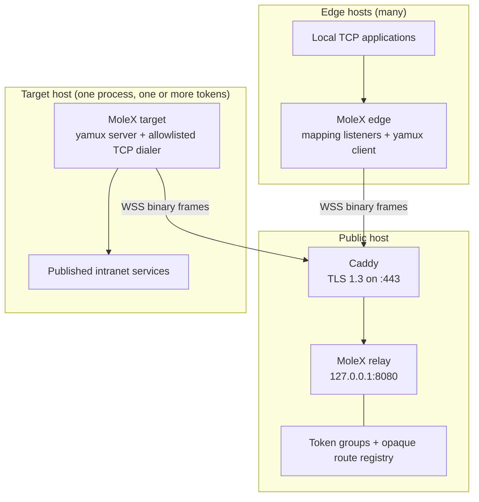
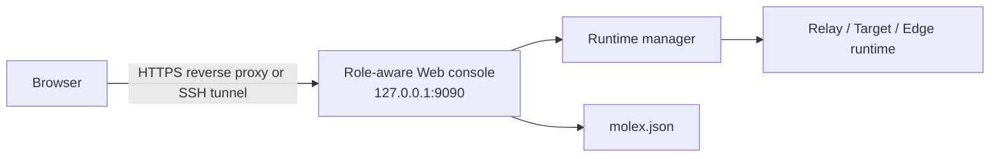
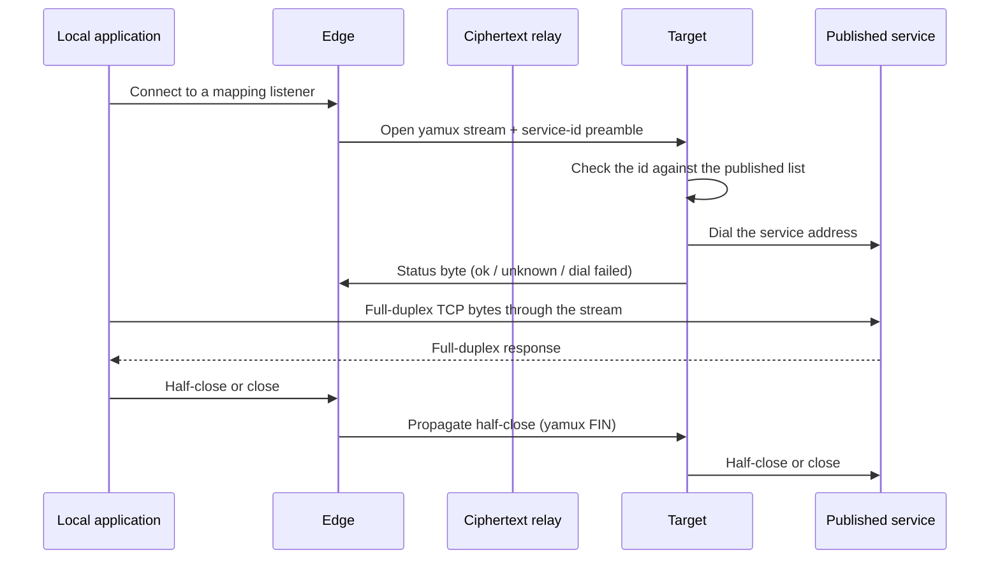

# Architecture and protocol

## Components



Edges and the Target always initiate outbound WSS connections. The relay does not open a per-tunnel public TCP port, so every group shares Caddy's single `443/tcp` listener.

One access token defines one group: exactly one Target process plus any number of Edges. A single Target or Edge process may join several tokens at once; each group still has its own encrypted sessions, catalog, and allowlist. The Relay tracks the Target's random instance id and rejects a second Target process on the same token while the first is alive; server keepalive pings clear dead sessions within about a minute so a crashed Target can rejoin quickly.

## Web management plane

`molex web` embeds the browser assets and runs the configured role through the same in-process service manager used by the API. It reads and writes the normal `molex.json`; there is no desktop wrapper or child MoleX process.



Each console manages exactly one role, fixed by the configuration file:

- **Relay console** — password login, token manager (create, note, rotate with a grace window, disable, delete, reveal/copy), durable JSONL audit log, per-token online summary, connected-client table with disconnect, live SSE activity.
- **Target console** — login-free (loopback only), relay address and one or more token groups, published-service editor with per-group visibility, applied live to running sessions, per-service stream counters and last dial errors.
- **Edge console** — login-free (loopback only), relay address and one or more token groups, live grouped service catalog with checkbox-to-map, suggested free local ports, per-mapping LAN toggle, listener state, and traffic counters.

Login-free consoles still enforce loopback TCP peers, local host names (anti DNS-rebinding), same-origin checks, and a per-boot CSRF token for mutations. The management listener is always loopback-only and separate from the relay data listener and Edge mapping listeners.

Token, service, and mapping edits apply to a running runtime without restarting it: the Web API persists the configuration and pushes the new list into the relay (admission and group revocation) or the client (catalog republish, listener reconciliation).

## Layering

From the application payload outward:

```text
TCP byte stream
  -> yamux logical stream (catalog control or service-addressed data)
  -> AES-256-GCM record
  -> WebSocket binary message
  -> TLS 1.3 connection to Caddy
  -> TCP/IP
```

Caddy removes the TLS layer and forwards the WebSocket message to the loopback relay. The message body remains an authenticated MoleX ciphertext record. The relay copies it to the paired WebSocket without opening the record.

## Rendezvous

Both clients present the same access token. From it each side derives:

```text
PSK   = HKDF-SHA256(token, "molex/v2/e2e-psk")
route = HMAC-SHA256(PSK, "molex/rendezvous/v1" || "molex/v2")
```

The relay authenticates the bearer token (SHA-256 lookup, disabled tokens refused with HTTP 403), pre-computes the expected route for that token, and rejects any hello whose route does not match — a session cannot smuggle itself into another token's group.

One live Target process is admitted per token. That process opens an adaptive pool of outbound sessions: one hot-standby slot plus one paired slot per Edge, up to 65,535. Arriving Edges wait in a FIFO queue and each is paired with the oldest free Target session slot. Each pair gets its own hello, ephemeral keys, encrypted records, and yamux session, so streams and keys never mix between Edges. A second Target process on the same token is rejected with an actionable close reason; unmatched Target slots remain as long-lived hot standby for the next Edge.

## Handshake

```mermaid
sequenceDiagram
    participant E as Edge
    participant C as Caddy
    participant R as Relay
    participant T as Target

    E->>C: TLS 1.3 + WebSocket upgrade (Bearer token)
    C->>R: WebSocket on loopback
    T->>C: TLS 1.3 + WebSocket upgrade (Bearer token)
    C->>R: WebSocket on loopback

    E->>R: Fixed-size encrypted metadata pings
    T->>R: Fixed-size encrypted metadata pings (incl. instance id)
    E->>R: Opaque hello (route, role, X25519 key, nonce, proof)
    T->>R: Opaque hello (route, role, X25519 key, nonce, proof)
    R->>R: Verify route matches token; enforce one Target instance
    R->>E: Target hello
    R->>T: Edge hello

    E->>E: Verify PSK proof and derive directional keys
    T->>T: Verify PSK proof and derive directional keys
    E->>T: Encrypted key confirmation
    T->>E: Encrypted key confirmation

    Note over E,T: Secure record connection is ready
```

Each hello is exactly 128 bytes and has no plaintext product magic or token. It contains a 32-byte opaque route key, one masked role byte, a 32-byte ephemeral X25519 public key, a 16-byte random nonce, a 32-byte HMAC proof, and 15 bytes of random padding.

Before the hello, a client may send up to five 125-byte WebSocket ping payloads carrying its node name, mapping/service count, relay URL without query parameters, GOOS/GOARCH platform, and (for a Target) its random per-process instance id. Each field is padded, AES-GCM encrypted with a key derived from the route and token, and bound to that exact hello. The same channel is reused after pairing so service and mapping counts refresh without a reconnect; each refresh uses a fresh GCM nonce. The Relay decrypts these operator-facing fields; the token and PSK are never encoded as metadata.

The peers verify the proof with the PSK, perform X25519 ECDH, and expand the result with HKDF-SHA256. The transcript binds the route, both public keys, both nonces, and roles. Key confirmation is the first encrypted record; a relay that substitutes an ephemeral key cannot produce a valid confirmation without the PSK, which the shipped relay never derives.

## Tunnel control protocol

Inside each paired yamux session the first byte of every stream selects its kind:

- **Control stream (`0x02`)** — opened by the Target right after the session is ready. It carries length-prefixed JSON catalog snapshots (`{id, name, address}` per service) filtered to the groups that session joined; the full visible list is re-sent after every service edit, so Edges converge on the current catalog without diffing.
- **Data stream (`0x01`)** — opened by the Edge for each accepted local connection. A short preamble carries the target service id; the Target answers with one status byte: `0` dial succeeded, `1` unknown/unpublished service (allowlist refusal), `2` backend dial failed. Only after status `0` does full-duplex bridging start.

The Relay never sees any of this: catalog contents, service ids, and statuses all travel inside AES-GCM records.

## Encrypted records

Each `net.Conn.Write` is split into chunks of at most 64 KiB. A chunk becomes one WebSocket binary message:

```text
ciphertext = AES-256-GCM(key, nonce_prefix || sequence, plaintext, sequence)
```

The sequence counter is monotonically increasing and is authenticated as additional data. Separate keys and nonce prefixes are used for each direction. Any changed, removed, duplicated, or reordered record causes authentication or stream failure.

WebSocket per-message compression is disabled. Compressing attacker-controlled and secret data in the same encryption context can create side channels, and tunneled applications may already compress their own payloads.

## Stream lifecycle



Each local connection maps to one yamux stream. TCP copies run in both directions and propagate half-close: `CloseWrite` on TCP sockets, FIN via `Close` on yamux streams, so a backend that finishes first still delivers EOF to the client. An Edge process allows at most 256 concurrent stream workers; each Target session allows the same per paired Edge. New sockets beyond that bound are closed with an actionable warning.

Mapping listeners follow the catalog: a listener opens only while the route is up and the service is published, closes when either goes away, and a port conflict marks just that mapping as errored while a background retry recovers it once the port is free. On shutdown, listeners and sessions close first, then MoleX closes tracked local connections and waits for every admitted worker to finish.

## Reconnection

Clients reconnect after a failed session with exponential delays from one to fifteen seconds. A 20% random jitter prevents Edge and Target fleets from synchronizing their attempts when a relay recovers. A secure session that remains active for 30 seconds resets the backoff.

A new connection creates fresh X25519 material and fresh directional keys. Mapping listeners exist only while a secure session is ready; when Relay or Target disappears, the Edge closes them, reports the catalog offline, and reopens everything after re-pairing. Existing TCP streams fail closed and the local application must retry them.

Each Relay participant owns one WebSocket read pump for its entire lifetime, extended by server keepalive pings (20-second interval, 75-second read deadline) so dead connections free their group slot promptly. Waiting participants are stored in per-route FIFO queues, and a closed waiter is removed immediately. Timeout, read failure, bridge failure, administrative kick, token revocation, and handler shutdown all converge on a `sync.Once` close; kicks and revocations pre-arm the close code so clients always receive the actionable reason (`4401` kicked, `4403` token disabled, `4409` duplicate Target).

Transient failures do not terminate the client process. Diagnostic events classify unknown and disabled tokens, duplicate Targets, administrative disconnects, HTTP routing responses, Caddy gateway errors, DNS resolution, refused connections, TLS verification, pairing timeout, occupied mapping ports, and unavailable published services. Each message identifies the setting or service the operator should check while automatic retries continue.

## Trust boundaries

| Component | Sees payload plaintext | Holds the token | Sees connection metadata |
| --- | --- | --- | --- |
| Edge | Yes | Yes | Local mappings and relay endpoint |
| Caddy | No MoleX payload plaintext | Sees bearer values on the loopback hop | Client IPs, timing, frame sizes |
| Relay | Never decrypts; operator could derive keys from stored tokens | Yes, stores all tokens | Names/counts/platform/instance ids, token groups, route IDs, timing, encrypted frame sizes |
| Target | Yes | Yes | Published services and relay endpoint |
