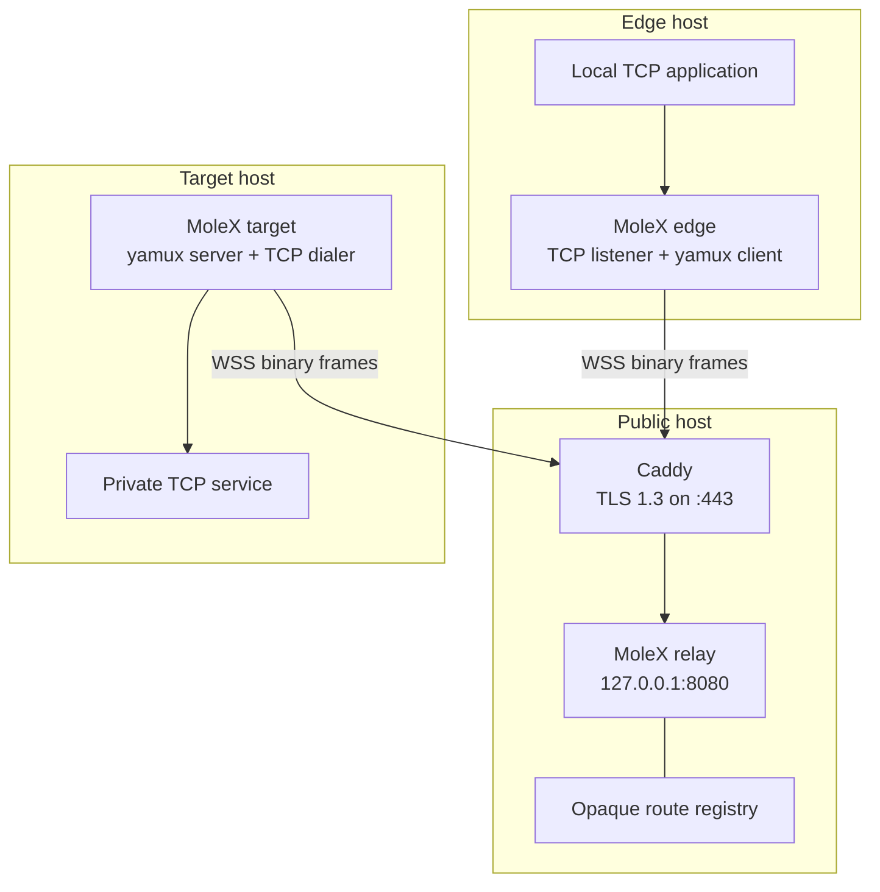
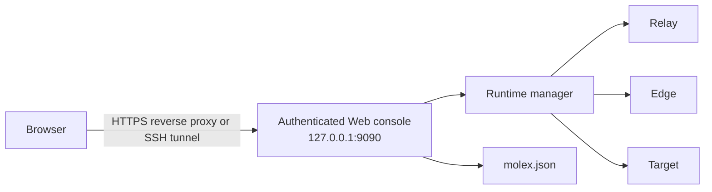
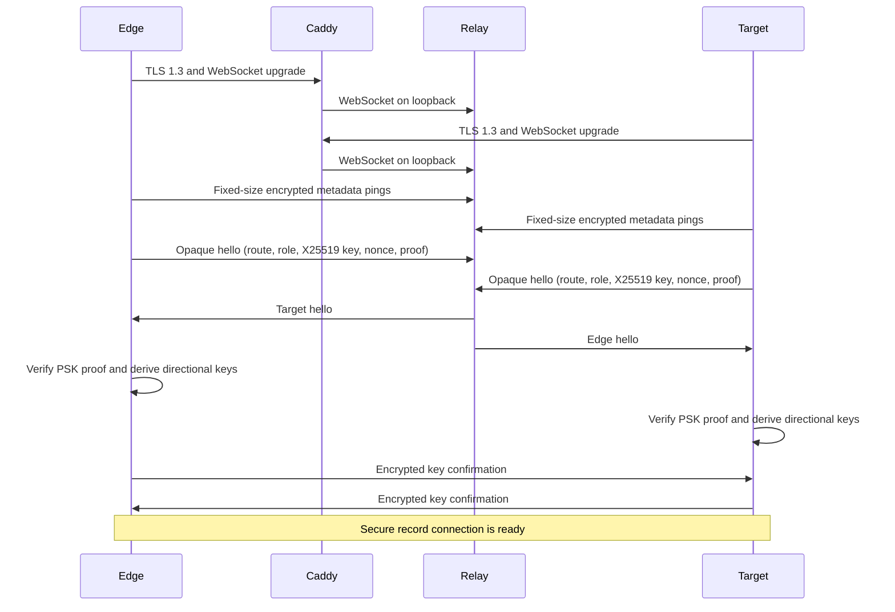
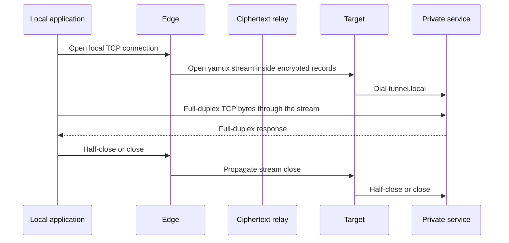

# Architecture and protocol

## Components



The edge and target always initiate outbound WSS connections. The relay does not open a per-tunnel public TCP port. This lets every route share Caddy's single `443/tcp` listener.

## Web management plane

`molex web` embeds the browser assets and runs the selected relay, edge, or target through the same in-process service manager used by the API. It reads and writes the normal `molex.json`; there is no desktop wrapper or child MoleX process.



Only one runtime role is active in a process. The management listener is always loopback-only; it is separate from the relay WebSocket listener and an edge TCP listener. Server-sent events carry runtime activity to authenticated browsers.

The Relay publishes structured connection lifecycle events containing a temporary process-local ID, normalized client IP, client-provided node name, Edge/Target role, forwarding and relay endpoints, platform, waiting/paired state, counterpart, pseudonymous route ID, connection time, last activity, and encrypted byte/frame counters. The service manager folds those events into the current status returned to the Web console and removes a peer when its WebSocket closes. Statistics use update-only events, so a delayed update cannot recreate a removed connection. The Relay never exposes the opaque route key, literal channel, payload secret, or relay token. Forwarded client-IP headers are accepted only when the immediate Relay connection comes from a loopback proxy such as Caddy; a direct remote client cannot spoof its displayed address.

## Layering

From the application payload outward:

```text
TCP byte stream
  -> yamux logical stream
  -> AES-256-GCM record
  -> WebSocket binary message
  -> TLS 1.3 connection to Caddy
  -> TCP/IP
```

Caddy removes the TLS layer and forwards the WebSocket message to the loopback relay. The message body remains an authenticated MoleX ciphertext record. The relay copies it to the paired WebSocket without opening the record.

## Rendezvous

The two clients share:

- a high-entropy end-to-end `secret`;
- a logical `tunnel.remote` channel;
- an optional relay admission `token`.

The route key is:

```text
HMAC-SHA256(secret, "molex/rendezvous/v1" || channel)
```

Only the 32-byte result is sent to the relay. Neither the literal channel nor the payload secret is sent. For each route key, the relay keeps FIFO waiting queues for Edge and Target participants. Every arriving participant is paired with the oldest waiting participant of the complementary role; additional same-role participants remain queued until a peer is available. Each pair gets its own hello exchange, ephemeral keys, encrypted record connection, and yamux session. Node names are display labels only, so multiple Edge or Target participants may use the same name; the temporary Relay peer ID distinguishes them in the Web console.

The route key is stable for a given secret and channel. It therefore lets the relay correlate reconnections. A low-entropy secret also permits offline guessing if an observer already knows likely channel values. Use the generated 32-byte secret.

Target supports one-to-many Edge access. With `tunnel.pool: 0` (the default), it starts one outbound session and opens the next session only after the previous slot is paired, up to 65,535 slots. A fixed pool from 1 to 65,535 is also accepted. Every slot has an independent WebSocket, hello packet, ephemeral X25519 keys, AES-GCM nonce state, and yamux session; the Relay pairs each slot independently without mixing stream namespaces.

## Handshake



Each hello is exactly 128 bytes and has no plaintext product magic, secret, or channel name. It contains:

- 32-byte opaque route key;
- one masked role byte;
- 32-byte ephemeral X25519 public key;
- 16-byte random nonce;
- 32-byte HMAC proof;
- 15 bytes of random padding.

Before the hello, a client may send up to four 125-byte WebSocket ping payloads for its node name, role-specific forwarding endpoint, relay URL without query parameters, and GOOS/GOARCH platform. Each field is padded and encrypted with AES-GCM, bound to that exact hello, and authenticated with a key derived from the opaque route plus the relay token when configured. The Relay decrypts these operator-facing fields; they are not end-to-end secret from the Relay or Caddy. The channel, route key, payload secret, and token are never encoded as metadata. A legacy Relay uses the standard ping handler, acknowledges the frames, and then reads the unchanged 128-byte hello.

The peers verify the proof with the PSK, perform X25519 ECDH, and expand the result with HKDF-SHA256. The transcript binds the route, both public keys, both nonces, and roles. The key schedule returns two AES-256 keys and two four-byte nonce prefixes, one set for each direction.

Key confirmation is the first encrypted record. A relay that substitutes an ephemeral key cannot produce a valid confirmation without the PSK.

## Encrypted records

Each `net.Conn.Write` is split into chunks of at most 64 KiB. A chunk becomes one WebSocket binary message:

```text
ciphertext = AES-256-GCM(key, nonce_prefix || sequence, plaintext, sequence)
```

The sequence counter is monotonically increasing and is authenticated as additional data. Separate keys and nonce prefixes are used for each direction. Any changed, removed, duplicated, or reordered record causes authentication or stream failure.

WebSocket per-message compression is disabled. Compressing attacker-controlled and secret data in the same encryption context can create side channels, and tunneled applications may already compress their own payloads.

## Stream lifecycle



Each local edge connection maps to one yamux stream. TCP copies run in both directions and propagate `CloseWrite` when the underlying connection supports it. A route permits at most 256 active stream workers, matching the yamux accept backlog. New sockets beyond that bound are closed with an actionable warning. On shutdown, the listener and session close first, then MoleX waits for every admitted worker to finish.

## Reconnection

Clients reconnect after a failed session with exponential delays from one to fifteen seconds. A 20% random jitter prevents Edge and Target fleets from synchronizing their attempts when a relay recovers. A secure session that remains active for 30 seconds resets the backoff, so an isolated later interruption recovers promptly.

A new connection creates fresh X25519 material and fresh directional keys. The Edge listener exists only while a secure peer session is ready. When Relay or Target disappears, yamux closure stops the listener and the runtime state returns to `connecting`; the previous listen address is cleared from status. Pairing recreates both the secure session and listener. Existing TCP streams fail closed and the local application must retry them.

Each Relay participant owns one WebSocket read pump for its entire lifetime. While waiting, that pump processes control frames and detects disconnects; after pairing, it passes binary frames through an unbuffered ordered handoff to the bridge. Waiting participants are stored in per-route FIFO queues, and a closed waiter is removed immediately so the next compatible participant can use its place. Registry ownership decides pairing and timeout under one mutex: if pairing claims a participant at the exact timeout boundary, the timeout path observes that it is no longer waiting and keeps the paired session. Per-frame writes are limited to 30 seconds. Timeout, read failure, bridge failure, and handler shutdown all converge on a `sync.Once` close operation, while the bridge closes both participants and waits for both relay workers to exit.

Transient failures do not terminate the client process. Diagnostic events classify HTTP authentication and routing responses, Caddy gateway errors, DNS resolution, refused connections, TLS verification, pairing timeout, mismatched peer configuration, occupied Edge addresses, and unavailable Target services. Each message identifies the setting or service the operator should check while automatic retries continue.

## Trust boundaries

| Component | Sees payload plaintext | Sees relay token | Sees connection metadata |
| --- | --- | --- | --- |
| Edge | Yes | Yes, if configured | Local and relay endpoints |
| Caddy | No MoleX payload plaintext | Yes | Client IPs, timing, frame sizes |
| Relay | No | Yes, for validation | Client-provided names/endpoints/platform, paired route IDs, timing, encrypted frame sizes |
| Target | Yes | Yes, if configured | Relay and target endpoints |
