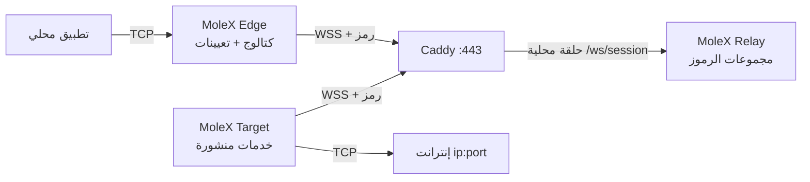

# دليل مستخدم MoleX

[English](user-guide.md) | [简体中文](user-guide.zh-CN.md) | [繁體中文](user-guide.zh-TW.md) | [Español](user-guide.es.md) | [Português (Brasil)](user-guide.pt-BR.md) | [Français](user-guide.fr.md) | [Deutsch](user-guide.de.md) | [日本語](user-guide.ja.md) | [한국어](user-guide.ko.md) | [Русский](user-guide.ru.md) | **العربية** | [हिन्दी](user-guide.hi.md)

يغطي هذا الدليل أول نشر والتشغيل اليومي. لقطات الشاشة من وحدة تحكم حقيقية؛ العناوين والمعرّفات والعدادات للإيضاح فقط. تبقى الرموز مخفية. واجهة وحدة التحكم بالإنجليزية والصينية المبسطة؛ هذا المستند هو دليل التشغيل بالعربية.

> ينقل MoleX **TCP** فقط: HTTP وHTTPS وواجهات البرمجة وSSH وRDP وقواعد البيانات. لا يحمل UDP الأصلي ولا QUIC/HTTP/3 ولا ICMP. انظر [حالة UDP](#7-حالة-udp-والبدائل).

الإصدار v1 (`mode: "punch"` مع `role` / `secret` / `channel` / `tunnel`) غير مقبول. أعد إنشاء الملفات بـ `molex config init --mode relay|target|edge`. انظر [دليل الترقية](upgrade-guide.md).

## 1. نظرة عامة

MoleX محور TCP آمن في ملف تنفيذي واحد. رمز وصول واحد يعرّف مجموعة: Target واحد تمامًا وأي عدد من Edges. ينشر Target خدمات الإنترانت `ip:port`؛ يعيّن كل Edge ما يحتاجه إلى منافذ محلية. يتصل Edge وTarget بنفس عنوان WSS العام. يعرّض Caddy عادة `443/tcp` فقط.

يقبل Relay العملاء بالرمز، ويجمّعهم، وينسخ نصًا مشفّرًا معتمًا. لا يفكّ Relay الموزَّع حمولة البيانات أبدًا. من يملك الرموز داخل حدود الثقة؛ عامل الرمز كالمفتاح الخاص لـ SSH. التفاصيل: [نموذج الأمان](security.md).

أبرز النقاط:

- رمز واحد، Target واحد، أي عدد من Edges. يُرفض Target ثانٍ على الرمز نفسه.
- يمكن لعملية Target أو Edge واحدة الانضمام إلى عدة رموز. يمكن تقييد الخدمات بمجموعات محددة.
- يتزامن كتالوج Target مباشرة. يفتح Edge مستمع التعيين فقط عندما يكون المسار جاهزًا والخدمة منشورة.
- حماية الحمولة هي X25519 + HKDF-SHA256 + AES-256-GCM داخل TLS 1.3. يُشتق PSK من الرمز.
- وحدة Relay: تسجيل دخول بكلمة مرور، إنشاء / تدوير / تعطيل / حذف الرموز، تدقيق، أقران مباشرة.
- وحدتا Target وEdge: بلا تسجيل دخول، حلقة محلية فقط، نفس الأصل وCSRF.
- إعادة المحاولة بتراجع محدود واهتزاز، من نحو ثانية إلى 15 ثانية.

سطر العلامة: **MoleX — The single-port secure transit hub.**

## 2. الأدوار ومسار الحركة



| الدور | المكان | السلوك | الدخول العام |
| --- | --- | --- | --- |
| Relay | اسم مضيف عام | يقبل الرموز، يقرن Target واحدًا مع N من Edges، ينسخ التشفير | Caddy `443/tcp` فقط |
| Target | مضيف يصل إلى الخلفيات | ينشر كتالوجًا؛ يتصل بتلك العناوين فقط | لا شيء؛ WSS صادر فقط |
| Edge | مضيف يستخدم الخدمات | يعيّن الخدمات المنشورة إلى منافذ محلية | حلقة محلية افتراضيًا؛ ربط LAN اختياري |

```text
تطبيق TCP -> تعيين Edge -> yamux (مقدمة معرّف الخدمة) -> AES-256-GCM -> WSS
        -> نسخ تشفير Relay -> اتصال Target حسب القائمة البيضاء -> TCP الخلفية
```

## 3. قبل البدء

- خادم عام لـ Relay وCaddy، اسم مثل `molex.example.com`.
- جهاز Target يصل إلى خدمات الإنترانت.
- جهاز Edge واحد أو أكثر.
- عامًا `443/tcp` فقط. مستوى بيانات Relay وكل وحدات الويب على الحلقة المحلية.

البناء من المصدر (Go 1.25+ وNode.js 20+):

```bash
cd frontend
npm ci
npm run build
cd ..
go build -trimpath -ldflags "-s -w -X main.version=0.4.0" -o bin/molex .
```

على Windows الناتج `bin/molex.exe`.

### 3.1 بيانات الاعتماد

| القيمة | من يستخدمها | الغرض |
| --- | --- | --- |
| كلمة مرور الويب | وحدة Relay فقط (≥12 حرفًا) | دخول الإدارة. لا تُحفظ في `molex.json`. |
| رمز الوصول | يصدره Relay؛ يقدّمه Target وEdge | القبول والتجميع ومصدر مفتاح الطرف إلى الطرف (`mx2_` + 32 بايت عشوائي). |

لا تضع كلمات المرور أو الرموز أو مفاتيح API أو ملفات تعريف الارتباط أو CSRF في اللقطات أو السجلات أو أسماء العقد أو مستودع عام. يسجّل التدقيق معرّفات الرموز فقط.

## 4. نشر في خمس دقائق

### 4.1 Relay

```bash
molex config init --mode relay --config relay.json
molex web --config relay.json --password-file ./web-password --autostart
```

سجّل الدخول، أنشئ رمزًا (ملاحظة مثل `office-nas`)، أظهره وانسخه. يستمع مستوى البيانات على `127.0.0.1:8080`. تفضّل الوحدة `127.0.0.1:9090`.

```json
{
  "mode": "relay",
  "listen": "127.0.0.1:8080",
  "tokens": [
    { "id": "tok-example", "token": "mx2_generated-value", "note": "office" }
  ]
}
```

### 4.2 Caddy

```caddyfile
molex.example.com {
    @molex_session {
        path /ws/session
        header Connection *Upgrade*
        header Upgrade websocket
    }
    handle @molex_session {
        reverse_proxy 127.0.0.1:8080
    }
    handle {
        respond "Hello, world." 200
    }
}

admin.molex.example.com {
    reverse_proxy 127.0.0.1:9090
}
```

لا تضف CORS عامًا. المثال الكامل: [نشر Caddy](deployment-caddy.md).

### 4.3 Target

على الجهاز الذي يصل إلى الخلفيات:

```bash
molex web
```

اختر **Target**، الصق عنوان WSS والرمز، ابدأ، ثم أضف خدمات (مثل `10.188.200.16:30927`). الحفظ ينشر الكتالوج فورًا.

```json
{
  "mode": "target",
  "remote": "wss://molex.example.com/ws/session",
  "token": "mx2_generated-value",
  "name": "home-target",
  "services": [
    { "id": "svc-web", "name": "web", "address": "10.188.200.16:30927" },
    { "id": "svc-ssh", "name": "ssh", "address": "127.0.0.1:22" }
  ]
}
```

للانضمام إلى مجموعتين في عملية واحدة استخدم `tokens` بدل `token` وقيّد الرؤية بـ `services[].groups`:

```json
{
  "mode": "target",
  "remote": "wss://molex.example.com/ws/session",
  "tokens": [
    { "id": "office", "token": "mx2_office-token" },
    { "id": "lab", "token": "mx2_lab-token" }
  ],
  "services": [
    { "id": "svc-web", "name": "web", "address": "10.188.200.16:30927", "groups": ["office"] }
  ]
}
```

`groups` الفارغ يعني كل المجموعات التي انضم إليها هذا Target.

### 4.4 Edge

```bash
molex web
```

اختر **Edge**، الصق نفس WSS والرمز، ابدأ. علّم خدمة منشورة؛ تقترح الوحدة منفذًا محليًا حرًا. فعّل **LAN visible** فقط عندما يجب أن تتصل أجهزة أخرى على تلك الشبكة (`0.0.0.0`).

```json
{
  "mode": "edge",
  "remote": "wss://molex.example.com/ws/session",
  "token": "mx2_generated-value",
  "name": "office-edge",
  "mappings": [
    { "service": "svc-web", "port": 28080 },
    { "service": "svc-ssh", "port": 2222 }
  ]
}
```

عند الانضمام إلى عدة مجموعات يحتاج كل تعيين إلى `group`.

### 4.5 التحقق والبدء دون متصفح

```bash
molex config check --config relay.json
molex config check --config target.json
molex config check --config edge.json

molex serve   --config relay.json
molex connect --config target.json
molex connect --config edge.json
```

وحدتا Target وEdge لا تطلبان كلمة مرور. الوصول عن بُعد لأي وحدة يكون عبر SSH أو HTTPS:

```bash
ssh -N -L 9090:127.0.0.1:9090 user@molex-host
```

## 5. جولة وحدة التحكم على الويب

### 5.1 تسجيل دخول Relay


وحدة Relay وحدها تطلب كلمة مرور. التشغيل الأول ينشئها. اللغة والمظهر على كل الوحدات. تتخطى Target وEdge هذه الشاشة.

### 5.2 Relay: الرموز والعملاء


- إنشاء الرموز وإظهارها/نسخها وتعطيلها وحذفها و**تدويرها**. يبقي التدوير القيمة السابقة صالحة 1–30 يومًا (الافتراضي 3).
- تُكتب الإجراءات الإدارية في ملف تدقيق JSONL بجانب الإعداد (معرّفات الرموز فقط).
- «Listen address» هو مستوى البيانات لا وحدة الويب.
- يعرض العملاء المتصلون الاسم والدور ومعرّف الرمز والمنصة ومدة التشغيل وRX/TX المشفر. يتحدث التسمية «N services / N mappings» عند تغيّر الكتالوج أو التعيينات.


الفصل يطرد عميلًا واحدًا؛ يعيد الاتصال بتراجع ما لم يُعطَّل الرمز.

### 5.3 Target


املأ عنوان WSS ورمزًا واحدًا أو أكثر. أضف الخدمات كـ `name` + `host:port`. مع عدة مجموعات علّم أيها يرى كل خدمة. الحفظ يطبَّق مباشرة. يبقى آخر خطأ اتصال على تلك الخدمة فقط.

### 5.4 Edge


بعد البدء يظهر الكتالوج. علّم خدمة لتعيينها. توجد المستمعات فقط بينما المسار جاهز والخدمة ما زالت منشورة. «Waiting» أثناء انقطاع متوقع.

## 6. وصفات شائعة

انشر الخلفية على Target ثم عيّنها على Edge. يمكن لعملية Target واحدة نشر كل الخدمات أدناه.

| السيناريو | عنوان خدمة Target | منفذ Edge المحلي | الأمر المحلي |
| --- | --- | --- | --- |
| SSH | `127.0.0.1:22` | `2222` | `ssh -p 2222 user@127.0.0.1` |
| Windows RDP | `127.0.0.1:3389` | `13389` | `mstsc /v:127.0.0.1:13389` |
| HTTP API | `127.0.0.1:8080` | `18080` | `curl http://127.0.0.1:18080/health` |
| PostgreSQL | `127.0.0.1:5432` | `15432` | `psql -h 127.0.0.1 -p 15432` |
| MySQL | `127.0.0.1:3306` | `13306` | `mysql -h 127.0.0.1 -P 13306` |
| Redis | `127.0.0.1:6379` | `16379` | `redis-cli -h 127.0.0.1 -p 16379` |
| HTTPS API | `api.openai.com:443` | `18443` | احتفظ باسم مضيف TLS (أدناه) |

لا تضع أسماء مستخدمين أو مفاتيح API أو أسماء عملاء في أسماء الخدمات أو العقد.

### 6.1 HTTP API

```bash
curl http://127.0.0.1:18080/health
```

لا يحلّل MoleX بروتوكول HTTP. WebSocket هو مسار بيانات MoleX فقط.

### 6.2 HTTPS / واجهة متوافقة مع OpenAI

لا تفتح `https://127.0.0.1:18443` مباشرة؛ يفشل فحص اسم المضيف في الشهادة. وجّه TCP إلى Edge مع الإبقاء على اسم المضيف الأصلي:

```bash
curl --connect-to api.openai.com:443:127.0.0.1:18443 \
  https://api.openai.com/v1/models \
  -H "Authorization: Bearer $OPENAI_API_KEY"
```

أبقِ مفتاح API في بيئة التطبيق لا في إعداد MoleX. يستخدم الخروج عنوان IP العام لشبكة Target. التزم بشروط المزوّد.

### 6.3 SSH وRDP

```bash
ssh -p 2222 user@127.0.0.1
scp -P 2222 ./file user@127.0.0.1:/tmp/
```

```powershell
mstsc /v:127.0.0.1:13389
```

ما زال SSH وWindows يملكان المصادقة. لا تربط Edge بـ `0.0.0.0` دون خطة جدار ناري.

### 6.4 عدة خدمات، عملية واحدة

انشر كل الخلفيات على Target واحد. عيّن المطلوب على كل Edge. ما زالت كل الجلسات تستخدم `wss://molex.example.com/ws/session`، فالسطح العام يبقى `443/tcp` واحدًا. تختار عدة وحدات ويب على مضيف واحد منافذ حلقة محلية مختلفة بدءًا من `9090`؛ ثبّتها إن احتجت إعادة توجيه SSH مستقرة.

## 7. حالة UDP والبدائل

لا يملك MoleX مقبس UDP ولا تأطير مخططات بيانات. لا يمكنه حمل DNS عبر UDP أو QUIC/HTTP/3 أو الألعاب أو VoIP أو NTP أو ICMP.

| الحاجة | التوصية |
| --- | --- |
| DNS | TCP/53 أو DoH أو DoT ثم إعادة توجيه خدمة TCP تلك |
| واجهة HTTP/3 | إجبار HTTP/1.1 أو HTTP/2 عبر TCP |
| Syslog | Syslog عبر TCP |
| ألعاب، VoIP، QUIC | WireGuard أو Tailscale أو نفق UDP أصلي آخر |

## 8. واجهة الأوامر

```bash
molex serve   --config ./relay.json
molex connect --config ./target.json
molex connect --config ./edge.json --remote wss://molex.example.com/ws/session --token "$MOLEX_TOKEN"
molex web     --config ./molex.json --password-file ./web-password --autostart
molex config init  --config ./molex.json --mode relay|target|edge
molex config check --config ./molex.json
molex version
```

قد تظهر رموز سطر الأوامر في سجل الصدفة. فضّل ملف إعداد محميًا. على Linux أبقِ مستوى البيانات بـ `deploy/molex-relay.service`؛ بدون systemd استخدم `deploy/molex-keepalive.sh`.

## 9. السلوك أثناء التشغيل

- يبدأ Edge وTarget WSS صادرًا فقط.
- توجد مستمعات التعيين فقط بينما المسار جاهز والخدمة منشورة.
- التراجع: نحو 1 ث → 15 ث، اهتزاز ±20٪، إعادة ضبط بعد 30 ث سليمة.
- المسار المكسور يغلق تدفقات TCP القائمة؛ يجب أن تعيد التطبيقات المحاولة.
- 256 تدفقًا متزامنًا كحد أقصى لكل عملية Edge / جلسة Target.
- Target مكرر: يُرفض بسبب إغلاق واضح. تعطيل/حذف الرمز يقطع المجموعة. يبقي التدوير القيمة القديمة خلال نافذة السماح.

## 10. استكشاف الأخطاء

| النتيجة | الإجراء |
| --- | --- |
| HTTP `401` | انسخ الرمز الحالي من وحدة Relay. بعد التدوير انتقل قبل انتهاء السماح. |
| HTTP `403` | الرمز معطّل. اطلب من مشغّل Relay تفعيله أو إصدار رمز جديد. |
| HTTP `404` | يجب أن ينتهي العنوان بـ `/ws/session` وأن يمرّر Caddy هذا المسار. |
| HTTP `502`/`503`/`504` | شغّل Relay؛ افحص أعلى Caddy `127.0.0.1:8080`. |
| Target مكرر | أوقف Target الآخر أو استخدم رمزًا آخر. |
| مهلة الاقتران | شغّل Target هذا الرمز. يجب أن يعمل الطرفان بـ MoleX v2 وبنفس الرمز. |
| التعيين في انتظار | Target غير متصل أو سُحبت الخدمة؛ يُستأنف تلقائيًا. |
| المنفذ مستخدم | أوقف الشاغل أو اختر منفذًا آخر؛ يتأثر هذا التعيين فقط. |
| الخدمة غير متاحة | شغّل الخلفية أو صحّح عنوان Target. |
| لا يستمع | متوقع في idle أو connecting أو stopping. |

```bash
curl --fail http://127.0.0.1:8080/healthz
curl --fail http://127.0.0.1:9090/healthz
```

## 11. قائمة الإنتاج

- عامًا: Caddy `443/tcp` فقط.
- بيانات Relay `127.0.0.1:8080`، الوحدات `127.0.0.1:9090`.
- يحتاج WSS البعيد شهادة صالحة. `ws://` الصريح حلقة محلية فقط.
- أنشئ الرموز في وحدة Relay. دوّرها بنافذة السماح ثم حدّث كل Target وEdge.
- رمز واحد لكل مجموعة ثقة. قيّد خدمات Target بـ `groups` عندما تخدم عملية واحدة عدة مجموعات.
- حساب خدمة بأقل صلاحية؛ ACL خاص للإعداد.
- تعيينات الحلقة المحلية افتراضيًا؛ ربط LAN لكل تعيين عند الحاجة فقط.
- فعّل إعادة اتصال التطبيق. لا يستأنف MoleX تدفق TCP قديمًا بعد إعادة بناء المسار.

انظر [الهندسة](architecture.md) و[نشر Caddy](deployment-caddy.md) و[الأمان](security.md).

## 12. رخصة MIT

يُوزَّع MoleX بموجب [رخصة MIT](../LICENSE). يُقدَّم البرنامج «كما هو». تغطي الرخصة الشفرة لا اسم المشروع أو الشعار أو علامات الغير، ولا تحل محل التزامات المشغّل القانونية وشروط الخدمة.
