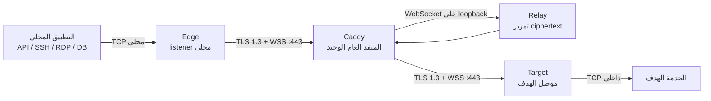

# دليل استخدام MoleX

[English](user-guide.md) | [简体中文](user-guide.zh-CN.md) | [繁體中文](user-guide.zh-TW.md) | [Español](user-guide.es.md) | [Português (Brasil)](user-guide.pt-BR.md) | [Français](user-guide.fr.md) | [Deutsch](user-guide.de.md) | [日本語](user-guide.ja.md) | [한국어](user-guide.ko.md) | [Русский](user-guide.ru.md) | **العربية** | [हिन्दी](user-guide.hi.md)

> حدود الإمكانات الحالية: ينقل MoleX اتصالات **TCP** بأمان. يدعم HTTP وHTTPS/API وSSH وRDP وقواعد البيانات المبنية على TCP. لا يدعم حالياً UDP أو QUIC/HTTP/3 أو ICMP بشكل أصلي. تتوفر WebUI حالياً بالإنجليزية والصينية المبسطة؛ وهذا هو الدليل العربي.

## 1. المشروع والعلامة

MoleX هو محور نقل TCP آمن مكتوب بلغة Go وموزع كملف تنفيذي واحد. يبدأ كل من Edge وTarget اتصالاً صادراً إلى WSS endpoint نفسه. يعرض Caddy عادة المنفذ العام الوحيد `443/tcp`. يجمع Relay الطرفين وينسخ ciphertext غير شفاف فقط؛ ولا يستلم end-to-end payload secret ولا يستطيع فك تشفير بيانات التطبيق.

ينطق `MoleX` بالشكل `/moʊl ɛks/`. تشير **Mole** إلى الخلد الذي يحفر نفقاً بعيداً عن الأنظار، بينما يشير **X** إلى Xfer/Transfer والتقاطع والتبادل بين نقطتين. العبارة المقترحة: **The single-port secure transit hub. One port. Two peers. One secure route.** لا يعني الاسم ضمان إخفاء الهوية أو عدم إمكانية الاكتشاف. تغطي MIT License الشفرة، لكنها لا تمنح تلقائياً حقوق الاسم أو الشعار أو العلامات التجارية؛ يجب التحقق منها بشكل مستقل قبل النشر العام.

## 2. البنية



| الدور | الوظيفة |
| --- | --- |
| Relay | يجمع Edge وTarget ويمرر ciphertext فقط |
| Edge | يفتح TCP listener المحلي بعد جاهزية route موثقة فقط |
| Target | يستقبل yamux streams ويوصل كل stream إلى `tunnel.local` |

يقابل كل اتصال TCP محلي yamux stream واحداً. تحمي X25519 وHKDF-SHA256 وAES-256-GCM الـpayload داخل TLS 1.3. الحد الأقصى هو 256 stream متزامناً لكل route.

## 3. القيم الحساسة

| القيمة | مكان الاستخدام | الغرض |
| --- | --- | --- |
| Web password | قيمة مستقلة لكل عقدة | دخول WebUI، ولا تحفظ في `molex.json` |
| Relay token | القيمة نفسها في Relay وEdge وTarget | السماح باتصال WSS، وليست payload key |
| End-to-end secret | القيمة نفسها في Edge/Target المقترنين فقط | التوثيق والتشفير، ولا يستلمها Relay |
| Channel | القيمة نفسها في Edge وTarget | اسم rendezvous منطقي وليس منفذاً عاماً |

لا تضع passwords أو tokens أو secrets أو API keys أو cookies أو قيم CSRF في screenshots أو logs أو tickets أو أسماء العقد أو المستودعات العامة.

## 4. نشر سريع

### Relay

```bash
molex config init --mode relay --config relay.json
```

```json
{
  "mode": "relay",
  "token": "mx1_REPLACE_WITH_RANDOM_RELAY_TOKEN",
  "listen": "127.0.0.1:8080",
  "tunnel": {}
}
```

انشر المسار `/ws/session` فقط عبر Caddy:

```caddyfile
molex.example.com {
    @molex_session {
        path /ws/session
        header Connection *Upgrade*
        header Upgrade websocket
    }
    handle @molex_session {
        reverse_proxy 127.0.0.1:8080
    }
    handle {
        respond "Hello, world." 200
    }
}
```

لا تضف wildcard CORS ولا تفرض upstream Upgrade headers يدوياً.

### Edge

```json
{
  "mode": "punch",
  "role": "edge",
  "secret": "mx1_SAME_END_TO_END_SECRET_ON_BOTH_CLIENTS",
  "token": "mx1_SAME_RELAY_TOKEN_ON_ALL_THREE_NODES",
  "listen": "127.0.0.1:2222",
  "remote": "wss://molex.example.com/ws/session",
  "tunnel": {
    "remote": "home-ssh",
    "name": "office-edge"
  }
}
```

### Target

```json
{
  "mode": "punch",
  "role": "target",
  "secret": "mx1_SAME_END_TO_END_SECRET_ON_BOTH_CLIENTS",
  "token": "mx1_SAME_RELAY_TOKEN_ON_ALL_THREE_NODES",
  "remote": "wss://molex.example.com/ws/session",
  "tunnel": {
    "local": "127.0.0.1:22",
    "remote": "home-ssh",
    "name": "home-target"
  }
}
```

يجب أن تتطابق `secret` و`token` و`remote` و`tunnel.remote` في Edge وTarget، وأن يكون الدوران متكاملين. يستخدم Edge وحده `listen` ويستخدم Target وحده `tunnel.local`.

تحقق ثم شغل كل عقدة على جهازها:

```bash
molex config check --config relay.json
molex config check --config edge.json
molex config check --config target.json

molex web --config relay.json  --password-file ./web-password --autostart
molex web --config target.json --password-file ./web-password --autostart
molex web --config edge.json   --password-file ./web-password --autostart
```

تستمع الإدارة على loopback `127.0.0.1:9090` فقط. للوصول البعيد المؤقت:

```bash
ssh -N -L 9090:127.0.0.1:9090 user@molex-host
```

ثم افتح `http://127.0.0.1:9090` محلياً. استخدم reverse proxy منفصلاً عبر HTTPS للوصول المستمر.

## 5. شرح WebUI


يتيح الشريط العلوي التبديل بين الإنجليزية والصينية المبسطة، وموضوع النظام/الفاتح/الداكن، وتسجيل الخروج. لتعديل route تعمل: **Stop** ثم التعديل ثم **Save** ثم **Start**.


يعرض Relay الاسم وIP الموثوق والدور والحالة وforward endpoint وRoute ID مستعاراً والطرف المقابل والمنصة ومدة الاتصال وRX/TX المشفر. Route ID ليس channel أو key.


لا يفتح Edge الـlistener قبل الاقتران مع Target موثق. حالة `Not listening` أثناء الانقطاع حماية متوقعة.


يجب أن يكون Target service عنوان TCP يمكن لجهاز Target الوصول إليه.

## 6. وصفات الاستخدام

| السيناريو | Target `tunnel.local` | Edge `listen` | الاستخدام المحلي |
| --- | --- | --- | --- |
| SSH | `127.0.0.1:22` | `127.0.0.1:2222` | `ssh -p 2222 user@127.0.0.1` |
| RDP | `127.0.0.1:3389` | `127.0.0.1:13389` | `mstsc /v:127.0.0.1:13389` |
| HTTP API | `127.0.0.1:8080` | `127.0.0.1:18080` | `curl http://127.0.0.1:18080/health` |
| PostgreSQL | `127.0.0.1:5432` | `127.0.0.1:15432` | `psql -h 127.0.0.1 -p 15432` |
| MySQL | `127.0.0.1:3306` | `127.0.0.1:13306` | `mysql -h 127.0.0.1 -P 13306` |
| Redis | `127.0.0.1:6379` | `127.0.0.1:16379` | `redis-cli -h 127.0.0.1 -p 16379` |
| OpenAI/HTTPS | `api.openai.com:443` | `127.0.0.1:18443` | الحفاظ على TLS hostname |

لا يحلل MoleX بروتوكول HTTP ولا يغير Host أو path أو headers أو body.

### OpenAI وHTTPS

استخدم channel باسم `openai-api`، واضبط Target على `api.openai.com:443` وEdge على `127.0.0.1:18443`. لا تطلب `https://127.0.0.1:18443` مباشرة لأن التحقق من hostname في الشهادة سيفشل.

```bash
curl --connect-to api.openai.com:443:127.0.0.1:18443 \
  https://api.openai.com/v1/models \
  -H "Authorization: Bearer $OPENAI_API_KEY"
```

يغير `--connect-to` وجهة TCP فقط؛ ويبقى URL وSNI وhostname الشهادة هو `api.openai.com`. احفظ API key في environment أو secret manager الخاص بالتطبيق، وليس في إعداد MoleX. سيكون egress IP هو عنوان شبكة Target؛ يجب الالتزام بشروط المزود والقيود الإقليمية.

### خدمات متعددة

يدير client process واحد route واحدة. استخدم config وchannel وEdge port وprocess مستقلة لكل من SSH وقاعدة البيانات وAPI. يمكن للجميع مشاركة `wss://molex.example.com/ws/session` ليبقى `443/tcp` المنفذ العام الوحيد. تحتاج WebUI المتعددة إلى منافذ loopback مختلفة مثل `9090` و`9091` و`9092`.

## 7. UDP

UDP غير مدعوم حالياً. يستخدم التنفيذ TCP listeners وyamux byte streams من دون حدود datagram أو mapping لعنوان المصدر أو انتهاء UDP flows. لا يمكن نقل UDP DNS أو QUIC/HTTP/3 أو الألعاب أو VoIP أو NTP أو SNMP traps أو ICMP مباشرة.

- DNS: استخدم TCP/53 أو DoH أو DoT.
- HTTP/3: أجبر العميل على HTTP/1.1 أو HTTP/2 فوق TCP.
- Syslog: استخدم TCP syslog.
- الألعاب وVoIP وQUIC: استخدم WireGuard أو Tailscale أو tunnel أصلياً لـUDP.

قد يضيف إصدار مستقبلي `tunnel.protocol: "udp"` مع الحفاظ على datagram داخل streams مشفرة، لكن WSS/TCP سيبقي head-of-line blocking. يصلح ذلك لـDNS أو المراقبة الخفيفة وليس للزمن الحقيقي. اعتبر MoleX TCP-only حتى تعلن release notes دعماً صريحاً.

## 8. إعادة الاتصال والتشخيص

- يرتفع backoff من نحو 1 إلى 15 ثانية مع jitter بنسبة 20%، ويعاد ضبطه بعد 30 ثانية سليمة.
- يغلق الانقطاع اتصالات TCP القديمة، وعلى التطبيق إعادة الاتصال.
- `401/403`: طابق `token` في العقد الثلاث.
- `404`: تحقق من `/ws/session` وCaddy matcher.
- `502/503/504`: شغل Relay وافحص upstream.
- Pairing timeout: افحص peer وchannel وsecret وtoken والأدوار المتكاملة.
- Address in use: حرر Edge listener أو غيره.
- Target unavailable: شغل الخدمة وافحص `tunnel.local`.

## 9. الأمان وترخيص MIT

اعرض Caddy `443/tcp` فقط للعامة. أبق Relay على `127.0.0.1:8080` وWebUI على `127.0.0.1:9090`. استخدم WSS بشهادة صالحة، وtoken وsecret عشوائيين مستقلين، وحسابات بأقل صلاحية وACL خاصة. أبق Edge على loopback ما لم يوجد تصميم واضح للجدار الناري والتوثيق.

يستخدم MoleX [MIT License](../LICENSE): يسمح بالاستخدام والنسخ والتعديل والدمج والنشر والتوزيع وإعادة الترخيص والبيع مع الاحتفاظ بإشعار حقوق النشر والترخيص. يقدم البرنامج “كما هو” من دون ضمان. لا يمنح الترخيص تلقائياً حقوق الاسم أو الشعار أو العلامات التجارية للغير.
