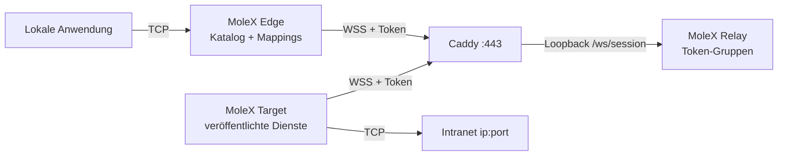

# MoleX-Benutzerhandbuch

[English](user-guide.md) | [简体中文](user-guide.zh-CN.md) | [繁體中文](user-guide.zh-TW.md) | [Español](user-guide.es.md) | [Português (Brasil)](user-guide.pt-BR.md) | [Français](user-guide.fr.md) | **Deutsch** | [日本語](user-guide.ja.md) | [한국어](user-guide.ko.md) | [Русский](user-guide.ru.md) | [العربية](user-guide.ar.md) | [हिन्दी](user-guide.hi.md)

Dieses Handbuch gilt für die Erstinbetriebnahme und den Alltag. Screenshots stammen aus einer echten Konsole; Adressen, IDs und Zähler sind beispielhaft. Tokens bleiben maskiert. Die Konsolenoberfläche ist Englisch und vereinfachtes Chinesisch; dieses Dokument ist die deutsche Betriebsanleitung.

> MoleX leitet nur **TCP** weiter: HTTP, HTTPS, APIs, SSH, RDP und Datenbanken. Native UDP, QUIC/HTTP/3 und ICMP werden nicht getragen. Siehe [UDP-Status](#7-udp-status-und-alternativen).

v1 (`mode: "punch"` mit `role` / `secret` / `channel` / `tunnel`) wird nicht akzeptiert. Dateien mit `molex config init --mode relay|target|edge` neu anlegen. Siehe den [Upgrade-Leitfaden](upgrade-guide.md).

## 1. Projektüberblick

MoleX ist ein sicherer TCP-Transit-Hub als Einzelbinärdatei. Ein Zugriffstoken definiert eine Gruppe: genau ein Target und beliebig viele Edges. Das Target veröffentlicht Intranet-Dienste `ip:port`; jede Edge mappt die benötigten auf lokale Ports. Edge und Target wählen dieselbe öffentliche WSS-Adresse. Caddy exponiert normalerweise nur `443/tcp`.

Der Relay lässt Clients per Token zu, gruppiert sie und kopiert undurchsichtigen Chiffretext. Der ausgelieferte Relay entschlüsselt Payloads nie. Wer die Tokens hält, liegt innerhalb der Vertrauensgrenze; behandeln Sie ein Token wie einen SSH-Privatschlüssel. Details: [Sicherheitsmodell](security.md).

Highlights:

- Ein Token, ein Target, beliebig viele Edges. Ein zweites Target am selben Token wird abgelehnt.
- Ein Target- oder Edge-Prozess kann mehreren Tokens beitreten. Dienste lassen sich auf ausgewählte Gruppen beschränken.
- Der Target-Katalog synchronisiert live. Die Edge öffnet einen Mapping-Listener nur, wenn die Route bereit und der Dienst veröffentlicht ist.
- Payload-Schutz ist X25519 + HKDF-SHA256 + AES-256-GCM innerhalb von TLS 1.3. Der PSK wird aus dem Token abgeleitet.
- Relay-Konsole: Passwort-Login, Token anlegen / rotieren / deaktivieren / löschen, Audit, Live-Peers.
- Target- und Edge-Konsolen: ohne Login, nur Loopback, Same-Origin und CSRF.
- Wiederholungen mit begrenztem Jitter-Backoff von etwa 1 s bis 15 s.

Markenzeile: **MoleX — The single-port secure transit hub.**

## 2. Rollen und Verkehrspfad



| Rolle | Ort | Verhalten | Öffentlicher Eingang |
| --- | --- | --- | --- |
| Relay | Öffentlicher Hostname | Lässt Tokens zu, paart ein Target mit N Edges, kopiert Chiffretext | Nur Caddy `443/tcp` |
| Target | Host, der Backends erreicht | Veröffentlicht einen Katalog; wählt nur diese Adressen | Keiner; nur ausgehendes WSS |
| Edge | Host, der die Dienste nutzt | Mappt veröffentlichte Dienste auf lokale Ports | Standard Loopback; optionales LAN-Bind |

```text
App-TCP -> Edge-Mapping -> yamux (Service-ID-Präambel) -> AES-256-GCM -> WSS
        -> Relay-Chiffretextkopie -> Target-Allowlist-Dial -> Backend-TCP
```

## 3. Vor dem Start

- Ein öffentlicher Server für Relay und Caddy, Hostname wie `molex.example.com`.
- Eine Target-Maschine, die die Intranet-Dienste erreicht.
- Eine oder mehrere Edge-Maschinen.
- Öffentlich nur `443/tcp`. Relay-Datenebene und alle Web-Konsolen auf Loopback.

Build aus dem Quellcode (Go 1.25+, Node.js 20+):

```bash
cd frontend
npm ci
npm run build
cd ..
go build -trimpath -ldflags "-s -w -X main.version=0.4.0" -o bin/molex .
```

Unter Windows heißt die Ausgabe `bin/molex.exe`.

### 3.1 Zugangsdaten

| Wert | Wer nutzt ihn | Zweck |
| --- | --- | --- |
| Web-Passwort | Nur Relay-Konsole (≥12 Zeichen) | Verwaltungs-Login. Nicht in `molex.json`. |
| Zugriffstoken | Relay stellt aus; Target und Edge legen vor | Zulassung, Gruppierung und Quelle des Ende-zu-Ende-Schlüssels (`mx2_` + 32 Zufallsbytes). |

Keine Passwörter, Tokens, API-Schlüssel, Cookies oder CSRF-Werte in Screenshots, Logs, Knotennamen oder ein öffentliches Repository. Audit speichert nur Token-IDs.

## 4. Fünf-Minuten-Deployment

### 4.1 Relay

```bash
molex config init --mode relay --config relay.json
molex web --config relay.json --password-file ./web-password --autostart
```

Anmelden, Token anlegen (Notiz wie `office-nas`), anzeigen und kopieren. Die Datenebene lauscht auf `127.0.0.1:8080`. Die Konsole bevorzugt `127.0.0.1:9090`.

```json
{
  "mode": "relay",
  "listen": "127.0.0.1:8080",
  "tokens": [
    { "id": "tok-example", "token": "mx2_generated-value", "note": "office" }
  ]
}
```

### 4.2 Caddy

```caddyfile
molex.example.com {
    @molex_session {
        path /ws/session
        header Connection *Upgrade*
        header Upgrade websocket
    }
    handle @molex_session {
        reverse_proxy 127.0.0.1:8080
    }
    handle {
        respond "Hello, world." 200
    }
}

admin.molex.example.com {
    reverse_proxy 127.0.0.1:9090
}
```

Kein Wildcard-CORS. Vollständiges Beispiel: [Caddy-Deployment](deployment-caddy.md).

### 4.3 Target

Auf der Maschine, die die Backends erreicht:

```bash
molex web
```

**Target** wählen, WSS-URL und Token einfügen, starten, dann Dienste hinzufügen (z. B. `10.188.200.16:30927`). Speichern veröffentlicht den Katalog sofort.

```json
{
  "mode": "target",
  "remote": "wss://molex.example.com/ws/session",
  "token": "mx2_generated-value",
  "name": "home-target",
  "services": [
    { "id": "svc-web", "name": "web", "address": "10.188.200.16:30927" },
    { "id": "svc-ssh", "name": "ssh", "address": "127.0.0.1:22" }
  ]
}
```

Für zwei Gruppen in einem Prozess `tokens` statt `token` verwenden und Sichtbarkeit mit `services[].groups` beschränken:

```json
{
  "mode": "target",
  "remote": "wss://molex.example.com/ws/session",
  "tokens": [
    { "id": "office", "token": "mx2_office-token" },
    { "id": "lab", "token": "mx2_lab-token" }
  ],
  "services": [
    { "id": "svc-web", "name": "web", "address": "10.188.200.16:30927", "groups": ["office"] }
  ]
}
```

Leeres `groups` bedeutet alle Gruppen, denen dieses Target beigetreten ist.

### 4.4 Edge

```bash
molex web
```

**Edge** wählen, dieselbe WSS-URL und dasselbe Token einfügen, starten. Einen veröffentlichten Dienst ankreuzen; die Konsole schlägt einen freien lokalen Port vor. **LAN sichtbar** nur aktivieren, wenn andere Geräte in diesem Netz verbinden müssen (`0.0.0.0`).

```json
{
  "mode": "edge",
  "remote": "wss://molex.example.com/ws/session",
  "token": "mx2_generated-value",
  "name": "office-edge",
  "mappings": [
    { "service": "svc-web", "port": 28080 },
    { "service": "svc-ssh", "port": 2222 }
  ]
}
```

Bei mehreren Gruppen braucht jedes Mapping `group`.

### 4.5 Prüfen und ohne Browser starten

```bash
molex config check --config relay.json
molex config check --config target.json
molex config check --config edge.json

molex serve   --config relay.json
molex connect --config target.json
molex connect --config edge.json
```

Target- und Edge-Konsolen brauchen kein Passwort. Fernzugriff auf jede Konsole über SSH oder HTTPS:

```bash
ssh -N -L 9090:127.0.0.1:9090 user@molex-host
```

## 5. Web-Konsolenrundgang

### 5.1 Relay-Anmeldung


Nur die Relay-Konsole fragt nach einem Passwort. Der erste Lauf legt es an. Sprache und Thema gibt es auf jeder Konsole. Target und Edge überspringen diesen Bildschirm.

### 5.2 Relay: Tokens und Clients


- Tokens anlegen, anzeigen/kopieren, deaktivieren, löschen und **rotieren**. Die Rotation hält den alten Wert 1–30 Tage gültig (Standard 3).
- Verwaltungsaktionen landen in einer JSONL-Auditdatei neben der Konfiguration (nur Token-IDs).
- „Listen address“ ist die Datenebene, nicht die Web-Konsole.
- Verbundene Clients zeigen Name, Rolle, Token-ID, Plattform, Onlinezeit und Chiffretext-RX/TX. Das Label „N services / N mappings“ aktualisiert sich bei Katalog- oder Mapping-Änderungen.


Trennen wirft einen Client; er verbindet mit Backoff erneut, sofern das Token nicht deaktiviert ist.

### 5.3 Target


WSS-Adresse und ein oder mehrere Tokens eintragen. Dienste als `name` + `host:port` hinzufügen. Bei mehreren Gruppen ankreuzen, welche den Dienst sehen dürfen. Speichern gilt live. Der letzte Dial-Fehler bleibt nur an diesem Dienst.

### 5.4 Edge


Nach dem Start erscheint der Katalog. Einen Dienst ankreuzen, um ihn zu mappen. Listener existieren nur, solange die Route bereit und der Dienst veröffentlicht ist. „Waiting“ während eines Ausfalls ist erwartet.

## 6. Häufige Rezepte

Backend auf dem Target veröffentlichen, dann auf der Edge mappen. Ein Target-Prozess kann alle folgenden Dienste veröffentlichen.

| Szenario | Target-Dienstadresse | Lokaler Edge-Port | Lokaler Befehl |
| --- | --- | --- | --- |
| SSH | `127.0.0.1:22` | `2222` | `ssh -p 2222 user@127.0.0.1` |
| Windows RDP | `127.0.0.1:3389` | `13389` | `mstsc /v:127.0.0.1:13389` |
| HTTP API | `127.0.0.1:8080` | `18080` | `curl http://127.0.0.1:18080/health` |
| PostgreSQL | `127.0.0.1:5432` | `15432` | `psql -h 127.0.0.1 -p 15432` |
| MySQL | `127.0.0.1:3306` | `13306` | `mysql -h 127.0.0.1 -P 13306` |
| Redis | `127.0.0.1:6379` | `16379` | `redis-cli -h 127.0.0.1 -p 16379` |
| HTTPS API | `api.openai.com:443` | `18443` | TLS-Hostname beibehalten (unten) |

Keine Benutzernamen, API-Schlüssel oder Kundennamen in Dienst- oder Knotennamen.

### 6.1 HTTP API

```bash
curl http://127.0.0.1:18080/health
```

MoleX parst HTTP nicht. WebSocket ist nur der MoleX-Datenpfad.

### 6.2 HTTPS / OpenAI-kompatible API

`https://127.0.0.1:18443` nicht direkt öffnen; die Zertifikat-Hostnameprüfung scheitert. TCP auf die Edge zeigen und den Original-Hostnamen behalten:

```bash
curl --connect-to api.openai.com:443:127.0.0.1:18443 \
  https://api.openai.com/v1/models \
  -H "Authorization: Bearer $OPENAI_API_KEY"
```

API-Schlüssel nur in der Anwendungsumgebung, nie in der MoleX-Konfiguration. Der Ausgang nutzt die öffentliche IP des Target-Netzes. Anbieterbedingungen einhalten.

### 6.3 SSH und RDP

```bash
ssh -p 2222 user@127.0.0.1
scp -P 2222 ./file user@127.0.0.1:/tmp/
```

```powershell
mstsc /v:127.0.0.1:13389
```

Authentifizierung bleibt bei SSH und Windows. Edge nicht ohne Firewallplan an `0.0.0.0` binden.

### 6.4 Mehrere Dienste, ein Prozess

Alle Backends auf einem Target veröffentlichen. Benötigte auf jeder Edge mappen. Alle Sitzungen nutzen weiter `wss://molex.example.com/ws/session`, die öffentliche Fläche bleibt ein `443/tcp`. Mehrere Web-Konsolen auf einem Host wählen ab `9090` unterschiedliche Loopback-Ports; festlegen, wenn stabile SSH-Forwards nötig sind.

## 7. UDP-Status und Alternativen

MoleX hat keinen UDP-Socket und kein Datagramm-Framing. Es kann kein UDP-DNS, QUIC/HTTP/3, Spiele, VoIP, NTP oder ICMP tragen.

| Bedarf | Empfehlung |
| --- | --- |
| DNS | TCP/53, DoH oder DoT, dann diesen TCP-Dienst weiterleiten |
| HTTP/3-API | HTTP/1.1 oder HTTP/2 über TCP erzwingen |
| Syslog | TCP-Syslog |
| Spiele, VoIP, QUIC | WireGuard, Tailscale oder ein anderer nativer UDP-Tunnel |

## 8. CLI

```bash
molex serve   --config ./relay.json
molex connect --config ./target.json
molex connect --config ./edge.json --remote wss://molex.example.com/ws/session --token "$MOLEX_TOKEN"
molex web     --config ./molex.json --password-file ./web-password --autostart
molex config init  --config ./molex.json --mode relay|target|edge
molex config check --config ./molex.json
molex version
```

Kommandozeilen-Tokens können in der Shell-Historie landen. Lieber eine geschützte Konfigurationsdatei. Unter Linux die Datenebene mit `deploy/molex-relay.service` halten; ohne systemd `deploy/molex-keepalive.sh`.

## 9. Laufzeitverhalten

- Edge und Target wählen nur ausgehendes WSS.
- Mapping-Listener existieren nur, solange die Route bereit und der Dienst veröffentlicht ist.
- Backoff: etwa 1 s → 15 s, ±20 % Jitter, Reset nach 30 s gesund.
- Eine unterbrochene Route schließt bestehende TCP-Streams; Anwendungen müssen erneut versuchen.
- Höchstens 256 gleichzeitige Streams pro Edge-Prozess / Target-Sitzung.
- Doppeltes Target: Ablehnung mit klarer Close-Reason. Token deaktivieren/löschen trennt die Gruppe. Rotation hält den alten Wert im Gnadenfenster.

## 10. Fehlerbehebung

| Ergebnis | Aktion |
| --- | --- |
| HTTP `401` | Aktuelles Token aus der Relay-Konsole kopieren. Nach Rotation vor Ende des Gnadenfensters migrieren. |
| HTTP `403` | Token ist deaktiviert. Relay-Betreiber um Aktivierung oder ein neues Token bitten. |
| HTTP `404` | URL muss auf `/ws/session` enden; Caddy muss diesen Pfad weiterleiten. |
| HTTP `502`/`503`/`504` | Relay starten; Caddy-Upstream `127.0.0.1:8080` prüfen. |
| Doppeltes Target | Das andere Target stoppen oder ein anderes Token nutzen. |
| Pairing-Timeout | Target für dieses Token starten. Beide Seiten müssen MoleX v2 mit demselben Token ausführen. |
| Mapping wartet | Target offline oder Dienst zurückgezogen; startet automatisch neu. |
| Port belegt | Beleger stoppen oder anderen Port wählen; betrifft nur dieses Mapping. |
| Dienst nicht erreichbar | Backend starten oder Target-Adresse korrigieren. |
| Lauscht nicht | Erwartet bei idle, connecting oder stopping. |

```bash
curl --fail http://127.0.0.1:8080/healthz
curl --fail http://127.0.0.1:9090/healthz
```

## 11. Produktionscheckliste

- Öffentlich: nur Caddy `443/tcp`.
- Relay-Daten `127.0.0.1:8080`, Konsolen `127.0.0.1:9090`.
- Remote-WSS braucht ein gültiges Zertifikat. Klares `ws://` nur Loopback.
- Tokens in der Relay-Konsole erzeugen. Mit Gnadenfenster rotieren, dann alle Targets und Edges aktualisieren.
- Ein Token pro Vertrauensgruppe. Target-Dienste mit `groups` beschränken, wenn ein Prozess mehrere Gruppen bedient.
- Dienstkonto mit Minimalrechten; private Konfigurations-ACL.
- Standardmäßig Loopback-Mappings; LAN-Bind pro Mapping nur bei Bedarf.
- Anwendungs-Reconnect aktivieren. MoleX setzt nach Routenneubau keinen alten TCP-Stream fort.

Siehe [Architektur](architecture.md), [Caddy-Deployment](deployment-caddy.md) und [Sicherheit](security.md).

## 12. MIT-Lizenz

MoleX wird unter der [MIT-Lizenz](../LICENSE) verteilt. Die Software wird „wie besehen“ bereitgestellt. Die Lizenz gilt für den Code, nicht für Projektname, Logo oder Marken Dritter, und ersetzt nicht die rechtlichen und Nutzungsbedingungen des Betreibers.
