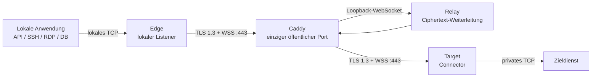

# MoleX Benutzerhandbuch

[English](user-guide.md) | [简体中文](user-guide.zh-CN.md) | [繁體中文](user-guide.zh-TW.md) | [Español](user-guide.es.md) | [Português (Brasil)](user-guide.pt-BR.md) | [Français](user-guide.fr.md) | **Deutsch** | [日本語](user-guide.ja.md) | [한국어](user-guide.ko.md) | [Русский](user-guide.ru.md) | [العربية](user-guide.ar.md) | [हिन्दी](user-guide.hi.md)

> Aktuelle Grenze: MoleX transportiert **TCP** sicher. HTTP, HTTPS/API, SSH, RDP und Datenbanken über TCP werden unterstützt. UDP, QUIC/HTTP/3 und ICMP werden nicht nativ unterstützt. Die WebUI ist derzeit auf Englisch und vereinfachtem Chinesisch verfügbar; dieses Dokument ist die deutsche Anleitung.

## 1. Projekt und Marke

MoleX ist ein in Go geschriebener sicherer TCP-Transit-Hub in einer einzigen Binärdatei. Edge und Target bauen ausgehende Verbindungen zum selben WSS-Endpunkt auf. Caddy veröffentlicht normalerweise nur `443/tcp`. Relay führt beide Peers zusammen und kopiert undurchsichtigen Ciphertext; das Ende-zu-Ende-Payload-Secret erhält Relay nie.

`MoleX` wird `/moʊl ɛks/` ausgesprochen. **Mole** steht für einen unsichtbar gegrabenen Tunnel; **X** für Xfer/Transfer, Kreuzung und Austausch zwischen zwei Endpunkten. Empfohlene Zeile: **The single-port secure transit hub. One port. Two peers. One secure route.** Der Name verspricht weder Anonymität noch Unsichtbarkeit. Die MIT-Lizenz gilt für den Code, erteilt aber nicht automatisch Rechte am Namen, Logo oder an Marken. Vor einer öffentlichen Veröffentlichung sollte die Verfügbarkeit geprüft werden.

## 2. Architektur



| Rolle | Aufgabe |
| --- | --- |
| Relay | Bringt Edge und Target zusammen und leitet nur Ciphertext weiter |
| Edge | Öffnet den lokalen TCP-Listener erst nach authentifizierter Kopplung |
| Target | Nimmt yamux-Streams an und verbindet jeden mit `tunnel.local` |

Jede lokale TCP-Verbindung entspricht einem yamux-Stream. X25519, HKDF-SHA256 und AES-256-GCM schützen das Payload innerhalb von TLS 1.3. Eine Route erlaubt höchstens 256 gleichzeitige Streams.

## 3. Vertrauliche Werte

| Wert | Verwendung | Zweck |
| --- | --- | --- |
| Web-Passwort | Auf jedem Knoten separat | WebUI-Anmeldung; nicht in `molex.json` |
| Relay token | Gleich auf Relay, Edge und Target | WSS-Zulassung; kein Payload-Key |
| End-to-end secret | Nur auf dem gekoppelten Edge/Target gleich | Authentifizierung und Verschlüsselung; Relay erhält es nicht |
| Channel | Auf Edge und Target gleich | Logischer Rendezvous-Name, kein öffentlicher Port |

Passwörter, Tokens, Secrets, API Keys, Cookies und CSRF-Werte gehören nie in Screenshots, Logs, Tickets, Knotennamen oder öffentliche Repositories.

## 4. Schnelle Bereitstellung

### Relay

```bash
molex config init --mode relay --config relay.json
```

```json
{
  "mode": "relay",
  "token": "mx1_REPLACE_WITH_RANDOM_RELAY_TOKEN",
  "listen": "127.0.0.1:8080",
  "tunnel": {}
}
```

Veröffentlichen Sie mit Caddy nur `/ws/session`:

```caddyfile
molex.example.com {
    @molex_session {
        path /ws/session
        header Connection *Upgrade*
        header Upgrade websocket
    }
    handle @molex_session {
        reverse_proxy 127.0.0.1:8080
    }
    handle {
        respond "Hello, world." 200
    }
}
```

Kein Wildcard-CORS hinzufügen und die Upgrade-Header zum Upstream nicht manuell erzwingen.

### Edge

```json
{
  "mode": "punch",
  "role": "edge",
  "secret": "mx1_SAME_END_TO_END_SECRET_ON_BOTH_CLIENTS",
  "token": "mx1_SAME_RELAY_TOKEN_ON_ALL_THREE_NODES",
  "listen": "127.0.0.1:2222",
  "remote": "wss://molex.example.com/ws/session",
  "tunnel": {
    "remote": "home-ssh",
    "name": "office-edge"
  }
}
```

### Target

```json
{
  "mode": "punch",
  "role": "target",
  "secret": "mx1_SAME_END_TO_END_SECRET_ON_BOTH_CLIENTS",
  "token": "mx1_SAME_RELAY_TOKEN_ON_ALL_THREE_NODES",
  "remote": "wss://molex.example.com/ws/session",
  "tunnel": {
    "local": "127.0.0.1:22",
    "remote": "home-ssh",
    "name": "home-target"
  }
}
```

`secret`, `token`, `remote` und `tunnel.remote` müssen auf Edge und Target übereinstimmen. Die Rollen müssen komplementär sein. Nur Edge verwendet `listen`, nur Target `tunnel.local`.

Konfiguration prüfen und auf den jeweiligen Rechnern starten:

```bash
molex config check --config relay.json
molex config check --config edge.json
molex config check --config target.json

molex web --config relay.json  --password-file ./web-password --autostart
molex web --config target.json --password-file ./web-password --autostart
molex web --config edge.json   --password-file ./web-password --autostart
```

Die WebUI bevorzugt `127.0.0.1:9090`, wählt bei Belegung automatisch einen freien Loopback-Port und öffnet danach den Standardbrowser. Für Server, SSH und Reverse-Proxys die Adresse mit `--listen 127.0.0.1:9090 --open-browser=false` festlegen. Für gelegentlichen Fernzugriff:

```bash
ssh -N -L 9090:127.0.0.1:9090 user@molex-host
```

Danach lokal `http://127.0.0.1:9090` öffnen. Für dauerhaften Zugriff einen separaten HTTPS-Reverse-Proxy verwenden.

## 5. WebUI-Anleitung


Die Kopfzeile schaltet Englisch/vereinfachtes Chinesisch, System-/Hell-/Dunkelmodus und Abmeldung. Zum Bearbeiten einer laufenden Route: **Stop**, ändern, **Save**, **Start**.


Relay zeigt Name, vertrauenswürdige IP, Rolle, Status, Weiterleitungsendpunkt, pseudonyme Route ID, Peer, Plattform, Onlinezeit und verschlüsselte Bytes/Frames. Die Route ID ist weder Channel noch Schlüssel.


Edge öffnet den Listener erst nach Kopplung mit einem authentifizierten Target. `Not listening` während eines Ausfalls ist erwarteter Schutz.


Target service muss eine vom Target-Rechner erreichbare TCP-Adresse sein.

## 6. Szenarien

| Szenario | Target `tunnel.local` | Edge `listen` | Lokale Verwendung |
| --- | --- | --- | --- |
| SSH | `127.0.0.1:22` | `127.0.0.1:2222` | `ssh -p 2222 user@127.0.0.1` |
| RDP | `127.0.0.1:3389` | `127.0.0.1:13389` | `mstsc /v:127.0.0.1:13389` |
| HTTP-API | `127.0.0.1:8080` | `127.0.0.1:18080` | `curl http://127.0.0.1:18080/health` |
| PostgreSQL | `127.0.0.1:5432` | `127.0.0.1:15432` | `psql -h 127.0.0.1 -p 15432` |
| MySQL | `127.0.0.1:3306` | `127.0.0.1:13306` | `mysql -h 127.0.0.1 -P 13306` |
| Redis | `127.0.0.1:6379` | `127.0.0.1:16379` | `redis-cli -h 127.0.0.1 -p 16379` |
| OpenAI/HTTPS | `api.openai.com:443` | `127.0.0.1:18443` | TLS-Hostname beibehalten |

MoleX analysiert HTTP nicht und ändert weder Host, Pfad, Header noch Body.

### OpenAI und HTTPS

Verwenden Sie Channel `openai-api`, Target `api.openai.com:443` und Edge `127.0.0.1:18443`. Rufen Sie nicht direkt `https://127.0.0.1:18443` auf, da die Zertifikatsprüfung scheitert.

```bash
curl --connect-to api.openai.com:443:127.0.0.1:18443 \
  https://api.openai.com/v1/models \
  -H "Authorization: Bearer $OPENAI_API_KEY"
```

`--connect-to` ändert nur das TCP-Ziel; URL, SNI und Zertifikatshostname bleiben `api.openai.com`. Der API Key gehört in die Umgebung oder den Secret Manager der Anwendung, nie in MoleX. Der öffentliche Egress-IP ist der des Target-Netzes; Anbieterbedingungen und regionale Verfügbarkeit gelten weiterhin.

### Mehrere Dienste

Ein Client-Prozess verwaltet eine Route. Für SSH, Datenbank und API jeweils eigene Konfigurationen, Channels, Edge-Ports und Prozesse verwenden. Alle können `wss://molex.example.com/ws/session` teilen; öffentlich bleibt nur `443/tcp`. Mehrere WebUIs wählen automatisch verschiedene Loopback-Ports; für stabile Proxy-Adressen `9090`, `9091`, `9092` explizit festlegen.

## 7. UDP

UDP wird derzeit nicht unterstützt. Die Implementierung verwendet TCP-Listener und yamux-Streams ohne Datagrammgrenzen, Quelladresszuordnung oder UDP-Flow-Ablauf. UDP-DNS, QUIC/HTTP/3, Spiele, VoIP, NTP, SNMP-Traps und ICMP können nicht direkt übertragen werden.

- DNS: TCP/53, DoH oder DoT verwenden.
- HTTP/3: HTTP/1.1 oder HTTP/2 über TCP erzwingen.
- Syslog: TCP-Syslog verwenden.
- Spiele, VoIP und QUIC: WireGuard, Tailscale oder einen nativen UDP-Tunnel verwenden.

Eine künftige Option `tunnel.protocol: "udp"` könnte Datagramme in verschlüsselten Streams erhalten, WSS/TCP hätte aber weiterhin Head-of-Line-Blocking. Das wäre für DNS oder leichte Überwachung geeignet, nicht für Echtzeit. Bis zu einer ausdrücklichen Release-Ankündigung ist MoleX TCP-only.

## 8. Wiederverbindung und Diagnose

- Backoff von etwa 1 bis 15 Sekunden mit 20 % Jitter; Reset nach 30 gesunden Sekunden.
- Ein Ausfall schließt alte TCP-Verbindungen; die Anwendung muss neu verbinden.
- `401/403`: `token` auf allen drei Knoten angleichen.
- `404`: `/ws/session` und Caddy-Matcher prüfen.
- `502/503/504`: Relay starten und Upstream prüfen.
- Pairing timeout: Peer, Channel, Secret, Token und komplementäre Rollen prüfen.
- Address in use: Edge-Listener freigeben oder ändern.
- Target unavailable: Dienst starten und `tunnel.local` prüfen.

## 9. Sicherheit und MIT-Lizenz

Nur Caddy `443/tcp` öffentlich bereitstellen. Relay auf `127.0.0.1:8080` und WebUI auf `127.0.0.1:9090` halten. WSS mit gültigem Zertifikat, unabhängige zufällige Tokens/Secrets, Konten mit minimalen Rechten und private ACLs verwenden. Edge ohne explizites Firewall- und Authentifizierungsdesign auf Loopback belassen.

MoleX verwendet die [MIT License](../LICENSE): Nutzung, Kopieren, Ändern, Zusammenführen, Veröffentlichen, Verteilen, Unterlizenzieren und Verkaufen sind bei Beibehaltung der Copyright- und Lizenzhinweise erlaubt. Die Software wird ohne Gewährleistung bereitgestellt. Die Lizenz erteilt nicht automatisch Rechte am Namen, Logo oder an Marken Dritter.
