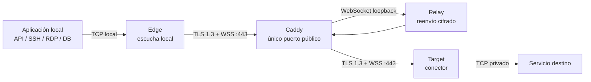

# Manual de usuario de MoleX

[English](user-guide.md) | [简体中文](user-guide.zh-CN.md) | [繁體中文](user-guide.zh-TW.md) | **Español** | [Português (Brasil)](user-guide.pt-BR.md) | [Français](user-guide.fr.md) | [Deutsch](user-guide.de.md) | [日本語](user-guide.ja.md) | [한국어](user-guide.ko.md) | [Русский](user-guide.ru.md) | [العربية](user-guide.ar.md) | [हिन्दी](user-guide.hi.md)

> Límite actual: MoleX transporta **TCP** de forma segura. Admite HTTP, HTTPS/API, SSH, RDP y bases de datos sobre TCP. No admite de forma nativa UDP, QUIC/HTTP/3 ni ICMP. La WebUI está disponible actualmente en inglés y chino simplificado; este documento es la guía en español.

## 1. Proyecto y marca

MoleX es un concentrador de tránsito TCP seguro, escrito en Go y distribuido como un solo binario. Edge y Target inician conexiones salientes hacia el mismo endpoint WSS. Caddy suele publicar el único puerto público, `443/tcp`. Relay solo reúne a los dos extremos y copia ciphertext opaco; nunca recibe el secreto de payload de extremo a extremo.

`MoleX` se pronuncia `/moʊl ɛks/`. **Mole** representa un túnel construido fuera de la vista; **X** sugiere Xfer/Transfer, cruce e intercambio entre dos extremos. Lema recomendado: **The single-port secure transit hub. One port. Two peers. One secure route.** El nombre no promete anonimato ni invisibilidad. La licencia MIT cubre el código, no concede automáticamente derechos sobre el nombre, el logotipo o marcas; compruebe su disponibilidad antes de una publicación comercial.

## 2. Arquitectura



| Rol | Función |
| --- | --- |
| Relay | Reúne Edge y Target y reenvía ciphertext sin descifrarlo |
| Edge | Abre el puerto TCP local solo cuando la ruta autenticada está lista |
| Target | Acepta streams yamux y conecta cada uno con `tunnel.local` |

Cada conexión TCP local corresponde a un stream yamux. X25519, HKDF-SHA256 y AES-256-GCM protegen el payload dentro de TLS 1.3. Una ruta admite hasta 256 streams simultáneos.

## 3. Valores sensibles

| Valor | Dónde se usa | Propósito |
| --- | --- | --- |
| Contraseña Web | Diferente en cada nodo | Inicio de sesión WebUI; no va en `molex.json` |
| Relay token | Igual en Relay, Edge y Target | Admisión WSS; no es la clave del payload |
| End-to-end secret | Igual solo en Edge y Target emparejados | Autenticación y cifrado; Relay no lo recibe |
| Channel | Igual en Edge y Target | Nombre lógico de encuentro, no un puerto público |

No incluya contraseñas, tokens, secretos, API keys, cookies o CSRF tokens en capturas, logs, incidencias, nombres de nodo o repositorios públicos.

## 4. Despliegue rápido

### Relay

```bash
molex config init --mode relay --config relay.json
```

```json
{
  "mode": "relay",
  "token": "mx1_REPLACE_WITH_RANDOM_RELAY_TOKEN",
  "listen": "127.0.0.1:8080",
  "tunnel": {}
}
```

Publique únicamente `/ws/session` con Caddy:

```caddyfile
molex.example.com {
    @molex_session {
        path /ws/session
        header Connection *Upgrade*
        header Upgrade websocket
    }
    handle @molex_session {
        reverse_proxy 127.0.0.1:8080
    }
    handle {
        respond "Hello, world." 200
    }
}
```

No añada CORS comodín ni fuerce manualmente los headers Upgrade de upstream.

### Edge

```json
{
  "mode": "punch",
  "role": "edge",
  "secret": "mx1_SAME_END_TO_END_SECRET_ON_BOTH_CLIENTS",
  "token": "mx1_SAME_RELAY_TOKEN_ON_ALL_THREE_NODES",
  "listen": "127.0.0.1:2222",
  "remote": "wss://molex.example.com/ws/session",
  "tunnel": {
    "remote": "home-ssh",
    "name": "office-edge"
  }
}
```

### Target

```json
{
  "mode": "punch",
  "role": "target",
  "secret": "mx1_SAME_END_TO_END_SECRET_ON_BOTH_CLIENTS",
  "token": "mx1_SAME_RELAY_TOKEN_ON_ALL_THREE_NODES",
  "remote": "wss://molex.example.com/ws/session",
  "tunnel": {
    "local": "127.0.0.1:22",
    "remote": "home-ssh",
    "name": "home-target"
  }
}
```

`secret`, `token`, `remote` y `tunnel.remote` deben coincidir en Edge y Target. Los roles deben ser complementarios. Solo Edge usa `listen`; solo Target usa `tunnel.local`.

Valide y arranque cada nodo:

```bash
molex config check --config relay.json
molex config check --config edge.json
molex config check --config target.json

molex web --config relay.json  --password-file ./web-password --autostart
molex web --config target.json --password-file ./web-password --autostart
molex web --config edge.json   --password-file ./web-password --autostart
```

La WebUI prefiere `127.0.0.1:9090`, elige automáticamente otro puerto loopback libre si está ocupado y después abre el navegador predeterminado. En servidores, SSH o reverse proxy, fije `--listen 127.0.0.1:9090 --open-browser=false`. Para acceso remoto ocasional:

```bash
ssh -N -L 9090:127.0.0.1:9090 user@molex-host
```

Abra después `http://127.0.0.1:9090` en el equipo local. Para acceso permanente, use un reverse proxy HTTPS separado.

## 5. Recorrido por la WebUI


La cabecera permite alternar inglés/chino simplificado, tema de sistema/claro/oscuro y cerrar sesión. Para editar una ruta en ejecución: **Stop**, modifique, **Save** y **Start**.


Relay muestra nombre, IP fiable, rol, estado, endpoint reenviado, Route ID seudónimo, peer, plataforma, tiempo online y bytes/frames cifrados. Route ID no es el channel ni una clave.


Edge no abre su listener hasta que Target esté autenticado y emparejado. `Not listening` durante una caída es protección esperada.


Target service debe ser una dirección TCP accesible desde el equipo Target.

## 6. Recetas por escenario

| Escenario | Target `tunnel.local` | Edge `listen` | Uso local |
| --- | --- | --- | --- |
| SSH | `127.0.0.1:22` | `127.0.0.1:2222` | `ssh -p 2222 user@127.0.0.1` |
| RDP | `127.0.0.1:3389` | `127.0.0.1:13389` | `mstsc /v:127.0.0.1:13389` |
| API HTTP | `127.0.0.1:8080` | `127.0.0.1:18080` | `curl http://127.0.0.1:18080/health` |
| PostgreSQL | `127.0.0.1:5432` | `127.0.0.1:15432` | `psql -h 127.0.0.1 -p 15432` |
| MySQL | `127.0.0.1:3306` | `127.0.0.1:13306` | `mysql -h 127.0.0.1 -P 13306` |
| Redis | `127.0.0.1:6379` | `127.0.0.1:16379` | `redis-cli -h 127.0.0.1 -p 16379` |
| OpenAI/HTTPS | `api.openai.com:443` | `127.0.0.1:18443` | Conservar hostname TLS |

MoleX no interpreta HTTP ni cambia Host, ruta, headers o body.

### OpenAI y HTTPS

Configure channel `openai-api`, Target `api.openai.com:443` y Edge `127.0.0.1:18443`. No use directamente `https://127.0.0.1:18443`, porque fallará la validación del certificado.

```bash
curl --connect-to api.openai.com:443:127.0.0.1:18443 \
  https://api.openai.com/v1/models \
  -H "Authorization: Bearer $OPENAI_API_KEY"
```

`--connect-to` cambia el socket TCP, pero mantiene URL, SNI y hostname del certificado. Guarde la API key solo en el entorno o secret manager de la aplicación, nunca en MoleX. El IP de salida será el de la red Target; respete términos del proveedor y restricciones regionales.

### Varios servicios

Un proceso cliente gestiona una ruta. Use configuraciones, channels, puertos Edge y procesos independientes para SSH, base de datos y API. Todos pueden compartir `wss://molex.example.com/ws/session`; el servidor sigue exponiendo un único `443/tcp`. Varias WebUI eligen puertos loopback distintos automáticamente; fije `9090`, `9091`, `9092` para direcciones proxy estables.

## 7. UDP

UDP no está soportado actualmente. La implementación usa listeners TCP y streams yamux, sin límites de datagrama, mapeo de direcciones de origen ni expiración de flows UDP. No puede transportar directamente DNS UDP, QUIC/HTTP/3, juegos, VoIP, NTP, SNMP traps ni ICMP.

- DNS: use TCP/53, DoH o DoT.
- HTTP/3: fuerce HTTP/1.1 o HTTP/2 sobre TCP.
- Syslog: use TCP syslog.
- Juegos, VoIP y QUIC: use WireGuard, Tailscale u otro túnel UDP nativo.

Una futura opción `tunnel.protocol: "udp"` podría enmarcar datagramas dentro de streams cifrados, pero WSS/TCP seguiría teniendo head-of-line blocking. Sería adecuada para DNS o monitorización de bajo caudal, no para tiempo real. Trate MoleX como TCP-only hasta que una release anuncie lo contrario.

## 8. Reconexión y diagnóstico

- El backoff crece de aproximadamente 1 a 15 segundos, con 20% de jitter; se reinicia tras 30 segundos saludables.
- Una caída cierra conexiones TCP antiguas; la aplicación debe reconectar.
- `401/403`: iguale `token` en los tres nodos.
- `404`: compruebe `/ws/session` y el matcher Caddy.
- `502/503/504`: arranque Relay y revise el upstream.
- Pairing timeout: revise peer, channel, secret, token y roles complementarios.
- Address in use: libere o cambie el listener Edge.
- Target unavailable: arranque el servicio y revise `tunnel.local`.

## 9. Seguridad y licencia MIT

Exponga solo Caddy `443/tcp`. Mantenga Relay en `127.0.0.1:8080` y WebUI en `127.0.0.1:9090`. Use WSS con certificado válido, tokens y secretos aleatorios independientes, cuentas de mínimo privilegio y ACL privadas. Edge debe permanecer en loopback salvo que exista un diseño explícito de firewall y autenticación.

MoleX usa la [MIT License](../LICENSE): se permite usar, copiar, modificar, fusionar, publicar, distribuir, sublicenciar y vender el software conservando el aviso de copyright y licencia. Se entrega “tal cual”, sin garantía. La licencia no concede automáticamente derechos sobre nombre, logotipo o marcas de terceros.
