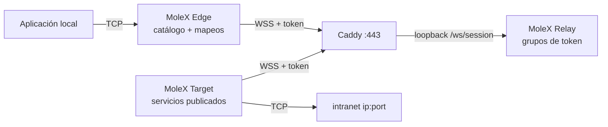

# Guía de usuario de MoleX

[English](user-guide.md) | [简体中文](user-guide.zh-CN.md) | [繁體中文](user-guide.zh-TW.md) | **Español** | [Português (Brasil)](user-guide.pt-BR.md) | [Français](user-guide.fr.md) | [Deutsch](user-guide.de.md) | [日本語](user-guide.ja.md) | [한국어](user-guide.ko.md) | [Русский](user-guide.ru.md) | [العربية](user-guide.ar.md) | [हिन्दी](user-guide.hi.md)

Esta guía cubre el primer despliegue y el día a día. Las capturas son de una consola real; direcciones, identificadores y contadores son ilustrativos. Los tokens permanecen enmascarados. La interfaz de la consola está en inglés y chino simplificado; este documento es la guía operativa en español.

> MoleX reenvía solo **TCP**: HTTP, HTTPS, APIs, SSH, RDP y bases de datos. No transporta UDP nativo, QUIC/HTTP/3 ni ICMP. Véase [estado de UDP](#7-estado-de-udp-y-alternativas).

v1 (`mode: "punch"` con `role` / `secret` / `channel` / `tunnel`) no se acepta. Recree los archivos con `molex config init --mode relay|target|edge`. Véase la [guía de actualización](upgrade-guide.md).

## 1. Descripción del proyecto

MoleX es un concentrador TCP seguro en un solo binario. Un token de acceso define un grupo: exactamente un Target y cualquier número de Edges. El Target publica servicios de intranet `ip:port`; cada Edge asigna los que necesita a puertos locales. Edge y Target marcan la misma dirección WSS pública. Caddy suele exponer solo `443/tcp`.

El Relay admite clientes por token, los agrupa y copia texto cifrado opaco. El Relay publicado nunca descifra la carga. Quien posee los tokens está dentro del perímetro de confianza; trátelos como una clave privada SSH. Detalles: [modelo de seguridad](security.md).

Puntos clave:

- Un token, un Target, cualquier número de Edges. Un segundo Target en el mismo token se rechaza.
- Un proceso Target o Edge puede unirse a varios tokens. Los servicios se pueden limitar a grupos concretos.
- El catálogo del Target se sincroniza en vivo. El Edge abre un listener de mapeo solo cuando la ruta está lista y el servicio publicado.
- La protección de carga es X25519 + HKDF-SHA256 + AES-256-GCM dentro de TLS 1.3. El PSK se deriva del token.
- Consola Relay: inicio de sesión con contraseña, crear / rotar / desactivar / eliminar tokens, auditoría, peers en vivo.
- Consolas Target y Edge: sin login, solo loopback, same-origin y CSRF.
- Reintentos con backoff limitado y jitter, de unos 1 s a 15 s.

Línea de marca sugerida: **MoleX — The single-port secure transit hub.**

## 2. Roles y camino del tráfico



| Rol | Dónde | Comportamiento | Entrada pública |
| --- | --- | --- | --- |
| Relay | Nombre de host público | Admite tokens, empareja un Target con N Edges, copia cifrado | Solo Caddy `443/tcp` |
| Target | Host que alcanza los backends | Publica un catálogo; marca solo esas direcciones | Ninguna; solo WSS de salida |
| Edge | Host que usa los servicios | Mapea servicios publicados a puertos locales | Loopback por defecto; bind LAN opcional |

```text
app TCP -> mapeo Edge -> yamux (preámbulo service-id) -> AES-256-GCM -> WSS
        -> copia de cifrado del Relay -> dial con allowlist del Target -> TCP del backend
```

## 3. Antes de empezar

- Un servidor público para Relay y Caddy, hostname como `molex.example.com`.
- Una máquina Target que alcance los servicios de intranet.
- Una o más máquinas Edge.
- Solo `443/tcp` público. El plano de datos del Relay y todas las consolas Web en loopback.

Compilación desde el código (Go 1.25+, Node.js 20+):

```bash
cd frontend
npm ci
npm run build
cd ..
go build -trimpath -ldflags "-s -w -X main.version=0.4.0" -o bin/molex .
```

En Windows el binario es `bin/molex.exe`.

### 3.1 Credenciales

| Valor | Quién lo usa | Propósito |
| --- | --- | --- |
| Contraseña Web | Solo consola Relay (≥12 caracteres) | Login de administración. No se guarda en `molex.json`. |
| Token de acceso | El Relay lo emite; Target y Edge lo presentan | Admisión, agrupación y origen de la clave extremo a extremo (`mx2_` + 32 bytes aleatorios). |

No ponga contraseñas, tokens, claves API, cookies ni valores CSRF en capturas, logs, nombres de nodo o un repositorio público. La auditoría guarda solo ids de token.

## 4. Despliegue en cinco minutos

### 4.1 Relay

```bash
molex config init --mode relay --config relay.json
molex web --config relay.json --password-file ./web-password --autostart
```

Inicie sesión, cree un token (nota como `office-nas`), revélelo y cópielo. El plano de datos escucha en `127.0.0.1:8080`. La consola prefiere `127.0.0.1:9090`.

```json
{
  "mode": "relay",
  "listen": "127.0.0.1:8080",
  "tokens": [
    { "id": "tok-example", "token": "mx2_generated-value", "note": "office" }
  ]
}
```

### 4.2 Caddy

```caddyfile
molex.example.com {
    @molex_session {
        path /ws/session
        header Connection *Upgrade*
        header Upgrade websocket
    }
    handle @molex_session {
        reverse_proxy 127.0.0.1:8080
    }
    handle {
        respond "Hello, world." 200
    }
}

admin.molex.example.com {
    reverse_proxy 127.0.0.1:9090
}
```

No añada CORS comodín. Ejemplo completo: [despliegue con Caddy](deployment-caddy.md).

### 4.3 Target

En la máquina que alcanza los backends:

```bash
molex web
```

Elija **Target**, pegue la URL WSS y el token, inicie y añada servicios (por ejemplo `10.188.200.16:30927`). Guardar publica el catálogo al momento.

```json
{
  "mode": "target",
  "remote": "wss://molex.example.com/ws/session",
  "token": "mx2_generated-value",
  "name": "home-target",
  "services": [
    { "id": "svc-web", "name": "web", "address": "10.188.200.16:30927" },
    { "id": "svc-ssh", "name": "ssh", "address": "127.0.0.1:22" }
  ]
}
```

Para unirse a dos grupos en un proceso, use `tokens` en lugar de `token` y `services[].groups` para restringir la visibilidad:

```json
{
  "mode": "target",
  "remote": "wss://molex.example.com/ws/session",
  "tokens": [
    { "id": "office", "token": "mx2_office-token" },
    { "id": "lab", "token": "mx2_lab-token" }
  ],
  "services": [
    { "id": "svc-web", "name": "web", "address": "10.188.200.16:30927", "groups": ["office"] }
  ]
}
```

`groups` vacío significa todos los grupos a los que este Target se unió.

### 4.4 Edge

```bash
molex web
```

Elija **Edge**, pegue la misma URL WSS y el token, inicie. Marque un servicio publicado; la consola sugiere un puerto local libre. Active **LAN visible** solo si otros dispositivos de esa red deben conectar (`0.0.0.0`).

```json
{
  "mode": "edge",
  "remote": "wss://molex.example.com/ws/session",
  "token": "mx2_generated-value",
  "name": "office-edge",
  "mappings": [
    { "service": "svc-web", "port": 28080 },
    { "service": "svc-ssh", "port": 2222 }
  ]
}
```

Si hay varios grupos, cada mapeo necesita `group`.

### 4.5 Validar e iniciar sin navegador

```bash
molex config check --config relay.json
molex config check --config target.json
molex config check --config edge.json

molex serve   --config relay.json
molex connect --config target.json
molex connect --config edge.json
```

Las consolas Target y Edge no piden contraseña. El acceso remoto a cualquier consola usa SSH o HTTPS:

```bash
ssh -N -L 9090:127.0.0.1:9090 user@molex-host
```

## 5. Recorrido de la consola Web

### 5.1 Inicio de sesión del Relay


Solo la consola Relay pide contraseña. La primera ejecución la crea. Idioma y tema están en todas las consolas. Target y Edge omiten esta pantalla.

### 5.2 Relay: tokens y clientes


- Crear, revelar/copiar, desactivar, eliminar y **rotar** tokens. La rotación mantiene el valor anterior válido 1–30 días (predeterminado 3).
- Las acciones administrativas se escriben en un JSONL de auditoría junto a la configuración (solo ids de token).
- «Listen address» es el plano de datos, no la consola Web.
- Los clientes conectados muestran nombre, rol, token id, plataforma, tiempo en línea y RX/TX de cifrado. La etiqueta «N services / N mappings» se actualiza al cambiar el catálogo o los mapeos.


Desconectar expulsa a un cliente; se reconecta con backoff salvo que el token esté desactivado.

### 5.3 Target


Rellene la dirección WSS y uno o más tokens. Añada servicios como `name` + `host:port`. Con varios grupos, marque cuáles pueden ver cada servicio. Guardar aplica en vivo. El último error de dial permanece solo en ese servicio.

### 5.4 Edge


Tras iniciar, aparece el catálogo. Marque un servicio para mapearlo. Los listeners existen solo mientras la ruta está lista y el servicio sigue publicado. «Waiting» durante una interrupción es lo esperado.

## 6. Recetas habituales

Publique el backend en el Target y luego mapéelo en el Edge. Un proceso Target puede publicar todos los servicios siguientes.

| Escenario | Dirección del servicio Target | Puerto local Edge | Comando local |
| --- | --- | --- | --- |
| SSH | `127.0.0.1:22` | `2222` | `ssh -p 2222 user@127.0.0.1` |
| Windows RDP | `127.0.0.1:3389` | `13389` | `mstsc /v:127.0.0.1:13389` |
| HTTP API | `127.0.0.1:8080` | `18080` | `curl http://127.0.0.1:18080/health` |
| PostgreSQL | `127.0.0.1:5432` | `15432` | `psql -h 127.0.0.1 -p 15432` |
| MySQL | `127.0.0.1:3306` | `13306` | `mysql -h 127.0.0.1 -P 13306` |
| Redis | `127.0.0.1:6379` | `16379` | `redis-cli -h 127.0.0.1 -p 16379` |
| HTTPS API | `api.openai.com:443` | `18443` | Conserve el hostname TLS (abajo) |

No ponga usuarios, claves API ni nombres de clientes en nombres de servicio o de nodo.

### 6.1 HTTP API

```bash
curl http://127.0.0.1:18080/health
```

MoleX no analiza HTTP. WebSocket es solo el camino de datos de MoleX.

### 6.2 HTTPS / API compatible con OpenAI

No abra `https://127.0.0.1:18443` directamente; la comprobación del hostname del certificado falla. Apunte el TCP al Edge y conserve el hostname original:

```bash
curl --connect-to api.openai.com:443:127.0.0.1:18443 \
  https://api.openai.com/v1/models \
  -H "Authorization: Bearer $OPENAI_API_KEY"
```

Guarde la clave API en el entorno de la aplicación, nunca en la configuración de MoleX. La salida usa la IP pública de la red del Target. Respete los términos del proveedor.

### 6.3 SSH y RDP

```bash
ssh -p 2222 user@127.0.0.1
scp -P 2222 ./file user@127.0.0.1:/tmp/
```

```powershell
mstsc /v:127.0.0.1:13389
```

SSH y Windows siguen siendo dueños de la autenticación. No enlace el Edge a `0.0.0.0` sin un plan de cortafuegos.

### 6.4 Varios servicios, un proceso

Publique todos los backends en un Target. Mapee los necesarios en cada Edge. Todas las sesiones siguen usando `wss://molex.example.com/ws/session`, así que la superficie pública sigue siendo un `443/tcp`. Varias consolas Web en un host eligen puertos loopback distintos a partir de `9090`; fíjelos si necesita reenvíos SSH estables.

## 7. Estado de UDP y alternativas

MoleX no tiene socket UDP ni tramas de datagrama. No puede transportar DNS UDP, QUIC/HTTP/3, juegos, VoIP, NTP ni ICMP.

| Necesidad | Recomendación |
| --- | --- |
| DNS | TCP/53, DoH o DoT, y luego reenviar ese servicio TCP |
| API HTTP/3 | Forzar HTTP/1.1 o HTTP/2 sobre TCP |
| Syslog | Syslog TCP |
| Juegos, VoIP, QUIC | WireGuard, Tailscale u otro túnel UDP nativo |

## 8. CLI

```bash
molex serve   --config ./relay.json
molex connect --config ./target.json
molex connect --config ./edge.json --remote wss://molex.example.com/ws/session --token "$MOLEX_TOKEN"
molex web     --config ./molex.json --password-file ./web-password --autostart
molex config init  --config ./molex.json --mode relay|target|edge
molex config check --config ./molex.json
molex version
```

Los tokens en la línea de comandos pueden quedar en el historial del shell. Prefiera un archivo de configuración protegido. En Linux, mantenga el plano de datos con `deploy/molex-relay.service`; sin systemd use `deploy/molex-keepalive.sh`.

## 9. Comportamiento en ejecución

- Edge y Target solo marcan WSS de salida.
- Los listeners de mapeo existen solo mientras la ruta está lista y el servicio publicado.
- Backoff: unos 1 s → 15 s, jitter ±20 %, se restablece tras 30 s sanos.
- Una ruta rota cierra los flujos TCP existentes; las aplicaciones deben reintentar.
- Como máximo 256 flujos concurrentes por proceso Edge / sesión Target.
- Target duplicado: se rechaza con un motivo de cierre claro. Desactivar/eliminar el token desconecta el grupo. La rotación mantiene el valor antiguo durante la ventana de gracia.

## 10. Resolución de problemas

| Resultado | Acción |
| --- | --- |
| HTTP `401` | Copie el token actual de la consola Relay. Tras rotar, migre antes de que termine la gracia. |
| HTTP `403` | El token está desactivado. Pida al operador del Relay que lo active o emita uno nuevo. |
| HTTP `404` | La URL debe terminar en `/ws/session`; Caddy debe reenviar esa ruta. |
| HTTP `502`/`503`/`504` | Arranque el Relay; compruebe el upstream de Caddy `127.0.0.1:8080`. |
| Target duplicado | Detenga el otro Target o use otro token. |
| Tiempo de emparejamiento agotado | Arranque el Target de este token. Ambos lados deben ejecutar MoleX v2 con el mismo token. |
| Mapeo en espera | Target fuera de línea o servicio retirado; se reanuda solo. |
| Puerto en uso | Detenga al ocupante o elija otro puerto; solo afecta a ese mapeo. |
| Servicio no disponible | Arranque el backend o corrija la dirección del Target. |
| No escucha | Esperado en idle, connecting o stopping. |

```bash
curl --fail http://127.0.0.1:8080/healthz
curl --fail http://127.0.0.1:9090/healthz
```

## 11. Lista de producción

- Público: solo Caddy `443/tcp`.
- Datos del Relay `127.0.0.1:8080`, consolas `127.0.0.1:9090`.
- El WSS remoto necesita un certificado válido. `ws://` plano es solo loopback.
- Genere tokens en la consola Relay. Rote con la ventana de gracia y actualice todos los Target y Edge.
- Un token por grupo de confianza. Restrinja servicios del Target con `groups` si un proceso sirve a varios grupos.
- Cuenta de servicio con mínimo privilegio; ACL privada en la configuración.
- Mapeos loopback por defecto; bind LAN por mapeo solo cuando haga falta.
- Active la reconexión de la aplicación. MoleX no reanuda un flujo TCP antiguo tras reconstruir la ruta.

Véase [arquitectura](architecture.md), [despliegue con Caddy](deployment-caddy.md) y [seguridad](security.md).

## 12. Licencia MIT

MoleX se distribuye bajo la [licencia MIT](../LICENSE). El software se ofrece «tal cual». La licencia cubre el código, no el nombre del proyecto, el logotipo ni marcas de terceros, y no sustituye las obligaciones legales y de términos de servicio del operador.
