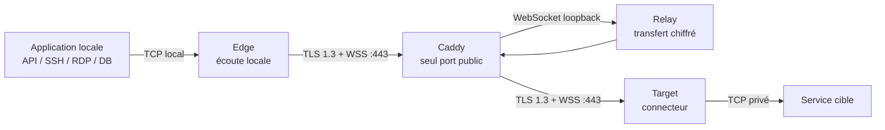

# Guide d'utilisation de MoleX

[English](user-guide.md) | [简体中文](user-guide.zh-CN.md) | [繁體中文](user-guide.zh-TW.md) | [Español](user-guide.es.md) | [Português (Brasil)](user-guide.pt-BR.md) | **Français** | [Deutsch](user-guide.de.md) | [日本語](user-guide.ja.md) | [한국어](user-guide.ko.md) | [Русский](user-guide.ru.md) | [العربية](user-guide.ar.md) | [हिन्दी](user-guide.hi.md)

> Limite actuelle : MoleX transporte du **TCP** de manière sécurisée. HTTP, HTTPS/API, SSH, RDP et les bases de données sur TCP sont pris en charge. UDP, QUIC/HTTP/3 et ICMP ne sont pas pris en charge nativement. La WebUI est actuellement disponible en anglais et en chinois simplifié ; ce document est le guide français.

## 1. Projet et marque

MoleX est un hub de transit TCP sécurisé écrit en Go et distribué sous forme d'un binaire unique. Edge et Target ouvrent tous deux une connexion sortante vers le même endpoint WSS. Caddy expose normalement l'unique port public `443/tcp`. Relay met les deux pairs en relation et copie un ciphertext opaque ; il ne reçoit jamais le secret de payload de bout en bout.

`MoleX` se prononce `/moʊl ɛks/`. **Mole** évoque une taupe creusant un tunnel hors de vue ; **X** représente Xfer/Transfer, le croisement et l'échange entre deux extrémités. Signature proposée : **The single-port secure transit hub. One port. Two peers. One secure route.** Le nom ne garantit ni anonymat ni invisibilité. La licence MIT couvre le code, mais n'accorde pas automatiquement de droits sur le nom, le logo ou les marques ; vérifiez leur disponibilité avant une diffusion publique.

## 2. Architecture



| Rôle | Fonction |
| --- | --- |
| Relay | Met Edge et Target en relation et relaie uniquement le ciphertext |
| Edge | Ouvre l'écoute TCP locale seulement lorsque la route authentifiée est prête |
| Target | Accepte les streams yamux et connecte chacun à `tunnel.local` |

Chaque connexion TCP locale correspond à un stream yamux. X25519, HKDF-SHA256 et AES-256-GCM protègent le payload à l'intérieur de TLS 1.3. Une route accepte au maximum 256 streams simultanés.

## 3. Valeurs sensibles

| Valeur | Où l'utiliser | Objectif |
| --- | --- | --- |
| Mot de passe Web | Différent sur chaque nœud | Connexion WebUI ; absent de `molex.json` |
| Relay token | Identique sur Relay, Edge et Target | Admission WSS ; ce n'est pas la clé du payload |
| End-to-end secret | Identique uniquement sur le couple Edge/Target | Authentification et chiffrement ; Relay ne le reçoit pas |
| Channel | Identique sur Edge et Target | Nom logique de rendez-vous, pas un port public |

Ne placez jamais mots de passe, tokens, secrets, clés API, cookies ou valeurs CSRF dans des captures, logs, tickets, noms de nœud ou dépôts publics.

## 4. Déploiement rapide

### Relay

```bash
molex config init --mode relay --config relay.json
```

```json
{
  "mode": "relay",
  "token": "mx1_REPLACE_WITH_RANDOM_RELAY_TOKEN",
  "listen": "127.0.0.1:8080",
  "tunnel": {}
}
```

Publiez uniquement `/ws/session` avec Caddy :

```caddyfile
molex.example.com {
    @molex_session {
        path /ws/session
        header Connection *Upgrade*
        header Upgrade websocket
    }
    handle @molex_session {
        reverse_proxy 127.0.0.1:8080
    }
    handle {
        respond "Hello, world." 200
    }
}
```

N'ajoutez pas de CORS générique et ne forcez pas manuellement les headers Upgrade vers l'upstream.

### Edge

```json
{
  "mode": "punch",
  "role": "edge",
  "secret": "mx1_SAME_END_TO_END_SECRET_ON_BOTH_CLIENTS",
  "token": "mx1_SAME_RELAY_TOKEN_ON_ALL_THREE_NODES",
  "listen": "127.0.0.1:2222",
  "remote": "wss://molex.example.com/ws/session",
  "tunnel": {
    "remote": "home-ssh",
    "name": "office-edge"
  }
}
```

### Target

```json
{
  "mode": "punch",
  "role": "target",
  "secret": "mx1_SAME_END_TO_END_SECRET_ON_BOTH_CLIENTS",
  "token": "mx1_SAME_RELAY_TOKEN_ON_ALL_THREE_NODES",
  "remote": "wss://molex.example.com/ws/session",
  "tunnel": {
    "local": "127.0.0.1:22",
    "remote": "home-ssh",
    "name": "home-target"
  }
}
```

`secret`, `token`, `remote` et `tunnel.remote` doivent être identiques sur Edge et Target. Les rôles doivent être complémentaires. Seul Edge utilise `listen` ; seul Target utilise `tunnel.local`.

Validez puis démarrez sur chaque machine :

```bash
molex config check --config relay.json
molex config check --config edge.json
molex config check --config target.json

molex web --config relay.json  --password-file ./web-password --autostart
molex web --config target.json --password-file ./web-password --autostart
molex web --config edge.json   --password-file ./web-password --autostart
```

La WebUI préfère `127.0.0.1:9090`, choisit automatiquement un port loopback libre s'il est occupé, puis ouvre le navigateur par défaut. Sur serveur, pour SSH ou un reverse proxy, fixez `--listen 127.0.0.1:9090 --open-browser=false`. Pour un accès distant occasionnel :

```bash
ssh -N -L 9090:127.0.0.1:9090 user@molex-host
```

Ouvrez ensuite `http://127.0.0.1:9090` localement. Pour un accès continu, utilisez un reverse proxy HTTPS distinct.

## 5. Parcours WebUI


L'en-tête permet de choisir anglais/chinois simplifié, thème système/clair/sombre et déconnexion. Pour modifier une route active : **Stop**, modification, **Save**, **Start**.


Relay affiche nom, IP fiable, rôle, état, endpoint transféré, Route ID pseudonyme, pair, plate-forme, durée et octets/frames chiffrés. Le Route ID n'est ni le channel ni une clé.


Edge n'ouvre pas son listener avant l'association avec un Target authentifié. `Not listening` pendant une coupure est une protection normale.


Target service doit être une adresse TCP accessible depuis la machine Target.

## 6. Recettes par scénario

| Scénario | Target `tunnel.local` | Edge `listen` | Utilisation locale |
| --- | --- | --- | --- |
| SSH | `127.0.0.1:22` | `127.0.0.1:2222` | `ssh -p 2222 user@127.0.0.1` |
| RDP | `127.0.0.1:3389` | `127.0.0.1:13389` | `mstsc /v:127.0.0.1:13389` |
| API HTTP | `127.0.0.1:8080` | `127.0.0.1:18080` | `curl http://127.0.0.1:18080/health` |
| PostgreSQL | `127.0.0.1:5432` | `127.0.0.1:15432` | `psql -h 127.0.0.1 -p 15432` |
| MySQL | `127.0.0.1:3306` | `127.0.0.1:13306` | `mysql -h 127.0.0.1 -P 13306` |
| Redis | `127.0.0.1:6379` | `127.0.0.1:16379` | `redis-cli -h 127.0.0.1 -p 16379` |
| OpenAI/HTTPS | `api.openai.com:443` | `127.0.0.1:18443` | Conserver le hostname TLS |

MoleX n'analyse pas HTTP et ne modifie ni Host, ni chemin, ni headers, ni body.

### OpenAI et HTTPS

Utilisez le channel `openai-api`, Target `api.openai.com:443` et Edge `127.0.0.1:18443`. N'appelez pas directement `https://127.0.0.1:18443`, car la validation du certificat échouerait.

```bash
curl --connect-to api.openai.com:443:127.0.0.1:18443 \
  https://api.openai.com/v1/models \
  -H "Authorization: Bearer $OPENAI_API_KEY"
```

`--connect-to` change uniquement la destination TCP ; l'URL, le SNI et le hostname du certificat restent `api.openai.com`. Gardez la clé API dans l'environnement ou le secret manager de l'application, jamais dans MoleX. L'adresse IP de sortie est celle du réseau Target ; respectez les conditions du fournisseur et les restrictions régionales.

### Plusieurs services

Un processus client gère une route. Utilisez des configurations, channels, ports Edge et processus distincts pour SSH, base de données et API. Tous peuvent partager `wss://molex.example.com/ws/session`, donc un seul `443/tcp` reste public. Plusieurs WebUI choisissent automatiquement des ports loopback distincts ; fixez `9090`, `9091`, `9092` pour des adresses proxy stables.

## 7. UDP

UDP n'est pas pris en charge actuellement. L'implémentation utilise des listeners TCP et des streams yamux, sans limites de datagramme, mapping d'adresse source ou expiration de flows UDP. DNS UDP, QUIC/HTTP/3, jeux, VoIP, NTP, traps SNMP et ICMP ne peuvent pas être transférés directement.

- DNS : utilisez TCP/53, DoH ou DoT.
- HTTP/3 : forcez HTTP/1.1 ou HTTP/2 sur TCP.
- Syslog : utilisez TCP syslog.
- Jeux, VoIP et QUIC : utilisez WireGuard, Tailscale ou un tunnel UDP natif.

Une future option `tunnel.protocol: "udp"` pourrait conserver les datagrammes dans des streams chiffrés, mais WSS/TCP garderait le head-of-line blocking. Elle conviendrait au DNS ou à la supervision légère, pas au temps réel. Considérez MoleX comme TCP-only jusqu'à une annonce explicite dans les release notes.

## 8. Reconnexion et diagnostic

- Backoff d'environ 1 à 15 secondes avec 20 % de jitter ; reset après 30 secondes saines.
- Une coupure ferme les anciennes connexions TCP ; l'application doit se reconnecter.
- `401/403` : rendez `token` identique sur les trois nœuds.
- `404` : vérifiez `/ws/session` et le matcher Caddy.
- `502/503/504` : démarrez Relay et vérifiez l'upstream.
- Pairing timeout : vérifiez pair, channel, secret, token et rôles complémentaires.
- Address in use : libérez ou changez le listener Edge.
- Target unavailable : démarrez le service et vérifiez `tunnel.local`.

## 9. Sécurité et licence MIT

N'exposez publiquement que Caddy `443/tcp`. Gardez Relay sur `127.0.0.1:8080` et la WebUI sur `127.0.0.1:9090`. Utilisez WSS avec certificat valide, token et secret aléatoires indépendants, comptes à privilèges minimaux et ACL privées. Gardez Edge sur loopback sans conception explicite de pare-feu et d'authentification.

MoleX utilise la [MIT License](../LICENSE) : utilisation, copie, modification, fusion, publication, distribution, sous-licence et vente sont autorisées si les avis de copyright et de licence sont conservés. Le logiciel est fourni « tel quel », sans garantie. La licence n'accorde pas automatiquement de droits sur le nom, le logo ou les marques tierces.
