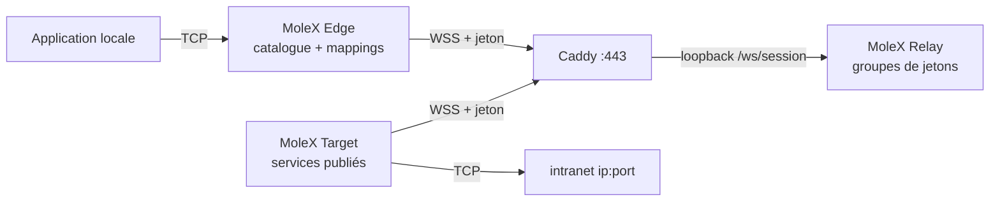

# Guide utilisateur MoleX

[English](user-guide.md) | [简体中文](user-guide.zh-CN.md) | [繁體中文](user-guide.zh-TW.md) | [Español](user-guide.es.md) | [Português (Brasil)](user-guide.pt-BR.md) | **Français** | [Deutsch](user-guide.de.md) | [日本語](user-guide.ja.md) | [한국어](user-guide.ko.md) | [Русский](user-guide.ru.md) | [العربية](user-guide.ar.md) | [हिन्दी](user-guide.hi.md)

Ce guide couvre le premier déploiement et l’exploitation quotidienne. Les captures viennent d’une console réelle ; adresses, identifiants et compteurs sont illustratifs. Les jetons restent masqués. L’interface de la console est en anglais et en chinois simplifié ; ce document est le guide opérationnel en français.

> MoleX ne relaie que le **TCP** : HTTP, HTTPS, API, SSH, RDP et bases de données. Il ne transporte pas l’UDP natif, QUIC/HTTP/3 ni ICMP. Voir [état UDP](#7-état-udp-et-alternatives).

v1 (`mode: "punch"` avec `role` / `secret` / `channel` / `tunnel`) n’est pas accepté. Recréez les fichiers avec `molex config init --mode relay|target|edge`. Voir le [guide de mise à niveau](upgrade-guide.md).

## 1. Présentation

MoleX est un concentrateur TCP sécurisé en un seul binaire. Un jeton d’accès définit un groupe : exactement un Target et un nombre quelconque d’Edges. Le Target publie des services intranet `ip:port` ; chaque Edge mappe ceux dont il a besoin vers des ports locaux. Edge et Target appellent la même adresse WSS publique. Caddy n’expose en général que `443/tcp`.

Le Relay admet les clients par jeton, les groupe et copie un chiffré opaque. Le Relay livré ne déchiffre jamais la charge. L’opérateur qui détient les jetons est dans le périmètre de confiance ; traitez un jeton comme une clé privée SSH. Détails : [modèle de sécurité](security.md).

Points forts :

- Un jeton, un Target, un nombre quelconque d’Edges. Un second Target sur le même jeton est refusé.
- Un processus Target ou Edge peut rejoindre plusieurs jetons. Les services peuvent être limités à certains groupes.
- Le catalogue du Target se synchronise en direct. L’Edge n’ouvre un écouteur de mapping que lorsque la route est prête et le service publié.
- La protection de charge est X25519 + HKDF-SHA256 + AES-256-GCM dans TLS 1.3. Le PSK est dérivé du jeton.
- Console Relay : mot de passe, création / rotation / désactivation / suppression de jetons, audit, pairs en direct.
- Consoles Target et Edge : sans connexion, loopback uniquement, same-origin et CSRF.
- Reprises avec backoff plafonné et jitter, d’environ 1 s à 15 s.

Ligne de marque suggérée : **MoleX — The single-port secure transit hub.**

## 2. Rôles et chemin du trafic



| Rôle | Emplacement | Comportement | Entrée publique |
| --- | --- | --- | --- |
| Relay | Nom d’hôte public | Admet les jetons, associe un Target à N Edges, copie le chiffré | Uniquement Caddy `443/tcp` |
| Target | Hôte qui atteint les backends | Publie un catalogue ; n’appelle que ces adresses | Aucune ; WSS sortant seulement |
| Edge | Hôte qui utilise les services | Mappe les services publiés vers des ports locaux | Loopback par défaut ; bind LAN optionnel |

```text
app TCP -> mapping Edge -> yamux (préambule service-id) -> AES-256-GCM -> WSS
        -> copie chiffrée du Relay -> appel allowlist du Target -> TCP backend
```

## 3. Avant de commencer

- Un serveur public pour Relay et Caddy, hostname du type `molex.example.com`.
- Une machine Target qui atteint les services intranet.
- Une ou plusieurs machines Edge.
- Uniquement `443/tcp` public. Plan de données Relay et toutes les consoles Web en loopback.

Compilation depuis les sources (Go 1.25+, Node.js 20+) :

```bash
cd frontend
npm ci
npm run build
cd ..
go build -trimpath -ldflags "-s -w -X main.version=0.4.0" -o bin/molex .
```

Sous Windows le binaire est `bin/molex.exe`.

### 3.1 Identifiants

| Valeur | Qui l’utilise | Rôle |
| --- | --- | --- |
| Mot de passe Web | Console Relay uniquement (≥12 caractères) | Connexion d’administration. Non stocké dans `molex.json`. |
| Jeton d’accès | Émis par le Relay ; présenté par Target et Edge | Admission, regroupement et source de clé de bout en bout (`mx2_` + 32 octets aléatoires). |

N’insérez jamais mots de passe, jetons, clés API, cookies ou valeurs CSRF dans les captures, journaux, noms de nœud ou un dépôt public. L’audit n’enregistre que les ids de jeton.

## 4. Déploiement en cinq minutes

### 4.1 Relay

```bash
molex config init --mode relay --config relay.json
molex web --config relay.json --password-file ./web-password --autostart
```

Connectez-vous, créez un jeton (note du type `office-nas`), révélez-le et copiez-le. Le plan de données écoute sur `127.0.0.1:8080`. La console préfère `127.0.0.1:9090`.

```json
{
  "mode": "relay",
  "listen": "127.0.0.1:8080",
  "tokens": [
    { "id": "tok-example", "token": "mx2_generated-value", "note": "office" }
  ]
}
```

### 4.2 Caddy

```caddyfile
molex.example.com {
    @molex_session {
        path /ws/session
        header Connection *Upgrade*
        header Upgrade websocket
    }
    handle @molex_session {
        reverse_proxy 127.0.0.1:8080
    }
    handle {
        respond "Hello, world." 200
    }
}

admin.molex.example.com {
    reverse_proxy 127.0.0.1:9090
}
```

N’ajoutez pas de CORS générique. Exemple complet : [déploiement Caddy](deployment-caddy.md).

### 4.3 Target

Sur la machine qui atteint les backends :

```bash
molex web
```

Choisissez **Target**, collez l’URL WSS et le jeton, démarrez, puis ajoutez des services (par exemple `10.188.200.16:30927`). Enregistrer publie le catalogue immédiatement.

```json
{
  "mode": "target",
  "remote": "wss://molex.example.com/ws/session",
  "token": "mx2_generated-value",
  "name": "home-target",
  "services": [
    { "id": "svc-web", "name": "web", "address": "10.188.200.16:30927" },
    { "id": "svc-ssh", "name": "ssh", "address": "127.0.0.1:22" }
  ]
}
```

Pour rejoindre deux groupes dans un processus, utilisez `tokens` à la place de `token` et `services[].groups` pour restreindre la visibilité :

```json
{
  "mode": "target",
  "remote": "wss://molex.example.com/ws/session",
  "tokens": [
    { "id": "office", "token": "mx2_office-token" },
    { "id": "lab", "token": "mx2_lab-token" }
  ],
  "services": [
    { "id": "svc-web", "name": "web", "address": "10.188.200.16:30927", "groups": ["office"] }
  ]
}
```

`groups` vide signifie tous les groupes rejoints par ce Target.

### 4.4 Edge

```bash
molex web
```

Choisissez **Edge**, collez la même URL WSS et le jeton, démarrez. Cochez un service publié ; la console propose un port local libre. Activez **LAN visible** seulement si d’autres appareils de ce réseau doivent se connecter (`0.0.0.0`).

```json
{
  "mode": "edge",
  "remote": "wss://molex.example.com/ws/session",
  "token": "mx2_generated-value",
  "name": "office-edge",
  "mappings": [
    { "service": "svc-web", "port": 28080 },
    { "service": "svc-ssh", "port": 2222 }
  ]
}
```

Lorsque plusieurs groupes sont rejoints, chaque mapping a besoin de `group`.

### 4.5 Valider et démarrer sans navigateur

```bash
molex config check --config relay.json
molex config check --config target.json
molex config check --config edge.json

molex serve   --config relay.json
molex connect --config target.json
molex connect --config edge.json
```

Les consoles Target et Edge n’exigent pas de mot de passe. L’accès distant à toute console passe par SSH ou HTTPS :

```bash
ssh -N -L 9090:127.0.0.1:9090 user@molex-host
```

## 5. Parcours de la console Web

### 5.1 Connexion Relay


Seule la console Relay demande un mot de passe. La première exécution le crée. Langue et thème sont sur toutes les consoles. Target et Edge ignorent cet écran.

### 5.2 Relay : jetons et clients


- Créer, révéler/copier, désactiver, supprimer et **faire tourner** les jetons. La rotation garde l’ancienne valeur valable 1–30 jours (défaut 3).
- Les actions d’administration sont écrites dans un JSONL d’audit à côté de la configuration (ids de jeton uniquement).
- « Listen address » est le plan de données, pas la console Web.
- Les clients connectés affichent nom, rôle, id de jeton, plateforme, durée en ligne et RX/TX chiffré. Le libellé « N services / N mappings » se met à jour quand le catalogue ou les mappings changent.


Déconnecter expulse un client ; il se reconnecte avec backoff sauf si le jeton est désactivé.

### 5.3 Target


Renseignez l’adresse WSS et un ou plusieurs jetons. Ajoutez des services sous la forme `name` + `host:port`. Avec plusieurs groupes, cochez ceux qui peuvent voir chaque service. Enregistrer s’applique en direct. La dernière erreur d’appel reste sur ce service seulement.

### 5.4 Edge


Après le démarrage, le catalogue apparaît. Cochez un service pour le mapper. Les écouteurs n’existent que tant que la route est prête et le service encore publié. « Waiting » pendant une panne est attendu.

## 6. Recettes courantes

Publiez le backend sur le Target, puis mappez-le sur l’Edge. Un processus Target peut publier tous les services ci-dessous.

| Scénario | Adresse du service Target | Port local Edge | Commande locale |
| --- | --- | --- | --- |
| SSH | `127.0.0.1:22` | `2222` | `ssh -p 2222 user@127.0.0.1` |
| Windows RDP | `127.0.0.1:3389` | `13389` | `mstsc /v:127.0.0.1:13389` |
| HTTP API | `127.0.0.1:8080` | `18080` | `curl http://127.0.0.1:18080/health` |
| PostgreSQL | `127.0.0.1:5432` | `15432` | `psql -h 127.0.0.1 -p 15432` |
| MySQL | `127.0.0.1:3306` | `13306` | `mysql -h 127.0.0.1 -P 13306` |
| Redis | `127.0.0.1:6379` | `16379` | `redis-cli -h 127.0.0.1 -p 16379` |
| HTTPS API | `api.openai.com:443` | `18443` | Conservez le hostname TLS (ci-dessous) |

N’insérez pas de noms d’utilisateur, de clés API ou de noms de clients dans les noms de service ou de nœud.

### 6.1 HTTP API

```bash
curl http://127.0.0.1:18080/health
```

MoleX n’analyse pas HTTP. WebSocket n’est que le chemin de données MoleX.

### 6.2 HTTPS / API compatible OpenAI

N’ouvrez pas `https://127.0.0.1:18443` directement ; la vérification du hostname du certificat échoue. Pointez le TCP vers l’Edge tout en conservant le hostname d’origine :

```bash
curl --connect-to api.openai.com:443:127.0.0.1:18443 \
  https://api.openai.com/v1/models \
  -H "Authorization: Bearer $OPENAI_API_KEY"
```

Gardez la clé API dans l’environnement de l’application, jamais dans la configuration MoleX. La sortie utilise l’IP publique du réseau du Target. Respectez les conditions du fournisseur.

### 6.3 SSH et RDP

```bash
ssh -p 2222 user@127.0.0.1
scp -P 2222 ./file user@127.0.0.1:/tmp/
```

```powershell
mstsc /v:127.0.0.1:13389
```

SSH et Windows restent maîtres de l’authentification. Ne liez pas l’Edge à `0.0.0.0` sans plan de pare-feu.

### 6.4 Plusieurs services, un processus

Publiez tous les backends sur un Target. Mappez ceux nécessaires sur chaque Edge. Toutes les sessions utilisent encore `wss://molex.example.com/ws/session`, donc la surface publique reste un `443/tcp`. Plusieurs consoles Web sur un hôte choisissent des ports loopback distincts à partir de `9090` ; figez-les si vous avez besoin de relais SSH stables.

## 7. État UDP et alternatives

MoleX n’a ni socket UDP ni cadrage de datagramme. Il ne peut pas transporter DNS UDP, QUIC/HTTP/3, jeux, VoIP, NTP ni ICMP.

| Besoin | Recommandation |
| --- | --- |
| DNS | TCP/53, DoH ou DoT, puis relayer ce service TCP |
| API HTTP/3 | Forcer HTTP/1.1 ou HTTP/2 sur TCP |
| Syslog | Syslog TCP |
| Jeux, VoIP, QUIC | WireGuard, Tailscale ou un autre tunnel UDP natif |

## 8. CLI

```bash
molex serve   --config ./relay.json
molex connect --config ./target.json
molex connect --config ./edge.json --remote wss://molex.example.com/ws/session --token "$MOLEX_TOKEN"
molex web     --config ./molex.json --password-file ./web-password --autostart
molex config init  --config ./molex.json --mode relay|target|edge
molex config check --config ./molex.json
molex version
```

Les jetons en ligne de commande peuvent apparaître dans l’historique du shell. Préférez un fichier de configuration protégé. Sous Linux, maintenez le plan de données avec `deploy/molex-relay.service` ; sans systemd utilisez `deploy/molex-keepalive.sh`.

## 9. Comportement à l’exécution

- Edge et Target n’appellent que du WSS sortant.
- Les écouteurs de mapping n’existent que tant que la route est prête et le service publié.
- Backoff : environ 1 s → 15 s, jitter ±20 %, réinitialisé après 30 s sains.
- Une route coupée ferme les flux TCP existants ; les applications doivent réessayer.
- Au plus 256 flux concurrents par processus Edge / session Target.
- Target en double : refusé avec une raison de fermeture claire. Désactiver/supprimer le jeton déconnecte le groupe. La rotation conserve l’ancienne valeur pendant la fenêtre de grâce.

## 10. Dépannage

| Résultat | Action |
| --- | --- |
| HTTP `401` | Copiez le jeton actuel depuis la console Relay. Après rotation, migrez avant la fin de la grâce. |
| HTTP `403` | Le jeton est désactivé. Demandez à l’opérateur Relay de l’activer ou d’en émettre un nouveau. |
| HTTP `404` | L’URL doit se terminer par `/ws/session` ; Caddy doit relayer ce chemin. |
| HTTP `502`/`503`/`504` | Démarrez le Relay ; vérifiez l’amont Caddy `127.0.0.1:8080`. |
| Target en double | Arrêtez l’autre Target ou utilisez un autre jeton. |
| Délai d’appariement | Démarrez le Target de ce jeton. Les deux côtés doivent exécuter MoleX v2 avec le même jeton. |
| Mapping en attente | Target hors ligne ou service retiré ; reprise automatique. |
| Port occupé | Arrêtez l’occupant ou choisissez un autre port ; seul ce mapping est affecté. |
| Service indisponible | Démarrez le backend ou corrigez l’adresse Target. |
| N’écoute pas | Attendu en idle, connecting ou stopping. |

```bash
curl --fail http://127.0.0.1:8080/healthz
curl --fail http://127.0.0.1:9090/healthz
```

## 11. Liste de production

- Public : uniquement Caddy `443/tcp`.
- Données Relay `127.0.0.1:8080`, consoles `127.0.0.1:9090`.
- Le WSS distant exige un certificat valide. `ws://` en clair est loopback uniquement.
- Générez les jetons dans la console Relay. Faites tourner avec la fenêtre de grâce, puis mettez à jour tous les Target et Edge.
- Un jeton par groupe de confiance. Restreignez les services Target avec `groups` si un processus sert plusieurs groupes.
- Compte de service au moindre privilège ; ACL privée sur la configuration.
- Mappings loopback par défaut ; bind LAN par mapping seulement si nécessaire.
- Activez la reconnexion applicative. MoleX ne reprend pas un ancien flux TCP après reconstruction de la route.

Voir [architecture](architecture.md), [déploiement Caddy](deployment-caddy.md) et [sécurité](security.md).

## 12. Licence MIT

MoleX est distribué sous la [licence MIT](../LICENSE). Le logiciel est fourni « en l’état ». La licence couvre le code, pas le nom du projet, le logo ni les marques de tiers, et ne remplace pas les obligations légales et de conditions d’utilisation de l’opérateur.
