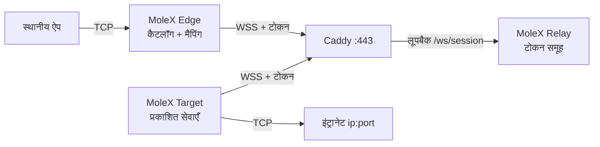

# MoleX उपयोगकर्ता मार्गदर्शिका

[English](user-guide.md) | [简体中文](user-guide.zh-CN.md) | [繁體中文](user-guide.zh-TW.md) | [Español](user-guide.es.md) | [Português (Brasil)](user-guide.pt-BR.md) | [Français](user-guide.fr.md) | [Deutsch](user-guide.de.md) | [日本語](user-guide.ja.md) | [한국어](user-guide.ko.md) | [Русский](user-guide.ru.md) | [العربية](user-guide.ar.md) | **हिन्दी**

यह मार्गदर्शिका पहली तैनाती और रोज़मर्रा के संचालन के लिए है। स्क्रीनशॉट वास्तविक कंसोल से हैं; पते, रूट आईडी और काउंटर केवल उदाहरण हैं। टोकन हमेशा मास्क रहते हैं। कंसोल UI अंग्रेज़ी और सरलीकृत चीनी में है; यह दस्तावेज़ हिन्दी संचालन गाइड है।

> MoleX केवल **TCP** अग्रेषित करता है: HTTP, HTTPS, API, SSH, RDP और डेटाबेस। यह मूल UDP, QUIC/HTTP/3 या ICMP नहीं ले जाता। देखें [UDP स्थिति](#7-udp-स्थिति-और-विकल्प)।

v1 (`mode: "punch"` तथा `role` / `secret` / `channel` / `tunnel`) स्वीकार नहीं होता। फ़ाइलें `molex config init --mode relay|target|edge` से फिर बनाएँ। देखें [अपग्रेड गाइड](upgrade-guide.md)।

## 1. परियोजना परिचय

MoleX एक एकल बाइनरी सुरक्षित TCP ट्रांज़िट हब है। एक एक्सेस टोकन एक समूह तय करता है: ठीक एक Target और कितने भी Edges। Target इंट्रानेट `ip:port` सेवाएँ प्रकाशित करता है; प्रत्येक Edge ज़रूरी सेवाओं को स्थानीय पोर्ट पर मैप करता है। Edge और Target एक ही सार्वजनिक WSS पर आउटबाउंड कनेक्ट करते हैं। Caddy आमतौर पर केवल `443/tcp` खोलता है।

Relay टोकन से क्लाइंट स्वीकार करता है, उन्हें समूहबद्ध करता है, और अपारदर्शी सिफरटेक्स्ट कॉपी करता है। वितरित Relay पेलोड कभी डिक्रिप्ट नहीं करता। जिसके पास टोकन हैं वह विश्वास सीमा के अंदर है; टोकन को SSH निजी कुंजी जैसा समझें। विवरण: [सुरक्षा मॉडल](security.md)।

मुख्य बातें:

- एक टोकन, एक Target, कितने भी Edges। उसी टोकन पर दूसरा Target अस्वीकृत होता है।
- एक Target या Edge प्रक्रिया कई टोकन में शामिल हो सकती है। सेवाएँ चुने हुए समूहों तक सीमित हो सकती हैं।
- Target कैटलॉग लाइव सिंक होता है। Edge मैपिंग लिसनर तभी खोलता है जब रूट तैयार हो और सेवा प्रकाशित हो।
- पेलोड सुरक्षा TLS 1.3 के अंदर X25519 + HKDF-SHA256 + AES-256-GCM है। PSK टोकन से व्युत्पन्न होता है।
- Relay कंसोल: पासवर्ड लॉगिन, टोकन बनाना / घुमाना / अक्षम / हटाना, ऑडिट, लाइव पीयर।
- Target और Edge कंसोल: लॉगिन नहीं, केवल लूपबैक, same-origin और CSRF।
- क्लाइंट पुनः प्रयास लगभग 1 सेकंड से 15 सेकंड की सीमा तक, जिटर सहित।

ब्रांड पंक्ति: **MoleX — The single-port secure transit hub.**

## 2. भूमिकाएँ और ट्रैफ़िक पथ



| भूमिका | स्थान | व्यवहार | सार्वजनिक इनबाउंड |
| --- | --- | --- | --- |
| Relay | सार्वजनिक होस्टनाम | टोकन स्वीकार, एक Target को N Edges से जोड़ना, सिफरटेक्स्ट कॉपी | केवल Caddy `443/tcp` |
| Target | वह होस्ट जो बैकएंड तक पहुँचे | कैटलॉग प्रकाशित करता है; केवल वे पते डायल करता है | कोई नहीं; केवल आउटबाउंड WSS |
| Edge | वह होस्ट जो सेवाएँ उपयोग करे | प्रकाशित सेवाओं को स्थानीय पोर्ट पर मैप करता है | डिफ़ॉल्ट लूपबैक; वैकल्पिक LAN बाइंड |

```text
ऐप TCP -> Edge मैपिंग -> yamux (service-id प्रस्तावना) -> AES-256-GCM -> WSS
        -> Relay सिफरटेक्स्ट कॉपी -> Target allowlist डायल -> बैकएंड TCP
```

## 3. शुरू करने से पहले

- Relay और Caddy के लिए सार्वजनिक सर्वर, होस्टनाम जैसे `molex.example.com`।
- एक Target मशीन जो इंट्रानेट सेवाओं तक पहुँचे।
- एक या अधिक Edge मशीनें।
- सार्वजनिक केवल `443/tcp`। Relay डेटा प्लेन और सभी वेब कंसोल लूपबैक पर।

स्रोत से बिल्ड (Go 1.25+, Node.js 20+):

```bash
cd frontend
npm ci
npm run build
cd ..
go build -trimpath -ldflags "-s -w -X main.version=0.4.0" -o bin/molex .
```

Windows पर आउटपुट `bin/molex.exe` है।

### 3.1 क्रेडेंशियल

| मान | कौन उपयोग करे | उद्देश्य |
| --- | --- | --- |
| वेब पासवर्ड | केवल Relay कंसोल (≥12 अक्षर) | प्रबंधन लॉगिन। `molex.json` में नहीं। |
| एक्सेस टोकन | Relay जारी करता है; Target और Edge प्रस्तुत करते हैं | प्रवेश, समूहबद्धता, और एंड-टू-एंड कुंजी स्रोत (`mx2_` + 32 यादृच्छिक बाइट)। |

पासवर्ड, टोकन, API कुंजी, कुकी या CSRF को स्क्रीनशॉट, लॉग, नोड नाम या सार्वजनिक रिपॉज़िटरी में न रखें। ऑडिट केवल टोकन id संग्रहीत करता है।

## 4. पाँच मिनट की तैनाती

### 4.1 Relay

```bash
molex config init --mode relay --config relay.json
molex web --config relay.json --password-file ./web-password --autostart
```

साइन इन करें, टोकन बनाएँ (नोट जैसे `office-nas`), दिखाएँ और कॉपी करें। डेटा प्लेन `127.0.0.1:8080` सुनता है। कंसोल `127.0.0.1:9090` पसंद करता है।

```json
{
  "mode": "relay",
  "listen": "127.0.0.1:8080",
  "tokens": [
    { "id": "tok-example", "token": "mx2_generated-value", "note": "office" }
  ]
}
```

### 4.2 Caddy

```caddyfile
molex.example.com {
    @molex_session {
        path /ws/session
        header Connection *Upgrade*
        header Upgrade websocket
    }
    handle @molex_session {
        reverse_proxy 127.0.0.1:8080
    }
    handle {
        respond "Hello, world." 200
    }
}

admin.molex.example.com {
    reverse_proxy 127.0.0.1:9090
}
```

वाइल्डकार्ड CORS न जोड़ें। पूरा उदाहरण: [Caddy तैनाती](deployment-caddy.md)।

### 4.3 Target

उस मशीन पर जो बैकएंड तक पहुँचे:

```bash
molex web
```

**Target** चुनें, WSS URL और टोकन चिपकाएँ, शुरू करें, फिर सेवाएँ जोड़ें (उदाहरण `10.188.200.16:30927`)। सहेजना कैटलॉग तुरंत प्रकाशित करता है।

```json
{
  "mode": "target",
  "remote": "wss://molex.example.com/ws/session",
  "token": "mx2_generated-value",
  "name": "home-target",
  "services": [
    { "id": "svc-web", "name": "web", "address": "10.188.200.16:30927" },
    { "id": "svc-ssh", "name": "ssh", "address": "127.0.0.1:22" }
  ]
}
```

एक प्रक्रिया में दो समूहों के लिए `token` की जगह `tokens` उपयोग करें और दृश्यता `services[].groups` से सीमित करें:

```json
{
  "mode": "target",
  "remote": "wss://molex.example.com/ws/session",
  "tokens": [
    { "id": "office", "token": "mx2_office-token" },
    { "id": "lab", "token": "mx2_lab-token" }
  ],
  "services": [
    { "id": "svc-web", "name": "web", "address": "10.188.200.16:30927", "groups": ["office"] }
  ]
}
```

खाली `groups` का अर्थ है वे सभी समूह जिनमें यह Target शामिल हुआ।

### 4.4 Edge

```bash
molex web
```

**Edge** चुनें, वही WSS और टोकन चिपकाएँ, शुरू करें। प्रकाशित सेवा चुनें; कंसोल खाली स्थानीय पोर्ट सुझाता है। **LAN visible** तभी चालू करें जब उस नेटवर्क के अन्य उपकरण कनेक्ट करें (`0.0.0.0`)।

```json
{
  "mode": "edge",
  "remote": "wss://molex.example.com/ws/session",
  "token": "mx2_generated-value",
  "name": "office-edge",
  "mappings": [
    { "service": "svc-web", "port": 28080 },
    { "service": "svc-ssh", "port": 2222 }
  ]
}
```

कई समूहों में शामिल होने पर प्रत्येक मैपिंग को `group` चाहिए।

### 4.5 ब्राउज़र के बिना जाँच और प्रारंभ

```bash
molex config check --config relay.json
molex config check --config target.json
molex config check --config edge.json

molex serve   --config relay.json
molex connect --config target.json
molex connect --config edge.json
```

Target और Edge कंसोल पासवर्ड नहीं माँगते। किसी भी कंसोल तक दूरस्थ पहुँच SSH या HTTPS से:

```bash
ssh -N -L 9090:127.0.0.1:9090 user@molex-host
```

## 5. वेब कंसोल भ्रमण

### 5.1 Relay लॉगिन


केवल Relay कंसोल पासवर्ड माँगता है। पहली बार चलाने पर वह बनता है। भाषा और थीम हर कंसोल पर हैं। Target और Edge यह स्क्रीन छोड़ते हैं।

### 5.2 Relay: टोकन और क्लाइंट


- टोकन बनाएँ, दिखाएँ/कॉपी करें, अक्षम करें, हटाएँ और **घुमाएँ**। घुमाने के बाद पुराना मान 1–30 दिन वैध रहता है (डिफ़ॉल्ट 3)।
- प्रशासनिक क्रियाएँ कॉन्फ़िग के पास JSONL ऑडिट फ़ाइल में लिखी जाती हैं (केवल टोकन id)।
- «Listen address» डेटा प्लेन है, वेब कंसोल नहीं।
- जुड़े क्लाइंट नाम, भूमिका, टोकन id, प्लेटफ़ॉर्म, अपटाइम और सिफरटेक्स्ट RX/TX दिखाते हैं। «N services / N mappings» कैटलॉग या मैपिंग बदलने पर ताज़ा होता है।


डिस्कनेक्ट एक क्लाइंट को निकालता है; टोकन अक्षम न हो तो वह बैकऑफ से फिर जुड़ता है।

### 5.3 Target


WSS और एक या अधिक टोकन भरें। सेवाएँ `name` + `host:port` के रूप में जोड़ें। कई समूहों पर प्रत्येक सेवा किन समूहों को दिखे, चुनें। सहेजना तुरंत लागू होता है। अंतिम डायल त्रुटि उसी सेवा पर रहती है।

### 5.4 Edge


शुरू करने के बाद कैटलॉग आता है। सेवा चुनकर मैप करें। लिसनर तभी रहते हैं जब रूट तैयार हो और सेवा प्रकाशित हो। आउटेज के दौरान «Waiting» अपेक्षित है।

## 6. सामान्य रेसिपी

Target पर बैकएंड प्रकाशित करें, फिर Edge पर मैप करें। एक Target प्रक्रिया नीचे की सभी सेवाएँ प्रकाशित कर सकती है।

| परिदृश्य | Target सेवा पता | Edge स्थानीय पोर्ट | स्थानीय कमांड |
| --- | --- | --- | --- |
| SSH | `127.0.0.1:22` | `2222` | `ssh -p 2222 user@127.0.0.1` |
| Windows RDP | `127.0.0.1:3389` | `13389` | `mstsc /v:127.0.0.1:13389` |
| HTTP API | `127.0.0.1:8080` | `18080` | `curl http://127.0.0.1:18080/health` |
| PostgreSQL | `127.0.0.1:5432` | `15432` | `psql -h 127.0.0.1 -p 15432` |
| MySQL | `127.0.0.1:3306` | `13306` | `mysql -h 127.0.0.1 -P 13306` |
| Redis | `127.0.0.1:6379` | `16379` | `redis-cli -h 127.0.0.1 -p 16379` |
| HTTPS API | `api.openai.com:443` | `18443` | TLS होस्टनाम रखें (नीचे) |

सेवा या नोड नाम में उपयोगकर्ता नाम, API कुंजी या ग्राहक नाम न डालें।

### 6.1 HTTP API

```bash
curl http://127.0.0.1:18080/health
```

MoleX HTTP पार्स नहीं करता। WebSocket केवल MoleX का डेटा पथ है।

### 6.2 HTTPS / OpenAI-संगत API

`https://127.0.0.1:18443` सीधे न खोलें; प्रमाणपत्र होस्टनाम जाँच विफल होगी। TCP को Edge की ओर रखें और मूल होस्टनाम बनाए रखें:

```bash
curl --connect-to api.openai.com:443:127.0.0.1:18443 \
  https://api.openai.com/v1/models \
  -H "Authorization: Bearer $OPENAI_API_KEY"
```

API कुंजी ऐप वातावरण में रखें, MoleX कॉन्फ़िग में नहीं। निकास Target नेटवर्क का सार्वजनिक IP है। प्रदाता शर्तें मानें।

### 6.3 SSH और RDP

```bash
ssh -p 2222 user@127.0.0.1
scp -P 2222 ./file user@127.0.0.1:/tmp/
```

```powershell
mstsc /v:127.0.0.1:13389
```

प्रमाणीकरण अभी भी SSH / Windows के पास है। फ़ायरवॉल योजना के बिना Edge को `0.0.0.0` पर न बाँधें।

### 6.4 कई सेवाएँ, एक प्रक्रिया

एक Target पर सभी बैकएंड प्रकाशित करें। प्रत्येक Edge पर ज़रूरी मैप करें। सभी सत्र अभी भी `wss://molex.example.com/ws/session` उपयोग करते हैं, इसलिए सार्वजनिक सतह एक `443/tcp` रहती है। एक होस्ट पर कई वेब कंसोल `9090` से अलग लूपबैक पोर्ट चुनते हैं; स्थिर SSH फ़ॉरवर्ड के लिए उन्हें पिन करें।

## 7. UDP स्थिति और विकल्प

MoleX के पास UDP सॉकेट या डेटाग्राम फ़्रेमिंग नहीं है। यह UDP DNS, QUIC/HTTP/3, गेम, VoIP, NTP या ICMP नहीं ले जा सकता।

| आवश्यकता | सुझाव |
| --- | --- |
| DNS | TCP/53, DoH या DoT, फिर वह TCP सेवा अग्रेषित करें |
| HTTP/3 API | TCP पर HTTP/1.1 या HTTP/2 बाध्य करें |
| Syslog | TCP syslog |
| गेम, VoIP, QUIC | WireGuard, Tailscale या अन्य मूल UDP टनल |

## 8. CLI

```bash
molex serve   --config ./relay.json
molex connect --config ./target.json
molex connect --config ./edge.json --remote wss://molex.example.com/ws/session --token "$MOLEX_TOKEN"
molex web     --config ./molex.json --password-file ./web-password --autostart
molex config init  --config ./molex.json --mode relay|target|edge
molex config check --config ./molex.json
molex version
```

कमांड-लाइन टोकन शेल इतिहास में आ सकते हैं। सुरक्षित कॉन्फ़िग फ़ाइल बेहतर है। Linux पर डेटा प्लेन `deploy/molex-relay.service` से रखें; systemd न हो तो `deploy/molex-keepalive.sh`।

## 9. रनटाइम व्यवहार

- Edge और Target केवल आउटबाउंड WSS डायल करते हैं।
- मैपिंग लिसनर तभी रहते हैं जब रूट तैयार हो और सेवा प्रकाशित हो।
- बैकऑफ: लगभग 1 से → 15 से, ±20% जिटर, 30 से स्वस्थ रहने पर रीसेट।
- टूटा रूट मौजूदा TCP बंद करता है; ऐप्स को पुनः प्रयास करना होगा।
- प्रत्येक Edge प्रक्रिया / Target सत्र पर अधिकतम 256 समवर्ती स्ट्रीम।
- डुप्लिकेट Target स्पष्ट बंद कारण से अस्वीकृत। टोकन अक्षम/हटाना समूह काटता है। रोटेशन अनुग्रह विंडो में पुराना मान रखता है।

## 10. समस्या निवारण

| परिणाम | कार्रवाई |
| --- | --- |
| HTTP `401` | Relay कंसोल से वर्तमान टोकन कॉपी करें। रोटेशन के बाद अनुग्रह समाप्त होने से पहले माइग्रेट करें। |
| HTTP `403` | टोकन अक्षम है। Relay संचालक से सक्षम करने या नया जारी करने को कहें। |
| HTTP `404` | URL `/ws/session` पर समाप्त होना चाहिए; Caddy उस पथ को अग्रेषित करे। |
| HTTP `502`/`503`/`504` | Relay शुरू करें; Caddy अपस्ट्रीम `127.0.0.1:8080` जाँचें। |
| डुप्लिकेट Target | दूसरा Target रोकें या दूसरा टोकन उपयोग करें। |
| पेयरिंग समय समाप्त | इस टोकन का Target शुरू करें। दोनों ओर MoleX v2 और वही टोकन होना चाहिए। |
| मैपिंग प्रतीक्षा | Target ऑफ़लाइन या सेवा वापस ली गई; अपने आप फिर खुलेगा। |
| पोर्ट व्यस्त | अधिभोगी रोकें या दूसरा पोर्ट चुनें; केवल वही मैपिंग प्रभावित। |
| सेवा अनुपलब्ध | बैकएंड शुरू करें या Target पता ठीक करें। |
| सुन नहीं रहा | idle, connecting या stopping में अपेक्षित। |

```bash
curl --fail http://127.0.0.1:8080/healthz
curl --fail http://127.0.0.1:9090/healthz
```

## 11. उत्पादन जाँच सूची

- सार्वजनिक: केवल Caddy `443/tcp`।
- Relay डेटा `127.0.0.1:8080`, कंसोल `127.0.0.1:9090`।
- दूरस्थ WSS को मान्य प्रमाणपत्र चाहिए। सादा `ws://` केवल लूपबैक।
- टोकन Relay कंसोल में बनाएँ। अनुग्रह के साथ घुमाएँ, फिर हर Target और Edge अपडेट करें।
- प्रत्येक विश्वास समूह के लिए एक टोकन। एक प्रक्रिया कई समूहों की सेवा करे तो `groups` से दृश्यता सीमित करें।
- न्यूनतम विशेषाधिकार सेवा खाता; निजी कॉन्फ़िग ACL।
- डिफ़ॉल्ट लूपबैक मैपिंग; LAN बाइंड केवल ज़रूरत पर प्रति मैपिंग।
- ऐप पुनः कनेक्ट चालू करें। रूट फिर बनने के बाद MoleX पुरानी TCP स्ट्रीम नहीं जारी रखता।

देखें [आर्किटेक्चर](architecture.md), [Caddy तैनाती](deployment-caddy.md) और [सुरक्षा](security.md)।

## 12. MIT लाइसेंस

MoleX [MIT License](../LICENSE) के अंतर्गत वितरित है। सॉफ़्टवेयर «जैसा है» दिया जाता है। लाइसेंस कोड को कवर करता है, परियोजना नाम, लोगो या तृतीय-पक्ष ट्रेडमार्क को नहीं, और संचालक के कानूनी तथा सेवा-शर्त दायित्वों का स्थान नहीं लेता।
