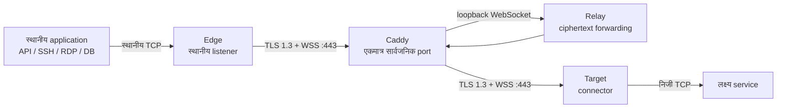

# MoleX उपयोगकर्ता मार्गदर्शिका

[English](user-guide.md) | [简体中文](user-guide.zh-CN.md) | [繁體中文](user-guide.zh-TW.md) | [Español](user-guide.es.md) | [Português (Brasil)](user-guide.pt-BR.md) | [Français](user-guide.fr.md) | [Deutsch](user-guide.de.md) | [日本語](user-guide.ja.md) | [한국어](user-guide.ko.md) | [Русский](user-guide.ru.md) | [العربية](user-guide.ar.md) | **हिन्दी**

> वर्तमान सीमा: MoleX सुरक्षित रूप से **TCP** ट्रैफ़िक भेजता है। TCP पर HTTP, HTTPS/API, SSH, RDP और databases समर्थित हैं। UDP, QUIC/HTTP/3 और ICMP का native support अभी नहीं है। WebUI अभी English और Simplified Chinese में उपलब्ध है; यह हिन्दी दस्तावेज़ है।

## 1. परियोजना और ब्रांड

MoleX Go में लिखा गया single-binary secure TCP transit hub है। Edge और Target दोनों एक ही WSS endpoint के लिए outbound connection शुरू करते हैं। सामान्यतः Caddy केवल सार्वजनिक `443/tcp` उपलब्ध कराता है। Relay दोनों peers को मिलाता है और opaque ciphertext को copy करता है; उसे end-to-end payload secret नहीं मिलता और वह application data decrypt नहीं कर सकता।

`MoleX` का उच्चारण `/moʊl ɛks/` है। **Mole** अदृश्य जगह में सुरंग बनाने वाले जीव का संकेत है; **X** Xfer/Transfer, cross-connect और exchange को दर्शाता है। सुझाई गई पंक्ति: **The single-port secure transit hub. One port. Two peers. One secure route.** नाम anonymity या invisibility की गारंटी नहीं देता। MIT License code पर लागू होती है; वह project name, logo या trademark अधिकार स्वतः नहीं देती। सार्वजनिक release से पहले अलग से जाँच करें।

## 2. आर्किटेक्चर



| Role | कार्य |
| --- | --- |
| Relay | Edge और Target को मिलाता है और केवल ciphertext भेजता है |
| Edge | authenticated route तैयार होने के बाद ही स्थानीय TCP listener खोलता है |
| Target | yamux streams स्वीकार कर हर stream को `tunnel.local` से जोड़ता है |

हर स्थानीय TCP connection एक yamux stream से जुड़ता है। TLS 1.3 के अंदर X25519, HKDF-SHA256 और AES-256-GCM payload को सुरक्षित रखते हैं। एक route पर अधिकतम 256 concurrent streams हो सकते हैं।

## 3. संवेदनशील मान

| मान | कहाँ उपयोग होता है | उद्देश्य |
| --- | --- | --- |
| Web password | हर node पर अलग | WebUI login; `molex.json` में नहीं |
| Relay token | Relay, Edge और Target पर समान | WSS admission; payload key नहीं |
| End-to-end secret | केवल paired Edge/Target पर समान | authentication और encryption; Relay को नहीं मिलता |
| Channel | Edge/Target पर समान | logical rendezvous नाम, सार्वजनिक port नहीं |

passwords, tokens, secrets, API keys, cookies या CSRF values को screenshots, logs, tickets, node names या public repository में न रखें।

## 4. त्वरित deployment

### Relay

```bash
molex config init --mode relay --config relay.json
```

```json
{
  "mode": "relay",
  "token": "mx1_REPLACE_WITH_RANDOM_RELAY_TOKEN",
  "listen": "127.0.0.1:8080",
  "tunnel": {}
}
```

Caddy से केवल `/ws/session` publish करें:

```caddyfile
molex.example.com {
    @molex_session {
        path /ws/session
        header Connection *Upgrade*
        header Upgrade websocket
    }
    handle @molex_session {
        reverse_proxy 127.0.0.1:8080
    }
    handle {
        respond "Hello, world." 200
    }
}
```

Wildcard CORS न जोड़ें और upstream Upgrade headers को manually force न करें।

### Edge

```json
{
  "mode": "punch",
  "role": "edge",
  "secret": "mx1_SAME_END_TO_END_SECRET_ON_BOTH_CLIENTS",
  "token": "mx1_SAME_RELAY_TOKEN_ON_ALL_THREE_NODES",
  "listen": "127.0.0.1:2222",
  "remote": "wss://molex.example.com/ws/session",
  "tunnel": {
    "remote": "home-ssh",
    "name": "office-edge"
  }
}
```

### Target

```json
{
  "mode": "punch",
  "role": "target",
  "secret": "mx1_SAME_END_TO_END_SECRET_ON_BOTH_CLIENTS",
  "token": "mx1_SAME_RELAY_TOKEN_ON_ALL_THREE_NODES",
  "remote": "wss://molex.example.com/ws/session",
  "tunnel": {
    "local": "127.0.0.1:22",
    "remote": "home-ssh",
    "name": "home-target"
  }
}
```

Edge और Target पर `secret`, `token`, `remote` और `tunnel.remote` समान होने चाहिए और roles complementary होने चाहिए। केवल Edge `listen` उपयोग करता है; केवल Target `tunnel.local` उपयोग करता है।

हर मशीन पर config जाँचें और संबंधित प्रक्रिया चलाएँ:

```bash
molex config check --config relay.json
molex config check --config edge.json
molex config check --config target.json

molex web --config relay.json  --password-file ./web-password --autostart
molex web --config target.json --password-file ./web-password --autostart
molex web --config edge.json   --password-file ./web-password --autostart
```

WebUI पहले `127.0.0.1:9090` उपयोग करता है, व्यस्त होने पर स्वतः खाली loopback port चुनता है और तैयार होने पर default browser खोलता है। Server, SSH या reverse proxy के लिए `--listen 127.0.0.1:9090 --open-browser=false` से address स्थिर करें। अस्थायी remote access के लिए:

```bash
ssh -N -L 9090:127.0.0.1:9090 user@molex-host
```

इसके बाद स्थानीय `http://127.0.0.1:9090` खोलें। लगातार remote access के लिए अलग HTTPS reverse proxy प्रयोग करें।

## 5. WebUI मार्गदर्शन


Header English/Simplified Chinese, system/light/dark theme और sign out बदलता है। चलती route edit करने के लिए: **Stop**, बदलाव, **Save**, **Start**।


Relay node name, trusted IP, role, status, forward endpoint, pseudonymous Route ID, peer, platform, online time और encrypted RX/TX दिखाता है। Route ID channel या key नहीं है।


Authenticated Target से pairing होने तक Edge listener नहीं खोलता। outage के दौरान `Not listening` अपेक्षित सुरक्षा है।


Target service ऐसा TCP address होना चाहिए जिसे Target मशीन access कर सके।

## 6. सामान्य उपयोग

| Scenario | Target `tunnel.local` | Edge `listen` | स्थानीय उपयोग |
| --- | --- | --- | --- |
| SSH | `127.0.0.1:22` | `127.0.0.1:2222` | `ssh -p 2222 user@127.0.0.1` |
| RDP | `127.0.0.1:3389` | `127.0.0.1:13389` | `mstsc /v:127.0.0.1:13389` |
| HTTP API | `127.0.0.1:8080` | `127.0.0.1:18080` | `curl http://127.0.0.1:18080/health` |
| PostgreSQL | `127.0.0.1:5432` | `127.0.0.1:15432` | `psql -h 127.0.0.1 -p 15432` |
| MySQL | `127.0.0.1:3306` | `127.0.0.1:13306` | `mysql -h 127.0.0.1 -P 13306` |
| Redis | `127.0.0.1:6379` | `127.0.0.1:16379` | `redis-cli -h 127.0.0.1 -p 16379` |
| OpenAI/HTTPS | `api.openai.com:443` | `127.0.0.1:18443` | TLS hostname बनाए रखें |

MoleX HTTP parse नहीं करता और Host, path, headers या body नहीं बदलता।

### OpenAI / HTTPS

Channel `openai-api`, Target `api.openai.com:443` और Edge `127.0.0.1:18443` रखें। `https://127.0.0.1:18443` को सीधे न खोलें, क्योंकि certificate hostname validation विफल होगी।

```bash
curl --connect-to api.openai.com:443:127.0.0.1:18443 \
  https://api.openai.com/v1/models \
  -H "Authorization: Bearer $OPENAI_API_KEY"
```

`--connect-to` केवल TCP destination बदलता है; URL, SNI और certificate hostname `api.openai.com` रहते हैं। API key application environment या secret manager में रखें, MoleX config में कभी नहीं। वास्तविक egress IP Target network की होगी। Provider terms और regional restrictions लागू रहेंगे।

### कई services

एक client process एक route चलाता है। SSH, database और API के लिए अलग config, channel, Edge port और process रखें। सभी `wss://molex.example.com/ws/session` share कर सकते हैं, इसलिए public port केवल `443/tcp` रहता है। कई WebUI अलग loopback ports स्वतः चुनते हैं; स्थिर proxy addresses के लिए `9090`, `9091`, `9092` स्पष्ट रूप से दें।

## 7. UDP

UDP अभी समर्थित नहीं है। Implementation TCP listeners और yamux byte streams उपयोग करता है; datagram boundary, source-address mapping और UDP flow timeout नहीं हैं। UDP DNS, QUIC/HTTP/3, games, VoIP, NTP, SNMP traps और ICMP सीधे forward नहीं किए जा सकते।

- DNS: TCP/53, DoH या DoT उपयोग करें।
- HTTP/3: HTTP/1.1 या HTTP/2 over TCP force करें।
- Syslog: TCP syslog उपयोग करें।
- Games, VoIP और QUIC: WireGuard, Tailscale या native UDP tunnel उपयोग करें।

भविष्य का `tunnel.protocol: "udp"` encrypted streams में datagram boundary बचा सकता है, लेकिन WSS/TCP का head-of-line blocking रहेगा। यह DNS या हल्के monitoring के लिए ठीक हो सकता है, realtime के लिए नहीं। Release notes में स्पष्ट घोषणा तक MoleX को TCP-only मानें।

## 8. Reconnection और troubleshooting

- Backoff लगभग 1 से 15 seconds तक, 20% jitter; 30 healthy seconds के बाद reset।
- Route failure पुराने TCP connections बंद करता है; application को reconnect करना होगा।
- `401/403`: तीनों nodes पर `token` समान करें।
- `404`: `/ws/session` और Caddy matcher जाँचें।
- `502/503/504`: Relay शुरू करें और upstream जाँचें।
- Pairing timeout: peer, channel, secret, token और complementary roles जाँचें।
- Address in use: Edge listener खाली करें या बदलें।
- Target unavailable: service शुरू करें और `tunnel.local` जाँचें।

## 9. सुरक्षा और MIT License

केवल Caddy `443/tcp` सार्वजनिक करें। Relay को `127.0.0.1:8080` और WebUI को `127.0.0.1:9090` पर रखें। Valid certificate वाला WSS, independent random token/secret, least-privilege accounts और private ACL उपयोग करें। स्पष्ट firewall/auth design के बिना Edge को loopback पर रखें।

MoleX [MIT License](../LICENSE) उपयोग करता है: copyright और license notice बनाए रखते हुए software का उपयोग, copy, modification, merge, publication, distribution, sublicense और sale किया जा सकता है। Software बिना warranty “as is” मिलता है। License name, logo या third-party trademark अधिकार स्वतः नहीं देती।
