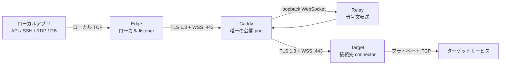

# MoleX ユーザーガイド

[English](user-guide.md) | [简体中文](user-guide.zh-CN.md) | [繁體中文](user-guide.zh-TW.md) | [Español](user-guide.es.md) | [Português (Brasil)](user-guide.pt-BR.md) | [Français](user-guide.fr.md) | [Deutsch](user-guide.de.md) | **日本語** | [한국어](user-guide.ko.md) | [Русский](user-guide.ru.md) | [العربية](user-guide.ar.md) | [हिन्दी](user-guide.hi.md)

> 現在の機能境界：MoleX は安全な **TCP** 転送ツールです。TCP 上の HTTP、HTTPS/API、SSH、RDP、データベースを転送できます。UDP、QUIC/HTTP/3、ICMP はネイティブ対応していません。WebUI の表示言語は現在 English と简体中文で、この文書は日本語版マニュアルです。

## 1. プロジェクトとブランド

MoleX は Go で書かれた単一バイナリの安全な TCP トランジットハブです。Edge と Target は同じ WSS endpoint へ外向き接続を開始します。通常、Caddy が唯一の公開 port `443/tcp` を提供します。Relay は両 peer を会合させて不透明な ciphertext をコピーするだけで、end-to-end payload secret を受け取らず、アプリケーションデータを復号できません。

`MoleX` の読みは `/moʊl ɛks/` です。**Mole** は見えない場所にトンネルを掘るモグラ、**X** は Xfer/Transfer、交差接続、交換を表します。推奨ブランド文：**The single-port secure transit hub. One port. Two peers. One secure route.** 名称は匿名性や不可視性を保証しません。MIT License はコードに適用され、名称、ロゴ、商標の権利を自動的に付与しないため、公開前に別途確認してください。

## 2. アーキテクチャ



| Role | 役割 |
| --- | --- |
| Relay | Edge と Target を会合させ、ciphertext のみを転送 |
| Edge | 認証済み route が準備できた後だけローカル TCP listener を開く |
| Target | yamux stream を受け取り、それぞれを `tunnel.local` へ接続 |

各ローカル TCP 接続は 1 本の yamux stream に対応します。TLS 1.3 の内側で X25519、HKDF-SHA256、AES-256-GCM が payload を保護します。1 route あたり同時 256 stream までです。

## 3. 機密値

| 値 | 使用場所 | 用途 |
| --- | --- | --- |
| Web password | 各ノードで個別 | WebUI login。`molex.json` には保存しない |
| Relay token | Relay、Edge、Target で同一 | WSS admission。payload key ではない |
| End-to-end secret | 対になる Edge/Target だけで同一 | 認証と暗号化。Relay は受け取らない |
| Channel | Edge/Target で同一 | 論理 rendezvous 名。公開 port ではない |

password、token、secret、API key、cookie、CSRF 値を screenshot、log、issue、node name、公開 repository に入れないでください。

## 4. クイックデプロイ

### Relay

```bash
molex config init --mode relay --config relay.json
```

```json
{
  "mode": "relay",
  "token": "mx1_REPLACE_WITH_RANDOM_RELAY_TOKEN",
  "listen": "127.0.0.1:8080",
  "tunnel": {}
}
```

Caddy では `/ws/session` だけを転送します。

```caddyfile
molex.example.com {
    @molex_session {
        path /ws/session
        header Connection *Upgrade*
        header Upgrade websocket
    }
    handle @molex_session {
        reverse_proxy 127.0.0.1:8080
    }
    handle {
        respond "Hello, world." 200
    }
}
```

Wildcard CORS を追加したり、upstream の Upgrade header を手動で強制したりしないでください。

### Edge

```json
{
  "mode": "punch",
  "role": "edge",
  "secret": "mx1_SAME_END_TO_END_SECRET_ON_BOTH_CLIENTS",
  "token": "mx1_SAME_RELAY_TOKEN_ON_ALL_THREE_NODES",
  "listen": "127.0.0.1:2222",
  "remote": "wss://molex.example.com/ws/session",
  "tunnel": {
    "remote": "home-ssh",
    "name": "office-edge"
  }
}
```

### Target

```json
{
  "mode": "punch",
  "role": "target",
  "secret": "mx1_SAME_END_TO_END_SECRET_ON_BOTH_CLIENTS",
  "token": "mx1_SAME_RELAY_TOKEN_ON_ALL_THREE_NODES",
  "remote": "wss://molex.example.com/ws/session",
  "tunnel": {
    "local": "127.0.0.1:22",
    "remote": "home-ssh",
    "name": "home-target"
  }
}
```

Edge と Target の `secret`、`token`、`remote`、`tunnel.remote` は一致させ、role は相補的にします。`listen` は Edge のみ、`tunnel.local` は Target のみ使用します。

検証して各マシンで起動します。

```bash
molex config check --config relay.json
molex config check --config edge.json
molex config check --config target.json

molex web --config relay.json  --password-file ./web-password --autostart
molex web --config target.json --password-file ./web-password --autostart
molex web --config edge.json   --password-file ./web-password --autostart
```

管理 UI は `127.0.0.1:9090` の loopback のみです。リモート管理には SSH forwarding を使います。

```bash
ssh -N -L 9090:127.0.0.1:9090 user@molex-host
```

その後、ローカルの `http://127.0.0.1:9090` を開きます。常時公開する場合は別の HTTPS reverse proxy を使用してください。

## 5. WebUI の見方


header で English/简体中文、system/light/dark theme、sign out を切り替えます。稼働中の route を編集するときは **Stop**、編集、**Save**、**Start** の順です。


Relay には node name、信頼できる source IP、role、status、forward endpoint、匿名化された Route ID、peer、platform、online time、暗号化 RX/TX が表示されます。Route ID は channel や key ではありません。


認証済み Target と pair になるまで Edge は listener を開きません。障害中の `Not listening` は正常な保護動作です。


Target service には Target マシンから到達できる TCP address を設定します。

## 6. 用途別クイック設定

| 用途 | Target `tunnel.local` | Edge `listen` | ローカル操作 |
| --- | --- | --- | --- |
| SSH | `127.0.0.1:22` | `127.0.0.1:2222` | `ssh -p 2222 user@127.0.0.1` |
| RDP | `127.0.0.1:3389` | `127.0.0.1:13389` | `mstsc /v:127.0.0.1:13389` |
| HTTP API | `127.0.0.1:8080` | `127.0.0.1:18080` | `curl http://127.0.0.1:18080/health` |
| PostgreSQL | `127.0.0.1:5432` | `127.0.0.1:15432` | `psql -h 127.0.0.1 -p 15432` |
| MySQL | `127.0.0.1:3306` | `127.0.0.1:13306` | `mysql -h 127.0.0.1 -P 13306` |
| Redis | `127.0.0.1:6379` | `127.0.0.1:16379` | `redis-cli -h 127.0.0.1 -p 16379` |
| OpenAI/HTTPS | `api.openai.com:443` | `127.0.0.1:18443` | TLS hostname を維持 |

MoleX は HTTP を解析せず、Host、path、header、body を変更しません。

### OpenAI / HTTPS

channel を `openai-api`、Target を `api.openai.com:443`、Edge を `127.0.0.1:18443` にします。証明書検証に失敗するため `https://127.0.0.1:18443` を直接使用しないでください。

```bash
curl --connect-to api.openai.com:443:127.0.0.1:18443 \
  https://api.openai.com/v1/models \
  -H "Authorization: Bearer $OPENAI_API_KEY"
```

`--connect-to` が変更するのは TCP destination だけで、URL、SNI、certificate hostname は `api.openai.com` のままです。API key はアプリの環境変数または secret manager に置き、MoleX config には入れません。実際の egress IP は Target network のものになります。サービス規約と地域制限に従ってください。

### 複数サービス

1 client process が 1 route を管理します。SSH、DB、API ごとに config、channel、Edge port、process を分けます。すべて同じ `wss://molex.example.com/ws/session` を共有でき、公開 port は `443/tcp` のままです。複数 WebUI には `9090`、`9091`、`9092` のような別々の loopback port が必要です。

## 7. UDP

UDP は現在サポートされていません。実装は TCP listener と yamux byte stream を使用し、datagram boundary、source-address mapping、UDP flow timeout がありません。UDP DNS、QUIC/HTTP/3、game、VoIP、NTP、SNMP Trap、ICMP は直接転送できません。

- DNS：TCP/53、DoH、DoT を使用。
- HTTP/3：HTTP/1.1 または HTTP/2 over TCP に fallback。
- Syslog：TCP syslog を使用。
- Game、VoIP、QUIC：WireGuard、Tailscale など native UDP tunnel を使用。

将来 `tunnel.protocol: "udp"` で暗号化 stream 内に datagram boundary を保持することは可能ですが、WSS/TCP の head-of-line blocking は残ります。DNS や低速監視には使えてもリアルタイム用途には不向きです。Release note で明示されるまでは TCP-only としてください。

## 8. 再接続と診断

- Backoff は約 1 秒から 15 秒、20% jitter。30 秒正常なら reset。
- Route 障害で既存 TCP connection は閉じるため、アプリ側で再接続が必要。
- `401/403`：3 ノードの `token` を一致。
- `404`：`/ws/session` と Caddy matcher を確認。
- `502/503/504`：Relay と Caddy upstream を確認。
- Pairing timeout：peer、channel、secret、token、相補 role を確認。
- Address in use：Edge listener を解放または変更。
- Target unavailable：service と `tunnel.local` を確認。

## 9. セキュリティと MIT License

公開するのは Caddy `443/tcp` だけです。Relay は `127.0.0.1:8080`、WebUI は `127.0.0.1:9090` に保ちます。有効な証明書の WSS、独立したランダム token/secret、最小権限 account、private ACL を使用し、明示的な firewall/auth 設計がない限り Edge は loopback に限定します。

MoleX は [MIT License](../LICENSE) です。Copyright と license notice を残せば、使用、複製、変更、結合、公開、配布、再許諾、販売が可能です。Software は無保証で “as is” 提供されます。License は名称、logo、第三者商標の権利を自動付与しません。
