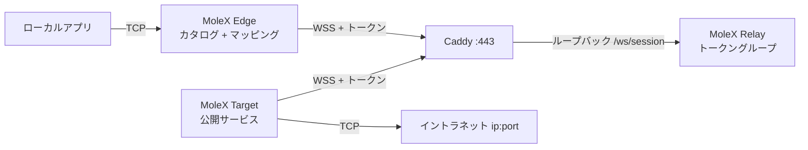

# MoleX ユーザーガイド

[English](user-guide.md) | [简体中文](user-guide.zh-CN.md) | [繁體中文](user-guide.zh-TW.md) | [Español](user-guide.es.md) | [Português (Brasil)](user-guide.pt-BR.md) | [Français](user-guide.fr.md) | [Deutsch](user-guide.de.md) | **日本語** | [한국어](user-guide.ko.md) | [Русский](user-guide.ru.md) | [العربية](user-guide.ar.md) | [हिन्दी](user-guide.hi.md)

初回導入と日常運用向けです。スクリーンショットは実コンソールから。アドレス、経路 ID、カウンタは例示です。トークンは常にマスクされます。コンソール UI は英語と簡体中国語です。本文書は日本語の運用ガイドです。

> MoleX が転送するのは **TCP** のみです。HTTP、HTTPS、API、SSH、RDP、データベース。ネイティブ UDP、QUIC/HTTP/3、ICMP は運びません。[UDP の現状](#7-udp-の現状と代替)を参照してください。

v1（`mode: "punch"` と `role` / `secret` / `channel` / `tunnel`）は受け付けません。`molex config init --mode relay|target|edge` で作り直してください。[アップグレードガイド](upgrade-guide.md)を参照。

## 1. プロジェクト概要

MoleX は単一バイナリの安全な TCP 中継ハブです。1 つのアクセストークンが 1 グループを定義します。Target は厳密に 1 つ、Edge は任意台数です。Target はイントラネットの `ip:port` を公開し、各 Edge は必要なものをローカルポートへマップします。Edge と Target は同じ公開 WSS に外向き接続します。Caddy は通常 `443/tcp` だけを公開します。

Relay はトークンで入場を認め、グループ化し、不透明な暗号文をコピーします。配布版 Relay はペイロードを復号しません。トークンを持つ運用者は信頼境界の内側にいます。トークンは SSH 秘密鍵と同様に扱ってください。詳細は[セキュリティモデル](security.md)。

要点：

- 1 トークン、1 Target、任意数の Edge。同じトークンの 2 つ目の Target は拒否されます。
- 1 つの Target / Edge プロセスが複数トークンに参加できます。サービスはグループ単位で可視性を制限できます。
- Target カタログはライブ同期です。Edge は経路が準備でき、サービスが公開されているときだけマッピングリスナーを開きます。
- ペイロード保護は TLS 1.3 内の X25519 + HKDF-SHA256 + AES-256-GCM。PSK はトークンから導出します。
- Relay コンソール：パスワードログイン、トークンの作成 / ローテーション / 無効化 / 削除、監査、オンラインピア。
- Target / Edge コンソール：ログイン不要、ループバックのみ、同一オリジンと CSRF。
- クライアント再試行は約 1 秒から 15 秒上限、ジッタ付き。

ブランド文：**MoleX — The single-port secure transit hub.**

## 2. 役割とトラフィック経路



| 役割 | 配置 | 動作 | 公開インバウンド |
| --- | --- | --- | --- |
| Relay | 公開ホスト名 | トークン入場、1 Target と N Edge を組む、暗号文コピー | Caddy `443/tcp` のみ |
| Target | バックエンドに届くホスト | カタログを公開し、そのアドレスだけをダイヤル | なし。外向き WSS のみ |
| Edge | サービスを使うホスト | 公開サービスをローカルポートへマップ | 既定はループバック。任意で LAN バインド |

```text
アプリ TCP -> Edge マッピング -> yamux（サービス id プリアンブル）-> AES-256-GCM -> WSS
        -> Relay の暗号文コピー -> Target の許可リストダイヤル -> バックエンド TCP
```

## 3. 事前準備

- Relay と Caddy 用の公開サーバ。ホスト名例 `molex.example.com`。
- イントラネットサービスに届く Target。
- 1 台以上の Edge。
- 公開は `443/tcp` のみ。Relay データ面とすべての Web コンソールはループバック。

ソースからビルド（Go 1.25+、Node.js 20+）：

```bash
cd frontend
npm ci
npm run build
cd ..
go build -trimpath -ldflags "-s -w -X main.version=0.4.0" -o bin/molex .
```

Windows では `bin/molex.exe` です。

### 3.1 資格情報

| 値 | 利用者 | 用途 |
| --- | --- | --- |
| Web パスワード | Relay コンソールのみ（12 文字以上） | 管理ログイン。`molex.json` には保存しません。 |
| アクセストークン | Relay が発行。Target / Edge が提示 | 入場、グループ化、エンドツーエンド鍵の源（`mx2_` + 32 バイト乱数）。 |

パスワード、トークン、API キー、Cookie、CSRF をスクリーンショット、ログ、ノード名、公開リポジトリに置かないでください。監査はトークン id のみ記録します。

## 4. 5 分デプロイ

### 4.1 Relay

```bash
molex config init --mode relay --config relay.json
molex web --config relay.json --password-file ./web-password --autostart
```

ログインし、トークンを作成（メモ例 `office-nas`）、表示してコピーします。データ面は `127.0.0.1:8080`。コンソールは `127.0.0.1:9090` を優先します。

```json
{
  "mode": "relay",
  "listen": "127.0.0.1:8080",
  "tokens": [
    { "id": "tok-example", "token": "mx2_generated-value", "note": "office" }
  ]
}
```

### 4.2 Caddy

```caddyfile
molex.example.com {
    @molex_session {
        path /ws/session
        header Connection *Upgrade*
        header Upgrade websocket
    }
    handle @molex_session {
        reverse_proxy 127.0.0.1:8080
    }
    handle {
        respond "Hello, world." 200
    }
}

admin.molex.example.com {
    reverse_proxy 127.0.0.1:9090
}
```

ワイルドカード CORS は付けないでください。完全例は [Caddy デプロイ](deployment-caddy.md)。

### 4.3 Target

バックエンドに届くマシンで：

```bash
molex web
```

**Target** を選び、WSS URL とトークンを貼って起動し、サービスを追加します（例 `10.188.200.16:30927`）。保存するとカタログが直ちに公開されます。

```json
{
  "mode": "target",
  "remote": "wss://molex.example.com/ws/session",
  "token": "mx2_generated-value",
  "name": "home-target",
  "services": [
    { "id": "svc-web", "name": "web", "address": "10.188.200.16:30927" },
    { "id": "svc-ssh", "name": "ssh", "address": "127.0.0.1:22" }
  ]
}
```

1 プロセスで 2 グループに入るときは `token` の代わりに `tokens` を使い、`services[].groups` で可視性を制限します。

```json
{
  "mode": "target",
  "remote": "wss://molex.example.com/ws/session",
  "tokens": [
    { "id": "office", "token": "mx2_office-token" },
    { "id": "lab", "token": "mx2_lab-token" }
  ],
  "services": [
    { "id": "svc-web", "name": "web", "address": "10.188.200.16:30927", "groups": ["office"] }
  ]
}
```

空の `groups` は、この Target が参加した全グループに公開します。

### 4.4 Edge

```bash
molex web
```

**Edge** を選び、同じ WSS とトークンを貼って起動します。公開サービスにチェックを入れると、コンソールが空きローカルポートを提案します。そのネットワーク上の他端末が接続する必要があるときだけ **LAN 可視**（`0.0.0.0`）を有効にします。

```json
{
  "mode": "edge",
  "remote": "wss://molex.example.com/ws/session",
  "token": "mx2_generated-value",
  "name": "office-edge",
  "mappings": [
    { "service": "svc-web", "port": 28080 },
    { "service": "svc-ssh", "port": 2222 }
  ]
}
```

複数グループに参加しているときは、各マッピングに `group` が必要です。

### 4.5 ブラウザなしで検証して起動

```bash
molex config check --config relay.json
molex config check --config target.json
molex config check --config edge.json

molex serve   --config relay.json
molex connect --config target.json
molex connect --config edge.json
```

Target / Edge コンソールにパスワードは不要です。任意のコンソールへの遠隔アクセスは SSH または HTTPS です。

```bash
ssh -N -L 9090:127.0.0.1:9090 user@molex-host
```

## 5. Web コンソール案内

### 5.1 Relay ログイン


パスワードを求めるのは Relay コンソールだけです。初回実行で作成します。言語とテーマはすべてのコンソールにあります。Target / Edge はこの画面を飛ばします。

### 5.2 Relay：トークンとクライアント


- トークンの作成、表示/コピー、無効化、削除、**ローテーション**。ローテーション後、旧値は 1–30 日間有効です（既定 3 日）。
- 管理操作は設定横の JSONL 監査ファイルに書かれます（トークン id のみ）。
- 「Listen address」はデータ面であり、Web コンソールではありません。
- 接続中クライアントは名前、役割、トークン id、プラットフォーム、稼働時間、暗号文 RX/TX を表示します。「N services / N mappings」はカタログやマッピング変更時に更新されます。


切断は 1 クライアントをキックします。トークンが無効でなければバックオフで再接続します。

### 5.3 Target


WSS と 1 つ以上のトークンを入力します。サービスは `name` + `host:port` です。複数グループでは、各サービスを見せるグループにチェックを入れます。保存は即時適用です。最後のダイヤルエラーはそのサービスだけに残ります。

### 5.4 Edge


起動後にカタログが出ます。サービスにチェックを入れてマップします。リスナーは経路が準備でき、サービスが公開されている間だけ存在します。障害中の「Waiting」は想定どおりです。

## 6. よく使うレシピ

Target でバックエンドを公開し、Edge でマップします。次のサービスはすべて 1 つの Target プロセスに載せられます。

| シナリオ | Target サービスアドレス | Edge ローカルポート | ローカルコマンド |
| --- | --- | --- | --- |
| SSH | `127.0.0.1:22` | `2222` | `ssh -p 2222 user@127.0.0.1` |
| Windows RDP | `127.0.0.1:3389` | `13389` | `mstsc /v:127.0.0.1:13389` |
| HTTP API | `127.0.0.1:8080` | `18080` | `curl http://127.0.0.1:18080/health` |
| PostgreSQL | `127.0.0.1:5432` | `15432` | `psql -h 127.0.0.1 -p 15432` |
| MySQL | `127.0.0.1:3306` | `13306` | `mysql -h 127.0.0.1 -P 13306` |
| Redis | `127.0.0.1:6379` | `16379` | `redis-cli -h 127.0.0.1 -p 16379` |
| HTTPS API | `api.openai.com:443` | `18443` | TLS ホスト名を維持（下記） |

ユーザー名、API キー、顧客名をサービス名やノード名に入れないでください。

### 6.1 HTTP API

```bash
curl http://127.0.0.1:18080/health
```

MoleX は HTTP を解析しません。WebSocket は MoleX 自身のデータ経路だけです。

### 6.2 HTTPS / OpenAI 互換 API

`https://127.0.0.1:18443` を直接開かないでください。証明書のホスト名検査が失敗します。TCP は Edge へ向け、元のホスト名は残します。

```bash
curl --connect-to api.openai.com:443:127.0.0.1:18443 \
  https://api.openai.com/v1/models \
  -H "Authorization: Bearer $OPENAI_API_KEY"
```

API キーはアプリの環境変数に置き、MoleX 設定には書かないでください。出口 IP は Target 側ネットワークの公開アドレスです。プロバイダ規約に従ってください。

### 6.3 SSH と RDP

```bash
ssh -p 2222 user@127.0.0.1
scp -P 2222 ./file user@127.0.0.1:/tmp/
```

```powershell
mstsc /v:127.0.0.1:13389
```

認証は引き続き SSH / Windows が担当します。ファイアウォール計画なしで Edge を `0.0.0.0` にバインドしないでください。

### 6.4 複数サービス、1 プロセス

1 つの Target ですべてのバックエンドを公開し、各 Edge は必要なものだけマップします。セッションはすべて `wss://molex.example.com/ws/session` なので、公開面は引き続き `443/tcp` 1 本です。同一ホストの複数コンソールは `9090` からループバックポートをずらします。安定した SSH 転送が必要なら明示指定してください。

## 7. UDP の現状と代替

MoleX に UDP ソケットやデータグラムフレーミングはありません。UDP DNS、QUIC/HTTP/3、ゲーム、VoIP、NTP、ICMP は運べません。

| 要件 | 推奨 |
| --- | --- |
| DNS | TCP/53、DoH、DoT を使い、その TCP サービスを転送 |
| HTTP/3 API | HTTP/1.1 または HTTP/2 over TCP に強制 |
| Syslog | TCP syslog |
| ゲーム、VoIP、QUIC | WireGuard、Tailscale、その他のネイティブ UDP トンネル |

## 8. CLI

```bash
molex serve   --config ./relay.json
molex connect --config ./target.json
molex connect --config ./edge.json --remote wss://molex.example.com/ws/session --token "$MOLEX_TOKEN"
molex web     --config ./molex.json --password-file ./web-password --autostart
molex config init  --config ./molex.json --mode relay|target|edge
molex config check --config ./molex.json
molex version
```

コマンドラインのトークンはシェル履歴に残ることがあります。保護された設定ファイルを優先してください。Linux では `deploy/molex-relay.service` でデータ面を維持し、systemd がなければ `deploy/molex-keepalive.sh` を使います。

## 9. 実行時の振る舞い

- Edge と Target は外向き WSS だけを開始します。
- マッピングリスナーは経路が準備でき、サービスが公開されている間だけ存在します。
- バックオフは約 1 秒 → 15 秒、±20% ジッタ、健全 30 秒後にリセット。
- 経路切断は既存 TCP を閉じます。アプリ側で再試行してください。
- Edge プロセス / Target セッションあたり同時ストリームは最大 256。
- 重複 Target は明確な切断理由で拒否されます。トークン無効化/削除はグループ全体を切断します。ローテーションの猶予期間中は旧値が使えます。

## 10. トラブルシューティング

| 結果 | 対処 |
| --- | --- |
| HTTP `401` | Relay コンソールから現在のトークンをコピー。ローテーション後は猶予終了前に移行。 |
| HTTP `403` | トークンは無効です。Relay 運用者に有効化または再発行を依頼。 |
| HTTP `404` | URL は `/ws/session` で終わる必要があり、Caddy がそのパスを転送する必要があります。 |
| HTTP `502`/`503`/`504` | Relay を起動し、Caddy 上流 `127.0.0.1:8080` を確認。 |
| 重複 Target | もう一方の Target を止めるか、別トークンを使う。 |
| ペアリングタイムアウト | このトークンの Target を起動。双方が MoleX v2 で同じトークンである必要があります。 |
| マッピング待機中 | Target オフラインまたはサービス取り下げ。復旧後に自動再開。 |
| ポート使用中 | 占有プロセスを止めるか別ポートを選ぶ。そのマッピングだけ影響。 |
| サービス利用不可 | バックエンドを起動するか Target アドレスを修正。 |
| 未リスン | idle / connecting / stopping の想定状態。 |

```bash
curl --fail http://127.0.0.1:8080/healthz
curl --fail http://127.0.0.1:9090/healthz
```

## 11. 本番チェックリスト

- 公開は Caddy `443/tcp` のみ。
- Relay データ面 `127.0.0.1:8080`、コンソール `127.0.0.1:9090`。
- 遠隔 WSS には有効な証明書が必要。平文 `ws://` はループバックのみ。
- トークンは Relay コンソールで生成。猶予付きローテーションのあと、すべての Target と Edge を更新。
- 信頼グループごとに 1 トークン。1 プロセスが複数グループを扱うときは `groups` で可視性を制限。
- 最小権限のサービスアカウント。設定は非公開 ACL。
- 既定はループバックマッピング。必要なときだけマッピング単位で LAN 可視。
- アプリ側の再接続を有効化。経路再構築後、古い TCP ストリームは再開されません。

[アーキテクチャ](architecture.md)、[Caddy デプロイ](deployment-caddy.md)、[セキュリティ](security.md)を参照。

## 12. MIT ライセンス

MoleX は [MIT License](../LICENSE) で配布されます。ソフトウェアは「現状のまま」提供されます。ライセンスはコードを対象とし、プロジェクト名、ロゴ、第三者商標を自動付与せず、運用者の法的義務や利用規約に代わるものでもありません。
