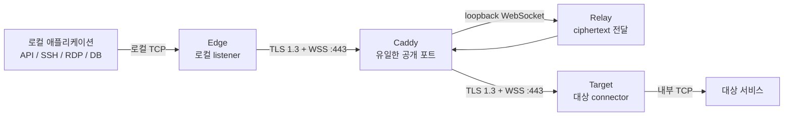

# MoleX 사용자 설명서

[English](user-guide.md) | [简体中文](user-guide.zh-CN.md) | [繁體中文](user-guide.zh-TW.md) | [Español](user-guide.es.md) | [Português (Brasil)](user-guide.pt-BR.md) | [Français](user-guide.fr.md) | [Deutsch](user-guide.de.md) | [日本語](user-guide.ja.md) | **한국어** | [Русский](user-guide.ru.md) | [العربية](user-guide.ar.md) | [हिन्दी](user-guide.hi.md)

> 현재 기능 범위: MoleX는 안전한 **TCP** 전달 도구입니다. TCP 기반 HTTP, HTTPS/API, SSH, RDP, 데이터베이스를 전달할 수 있습니다. UDP, QUIC/HTTP/3, ICMP는 네이티브로 지원하지 않습니다. WebUI는 현재 영어와 중국어 간체만 제공하며, 이 문서는 한국어 설명서입니다.

## 1. 프로젝트와 브랜드

MoleX는 Go로 작성된 단일 바이너리 보안 TCP transit hub입니다. Edge와 Target은 동일한 WSS endpoint로 아웃바운드 연결을 시작합니다. 일반적으로 Caddy가 유일한 공개 포트 `443/tcp`를 제공합니다. Relay는 두 peer를 연결하고 불투명한 ciphertext만 복사하며 end-to-end payload secret을 받지 않으므로 애플리케이션 데이터를 복호화할 수 없습니다.

`MoleX`는 `/moʊl ɛks/`로 읽습니다. **Mole**은 보이지 않는 곳에 터널을 만드는 두더지를, **X**는 Xfer/Transfer, 교차 연결과 교환을 뜻합니다. 권장 문구: **The single-port secure transit hub. One port. Two peers. One secure route.** 이름은 익명성이나 비가시성을 보장하지 않습니다. MIT License는 코드에 적용되며 이름, 로고, 상표 권리를 자동으로 부여하지 않으므로 공개 배포 전 별도 확인이 필요합니다.

## 2. 아키텍처



| 역할 | 기능 |
| --- | --- |
| Relay | Edge와 Target을 만나게 하고 ciphertext만 전달 |
| Edge | 인증된 route가 준비된 뒤에만 로컬 TCP listener 개방 |
| Target | yamux stream을 받아 각각 `tunnel.local`에 연결 |

각 로컬 TCP 연결은 하나의 yamux stream에 대응합니다. TLS 1.3 내부에서 X25519, HKDF-SHA256, AES-256-GCM이 payload를 보호합니다. route 하나당 동시 stream은 최대 256개입니다.

## 3. 민감한 값

| 값 | 사용 위치 | 목적 |
| --- | --- | --- |
| Web password | 각 노드에 별도 설정 | WebUI 로그인, `molex.json`에 저장하지 않음 |
| Relay token | Relay, Edge, Target에 동일 | WSS 접속 허가, payload key가 아님 |
| End-to-end secret | 짝을 이루는 Edge/Target에만 동일 | 인증과 암호화, Relay는 받지 않음 |
| Channel | Edge/Target에 동일 | 논리적 rendezvous 이름, 공개 포트가 아님 |

password, token, secret, API key, cookie, CSRF 값을 screenshot, log, issue, node name, 공개 repository에 넣지 마십시오.

## 4. 빠른 배포

### Relay

```bash
molex config init --mode relay --config relay.json
```

```json
{
  "mode": "relay",
  "token": "mx1_REPLACE_WITH_RANDOM_RELAY_TOKEN",
  "listen": "127.0.0.1:8080",
  "tunnel": {}
}
```

Caddy에서는 `/ws/session`만 전달합니다.

```caddyfile
molex.example.com {
    @molex_session {
        path /ws/session
        header Connection *Upgrade*
        header Upgrade websocket
    }
    handle @molex_session {
        reverse_proxy 127.0.0.1:8080
    }
    handle {
        respond "Hello, world." 200
    }
}
```

Wildcard CORS를 추가하거나 upstream Upgrade header를 수동으로 강제하지 마십시오.

### Edge

```json
{
  "mode": "punch",
  "role": "edge",
  "secret": "mx1_SAME_END_TO_END_SECRET_ON_BOTH_CLIENTS",
  "token": "mx1_SAME_RELAY_TOKEN_ON_ALL_THREE_NODES",
  "listen": "127.0.0.1:2222",
  "remote": "wss://molex.example.com/ws/session",
  "tunnel": {
    "remote": "home-ssh",
    "name": "office-edge"
  }
}
```

### Target

```json
{
  "mode": "punch",
  "role": "target",
  "secret": "mx1_SAME_END_TO_END_SECRET_ON_BOTH_CLIENTS",
  "token": "mx1_SAME_RELAY_TOKEN_ON_ALL_THREE_NODES",
  "remote": "wss://molex.example.com/ws/session",
  "tunnel": {
    "local": "127.0.0.1:22",
    "remote": "home-ssh",
    "name": "home-target"
  }
}
```

Edge와 Target의 `secret`, `token`, `remote`, `tunnel.remote`가 같아야 하고 역할은 상호 보완적이어야 합니다. `listen`은 Edge만, `tunnel.local`은 Target만 사용합니다.

검증한 뒤 각 장비에서 시작합니다.

```bash
molex config check --config relay.json
molex config check --config edge.json
molex config check --config target.json

molex web --config relay.json  --password-file ./web-password --autostart
molex web --config target.json --password-file ./web-password --autostart
molex web --config edge.json   --password-file ./web-password --autostart
```

관리 UI는 loopback `127.0.0.1:9090`에서만 수신합니다. 원격 관리에는 SSH forwarding을 사용합니다.

```bash
ssh -N -L 9090:127.0.0.1:9090 user@molex-host
```

그다음 로컬에서 `http://127.0.0.1:9090`을 엽니다. 상시 접근에는 별도의 HTTPS reverse proxy를 사용하십시오.

## 5. WebUI 안내


header에서 영어/중국어 간체, system/light/dark theme, sign out을 전환합니다. 실행 중인 route를 편집하려면 **Stop**, 수정, **Save**, **Start** 순서로 진행합니다.


Relay는 node name, 신뢰 가능한 source IP, role, status, forward endpoint, 익명화된 Route ID, peer, platform, online time, 암호화 RX/TX를 표시합니다. Route ID는 channel이나 key가 아닙니다.


Edge는 인증된 Target과 pair가 되기 전에는 listener를 열지 않습니다. 장애 중 `Not listening`은 정상적인 보호 상태입니다.


Target service에는 Target 장비에서 접근 가능한 TCP 주소를 입력합니다.

## 6. 사용 시나리오

| 시나리오 | Target `tunnel.local` | Edge `listen` | 로컬 사용 |
| --- | --- | --- | --- |
| SSH | `127.0.0.1:22` | `127.0.0.1:2222` | `ssh -p 2222 user@127.0.0.1` |
| RDP | `127.0.0.1:3389` | `127.0.0.1:13389` | `mstsc /v:127.0.0.1:13389` |
| HTTP API | `127.0.0.1:8080` | `127.0.0.1:18080` | `curl http://127.0.0.1:18080/health` |
| PostgreSQL | `127.0.0.1:5432` | `127.0.0.1:15432` | `psql -h 127.0.0.1 -p 15432` |
| MySQL | `127.0.0.1:3306` | `127.0.0.1:13306` | `mysql -h 127.0.0.1 -P 13306` |
| Redis | `127.0.0.1:6379` | `127.0.0.1:16379` | `redis-cli -h 127.0.0.1 -p 16379` |
| OpenAI/HTTPS | `api.openai.com:443` | `127.0.0.1:18443` | TLS hostname 유지 |

MoleX는 HTTP를 해석하지 않으며 Host, path, header, body를 변경하지 않습니다.

### OpenAI / HTTPS

channel은 `openai-api`, Target은 `api.openai.com:443`, Edge는 `127.0.0.1:18443`으로 설정합니다. 인증서 hostname 검증이 실패하므로 `https://127.0.0.1:18443`을 직접 사용하지 마십시오.

```bash
curl --connect-to api.openai.com:443:127.0.0.1:18443 \
  https://api.openai.com/v1/models \
  -H "Authorization: Bearer $OPENAI_API_KEY"
```

`--connect-to`는 TCP 목적지만 바꾸며 URL, SNI, certificate hostname은 `api.openai.com`으로 유지합니다. API key는 애플리케이션 환경 변수나 secret manager에 두고 MoleX config에는 넣지 마십시오. 실제 egress IP는 Target 네트워크의 주소입니다. 공급자 약관과 지역 제한을 준수해야 합니다.

### 여러 서비스

client process 하나가 route 하나를 관리합니다. SSH, DB, API마다 config, channel, Edge port, process를 분리하십시오. 모두 `wss://molex.example.com/ws/session`을 공유할 수 있어 공개 포트는 계속 `443/tcp` 하나입니다. 여러 WebUI는 `9090`, `9091`, `9092`처럼 서로 다른 loopback port를 사용해야 합니다.

## 7. UDP

UDP는 현재 지원하지 않습니다. 구현은 TCP listener와 yamux byte stream을 사용하며 datagram boundary, source-address mapping, UDP flow timeout이 없습니다. UDP DNS, QUIC/HTTP/3, 게임, VoIP, NTP, SNMP Trap, ICMP를 직접 전달할 수 없습니다.

- DNS: TCP/53, DoH, DoT 사용.
- HTTP/3: HTTP/1.1 또는 HTTP/2 over TCP로 fallback.
- Syslog: TCP syslog 사용.
- 게임, VoIP, QUIC: WireGuard, Tailscale 등 native UDP tunnel 사용.

향후 `tunnel.protocol: "udp"`로 암호화 stream 안에서 datagram boundary를 보존할 수 있지만 WSS/TCP의 head-of-line blocking은 남습니다. DNS나 저속 모니터링에는 가능해도 실시간 용도에는 적합하지 않습니다. Release note에서 명시하기 전까지 TCP-only로 취급하십시오.

## 8. 재연결과 진단

- Backoff는 약 1초에서 15초까지 증가하고 20% jitter를 사용하며, 30초 정상 상태 후 reset됩니다.
- Route 장애 시 기존 TCP connection은 닫히므로 애플리케이션이 다시 연결해야 합니다.
- `401/403`: 세 노드의 `token`을 일치시킵니다.
- `404`: `/ws/session`과 Caddy matcher를 확인합니다.
- `502/503/504`: Relay와 Caddy upstream을 확인합니다.
- Pairing timeout: peer, channel, secret, token, 상호 보완 role을 확인합니다.
- Address in use: Edge listener를 비우거나 변경합니다.
- Target unavailable: 서비스와 `tunnel.local`을 확인합니다.

## 9. 보안과 MIT License

공개하는 것은 Caddy `443/tcp` 하나뿐이어야 합니다. Relay는 `127.0.0.1:8080`, WebUI는 `127.0.0.1:9090`에 유지하십시오. 유효한 인증서의 WSS, 서로 독립적인 무작위 token/secret, 최소 권한 계정, private ACL을 사용하고 명시적인 firewall/auth 설계가 없다면 Edge는 loopback에만 바인딩하십시오.

MoleX는 [MIT License](../LICENSE)를 사용합니다. Copyright와 license notice를 유지하면 사용, 복사, 수정, 병합, 게시, 배포, 재허가, 판매할 수 있습니다. Software는 보증 없이 “as is”로 제공됩니다. License는 이름, logo, 제3자 상표 권리를 자동 부여하지 않습니다.
