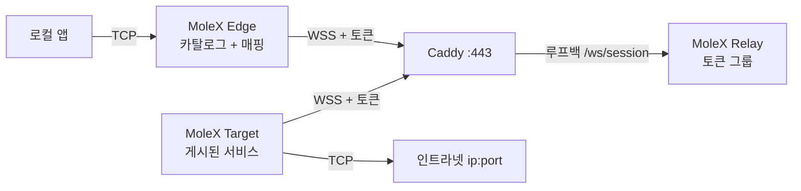

# MoleX 사용자 가이드

[English](user-guide.md) | [简体中文](user-guide.zh-CN.md) | [繁體中文](user-guide.zh-TW.md) | [Español](user-guide.es.md) | [Português (Brasil)](user-guide.pt-BR.md) | [Français](user-guide.fr.md) | [Deutsch](user-guide.de.md) | [日本語](user-guide.ja.md) | **한국어** | [Русский](user-guide.ru.md) | [العربية](user-guide.ar.md) | [हिन्दी](user-guide.hi.md)

첫 배포와 일상 운영을 위한 안내입니다. 스크린샷은 실제 콘솔에서 가져왔으며 주소, 경로 ID, 카운터는 예시입니다. 토큰은 항상 가려집니다. 콘솔 UI는 영어와 간체 중국어입니다. 이 문서는 한국어 운영 가이드입니다.

> MoleX는 **TCP**만 전달합니다. HTTP, HTTPS, API, SSH, RDP, 데이터베이스. 네이티브 UDP, QUIC/HTTP/3, ICMP는 운반하지 않습니다. [UDP 현황](#7-udp-현황과-대안)을 보세요.

v1(`mode: "punch"` 및 `role` / `secret` / `channel` / `tunnel`)은 받지 않습니다. `molex config init --mode relay|target|edge`로 다시 만드세요. [업그레이드 가이드](upgrade-guide.md)를 참고하세요.

## 1. 프로젝트 개요

MoleX는 단일 바이너리 보안 TCP 중계 허브입니다. 액세스 토큰 하나가 한 그룹을 정의합니다. Target은 정확히 하나, Edge는 대수 제한이 없습니다. Target은 인트라넷 `ip:port`를 게시하고, 각 Edge는 필요한 항목을 로컬 포트에 매핑합니다. Edge와 Target은 같은 공용 WSS로 나갑니다. Caddy는 보통 `443/tcp`만 엽니다.

Relay는 토큰으로 입장시키고 그룹화한 뒤 불투명한 암호문을 복사합니다. 배포판 Relay는 페이로드를 복호화하지 않습니다. 토큰을 가진 운영자는 신뢰 경계 안쪽에 있습니다. 토큰은 SSH 개인 키처럼 다루세요. 자세한 내용: [보안 모델](security.md).

핵심:

- 토큰 하나, Target 하나, Edge는 임의 대수. 같은 토큰의 두 번째 Target은 거절됩니다.
- Target 또는 Edge 프로세스 하나가 여러 토큰에 참여할 수 있습니다. 서비스는 그룹별로 가시성을 제한할 수 있습니다.
- Target 카탈로그는 실시간 동기화됩니다. Edge는 경로가 준비되고 서비스가 게시된 때만 매핑 리스너를 엽니다.
- 페이로드 보호는 TLS 1.3 안의 X25519 + HKDF-SHA256 + AES-256-GCM입니다. PSK는 토큰에서 파생됩니다.
- Relay 콘솔: 비밀번호 로그인, 토큰 생성 / 로테이션 / 비활성 / 삭제, 감사, 온라인 피어.
- Target / Edge 콘솔: 로그인 없음, 루프백만, same-origin과 CSRF.
- 클라이언트 재시도는 약 1초에서 15초 상한, 지터 포함.

브랜드 문구: **MoleX — The single-port secure transit hub.**

## 2. 역할과 트래픽 경로



| 역할 | 위치 | 동작 | 공용 인바운드 |
| --- | --- | --- | --- |
| Relay | 공용 호스트이름 | 토큰 입장, 1 Target과 N Edge 짝짓기, 암호문 복사 | Caddy `443/tcp`만 |
| Target | 백엔드에 닿는 호스트 | 카탈로그를 게시하고 그 주소만 다이얼 | 없음. 아웃바운드 WSS만 |
| Edge | 서비스를 쓰는 호스트 | 게시된 서비스를 로컬 포트에 매핑 | 기본 루프백. 선택적 LAN 바인드 |

```text
앱 TCP -> Edge 매핑 -> yamux(서비스 id 프리앰블) -> AES-256-GCM -> WSS
        -> Relay 암호문 복사 -> Target 허용 목록 다이얼 -> 백엔드 TCP
```

## 3. 시작 전 준비

- Relay와 Caddy용 공용 서버. 호스트이름 예: `molex.example.com`.
- 인트라넷 서비스에 닿는 Target.
- Edge 한 대 이상.
- 공용은 `443/tcp`만. Relay 데이터 면과 모든 Web 콘솔은 루프백.

소스 빌드(Go 1.25+, Node.js 20+):

```bash
cd frontend
npm ci
npm run build
cd ..
go build -trimpath -ldflags "-s -w -X main.version=0.4.0" -o bin/molex .
```

Windows 출력은 `bin/molex.exe`입니다.

### 3.1 자격 증명

| 값 | 사용자 | 용도 |
| --- | --- | --- |
| Web 비밀번호 | Relay 콘솔만(12자 이상) | 관리 로그인. `molex.json`에 저장하지 않음. |
| 액세스 토큰 | Relay가 발급. Target / Edge가 제시 | 입장, 그룹화, 종단 간 키 원천(`mx2_` + 32바이트 난수). |

비밀번호, 토큰, API 키, 쿠키, CSRF를 스크린샷, 로그, 노드 이름, 공개 저장소에 넣지 마세요. 감사는 토큰 id만 기록합니다.

## 4. 5분 배포

### 4.1 Relay

```bash
molex config init --mode relay --config relay.json
molex web --config relay.json --password-file ./web-password --autostart
```

로그인한 뒤 토큰을 만들고(메모 예: `office-nas`) 표시한 다음 복사합니다. 데이터 면은 `127.0.0.1:8080`을 듣습니다. 콘솔은 `127.0.0.1:9090`을 우선합니다.

```json
{
  "mode": "relay",
  "listen": "127.0.0.1:8080",
  "tokens": [
    { "id": "tok-example", "token": "mx2_generated-value", "note": "office" }
  ]
}
```

### 4.2 Caddy

```caddyfile
molex.example.com {
    @molex_session {
        path /ws/session
        header Connection *Upgrade*
        header Upgrade websocket
    }
    handle @molex_session {
        reverse_proxy 127.0.0.1:8080
    }
    handle {
        respond "Hello, world." 200
    }
}

admin.molex.example.com {
    reverse_proxy 127.0.0.1:9090
}
```

와일드카드 CORS를 넣지 마세요. 전체 예: [Caddy 배포](deployment-caddy.md).

### 4.3 Target

백엔드에 닿는 머신에서:

```bash
molex web
```

**Target**을 고르고 WSS URL과 토큰을 붙여 시작한 뒤 서비스를 추가합니다(예: `10.188.200.16:30927`). 저장하면 카탈로그가 바로 게시됩니다.

```json
{
  "mode": "target",
  "remote": "wss://molex.example.com/ws/session",
  "token": "mx2_generated-value",
  "name": "home-target",
  "services": [
    { "id": "svc-web", "name": "web", "address": "10.188.200.16:30927" },
    { "id": "svc-ssh", "name": "ssh", "address": "127.0.0.1:22" }
  ]
}
```

한 프로세스로 두 그룹에 들어가려면 `token` 대신 `tokens`를 쓰고 `services[].groups`로 가시성을 제한합니다.

```json
{
  "mode": "target",
  "remote": "wss://molex.example.com/ws/session",
  "tokens": [
    { "id": "office", "token": "mx2_office-token" },
    { "id": "lab", "token": "mx2_lab-token" }
  ],
  "services": [
    { "id": "svc-web", "name": "web", "address": "10.188.200.16:30927", "groups": ["office"] }
  ]
}
```

빈 `groups`는 이 Target이 참여한 모든 그룹에 공개합니다.

### 4.4 Edge

```bash
molex web
```

**Edge**를 고르고 같은 WSS와 토큰을 붙여 시작합니다. 게시된 서비스를 선택하면 콘솔이 빈 로컬 포트를 제안합니다. 그 네트워크의 다른 기기가 접속해야 할 때만 **LAN 가시**( `0.0.0.0` )를 켭니다.

```json
{
  "mode": "edge",
  "remote": "wss://molex.example.com/ws/session",
  "token": "mx2_generated-value",
  "name": "office-edge",
  "mappings": [
    { "service": "svc-web", "port": 28080 },
    { "service": "svc-ssh", "port": 2222 }
  ]
}
```

여러 그룹에 참여했다면 각 매핑에 `group`이 필요합니다.

### 4.5 브라우저 없이 검증하고 시작

```bash
molex config check --config relay.json
molex config check --config target.json
molex config check --config edge.json

molex serve   --config relay.json
molex connect --config target.json
molex connect --config edge.json
```

Target / Edge 콘솔은 비밀번호가 없습니다. 어떤 콘솔이든 원격 접근은 SSH 또는 HTTPS입니다.

```bash
ssh -N -L 9090:127.0.0.1:9090 user@molex-host
```

## 5. Web 콘솔 안내

### 5.1 Relay 로그인


비밀번호를 묻는 것은 Relay 콘솔뿐입니다. 첫 실행에서 만듭니다. 언어와 테마는 모든 콘솔에 있습니다. Target / Edge는 이 화면을 건너뜁니다.

### 5.2 Relay: 토큰과 클라이언트


- 토큰 생성, 표시/복사, 비활성, 삭제, **로테이션**. 로테이션 후 이전 값은 1–30일 동안 유효합니다(기본 3일).
- 관리 작업은 설정 옆 JSONL 감사 파일에 기록됩니다(토큰 id만).
- 「Listen address」는 데이터 면이지 Web 콘솔이 아닙니다.
- 연결된 클라이언트는 이름, 역할, 토큰 id, 플랫폼, 가동 시간, 암호문 RX/TX를 보여 줍니다. 「N services / N mappings」는 카탈로그나 매핑이 바뀌면 갱신됩니다.


연결 해제는 클라이언트 하나를 끊습니다. 토큰이 비활성이지 않으면 백오프로 다시 붙습니다.

### 5.3 Target


WSS와 하나 이상의 토큰을 채웁니다. 서비스는 `name` + `host:port`입니다. 여러 그룹이면 각 서비스를 볼 그룹을 선택합니다. 저장은 즉시 적용됩니다. 마지막 다이얼 오류는 그 서비스에만 남습니다.

### 5.4 Edge


시작 후 카탈로그가 나타납니다. 서비스를 선택해 매핑합니다. 리스너는 경로가 준비되고 서비스가 게시된 동안만 존재합니다. 장애 중 「Waiting」은 예상 동작입니다.

## 6. 자주 쓰는 레시피

Target에서 백엔드를 게시한 뒤 Edge에서 매핑합니다. 아래 서비스는 모두 한 Target 프로세스에 올릴 수 있습니다.

| 시나리오 | Target 서비스 주소 | Edge 로컬 포트 | 로컬 명령 |
| --- | --- | --- | --- |
| SSH | `127.0.0.1:22` | `2222` | `ssh -p 2222 user@127.0.0.1` |
| Windows RDP | `127.0.0.1:3389` | `13389` | `mstsc /v:127.0.0.1:13389` |
| HTTP API | `127.0.0.1:8080` | `18080` | `curl http://127.0.0.1:18080/health` |
| PostgreSQL | `127.0.0.1:5432` | `15432` | `psql -h 127.0.0.1 -p 15432` |
| MySQL | `127.0.0.1:3306` | `13306` | `mysql -h 127.0.0.1 -P 13306` |
| Redis | `127.0.0.1:6379` | `16379` | `redis-cli -h 127.0.0.1 -p 16379` |
| HTTPS API | `api.openai.com:443` | `18443` | TLS 호스트이름 유지(아래) |

사용자 이름, API 키, 고객 이름을 서비스명이나 노드명에 넣지 마세요.

### 6.1 HTTP API

```bash
curl http://127.0.0.1:18080/health
```

MoleX는 HTTP를 파싱하지 않습니다. WebSocket은 MoleX 자신의 데이터 경로입니다.

### 6.2 HTTPS / OpenAI 호환 API

`https://127.0.0.1:18443`을 직접 열지 마세요. 인증서 호스트이름 검사가 실패합니다. TCP는 Edge로 보내고 원래 호스트이름은 유지합니다.

```bash
curl --connect-to api.openai.com:443:127.0.0.1:18443 \
  https://api.openai.com/v1/models \
  -H "Authorization: Bearer $OPENAI_API_KEY"
```

API 키는 앱 환경 변수에만 두고 MoleX 설정에 쓰지 마세요. 출구 IP는 Target 네트워크의 공인 주소입니다. 제공자 약관을 지키세요.

### 6.3 SSH와 RDP

```bash
ssh -p 2222 user@127.0.0.1
scp -P 2222 ./file user@127.0.0.1:/tmp/
```

```powershell
mstsc /v:127.0.0.1:13389
```

인증은 여전히 SSH / Windows가 담당합니다. 방화벽 계획 없이 Edge를 `0.0.0.0`에 바인드하지 마세요.

### 6.4 여러 서비스, 한 프로세스

한 Target에 모든 백엔드를 게시하고, 각 Edge는 필요한 것만 매핑합니다. 세션은 모두 `wss://molex.example.com/ws/session`이므로 공용 면은 계속 `443/tcp` 하나입니다. 한 호스트의 여러 콘솔은 `9090`부터 루프백 포트를 나눕니다. 안정적인 SSH 전달이 필요하면 명시하세요.

## 7. UDP 현황과 대안

MoleX에는 UDP 소켓이나 데이터그램 프레이밍이 없습니다. UDP DNS, QUIC/HTTP/3, 게임, VoIP, NTP, ICMP를 운반할 수 없습니다.

| 필요 | 권장 |
| --- | --- |
| DNS | TCP/53, DoH, DoT를 쓴 뒤 그 TCP 서비스를 전달 |
| HTTP/3 API | HTTP/1.1 또는 HTTP/2 over TCP로 강제 |
| Syslog | TCP syslog |
| 게임, VoIP, QUIC | WireGuard, Tailscale 또는 다른 네이티브 UDP 터널 |

## 8. CLI

```bash
molex serve   --config ./relay.json
molex connect --config ./target.json
molex connect --config ./edge.json --remote wss://molex.example.com/ws/session --token "$MOLEX_TOKEN"
molex web     --config ./molex.json --password-file ./web-password --autostart
molex config init  --config ./molex.json --mode relay|target|edge
molex config check --config ./molex.json
molex version
```

명령줄 토큰은 셸 기록에 남을 수 있습니다. 보호된 설정 파일을 쓰세요. Linux에서는 `deploy/molex-relay.service`로 데이터 면을 유지하고, systemd가 없으면 `deploy/molex-keepalive.sh`를 사용합니다.

## 9. 런타임 동작

- Edge와 Target은 아웃바운드 WSS만 시작합니다.
- 매핑 리스너는 경로가 준비되고 서비스가 게시된 동안만 존재합니다.
- 백오프는 약 1초 → 15초, ±20% 지터, 건강 30초 후 리셋.
- 경로가 끊기면 기존 TCP가 닫힙니다. 앱이 재시도해야 합니다.
- Edge 프로세스 / Target 세션당 동시 스트림은 최대 256개.
- 중복 Target은 명확한 종료 이유로 거절됩니다. 토큰 비활성/삭제는 그룹 전체를 끊습니다. 로테이션 유예 기간에는 이전 값이 유효합니다.

## 10. 문제 해결

| 결과 | 조치 |
| --- | --- |
| HTTP `401` | Relay 콘솔에서 현재 토큰을 복사. 로테이션 후 유예가 끝나기 전에 이전. |
| HTTP `403` | 토큰이 비활성입니다. Relay 운영자에게 활성화 또는 재발급을 요청. |
| HTTP `404` | URL은 `/ws/session`으로 끝나야 하고 Caddy가 그 경로를 전달해야 합니다. |
| HTTP `502`/`503`/`504` | Relay를 시작하고 Caddy 업스트림 `127.0.0.1:8080`을 확인. |
| 중복 Target | 다른 Target을 멈추거나 다른 토큰을 사용. |
| 페어링 시간 초과 | 이 토큰의 Target을 시작. 양쪽 모두 MoleX v2와 같은 토큰이어야 합니다. |
| 매핑 대기 | Target 오프라인 또는 서비스 철회. 복구 후 자동 재개. |
| 포트 사용 중 | 점유 프로세스를 멈추거나 다른 포트를 선택. 해당 매핑만 영향. |
| 서비스 사용 불가 | 백엔드를 시작하거나 Target 주소를 수정. |
| 수신하지 않음 | idle / connecting / stopping의 예상 상태. |

```bash
curl --fail http://127.0.0.1:8080/healthz
curl --fail http://127.0.0.1:9090/healthz
```

## 11. 프로덕션 점검표

- 공용: Caddy `443/tcp`만.
- Relay 데이터 면 `127.0.0.1:8080`, 콘솔 `127.0.0.1:9090`.
- 원격 WSS는 유효한 인증서가 필요합니다. 평문 `ws://`는 루프백만.
- 토큰은 Relay 콘솔에서 생성. 유예 로테이션 후 모든 Target과 Edge를 갱신.
- 신뢰 그룹마다 토큰 하나. 한 프로세스가 여러 그룹을 쓰면 `groups`로 가시성 제한.
- 최소 권한 서비스 계정. 비공개 설정 ACL.
- 기본은 루프백 매핑. 필요할 때만 매핑별로 LAN 가시.
- 앱 재연결을 켜세요. 경로가 다시 만들어진 뒤 옛 TCP 스트림은 이어지지 않습니다.

[아키텍처](architecture.md), [Caddy 배포](deployment-caddy.md), [보안](security.md)을 보세요.

## 12. MIT 라이선스

MoleX는 [MIT License](../LICENSE)로 배포됩니다. 소프트웨어는 「있는 그대로」 제공됩니다. 라이선스는 코드를 다루며 프로젝트 이름, 로고, 제3자 상표를 자동으로 주지 않고, 운영자의 법적 의무와 서비스 약관을 대체하지 않습니다.
