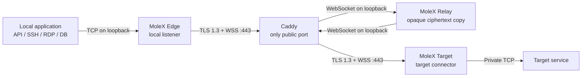

# MoleX User Guide

**English** | [简体中文](user-guide.zh-CN.md) | [繁體中文](user-guide.zh-TW.md) | [Español](user-guide.es.md) | [Português (Brasil)](user-guide.pt-BR.md) | [Français](user-guide.fr.md) | [Deutsch](user-guide.de.md) | [日本語](user-guide.ja.md) | [한국어](user-guide.ko.md) | [Русский](user-guide.ru.md) | [العربية](user-guide.ar.md) | [हिन्दी](user-guide.hi.md)

This guide is for first-time deployment and day-to-day operations. The screenshots come from a real WebUI demo. Addresses, route IDs, and traffic counters are illustrative; secrets and tokens remain masked.

> Current capability boundary: MoleX is a secure **TCP** transit tool. It carries TCP-based HTTP, HTTPS, APIs, SSH, RDP, and database traffic. It does not currently provide native UDP, QUIC/HTTP/3, or ICMP forwarding. See [UDP status and alternatives](#7-udp-status-and-alternatives).

## 1. Project overview

MoleX is a single-binary secure TCP transit hub written in Go. Edge and Target both initiate outbound connections to the same public WSS endpoint, normally TLS-terminated by Caddy on the only public port, `443/tcp`. Relay rendezvous the peers and copies opaque ciphertext; it never receives the end-to-end payload secret and cannot decrypt application data.

Highlights:

- One public WSS entrypoint serves any number of independent routes.
- Each route carries up to 256 concurrent TCP streams through yamux in one WSS session.
- X25519, HKDF-SHA256, and AES-256-GCM protect payloads inside TLS 1.3.
- Relay admission credentials are separate from the Edge/Target payload secret.
- Relay, Edge, and Target share one CLI and browser WebUI; no desktop environment is required.
- The WebUI supports English and Simplified Chinese, with light, dark, and system themes.
- Clients reconnect automatically with capped, jittered exponential backoff from about 1 to 15 seconds.
- The Relay console shows node names, trusted source IPs, roles, endpoints, pairing, platform, uptime, and ciphertext traffic.

### 1.1 MoleX name and brand meaning

`MoleX` is pronounced `/moʊl ɛks/` and can be read as “Mole + X”:

- **Mole** evokes a tunnel built out of sight through constrained terrain.
- **Xfer / Transfer** makes `X` a compact symbol for moving data.
- **Cross / Exchange** represents two endpoints meeting through a transit hub.
- **X factor** leaves room for engineering extension without naming one fixed network protocol.

Suggested brand line: **MoleX - The single-port secure transit hub. One port. Two peers. One secure route.**

The name and icon identify the project; they are not promises of anonymity, invisibility, or absolute security. The MIT License covers the software code but does not automatically grant exclusive rights to a project name, logo, or trademark. Check name and trademark availability separately before public distribution.

## 2. Roles and traffic path



| Role | Where it runs | Behavior | Public inbound traffic |
| --- | --- | --- | --- |
| Relay | Server with a public hostname | Waits for Edge and Target, then copies ciphertext frames | Only Caddy exposes `443/tcp` |
| Edge | Machine using the service | Opens a local TCP listener only after the route is ready | Loopback-only by default |
| Target | Machine that can reach the service | Dials `tunnel.local` for each yamux stream | None; it only dials WSS outbound |

Each local TCP connection maps to one yamux stream:

```text
application TCP -> Edge -> yamux -> AES-GCM -> WebSocket -> Relay
                -> WebSocket -> AES-GCM -> yamux -> Target -> target TCP service
```

Relay can observe source IPs, timing, ciphertext sizes, traffic counters, and reconnections of the same pseudonymous route. It cannot read application plaintext. MoleX is not an anonymity network and provides no traffic padding or traffic-analysis resistance.

## 3. Before you begin

### 3.1 Requirements

- A public server reachable by Edge and Target for Relay and Caddy.
- An Edge machine where the application will connect.
- A Target machine that can reach the private TCP service.
- A hostname such as `molex.example.com` pointing to the Relay server.
- Only public `443/tcp`; keep Relay data and management listeners on loopback.

Building from source requires Go 1.25+ and Node.js 20+:

```bash
cd frontend
npm ci
npm run build
cd ..
go build -trimpath -ldflags "-s -w -X main.version=0.3.1" -o bin/molex .
```

Use `bin/molex.exe` on Windows. Release-package users need only the single binary for their platform.

### 3.2 Keep these four values distinct

| Value | Used by | Purpose | Important boundary |
| --- | --- | --- | --- |
| Web password | Set separately on each WebUI node | Management login | Never stored in `molex.json` |
| Relay token | Same on Relay, Edge, and Target | Rejects unauthorized WSS admission | Visible to Relay and the Caddy loopback hop; not a payload key |
| End-to-end secret | Same only on a paired Edge and Target | Peer authentication and payload encryption | Relay must never receive it |
| Channel | Same on a paired Edge and Target | Logical rendezvous name | Not a public port; do not put credentials in it |

Never place passwords, tokens, secrets, API keys, cookies, or CSRF values in screenshots, logs, tickets, or a public repository.

## 4. Five-minute deployment

The example uses `molex.example.com`, channel `home-ssh`, and local Edge port `2222`. Replace every placeholder.

### 4.1 Relay configuration

Generate a secure Relay template:

```bash
molex config init --mode relay --config relay.json
```

Keep Relay on loopback:

```json
{
  "mode": "relay",
  "token": "mx1_REPLACE_WITH_RANDOM_RELAY_TOKEN",
  "listen": "127.0.0.1:8080",
  "tunnel": {}
}
```

The Relay token must contain at least 16 characters. Deliver the same value securely to Edge and Target, but never publish it.

### 4.2 Publish one port with Caddy

```caddyfile
molex.example.com {
    tls operator@example.com

    @molex_session {
        path /ws/session
        header Connection *Upgrade*
        header Upgrade websocket
    }

    handle @molex_session {
        reverse_proxy 127.0.0.1:8080
    }

    handle {
        respond "Hello, world." 200
    }

    header {
        Strict-Transport-Security "max-age=31536000; includeSubDomains"
        X-Content-Type-Options nosniff
        Referrer-Policy no-referrer
        -Server
    }
}
```

Do not add wildcard CORS headers or force upstream `Upgrade`/`Connection` headers. Caddy handles WebSocket upgrades and trusted client-address forwarding.

### 4.3 Edge configuration

Generate one client secret:

```bash
molex config init --mode punch --role edge --config edge.json
```

Edit the result:

```json
{
  "mode": "punch",
  "role": "edge",
  "secret": "mx1_SAME_END_TO_END_SECRET_ON_BOTH_CLIENTS",
  "token": "mx1_SAME_RELAY_TOKEN_ON_ALL_THREE_NODES",
  "listen": "127.0.0.1:2222",
  "remote": "wss://molex.example.com/ws/session",
  "tunnel": {
    "remote": "home-ssh",
    "name": "office-edge"
  }
}
```

### 4.4 Target configuration

Copy the secret generated for Edge; do not generate a second one:

```json
{
  "mode": "punch",
  "role": "target",
  "secret": "mx1_SAME_END_TO_END_SECRET_ON_BOTH_CLIENTS",
  "token": "mx1_SAME_RELAY_TOKEN_ON_ALL_THREE_NODES",
  "remote": "wss://molex.example.com/ws/session",
  "tunnel": {
    "local": "127.0.0.1:22",
    "remote": "home-ssh",
    "name": "home-target"
  }
}
```

Edge and Target must match on `secret`, `token`, `remote`, and `tunnel.remote`, and their roles must be complementary. Only Target uses `tunnel.local`; only Edge uses `listen`. Multiple Edge/Target processes may share one channel; the Relay pairs each Edge with the oldest waiting Target as an independent session. `tunnel.name` is a WebUI label and does not need to be unique.

### 4.5 Validate and start

```bash
molex config check --config relay.json
molex config check --config edge.json
molex config check --config target.json
```

On each machine, create a Web password file containing at least 12 characters and readable only by the service account. Start the matching process:

```bash
molex web --config relay.json  --password-file ./web-password --autostart
molex web --config target.json --password-file ./web-password --autostart
molex web --config edge.json   --password-file ./web-password --autostart
```

The management page prefers `http://127.0.0.1:9090`; if that port is occupied, MoleX advances to a free loopback port, prints the selected URL, and opens the default browser after listening succeeds. For servers, SSH forwarding, and reverse proxies, pin the address with `--listen 127.0.0.1:9090 --open-browser=false`. Non-loopback binding is always rejected. For occasional remote management:

```bash
ssh -N -L 9090:127.0.0.1:9090 user@molex-host
```

Then open `http://127.0.0.1:9090` locally. Use a separate HTTPS reverse-proxy hostname for continuous remote management.

## 5. WebUI walkthrough

### 5.1 Sign-in and global controls


1. Enter this node's Web management password.
2. The language button switches between English and Simplified Chinese.
3. The theme button cycles through system, light, and dark modes.
4. After login, the sign-out button ends the management session.

### 5.2 Relay console


- Arrows in the route diagram show the forwarding direction from Edge through Relay to Target.
- “Listen address” is the Relay data listener, not the Web management listener.
- Stop the runtime before editing; then Save and Start.
- “Connected clients” should contain complementary Edge/Target pairs.


| Field | Meaning |
| --- | --- |
| Node name | `tunnel.name`, a display label that may be shared by multiple clients; peer ID distinguishes connections |
| Target session pool | `tunnel.pool`, independent outbound sessions for one Target process. `0` (default) grows on demand up to 65,535; fixed values 1–65,535 are also supported. |
| Source IP | Direct socket address or trusted loopback-proxy client IP |
| Role/status | Edge or Target; waiting or paired |
| Forward endpoint | Edge local listener or Target service |
| Route ID | Pseudonymous truncated label, never the channel or key |
| Paired with | Current complementary peer |
| Relay endpoint/platform | Client WSS URL and OS/architecture |
| Online/last traffic | Session age and last ciphertext activity |
| RX/TX | Ciphertext bytes and frame counts observed by Relay |

### 5.3 Edge configuration


Edge is the local application entrypoint. Its local listener exists only after an authenticated Target is paired. “Not listening” during a route outage is a protective state, not a UI error.

### 5.4 Target configuration


Target service is any TCP address reachable from the Target machine, such as `127.0.0.1:22`, `10.0.0.25:5432`, or `api.openai.com:443`.

## 6. Common scenario recipes

| Scenario | Target `tunnel.local` | Edge `listen` | Local command |
| --- | --- | --- | --- |
| SSH | `127.0.0.1:22` | `127.0.0.1:2222` | `ssh -p 2222 user@127.0.0.1` |
| Windows RDP | `127.0.0.1:3389` | `127.0.0.1:13389` | `mstsc /v:127.0.0.1:13389` |
| HTTP API | `127.0.0.1:8080` | `127.0.0.1:18080` | `curl http://127.0.0.1:18080/health` |
| PostgreSQL | `127.0.0.1:5432` | `127.0.0.1:15432` | `psql -h 127.0.0.1 -p 15432` |
| MySQL | `127.0.0.1:3306` | `127.0.0.1:13306` | `mysql -h 127.0.0.1 -P 13306` |
| Redis | `127.0.0.1:6379` | `127.0.0.1:16379` | `redis-cli -h 127.0.0.1 -p 16379` |
| HTTPS/OpenAI | `api.openai.com:443` | `127.0.0.1:18443` | Preserve the TLS hostname as described below |

Use a separate `tunnel.remote` channel for each scenario. Do not put usernames, API keys, customer names, or other sensitive data in channels or node names.

### 6.1 HTTP API

```text
Target tunnel.local = 127.0.0.1:8080
Edge   listen       = 127.0.0.1:18080
Both   channel      = internal-api
```

After the route is ready:

```bash
curl http://127.0.0.1:18080/health
```

MoleX does not parse HTTP and does not modify the Host header, path, headers, or body. WebSocket is used only for MoleX's own data channel; the application still opens ordinary TCP/HTTP connections.

### 6.2 HTTPS and an OpenAI API endpoint

Target:

```text
tunnel.local  = api.openai.com:443
tunnel.remote = openai-api
```

Edge:

```text
listen        = 127.0.0.1:18443
tunnel.remote = openai-api
```

HTTPS validation depends on the original hostname and SNI. Do not request `https://127.0.0.1:18443` directly. For a quick test, tell curl to preserve `api.openai.com` while connecting the TCP socket to Edge:

```bash
curl --connect-to api.openai.com:443:127.0.0.1:18443 \
  https://api.openai.com/v1/models \
  -H "Authorization: Bearer $OPENAI_API_KEY"
```

PowerShell:

```powershell
curl.exe --connect-to api.openai.com:443:127.0.0.1:18443 `
  https://api.openai.com/v1/models `
  -H "Authorization: Bearer $env:OPENAI_API_KEY"
```

Important details:

- Keep the OpenAI API key in the calling application's environment or secret manager, never in MoleX configuration.
- `--connect-to` changes only the TCP destination; the URL, TLS SNI, and certificate hostname remain `api.openai.com`.
- For an SDK, configure its transport to reach Edge while retaining `api.openai.com` as the URL hostname, or use controlled local name mapping with a suitable Edge port.
- Do not simply set an SDK base URL to `https://127.0.0.1:18443`; certificate hostname validation will normally fail.
- Egress uses the Target network's public IP. Continue to follow provider terms, regional availability, and organizational policy.

MoleX has no OpenAI-specific integration. This is standard TLS-over-TCP forwarding and works the same way for other HTTPS APIs.

### 6.3 SSH

```text
Target tunnel.local = 127.0.0.1:22
Edge   listen       = 127.0.0.1:2222
Both   channel      = home-ssh
```

```bash
ssh -p 2222 user@127.0.0.1
scp -P 2222 ./file user@127.0.0.1:/tmp/
```

SSH remains responsible for user authentication and host-key verification.

### 6.4 RDP

```text
Target tunnel.local = 127.0.0.1:3389
Edge   listen       = 127.0.0.1:13389
Both   channel      = office-rdp
```

```powershell
mstsc /v:127.0.0.1:13389
```

Keep Network Level Authentication and strong Windows credentials enabled. Do not bind Edge to `0.0.0.0` without an explicit firewall and access-control design.

### 6.5 Databases

Database clients connect directly to the local Edge port. The database still owns accounts, TLS, and authorization. In production:

- Keep Edge on loopback.
- Use least-privilege accounts.
- Keep database-native TLS enabled when available.
- Configure connection pools to rebuild broken connections after MoleX reconnects.

### 6.6 Multiple services

One MoleX client process manages one Edge/Target WebSocket route. You may run multiple Edge or Target processes with the same `secret` and `tunnel.remote`; the Relay keeps per-route FIFO queues and pairs each Edge with the oldest waiting Target. Every pair remains an independent encrypted session. Run one configuration and process per service:

A single Target process can serve many Edge clients. Keep `tunnel.pool` at `0` (default) for demand-driven growth, or choose a fixed pool from 1 to 65,535. Every slot has separate WSS, key, nonce, and yamux state.

```text
ssh:      channel=home-ssh      edge=127.0.0.1:2222
postgres: channel=home-pg       edge=127.0.0.1:15432
api:      channel=internal-api  edge=127.0.0.1:18080
```

All processes still use `wss://molex.example.com/ws/session`, so the public surface remains one Caddy `443/tcp` listener. Multiple WebUIs on one host automatically select distinct loopback ports starting at `9090`; pin `9090`, `9091`, and `9092` explicitly when stable SSH-forward or reverse-proxy addresses are required.

## 7. UDP status and alternatives

### 7.1 Not currently supported

The current Edge accepts TCP, maps each connection to a yamux byte stream, and Target opens another TCP connection. It has no UDP socket, datagram framing, source-address mapping, or UDP idle-session management. It therefore cannot directly carry:

- ordinary UDP DNS;
- QUIC or HTTP/3;
- games, voice, video, or other real-time UDP;
- UDP syslog, SNMP traps, or NTP;
- ICMP/ping.

### 7.2 Practical alternatives

| Need | Recommendation |
| --- | --- |
| DNS | Use TCP/53, DoH, or DoT through a local proxy and forward that TCP service with MoleX |
| HTTP/3 API | Force the client to HTTP/1.1 or HTTP/2 over TCP |
| Syslog | Configure both ends for TCP syslog |
| Small custom UDP protocol | Deploy a gateway that explicitly preserves datagram boundaries, then give its TCP port to MoleX |
| Games, VoIP, QUIC, real-time media | Use WireGuard, Tailscale, or another native UDP tunnel |

Do not pretend that simple byte-stream copying is transparent UDP. It loses datagram boundaries, source-address semantics, and loss behavior.

### 7.3 Possible future boundary

A future `tunnel.protocol: "udp"` could map each Edge UDP source to an idle-expiring logical flow, length-frame datagrams inside an encrypted yamux stream, and use a Target UDP socket for `tunnel.local`. Relay could remain ciphertext-only.

The outer transport would still be WSS/TCP, so packet loss would cause head-of-line blocking. Such support would suit DNS, monitoring, and low-rate request/response traffic, not QUIC, games, or real-time media. Until release notes explicitly announce UDP support, treat MoleX as TCP-only.

## 8. CLI operation

Without a browser:

```bash
molex serve --config relay.json
molex connect --config edge.json
molex connect --config target.json
```

Flags can override a client configuration:

```bash
molex connect \
  --remote wss://molex.example.com/ws/session \
  --role edge \
  --name office-edge \
  --listen 127.0.0.1:2222 \
  --channel home-ssh \
  --secret "$MOLEX_SECRET" \
  --token "$MOLEX_RELAY_TOKEN"
```

Command-line values may appear in shell history and process listings. Prefer a protected configuration file for long-running services. `molex web` uses the same in-process runtime and does not spawn a child MoleX process.

## 9. Runtime and reconnection behavior

- Edge and Target initiate outbound WSS only.
- Edge does not listen locally until authenticated pairing succeeds.
- When Relay or Target drops, Edge closes its listener and clears the active-listen status.
- Clients retry continuously with exponential delays from about 1 to 15 seconds and 20% jitter.
- A session healthy for 30 seconds resets the retry delay.
- Existing TCP connections close when the route breaks; applications must retry after “Encrypted route is ready.”
- Each route allows at most 256 concurrent streams; excess connections fail closed with guidance.

## 10. Troubleshooting

| WebUI/log result | Action |
| --- | --- |
| HTTP `401`/`403` | Make `token` identical on Relay, Edge, and Target |
| HTTP `404` | Ensure the URL ends in `/ws/session` and Caddy forwards that exact path |
| HTTP `502`/`503`/`504` | Start Relay and check the `127.0.0.1:8080` Caddy upstream |
| DNS failure | Check the hostname, client DNS, and network egress |
| Connection refused | Check Caddy/Relay service state, port, and firewall |
| TLS verification failed | Check certificate hostname, chain, and system time |
| Pairing timeout | Start the peer; match channel, secret, token, and complementary roles |
| Same-role client waiting | Multiple Edge/Target clients are supported on one channel; wait for a complementary peer and let the Relay pair sessions FIFO |
| Edge address in use | Stop the occupying process or change `listen` |
| Target service unavailable | Start the target service and check `tunnel.local` and network access |
| Not listening | Wait for the secure route; this is expected protection during an outage |

Local health checks:

```bash
curl --fail http://127.0.0.1:8080/healthz
curl --fail http://127.0.0.1:9090/healthz
```

## 11. Production security checklist

- Expose only Caddy `443/tcp` publicly.
- Keep Relay data on `127.0.0.1:8080` and management on `127.0.0.1:9090`.
- Require a valid TLS certificate for remote WSS; use plain `ws://` only on loopback.
- Generate independent random Relay tokens and payload secrets of at least 32 bytes, and rotate them separately.
- Use a distinct strong Web password and least-privilege service account on every node.
- Restrict configuration files to the service account; use a private directory ACL on Windows.
- Keep Edge on loopback. Binding to `0.0.0.0` exposes the service to the local network and requires firewall and application authentication.
- Never put sensitive data in `tunnel.name`, channels, URL queries, or error screenshots.
- Update MoleX, Caddy, the OS, and frontend dependencies regularly.
- Enable application reconnection. MoleX cannot resume an old TCP stream after rebuilding the underlying route.

See [Architecture and protocol](architecture.md), [Caddy deployment](deployment-caddy.md), and [Security](security.md) for deeper detail.

## 12. MIT License

MoleX is distributed under the [MIT License](../LICENSE). Anyone may use, copy, modify, merge, publish, distribute, sublicense, and sell copies of the software as long as the copyright and license notice remain included.

The software is provided “as is,” without express or implied warranty. The MIT License covers software code; it does not automatically grant rights to a project name, logo, or third-party trademark, and it does not replace the operator's responsibility for network, data, service-term, and legal compliance.
