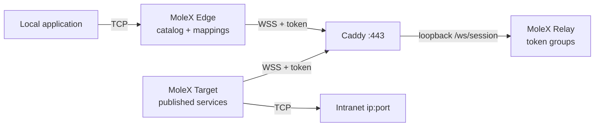

# MoleX User Guide

**English** | [简体中文](user-guide.zh-CN.md) | [繁體中文](user-guide.zh-TW.md) | [Español](user-guide.es.md) | [Português (Brasil)](user-guide.pt-BR.md) | [Français](user-guide.fr.md) | [Deutsch](user-guide.de.md) | [日本語](user-guide.ja.md) | [한국어](user-guide.ko.md) | [Русский](user-guide.ru.md) | [العربية](user-guide.ar.md) | [हिन्दी](user-guide.hi.md)

This guide is for first-time deployment and day-to-day operations. Screenshots are from a real Web console; addresses, route IDs, and counters are illustrative. Tokens stay masked.

> MoleX forwards **TCP** only: HTTP, HTTPS, APIs, SSH, RDP, and databases. It does not carry native UDP, QUIC/HTTP/3, or ICMP. See [UDP status](#7-udp-status-and-alternatives).

v1 (`mode: "punch"` with `role` / `secret` / `channel` / `tunnel`) is not accepted. Recreate files with `molex config init --mode relay|target|edge`. See the [upgrade guide](upgrade-guide.md).

## 1. Project overview

MoleX is a single-binary secure TCP transit hub. One access token defines one group: exactly one Target plus any number of Edges. The Target publishes intranet `ip:port` services; each Edge maps the ones it needs to local ports. Edge and Target dial the same public WSS address. Caddy normally exposes only `443/tcp`.

The Relay admits clients by token, groups them, and copies opaque ciphertext. The shipped Relay never decrypts payloads. The operator who holds the tokens is inside the trust boundary; treat a token like an SSH private key. Details: [security model](security.md).

Highlights:

- One token, one Target, any number of Edges. A second Target on the same token is rejected.
- One Target or Edge process can join several tokens. Services can be limited to selected groups.
- The Target catalog syncs live. Edges open a mapping listener only when the route is ready and the service is published.
- Payload protection is X25519 + HKDF-SHA256 + AES-256-GCM inside TLS 1.3. The PSK is derived from the token.
- Relay console: password login, token create / rotate / disable / delete, audit log, live peers.
- Target and Edge consoles: login-free, loopback-only, same-origin and CSRF protected.
- Clients retry with capped jittered backoff from about 1 s to 15 s.

Suggested brand line: **MoleX — The single-port secure transit hub.**

## 2. Roles and traffic path



| Role | Where | Behavior | Public inbound |
| --- | --- | --- | --- |
| Relay | Public hostname | Admits tokens, pairs one Target with N Edges, copies ciphertext | Only Caddy `443/tcp` |
| Target | Host that can reach the backends | Publishes a catalog; dials only those addresses | None; outbound WSS only |
| Edge | Host that uses the services | Maps published services to local ports | Loopback by default; optional LAN bind |

```text
app TCP -> Edge mapping -> yamux (service-id preamble) -> AES-256-GCM -> WSS
        -> Relay ciphertext copy -> Target allowlist dial -> backend TCP
```

## 3. Before you begin

- A public server for Relay and Caddy, hostname such as `molex.example.com`.
- A Target machine that can reach the intranet services.
- One or more Edge machines.
- Public `443/tcp` only. Keep Relay data and every Web console on loopback.

Build from source (Go 1.25+, Node.js 20+):

```bash
cd frontend
npm ci
npm run build
cd ..
go build -trimpath -ldflags "-s -w -X main.version=0.4.0" -o bin/molex .
```

On Windows the output is `bin/molex.exe`.

### 3.1 Credentials

| Value | Who uses it | Purpose |
| --- | --- | --- |
| Web password | Relay console only (≥12 characters) | Management login. Not stored in `molex.json`. |
| Access token | Relay issues it; Target and Edge present it | Admission, grouping, and the end-to-end key source (`mx2_` + 32 random bytes). |

Never put passwords, tokens, API keys, cookies, or CSRF values in screenshots, logs, node names, or a public repository. Audit records store token ids only.

## 4. Five-minute deployment

### 4.1 Relay

```bash
molex config init --mode relay --config relay.json
molex web --config relay.json --password-file ./web-password --autostart
```

Sign in, create a token (add a note such as `office-nas`), reveal and copy it. The data plane listens on `127.0.0.1:8080`. The console prefers `127.0.0.1:9090`.

```json
{
  "mode": "relay",
  "listen": "127.0.0.1:8080",
  "tokens": [
    { "id": "tok-example", "token": "mx2_generated-value", "note": "office" }
  ]
}
```

### 4.2 Caddy

```caddyfile
molex.example.com {
    @molex_session {
        path /ws/session
        header Connection *Upgrade*
        header Upgrade websocket
    }
    handle @molex_session {
        reverse_proxy 127.0.0.1:8080
    }
    handle {
        respond "Hello, world." 200
    }
}

admin.molex.example.com {
    reverse_proxy 127.0.0.1:9090
}
```

Do not add wildcard CORS. Full example: [Caddy deployment](deployment-caddy.md).

### 4.3 Target

On the machine that can reach the backends:

```bash
molex web
```

Choose **Target**, paste the WSS URL and token, start, then add services (for example `10.188.200.16:30927`). Saving publishes the catalog immediately.

```json
{
  "mode": "target",
  "remote": "wss://molex.example.com/ws/session",
  "token": "mx2_generated-value",
  "name": "home-target",
  "services": [
    { "id": "svc-web", "name": "web", "address": "10.188.200.16:30927" },
    { "id": "svc-ssh", "name": "ssh", "address": "127.0.0.1:22" }
  ]
}
```

To join two groups in one process, use `tokens` instead of `token` and set `services[].groups` to restrict visibility:

```json
{
  "mode": "target",
  "remote": "wss://molex.example.com/ws/session",
  "tokens": [
    { "id": "office", "token": "mx2_office-token" },
    { "id": "lab", "token": "mx2_lab-token" }
  ],
  "services": [
    { "id": "svc-web", "name": "web", "address": "10.188.200.16:30927", "groups": ["office"] }
  ]
}
```

Empty `groups` means every group this Target joined.

### 4.4 Edge

```bash
molex web
```

Choose **Edge**, paste the same WSS URL and token, start. Check a published service; the console suggests a free local port. Enable **LAN visible** only when other devices on that network must connect (`0.0.0.0`).

```json
{
  "mode": "edge",
  "remote": "wss://molex.example.com/ws/session",
  "token": "mx2_generated-value",
  "name": "office-edge",
  "mappings": [
    { "service": "svc-web", "port": 28080 },
    { "service": "svc-ssh", "port": 2222 }
  ]
}
```

When several groups are joined, each mapping needs `group`.

### 4.5 Validate and start without a browser

```bash
molex config check --config relay.json
molex config check --config target.json
molex config check --config edge.json

molex serve   --config relay.json
molex connect --config target.json
molex connect --config edge.json
```

Target and Edge consoles need no password. Remote access to any console uses SSH or HTTPS:

```bash
ssh -N -L 9090:127.0.0.1:9090 user@molex-host
```

## 5. Web console walkthrough

### 5.1 Relay login


Only the Relay console asks for a password. First run creates it. Language and theme controls are on every console. Target and Edge skip this screen.

### 5.2 Relay: tokens and clients


- Create, reveal/copy, disable, delete, and **rotate** tokens. Rotation keeps the previous value valid for 1–30 days (default 3).
- Administrative actions are written to a JSONL audit file beside the configuration (token ids only).
- “Listen address” is the data plane, not the Web console.
- Connected clients show name, role, token id, platform, uptime, and ciphertext RX/TX. The “N services / N mappings” label refreshes when the catalog or mappings change.


Disconnect kicks one client; it reconnects with backoff unless the token is disabled.

### 5.3 Target


Fill the WSS address and one or more tokens. Add services as `name` + `host:port`. With multiple groups, tick which groups may see each service. Save applies live. Last dial errors stay on that service only.

### 5.4 Edge


After start, the catalog appears. Check a service to map it. Listeners exist only while the route is ready and the service is still published. “Waiting” during an outage is expected.

## 6. Common recipes

Publish the backend on the Target, then map it on the Edge. One Target process can publish every service below.

| Scenario | Target service address | Edge local port | Local command |
| --- | --- | --- | --- |
| SSH | `127.0.0.1:22` | `2222` | `ssh -p 2222 user@127.0.0.1` |
| Windows RDP | `127.0.0.1:3389` | `13389` | `mstsc /v:127.0.0.1:13389` |
| HTTP API | `127.0.0.1:8080` | `18080` | `curl http://127.0.0.1:18080/health` |
| PostgreSQL | `127.0.0.1:5432` | `15432` | `psql -h 127.0.0.1 -p 15432` |
| MySQL | `127.0.0.1:3306` | `13306` | `mysql -h 127.0.0.1 -P 13306` |
| Redis | `127.0.0.1:6379` | `16379` | `redis-cli -h 127.0.0.1 -p 16379` |
| HTTPS API | `api.openai.com:443` | `18443` | Keep the TLS hostname (below) |

Do not put usernames, API keys, or customer names in service or node names.

### 6.1 HTTP API

```bash
curl http://127.0.0.1:18080/health
```

MoleX does not parse HTTP. WebSocket is only the MoleX data path.

### 6.2 HTTPS / OpenAI-compatible API

Do not open `https://127.0.0.1:18443` directly; certificate hostname checks fail. Point TCP at Edge while keeping the original hostname:

```bash
curl --connect-to api.openai.com:443:127.0.0.1:18443 \
  https://api.openai.com/v1/models \
  -H "Authorization: Bearer $OPENAI_API_KEY"
```

Keep the API key in the application environment, never in MoleX configuration. Egress uses the Target network’s public IP. Follow provider terms.

### 6.3 SSH and RDP

```bash
ssh -p 2222 user@127.0.0.1
scp -P 2222 ./file user@127.0.0.1:/tmp/
```

```powershell
mstsc /v:127.0.0.1:13389
```

SSH and Windows still own authentication. Do not bind Edge to `0.0.0.0` without a firewall plan.

### 6.4 Several services, one process

Publish every backend on one Target. Map the needed ones on each Edge. All sessions still use `wss://molex.example.com/ws/session`, so the public surface stays one `443/tcp`. Several Web consoles on one host pick distinct loopback ports from `9090`; pin them when you need stable SSH forwards.

## 7. UDP status and alternatives

MoleX has no UDP socket or datagram framing. It cannot carry UDP DNS, QUIC/HTTP/3, games, VoIP, NTP, or ICMP.

| Need | Recommendation |
| --- | --- |
| DNS | TCP/53, DoH, or DoT, then forward that TCP service |
| HTTP/3 API | Force HTTP/1.1 or HTTP/2 over TCP |
| Syslog | TCP syslog |
| Games, VoIP, QUIC | WireGuard, Tailscale, or another native UDP tunnel |

## 8. CLI

```bash
molex serve   --config ./relay.json
molex connect --config ./target.json
molex connect --config ./edge.json --remote wss://molex.example.com/ws/session --token "$MOLEX_TOKEN"
molex web     --config ./molex.json --password-file ./web-password --autostart
molex config init  --config ./molex.json --mode relay|target|edge
molex config check --config ./molex.json
molex version
```

Command-line tokens can appear in shell history. Prefer a protected config file. On Linux, keep the data plane up with `deploy/molex-relay.service`; without systemd use `deploy/molex-keepalive.sh`.

## 9. Runtime behavior

- Edge and Target only dial outbound WSS.
- Mapping listeners exist only while the route is ready and the service is published.
- Backoff: about 1 s → 15 s, ±20% jitter, reset after 30 s healthy.
- Broken routes close existing TCP streams; applications must retry.
- At most 256 concurrent streams per Edge process / Target session.
- Duplicate Target: rejected with a clear close reason. Token disable/delete disconnects the group. Rotation keeps the old value during the grace window.

## 10. Troubleshooting

| Result | Action |
| --- | --- |
| HTTP `401` | Copy the current token from the Relay console. After rotation, migrate before the grace window ends. |
| HTTP `403` | The token is disabled. Ask the Relay operator to enable it or issue a new one. |
| HTTP `404` | URL must end with `/ws/session`; Caddy must forward that path. |
| HTTP `502`/`503`/`504` | Start Relay; check Caddy upstream `127.0.0.1:8080`. |
| Duplicate Target | Stop the other Target or use a different token. |
| Pairing timeout | Start the Target for this token. Both sides must run MoleX v2 with the same token. |
| Mapping waiting | Target offline or service withdrawn; it resumes automatically. |
| Port in use | Stop the occupant or pick another port; only that mapping is affected. |
| Service unavailable | Start the backend or fix the Target address. |
| Not listening | Expected while idle, connecting, or stopping. |

```bash
curl --fail http://127.0.0.1:8080/healthz
curl --fail http://127.0.0.1:9090/healthz
```

## 11. Production checklist

- Public: Caddy `443/tcp` only.
- Relay data `127.0.0.1:8080`, consoles `127.0.0.1:9090`.
- Remote WSS needs a valid certificate. Plain `ws://` is loopback-only.
- Generate tokens in the Relay console. Rotate with the grace window, then update every Target and Edge.
- One token per trust group. Restrict Target services with `groups` when one process serves several groups.
- Least-privilege service account; private config ACL.
- Loopback mappings by default; LAN bind per mapping only when required.
- Enable application reconnect. MoleX does not resume an old TCP stream after the route rebuilds.

See [architecture](architecture.md), [Caddy deployment](deployment-caddy.md), and [security](security.md).

## 12. MIT License

MoleX is distributed under the [MIT License](../LICENSE). The software is provided “as is.” The license covers code, not the project name, logo, or third-party trademarks, and it does not replace the operator’s legal and service-term obligations.
