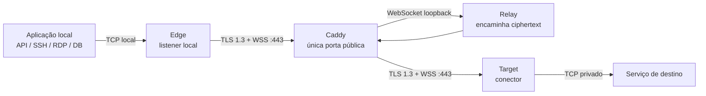

# Manual do usuário do MoleX

[English](user-guide.md) | [简体中文](user-guide.zh-CN.md) | [繁體中文](user-guide.zh-TW.md) | [Español](user-guide.es.md) | **Português (Brasil)** | [Français](user-guide.fr.md) | [Deutsch](user-guide.de.md) | [日本語](user-guide.ja.md) | [한국어](user-guide.ko.md) | [Русский](user-guide.ru.md) | [العربية](user-guide.ar.md) | [हिन्दी](user-guide.hi.md)

> Limite atual: o MoleX transporta **TCP** com segurança. HTTP, HTTPS/API, SSH, RDP e bancos de dados sobre TCP funcionam. UDP, QUIC/HTTP/3 e ICMP não têm suporte nativo. A WebUI oferece atualmente inglês e chinês simplificado; este documento é a versão em português.

## 1. Projeto e marca

MoleX é um hub de trânsito TCP seguro, escrito em Go e distribuído como um único binário. Edge e Target iniciam conexões de saída para o mesmo endpoint WSS. Normalmente o Caddy expõe apenas `443/tcp`. Relay reúne os pares e copia ciphertext opaco; ele nunca recebe o segredo de payload ponta a ponta.

`MoleX` é pronunciado `/moʊl ɛks/`. **Mole** remete a uma toupeira criando túneis fora de vista; **X** representa Xfer/Transfer, cruzamento e troca entre dois pontos. Frase sugerida: **The single-port secure transit hub. One port. Two peers. One secure route.** O nome não promete anonimato ou invisibilidade. A licença MIT cobre o código, mas não concede automaticamente direitos sobre nome, logotipo ou marcas; verifique a disponibilidade antes da publicação pública.

## 2. Arquitetura



| Papel | Função |
| --- | --- |
| Relay | Faz o rendezvous de Edge e Target e retransmite apenas ciphertext |
| Edge | Abre o listener TCP local somente quando a rota autenticada está pronta |
| Target | Aceita streams yamux e conecta cada um a `tunnel.local` |

Cada conexão TCP local corresponde a um stream yamux. X25519, HKDF-SHA256 e AES-256-GCM protegem o payload dentro do TLS 1.3. Uma rota aceita no máximo 256 streams simultâneos.

## 3. Valores sensíveis

| Valor | Onde usar | Finalidade |
| --- | --- | --- |
| Senha Web | Uma diferente em cada nó | Login da WebUI; não fica em `molex.json` |
| Relay token | Igual em Relay, Edge e Target | Admissão WSS; não é a chave do payload |
| End-to-end secret | Igual somente no par Edge/Target | Autenticação e criptografia; Relay não recebe |
| Channel | Igual no par Edge/Target | Nome lógico de rendezvous, não uma porta pública |

Nunca coloque senhas, tokens, secrets, API keys, cookies ou valores CSRF em capturas, logs, chamados, nomes de nó ou repositórios públicos.

## 4. Implantação rápida

### Relay

```bash
molex config init --mode relay --config relay.json
```

```json
{
  "mode": "relay",
  "token": "mx1_REPLACE_WITH_RANDOM_RELAY_TOKEN",
  "listen": "127.0.0.1:8080",
  "tunnel": {}
}
```

Publique somente `/ws/session` com Caddy:

```caddyfile
molex.example.com {
    @molex_session {
        path /ws/session
        header Connection *Upgrade*
        header Upgrade websocket
    }
    handle @molex_session {
        reverse_proxy 127.0.0.1:8080
    }
    handle {
        respond "Hello, world." 200
    }
}
```

Não adicione CORS curinga nem force manualmente headers Upgrade no upstream.

### Edge

```json
{
  "mode": "punch",
  "role": "edge",
  "secret": "mx1_SAME_END_TO_END_SECRET_ON_BOTH_CLIENTS",
  "token": "mx1_SAME_RELAY_TOKEN_ON_ALL_THREE_NODES",
  "listen": "127.0.0.1:2222",
  "remote": "wss://molex.example.com/ws/session",
  "tunnel": {
    "remote": "home-ssh",
    "name": "office-edge"
  }
}
```

### Target

```json
{
  "mode": "punch",
  "role": "target",
  "secret": "mx1_SAME_END_TO_END_SECRET_ON_BOTH_CLIENTS",
  "token": "mx1_SAME_RELAY_TOKEN_ON_ALL_THREE_NODES",
  "remote": "wss://molex.example.com/ws/session",
  "tunnel": {
    "local": "127.0.0.1:22",
    "remote": "home-ssh",
    "name": "home-target"
  }
}
```

`secret`, `token`, `remote` e `tunnel.remote` devem coincidir em Edge e Target. Os papéis devem ser complementares. Somente Edge usa `listen`; somente Target usa `tunnel.local`.

Valide e inicie em cada máquina:

```bash
molex config check --config relay.json
molex config check --config edge.json
molex config check --config target.json

molex web --config relay.json  --password-file ./web-password --autostart
molex web --config target.json --password-file ./web-password --autostart
molex web --config edge.json   --password-file ./web-password --autostart
```

A gestão escuta apenas em `127.0.0.1:9090`. Para acesso remoto ocasional:

```bash
ssh -N -L 9090:127.0.0.1:9090 user@molex-host
```

Abra `http://127.0.0.1:9090` localmente. Para acesso contínuo, use um reverse proxy HTTPS separado.

## 5. WebUI ilustrada


O cabeçalho alterna inglês/chinês simplificado, tema do sistema/claro/escuro e encerra a sessão. Para editar uma rota em execução: **Stop**, altere, **Save**, **Start**.


Relay mostra nome, IP confiável, papel, status, endpoint encaminhado, Route ID pseudônimo, peer, plataforma, tempo online e bytes/frames cifrados. Route ID não é o channel nem uma chave.


Edge não abre o listener antes de um Target autenticado ser pareado. `Not listening` durante queda de rota é uma proteção esperada.


Target service deve ser um endereço TCP acessível pela máquina Target.

## 6. Receitas de uso

| Cenário | Target `tunnel.local` | Edge `listen` | Uso local |
| --- | --- | --- | --- |
| SSH | `127.0.0.1:22` | `127.0.0.1:2222` | `ssh -p 2222 user@127.0.0.1` |
| RDP | `127.0.0.1:3389` | `127.0.0.1:13389` | `mstsc /v:127.0.0.1:13389` |
| API HTTP | `127.0.0.1:8080` | `127.0.0.1:18080` | `curl http://127.0.0.1:18080/health` |
| PostgreSQL | `127.0.0.1:5432` | `127.0.0.1:15432` | `psql -h 127.0.0.1 -p 15432` |
| MySQL | `127.0.0.1:3306` | `127.0.0.1:13306` | `mysql -h 127.0.0.1 -P 13306` |
| Redis | `127.0.0.1:6379` | `127.0.0.1:16379` | `redis-cli -h 127.0.0.1 -p 16379` |
| OpenAI/HTTPS | `api.openai.com:443` | `127.0.0.1:18443` | Preserve o hostname TLS |

MoleX não interpreta HTTP e não altera Host, caminho, headers ou body.

### OpenAI e HTTPS

Use o channel `openai-api`, Target `api.openai.com:443` e Edge `127.0.0.1:18443`. Não acesse diretamente `https://127.0.0.1:18443`, pois a validação do certificado falhará.

```bash
curl --connect-to api.openai.com:443:127.0.0.1:18443 \
  https://api.openai.com/v1/models \
  -H "Authorization: Bearer $OPENAI_API_KEY"
```

`--connect-to` muda apenas o destino TCP; URL, SNI e hostname do certificado continuam `api.openai.com`. Guarde a API key no ambiente ou secret manager da aplicação, nunca na configuração MoleX. O IP de saída será o da rede Target; respeite termos do provedor e disponibilidade regional.

### Vários serviços

Um processo cliente gerencia uma rota. Use configurações, channels, portas Edge e processos separados para SSH, banco e API. Todos compartilham `wss://molex.example.com/ws/session`, mantendo apenas `443/tcp` público. WebUIs múltiplas precisam de portas loopback diferentes (`9090`, `9091`, `9092`).

## 7. UDP

UDP não é suportado atualmente. A implementação usa listeners TCP e streams yamux, sem limites de datagrama, mapeamento de origem ou expiração de flows UDP. DNS UDP, QUIC/HTTP/3, jogos, VoIP, NTP, SNMP traps e ICMP não podem ser encaminhados diretamente.

- DNS: use TCP/53, DoH ou DoT.
- HTTP/3: force HTTP/1.1 ou HTTP/2 sobre TCP.
- Syslog: use TCP syslog.
- Jogos, VoIP e QUIC: use WireGuard, Tailscale ou outro túnel UDP nativo.

Uma futura opção `tunnel.protocol: "udp"` poderia preservar datagramas dentro de streams cifrados, mas WSS/TCP ainda causaria head-of-line blocking. Isso serviria para DNS ou monitoramento leve, não para tempo real. Considere MoleX TCP-only até anúncio explícito em release notes.

## 8. Reconexão e diagnóstico

- Backoff de aproximadamente 1 a 15 segundos, com 20% de jitter; reset após 30 segundos saudáveis.
- Uma queda fecha conexões TCP antigas; a aplicação deve reconectar.
- `401/403`: iguale `token` nos três nós.
- `404`: confira `/ws/session` e o matcher Caddy.
- `502/503/504`: inicie Relay e revise o upstream.
- Pairing timeout: confira peer, channel, secret, token e papéis complementares.
- Address in use: libere ou mude o listener Edge.
- Target unavailable: inicie o serviço e confira `tunnel.local`.

## 9. Segurança e licença MIT

Exponha apenas Caddy `443/tcp`. Mantenha Relay em `127.0.0.1:8080` e WebUI em `127.0.0.1:9090`. Use WSS com certificado válido, tokens e secrets aleatórios independentes, contas de menor privilégio e ACLs privadas. Mantenha Edge em loopback sem um projeto explícito de firewall e autenticação.

MoleX usa a [MIT License](../LICENSE): é permitido usar, copiar, modificar, mesclar, publicar, distribuir, sublicenciar e vender o software mantendo os avisos de copyright e licença. O software é fornecido “como está”, sem garantia. A licença não concede automaticamente direitos sobre nome, logotipo ou marcas de terceiros.
