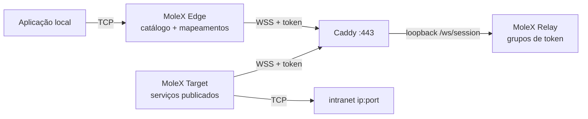
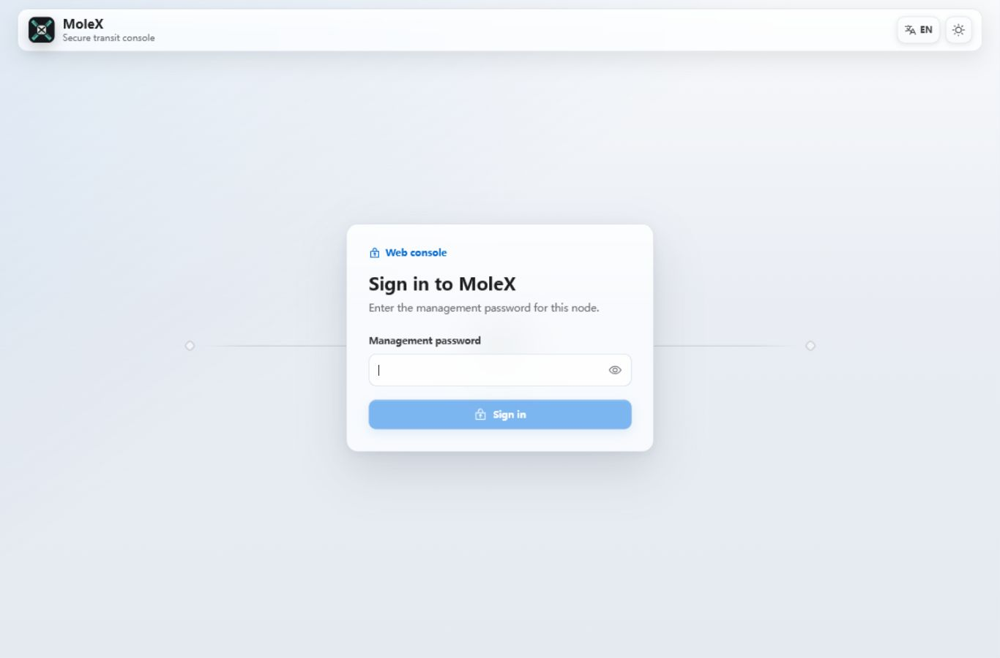
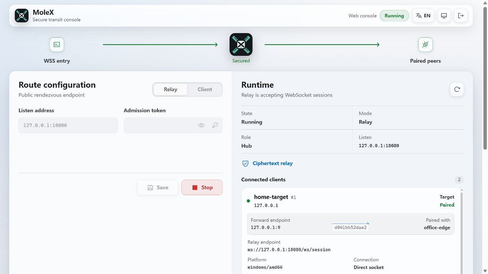
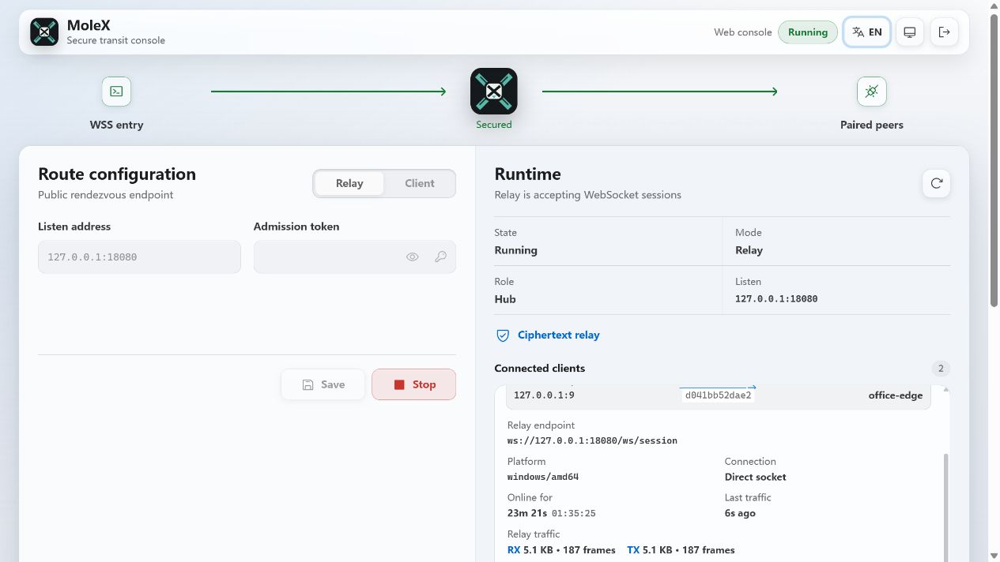
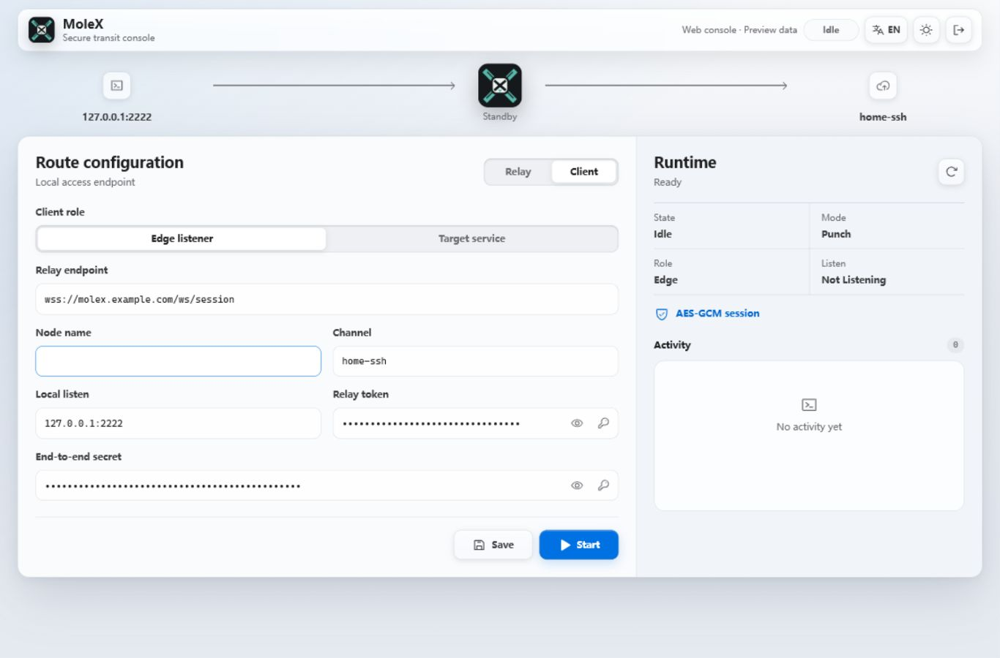

# Guia do usuário MoleX

[English](user-guide.md) | [简体中文](user-guide.zh-CN.md) | [繁體中文](user-guide.zh-TW.md) | [Español](user-guide.es.md) | **Português (Brasil)** | [Français](user-guide.fr.md) | [Deutsch](user-guide.de.md) | [日本語](user-guide.ja.md) | [한국어](user-guide.ko.md) | [Русский](user-guide.ru.md) | [العربية](user-guide.ar.md) | [हिन्दी](user-guide.hi.md)

Este guia cobre o primeiro deploy e o dia a dia. As capturas vêm de um console real; endereços, IDs e contadores são ilustrativos. Tokens permanecem mascarados. A interface do console está em inglês e chinês simplificado; este documento é o guia operacional em português.

> MoleX encaminha apenas **TCP**: HTTP, HTTPS, APIs, SSH, RDP e bancos de dados. Não transporta UDP nativo, QUIC/HTTP/3 nem ICMP. Veja [status de UDP](#7-status-de-udp-e-alternativas).

v1 (`mode: "punch"` com `role` / `secret` / `channel` / `tunnel`) não é aceito. Recrie os arquivos com `molex config init --mode relay|target|edge`. Veja o [guia de atualização](upgrade-guide.md).

## 1. Visão do projeto

MoleX é um hub TCP seguro em um único binário. Um token de acesso define um grupo: exatamente um Target e qualquer número de Edges. O Target publica serviços de intranet `ip:port`; cada Edge mapeia os que precisa para portas locais. Edge e Target discam o mesmo endereço WSS público. O Caddy normalmente expõe só `443/tcp`.

O Relay admite clientes por token, agrupa-os e copia texto cifrado opaco. O Relay distribuído nunca descriptografa o payload. Quem possui os tokens está dentro do perímetro de confiança; trate um token como uma chave privada SSH. Detalhes: [modelo de segurança](security.md).

Destaques:

- Um token, um Target, qualquer número de Edges. Um segundo Target no mesmo token é recusado.
- Um processo Target ou Edge pode entrar em vários tokens. Serviços podem ser limitados a grupos escolhidos.
- O catálogo do Target sincroniza ao vivo. O Edge abre um listener de mapeamento só quando a rota está pronta e o serviço publicado.
- A proteção do payload é X25519 + HKDF-SHA256 + AES-256-GCM dentro de TLS 1.3. O PSK deriva do token.
- Console Relay: login com senha, criar / rotacionar / desativar / excluir tokens, auditoria, peers ao vivo.
- Consoles Target e Edge: sem login, só loopback, same-origin e CSRF.
- Retentativas com backoff limitado e jitter, de cerca de 1 s a 15 s.

Linha de marca sugerida: **MoleX — The single-port secure transit hub.**

## 2. Papéis e caminho do tráfego



| Papel | Onde | Comportamento | Entrada pública |
| --- | --- | --- | --- |
| Relay | Hostname público | Admite tokens, emparelha um Target com N Edges, copia cifrado | Só Caddy `443/tcp` |
| Target | Host que alcança os backends | Publica um catálogo; disca só esses endereços | Nenhuma; só WSS de saída |
| Edge | Host que usa os serviços | Mapeia serviços publicados para portas locais | Loopback por padrão; bind LAN opcional |

```text
app TCP -> mapeamento Edge -> yamux (preâmbulo service-id) -> AES-256-GCM -> WSS
        -> cópia de cifrado do Relay -> discagem com allowlist do Target -> TCP do backend
```

## 3. Antes de começar

- Um servidor público para Relay e Caddy, hostname como `molex.example.com`.
- Uma máquina Target que alcance os serviços de intranet.
- Uma ou mais máquinas Edge.
- Só `443/tcp` público. Plano de dados do Relay e todos os consoles Web em loopback.

Build a partir do código (Go 1.25+, Node.js 20+):

```bash
cd frontend
npm ci
npm run build
cd ..
go build -trimpath -ldflags "-s -w -X main.version=0.4.0" -o bin/molex .
```

No Windows o binário é `bin/molex.exe`.

### 3.1 Credenciais

| Valor | Quem usa | Propósito |
| --- | --- | --- |
| Senha Web | Só o console Relay (≥12 caracteres) | Login de administração. Não fica em `molex.json`. |
| Token de acesso | O Relay emite; Target e Edge apresentam | Admissão, agrupamento e origem da chave ponta a ponta (`mx2_` + 32 bytes aleatórios). |

Não coloque senhas, tokens, chaves de API, cookies ou valores CSRF em capturas, logs, nomes de nó ou repositório público. A auditoria guarda só ids de token.

## 4. Deploy em cinco minutos

### 4.1 Relay

```bash
molex config init --mode relay --config relay.json
molex web --config relay.json --password-file ./web-password --autostart
```

Entre, crie um token (nota como `office-nas`), revele e copie. O plano de dados escuta em `127.0.0.1:8080`. O console prefere `127.0.0.1:9090`.

```json
{
  "mode": "relay",
  "listen": "127.0.0.1:8080",
  "tokens": [
    { "id": "tok-example", "token": "mx2_generated-value", "note": "office" }
  ]
}
```

### 4.2 Caddy

```caddyfile
molex.example.com {
    @molex_session {
        path /ws/session
        header Connection *Upgrade*
        header Upgrade websocket
    }
    handle @molex_session {
        reverse_proxy 127.0.0.1:8080
    }
    handle {
        respond "Hello, world." 200
    }
}

admin.molex.example.com {
    reverse_proxy 127.0.0.1:9090
}
```

Não adicione CORS curinga. Exemplo completo: [deploy com Caddy](deployment-caddy.md).

### 4.3 Target

Na máquina que alcança os backends:

```bash
molex web
```

Escolha **Target**, cole a URL WSS e o token, inicie e adicione serviços (por exemplo `10.188.200.16:30927`). Salvar publica o catálogo imediatamente.

```json
{
  "mode": "target",
  "remote": "wss://molex.example.com/ws/session",
  "token": "mx2_generated-value",
  "name": "home-target",
  "services": [
    { "id": "svc-web", "name": "web", "address": "10.188.200.16:30927" },
    { "id": "svc-ssh", "name": "ssh", "address": "127.0.0.1:22" }
  ]
}
```

Para entrar em dois grupos num processo, use `tokens` em vez de `token` e `services[].groups` para restringir a visibilidade:

```json
{
  "mode": "target",
  "remote": "wss://molex.example.com/ws/session",
  "tokens": [
    { "id": "office", "token": "mx2_office-token" },
    { "id": "lab", "token": "mx2_lab-token" }
  ],
  "services": [
    { "id": "svc-web", "name": "web", "address": "10.188.200.16:30927", "groups": ["office"] }
  ]
}
```

`groups` vazio significa todos os grupos aos quais este Target entrou.

### 4.4 Edge

```bash
molex web
```

Escolha **Edge**, cole a mesma URL WSS e o token, inicie. Marque um serviço publicado; o console sugere uma porta local livre. Ative **LAN visível** só quando outros dispositivos dessa rede precisarem conectar (`0.0.0.0`).

```json
{
  "mode": "edge",
  "remote": "wss://molex.example.com/ws/session",
  "token": "mx2_generated-value",
  "name": "office-edge",
  "mappings": [
    { "service": "svc-web", "port": 28080 },
    { "service": "svc-ssh", "port": 2222 }
  ]
}
```

Com vários grupos, cada mapeamento precisa de `group`.

### 4.5 Validar e iniciar sem navegador

```bash
molex config check --config relay.json
molex config check --config target.json
molex config check --config edge.json

molex serve   --config relay.json
molex connect --config target.json
molex connect --config edge.json
```

Consoles Target e Edge não pedem senha. Acesso remoto a qualquer console usa SSH ou HTTPS:

```bash
ssh -N -L 9090:127.0.0.1:9090 user@molex-host
```

## 5. Percurso do console Web

### 5.1 Login do Relay



Só o console Relay pede senha. A primeira execução a cria. Idioma e tema estão em todos os consoles. Target e Edge pulam esta tela.

### 5.2 Relay: tokens e clientes



- Criar, revelar/copiar, desativar, excluir e **rotacionar** tokens. A rotação mantém o valor anterior válido por 1–30 dias (padrão 3).
- Ações administrativas vão para um JSONL de auditoria ao lado da configuração (só ids de token).
- «Listen address» é o plano de dados, não o console Web.
- Clientes conectados mostram nome, papel, token id, plataforma, tempo online e RX/TX de cifrado. O rótulo «N services / N mappings» atualiza quando o catálogo ou os mapeamentos mudam.



Desconectar expulsa um cliente; ele reconecta com backoff a menos que o token esteja desativado.

### 5.3 Target


Preencha o endereço WSS e um ou mais tokens. Adicione serviços como `name` + `host:port`. Com vários grupos, marque quais podem ver cada serviço. Salvar aplica ao vivo. O último erro de discagem fica só naquele serviço.

### 5.4 Edge



Depois de iniciar, o catálogo aparece. Marque um serviço para mapeá-lo. Listeners existem só enquanto a rota está pronta e o serviço continua publicado. «Waiting» durante uma queda é esperado.

## 6. Receitas comuns

Publique o backend no Target e depois mapeie no Edge. Um processo Target pode publicar todos os serviços abaixo.

| Cenário | Endereço do serviço Target | Porta local Edge | Comando local |
| --- | --- | --- | --- |
| SSH | `127.0.0.1:22` | `2222` | `ssh -p 2222 user@127.0.0.1` |
| Windows RDP | `127.0.0.1:3389` | `13389` | `mstsc /v:127.0.0.1:13389` |
| HTTP API | `127.0.0.1:8080` | `18080` | `curl http://127.0.0.1:18080/health` |
| PostgreSQL | `127.0.0.1:5432` | `15432` | `psql -h 127.0.0.1 -p 15432` |
| MySQL | `127.0.0.1:3306` | `13306` | `mysql -h 127.0.0.1 -P 13306` |
| Redis | `127.0.0.1:6379` | `16379` | `redis-cli -h 127.0.0.1 -p 16379` |
| HTTPS API | `api.openai.com:443` | `18443` | Mantenha o hostname TLS (abaixo) |

Não coloque usuários, chaves de API ou nomes de clientes em nomes de serviço ou de nó.

### 6.1 HTTP API

```bash
curl http://127.0.0.1:18080/health
```

MoleX não interpreta HTTP. WebSocket é só o caminho de dados do MoleX.

### 6.2 HTTPS / API compatível com OpenAI

Não abra `https://127.0.0.1:18443` diretamente; a verificação do hostname do certificado falha. Aponte o TCP para o Edge e mantenha o hostname original:

```bash
curl --connect-to api.openai.com:443:127.0.0.1:18443 \
  https://api.openai.com/v1/models \
  -H "Authorization: Bearer $OPENAI_API_KEY"
```

Guarde a chave de API no ambiente da aplicação, nunca na configuração do MoleX. A saída usa o IP público da rede do Target. Siga os termos do provedor.

### 6.3 SSH e RDP

```bash
ssh -p 2222 user@127.0.0.1
scp -P 2222 ./file user@127.0.0.1:/tmp/
```

```powershell
mstsc /v:127.0.0.1:13389
```

SSH e Windows continuam donos da autenticação. Não vincule o Edge a `0.0.0.0` sem um plano de firewall.

### 6.4 Vários serviços, um processo

Publique todos os backends em um Target. Mapeie os necessários em cada Edge. Todas as sessões ainda usam `wss://molex.example.com/ws/session`, então a superfície pública continua um `443/tcp`. Vários consoles Web no mesmo host escolhem portas loopback distintas a partir de `9090`; fixe-as se precisar de encaminhamentos SSH estáveis.

## 7. Status de UDP e alternativas

MoleX não tem socket UDP nem framing de datagrama. Não transporta DNS UDP, QUIC/HTTP/3, jogos, VoIP, NTP nem ICMP.

| Necessidade | Recomendação |
| --- | --- |
| DNS | TCP/53, DoH ou DoT, e então encaminhe esse serviço TCP |
| API HTTP/3 | Force HTTP/1.1 ou HTTP/2 sobre TCP |
| Syslog | Syslog TCP |
| Jogos, VoIP, QUIC | WireGuard, Tailscale ou outro túnel UDP nativo |

## 8. CLI

```bash
molex serve   --config ./relay.json
molex connect --config ./target.json
molex connect --config ./edge.json --remote wss://molex.example.com/ws/session --token "$MOLEX_TOKEN"
molex web     --config ./molex.json --password-file ./web-password --autostart
molex config init  --config ./molex.json --mode relay|target|edge
molex config check --config ./molex.json
molex version
```

Tokens na linha de comando podem aparecer no histórico do shell. Prefira um arquivo de configuração protegido. No Linux, mantenha o plano de dados com `deploy/molex-relay.service`; sem systemd use `deploy/molex-keepalive.sh`.

## 9. Comportamento em execução

- Edge e Target só discam WSS de saída.
- Listeners de mapeamento existem só enquanto a rota está pronta e o serviço publicado.
- Backoff: cerca de 1 s → 15 s, jitter ±20 %, redefine após 30 s saudáveis.
- Rotas quebradas fecham os fluxos TCP existentes; as aplicações devem retentar.
- No máximo 256 fluxos concorrentes por processo Edge / sessão Target.
- Target duplicado: recusado com motivo de fechamento claro. Desativar/excluir o token desconecta o grupo. A rotação mantém o valor antigo na janela de graça.

## 10. Solução de problemas

| Resultado | Ação |
| --- | --- |
| HTTP `401` | Copie o token atual do console Relay. Após rotacionar, migre antes do fim da graça. |
| HTTP `403` | O token está desativado. Peça ao operador do Relay para ativá-lo ou emitir um novo. |
| HTTP `404` | A URL deve terminar em `/ws/session`; o Caddy deve encaminhar esse caminho. |
| HTTP `502`/`503`/`504` | Inicie o Relay; verifique o upstream do Caddy `127.0.0.1:8080`. |
| Target duplicado | Pare o outro Target ou use outro token. |
| Tempo de emparelhamento esgotado | Inicie o Target deste token. Os dois lados devem rodar MoleX v2 com o mesmo token. |
| Mapeamento aguardando | Target offline ou serviço retirado; retoma sozinho. |
| Porta em uso | Pare o ocupante ou escolha outra porta; só esse mapeamento é afetado. |
| Serviço indisponível | Inicie o backend ou corrija o endereço do Target. |
| Não está escutando | Esperado em idle, connecting ou stopping. |

```bash
curl --fail http://127.0.0.1:8080/healthz
curl --fail http://127.0.0.1:9090/healthz
```

## 11. Checklist de produção

- Público: só Caddy `443/tcp`.
- Dados do Relay `127.0.0.1:8080`, consoles `127.0.0.1:9090`.
- WSS remoto precisa de certificado válido. `ws://` simples é só loopback.
- Gere tokens no console Relay. Rotacione com a janela de graça e atualize todos os Target e Edge.
- Um token por grupo de confiança. Restrinja serviços do Target com `groups` quando um processo atende vários grupos.
- Conta de serviço com menor privilégio; ACL privada na configuração.
- Mapeamentos loopback por padrão; bind LAN por mapeamento só quando necessário.
- Ative reconexão na aplicação. MoleX não retoma um fluxo TCP antigo depois que a rota é reconstruída.

Veja [arquitetura](architecture.md), [deploy com Caddy](deployment-caddy.md) e [segurança](security.md).

## 12. Licença MIT

MoleX é distribuído sob a [licença MIT](../LICENSE). O software é fornecido «como está». A licença cobre o código, não o nome do projeto, o logotipo nem marcas de terceiros, e não substitui as obrigações legais e de termos de serviço do operador.
