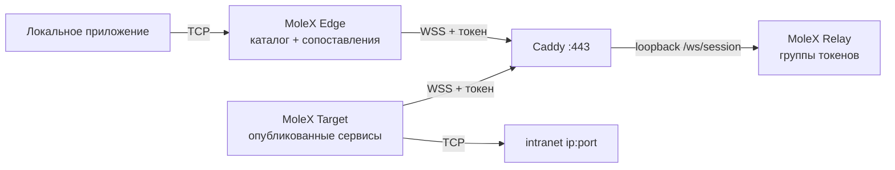

# Руководство пользователя MoleX

[English](user-guide.md) | [简体中文](user-guide.zh-CN.md) | [繁體中文](user-guide.zh-TW.md) | [Español](user-guide.es.md) | [Português (Brasil)](user-guide.pt-BR.md) | [Français](user-guide.fr.md) | [Deutsch](user-guide.de.md) | [日本語](user-guide.ja.md) | [한국어](user-guide.ko.md) | **Русский** | [العربية](user-guide.ar.md) | [हिन्दी](user-guide.hi.md)

Это руководство для первого развёртывания и повседневной эксплуатации. Снимки экрана сняты с настоящей консоли; адреса, идентификаторы и счётчики — примеры. Токены всегда скрыты. Интерфейс консоли — английский и упрощённый китайский; этот документ — русская операционная инструкция.

> MoleX передаёт только **TCP**: HTTP, HTTPS, API, SSH, RDP и базы данных. Нативный UDP, QUIC/HTTP/3 и ICMP не поддерживаются. См. [состояние UDP](#7-состояние-udp-и-альтернативы).

v1 (`mode: "punch"` с `role` / `secret` / `channel` / `tunnel`) не принимается. Пересоздайте файлы командой `molex config init --mode relay|target|edge`. См. [руководство по обновлению](upgrade-guide.md).

## 1. Обзор проекта

MoleX — безопасный TCP-хаб в одном двоичном файле. Один токен доступа задаёт группу: ровно один Target и любое число Edge. Target публикует intranet-сервисы `ip:port`; каждый Edge сопоставляет нужные с локальными портами. Edge и Target сами подключаются к одному публичному WSS. Caddy обычно открывает только `443/tcp`.

Relay допускает клиентов по токену, группирует их и копирует непрозрачный шифротекст. Поставляемый Relay никогда не расшифровывает нагрузку. Оператор, у которого есть токены, находится внутри границы доверия; относитесь к токену как к закрытому ключу SSH. Подробности: [модель безопасности](security.md).

Основные свойства:

- Один токен, один Target, любое число Edge. Второй Target на том же токене отклоняется.
- Один процесс Target или Edge может войти в несколько токенов. Видимость сервисов можно ограничить выбранными группами.
- Каталог Target синхронизируется вживую. Edge открывает слушатель сопоставления только когда маршрут готов и сервис опубликован.
- Защита нагрузки — X25519 + HKDF-SHA256 + AES-256-GCM внутри TLS 1.3. PSK выводится из токена.
- Консоль Relay: вход по паролю, создание / ротация / отключение / удаление токенов, аудит, живые пиры.
- Консоли Target и Edge: без входа, только loopback, same-origin и CSRF.
- Повторы клиентов с ограниченным backoff и джиттером, примерно от 1 с до 15 с.

Брендовая строка: **MoleX — The single-port secure transit hub.**

## 2. Роли и путь трафика



| Роль | Где | Поведение | Публичный вход |
| --- | --- | --- | --- |
| Relay | Публичное имя хоста | Допускает токены, связывает один Target с N Edge, копирует шифротекст | Только Caddy `443/tcp` |
| Target | Хост, который достаёт до бэкендов | Публикует каталог; набирает только эти адреса | Нет; только исходящий WSS |
| Edge | Хост, который пользуется сервисами | Сопоставляет опубликованные сервисы с локальными портами | По умолчанию loopback; опционально LAN |

```text
приложение TCP -> сопоставление Edge -> yamux (преамбула service-id) -> AES-256-GCM -> WSS
        -> копия шифротекста Relay -> набор Target по белому списку -> TCP бэкенда
```

## 3. Перед началом

- Публичный сервер для Relay и Caddy, имя вроде `molex.example.com`.
- Машина Target, которая достаёт до intranet-сервисов.
- Одна или несколько машин Edge.
- Публично только `443/tcp`. Плоскость данных Relay и все веб-консоли — на loopback.

Сборка из исходников (Go 1.25+, Node.js 20+):

```bash
cd frontend
npm ci
npm run build
cd ..
go build -trimpath -ldflags "-s -w -X main.version=0.4.0" -o bin/molex .
```

В Windows получается `bin/molex.exe`.

### 3.1 Учётные данные

| Значение | Кто использует | Назначение |
| --- | --- | --- |
| Веб-пароль | Только консоль Relay (≥12 символов) | Вход в управление. Не хранится в `molex.json`. |
| Токен доступа | Выдаёт Relay; предъявляют Target и Edge | Допуск, группировка и источник ключа «конец–конец» (`mx2_` + 32 случайных байта). |

Не помещайте пароли, токены, ключи API, cookie и CSRF в снимки, журналы, имена узлов или публичный репозиторий. Аудит хранит только id токенов.

## 4. Развёртывание за пять минут

### 4.1 Relay

```bash
molex config init --mode relay --config relay.json
molex web --config relay.json --password-file ./web-password --autostart
```

Войдите, создайте токен (заметка вроде `office-nas`), покажите и скопируйте. Плоскость данных слушает `127.0.0.1:8080`. Консоль предпочитает `127.0.0.1:9090`.

```json
{
  "mode": "relay",
  "listen": "127.0.0.1:8080",
  "tokens": [
    { "id": "tok-example", "token": "mx2_generated-value", "note": "office" }
  ]
}
```

### 4.2 Caddy

```caddyfile
molex.example.com {
    @molex_session {
        path /ws/session
        header Connection *Upgrade*
        header Upgrade websocket
    }
    handle @molex_session {
        reverse_proxy 127.0.0.1:8080
    }
    handle {
        respond "Hello, world." 200
    }
}

admin.molex.example.com {
    reverse_proxy 127.0.0.1:9090
}
```

Не добавляйте универсальный CORS. Полный пример: [развёртывание Caddy](deployment-caddy.md).

### 4.3 Target

На машине, которая достаёт до бэкендов:

```bash
molex web
```

Выберите **Target**, вставьте WSS URL и токен, запустите, затем добавьте сервисы (например `10.188.200.16:30927`). Сохранение сразу публикует каталог.

```json
{
  "mode": "target",
  "remote": "wss://molex.example.com/ws/session",
  "token": "mx2_generated-value",
  "name": "home-target",
  "services": [
    { "id": "svc-web", "name": "web", "address": "10.188.200.16:30927" },
    { "id": "svc-ssh", "name": "ssh", "address": "127.0.0.1:22" }
  ]
}
```

Чтобы войти в две группы одним процессом, используйте `tokens` вместо `token` и ограничьте видимость через `services[].groups`:

```json
{
  "mode": "target",
  "remote": "wss://molex.example.com/ws/session",
  "tokens": [
    { "id": "office", "token": "mx2_office-token" },
    { "id": "lab", "token": "mx2_lab-token" }
  ],
  "services": [
    { "id": "svc-web", "name": "web", "address": "10.188.200.16:30927", "groups": ["office"] }
  ]
}
```

Пустой `groups` означает все группы, в которые вошёл этот Target.

### 4.4 Edge

```bash
molex web
```

Выберите **Edge**, вставьте тот же WSS и токен, запустите. Отметьте опубликованный сервис; консоль предложит свободный локальный порт. Включайте **LAN visible** только если другие устройства этой сети должны подключаться (`0.0.0.0`).

```json
{
  "mode": "edge",
  "remote": "wss://molex.example.com/ws/session",
  "token": "mx2_generated-value",
  "name": "office-edge",
  "mappings": [
    { "service": "svc-web", "port": 28080 },
    { "service": "svc-ssh", "port": 2222 }
  ]
}
```

При нескольких группах у каждого сопоставления должен быть `group`.

### 4.5 Проверка и запуск без браузера

```bash
molex config check --config relay.json
molex config check --config target.json
molex config check --config edge.json

molex serve   --config relay.json
molex connect --config target.json
molex connect --config edge.json
```

Консоли Target и Edge пароль не спрашивают. Удалённый доступ к любой консоли — через SSH или HTTPS:

```bash
ssh -N -L 9090:127.0.0.1:9090 user@molex-host
```

## 5. Обзор веб-консоли

### 5.1 Вход Relay


Пароль спрашивает только консоль Relay. Первый запуск его создаёт. Язык и тема есть на всех консолях. Target и Edge этот экран пропускают.

### 5.2 Relay: токены и клиенты


- Создание, показ/копирование, отключение, удаление и **ротация** токенов. После ротации старое значение действует 1–30 дней (по умолчанию 3).
- Административные действия пишутся в JSONL-аудит рядом с конфигурацией (только id токенов).
- «Listen address» — плоскость данных, не веб-консоль.
- Подключённые клиенты показывают имя, роль, id токена, платформу, время работы и RX/TX шифротекста. Метка «N services / N mappings» обновляется при изменении каталога или сопоставлений.


Отключение выкидывает одного клиента; он переподключается с backoff, если токен не отключён.

### 5.3 Target


Заполните WSS и один или несколько токенов. Сервисы — `name` + `host:port`. При нескольких группах отметьте, каким группам виден каждый сервис. Сохранение применяется сразу. Последняя ошибка набора остаётся только у этого сервиса.

### 5.4 Edge


После запуска появляется каталог. Отметьте сервис, чтобы сопоставить его. Слушатели существуют только пока маршрут готов и сервис опубликован. «Waiting» во время сбоя — ожидаемое поведение.

## 6. Типовые сценарии

Опубликуйте бэкенд на Target, затем сопоставьте на Edge. Один процесс Target может опубликовать все сервисы ниже.

| Сценарий | Адрес сервиса Target | Локальный порт Edge | Локальная команда |
| --- | --- | --- | --- |
| SSH | `127.0.0.1:22` | `2222` | `ssh -p 2222 user@127.0.0.1` |
| Windows RDP | `127.0.0.1:3389` | `13389` | `mstsc /v:127.0.0.1:13389` |
| HTTP API | `127.0.0.1:8080` | `18080` | `curl http://127.0.0.1:18080/health` |
| PostgreSQL | `127.0.0.1:5432` | `15432` | `psql -h 127.0.0.1 -p 15432` |
| MySQL | `127.0.0.1:3306` | `13306` | `mysql -h 127.0.0.1 -P 13306` |
| Redis | `127.0.0.1:6379` | `16379` | `redis-cli -h 127.0.0.1 -p 16379` |
| HTTPS API | `api.openai.com:443` | `18443` | Сохраните TLS-имя хоста (ниже) |

Не вставляйте имена пользователей, ключи API и имена клиентов в имена сервисов или узлов.

### 6.1 HTTP API

```bash
curl http://127.0.0.1:18080/health
```

MoleX не разбирает HTTP. WebSocket — только путь данных самого MoleX.

### 6.2 HTTPS / API, совместимый с OpenAI

Не открывайте `https://127.0.0.1:18443` напрямую; проверка имени в сертификате не пройдёт. Направьте TCP на Edge, сохранив исходное имя хоста:

```bash
curl --connect-to api.openai.com:443:127.0.0.1:18443 \
  https://api.openai.com/v1/models \
  -H "Authorization: Bearer $OPENAI_API_KEY"
```

Ключ API держите в окружении приложения, не в конфигурации MoleX. Исходящий IP — публичный адрес сети Target. Соблюдайте условия провайдера.

### 6.3 SSH и RDP

```bash
ssh -p 2222 user@127.0.0.1
scp -P 2222 ./file user@127.0.0.1:/tmp/
```

```powershell
mstsc /v:127.0.0.1:13389
```

Аутентификацией по-прежнему владеют SSH и Windows. Не привязывайте Edge к `0.0.0.0` без плана межсетевого экрана.

### 6.4 Несколько сервисов, один процесс

Опубликуйте все бэкенды на одном Target. На каждом Edge сопоставьте нужные. Все сессии идут через `wss://molex.example.com/ws/session`, публичная поверхность остаётся одним `443/tcp`. Несколько веб-консолей на одном хосте выбирают разные loopback-порты начиная с `9090`; зафиксируйте их, если нужны стабильные SSH-пробросы.

## 7. Состояние UDP и альтернативы

У MoleX нет UDP-сокета и кадрирования датаграмм. Он не переносит UDP DNS, QUIC/HTTP/3, игры, VoIP, NTP и ICMP.

| Потребность | Рекомендация |
| --- | --- |
| DNS | TCP/53, DoH или DoT, затем переслать этот TCP-сервис |
| HTTP/3 API | Принудительно HTTP/1.1 или HTTP/2 поверх TCP |
| Syslog | TCP syslog |
| Игры, VoIP, QUIC | WireGuard, Tailscale или другой нативный UDP-туннель |

## 8. CLI

```bash
molex serve   --config ./relay.json
molex connect --config ./target.json
molex connect --config ./edge.json --remote wss://molex.example.com/ws/session --token "$MOLEX_TOKEN"
molex web     --config ./molex.json --password-file ./web-password --autostart
molex config init  --config ./molex.json --mode relay|target|edge
molex config check --config ./molex.json
molex version
```

Токены в командной строке могут попасть в историю оболочки. Лучше защищённый файл конфигурации. В Linux держите плоскость данных через `deploy/molex-relay.service`; без systemd используйте `deploy/molex-keepalive.sh`.

## 9. Поведение во время работы

- Edge и Target открывают только исходящий WSS.
- Слушатели сопоставления существуют только пока маршрут готов и сервис опубликован.
- Backoff: примерно 1 с → 15 с, джиттер ±20 %, сброс после 30 с здоровья.
- Обрыв маршрута закрывает существующие TCP; приложения должны повторить попытку.
- Не более 256 одновременных потоков на процесс Edge / сессию Target.
- Дублирующий Target отклоняется с понятной причиной закрытия. Отключение/удаление токена разрывает группу. Ротация сохраняет старое значение в окне льготы.

## 10. Устранение неполадок

| Результат | Действие |
| --- | --- |
| HTTP `401` | Скопируйте текущий токен из консоли Relay. После ротации перейдите до конца льготы. |
| HTTP `403` | Токен отключён. Попросите оператора Relay включить его или выдать новый. |
| HTTP `404` | URL должен заканчиваться на `/ws/session`; Caddy должен проксировать этот путь. |
| HTTP `502`/`503`/`504` | Запустите Relay; проверьте upstream Caddy `127.0.0.1:8080`. |
| Дублирующий Target | Остановите другой Target или возьмите другой токен. |
| Таймаут сопряжения | Запустите Target этого токена. Обе стороны должны быть MoleX v2 с одним токеном. |
| Сопоставление ждёт | Target офлайн или сервис снят; возобновится само. |
| Порт занят | Остановите занявший процесс или выберите другой порт; затронуто только это сопоставление. |
| Сервис недоступен | Запустите бэкенд или исправьте адрес Target. |
| Не слушает | Ожидаемо в idle, connecting или stopping. |

```bash
curl --fail http://127.0.0.1:8080/healthz
curl --fail http://127.0.0.1:9090/healthz
```

## 11. Производственный список

- Публично: только Caddy `443/tcp`.
- Данные Relay `127.0.0.1:8080`, консоли `127.0.0.1:9090`.
- Удалённый WSS требует действительный сертификат. Открытый `ws://` — только loopback.
- Генерируйте токены в консоли Relay. Ротируйте с окном льготы, затем обновите все Target и Edge.
- Один токен на группу доверия. Ограничивайте сервисы Target через `groups`, если один процесс обслуживает несколько групп.
- Учётная запись службы с минимальными правами; закрытый ACL на конфигурацию.
- По умолчанию loopback-сопоставления; LAN-привязка по каждому сопоставлению только при необходимости.
- Включите переподключение в приложении. MoleX не продолжает старый TCP-поток после пересборки маршрута.

См. [архитектуру](architecture.md), [развёртывание Caddy](deployment-caddy.md) и [безопасность](security.md).

## 12. Лицензия MIT

MoleX распространяется по [лицензии MIT](../LICENSE). Программа предоставляется «как есть». Лицензия покрывает код, но не имя проекта, логотип и чужие товарные знаки и не заменяет юридические обязанности и условия сервиса оператора.
