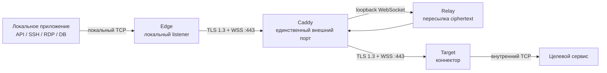

# Руководство пользователя MoleX

[English](user-guide.md) | [简体中文](user-guide.zh-CN.md) | [繁體中文](user-guide.zh-TW.md) | [Español](user-guide.es.md) | [Português (Brasil)](user-guide.pt-BR.md) | [Français](user-guide.fr.md) | [Deutsch](user-guide.de.md) | [日本語](user-guide.ja.md) | [한국어](user-guide.ko.md) | **Русский** | [العربية](user-guide.ar.md) | [हिन्दी](user-guide.hi.md)

> Текущие границы: MoleX безопасно передаёт **TCP**. Поддерживаются HTTP, HTTPS/API, SSH, RDP и базы данных поверх TCP. Нативной поддержки UDP, QUIC/HTTP/3 и ICMP сейчас нет. WebUI доступен на английском и упрощённом китайском; этот документ является русским руководством.

## 1. Проект и бренд

MoleX — безопасный TCP-транзитный узел на Go, распространяемый одним бинарным файлом. Edge и Target сами устанавливают исходящие соединения с одним WSS endpoint. Обычно Caddy публикует единственный внешний порт `443/tcp`. Relay сводит два peer и копирует непрозрачный ciphertext; он не получает end-to-end payload secret и не может расшифровать данные приложения.

`MoleX` произносится `/moʊl ɛks/`. **Mole** — крот, прокладывающий скрытый туннель; **X** — Xfer/Transfer, пересечение и обмен между двумя точками. Рекомендуемая фраза: **The single-port secure transit hub. One port. Two peers. One secure route.** Название не обещает анонимность или невидимость. MIT License относится к коду и не даёт автоматически прав на название, логотип или товарные знаки; перед публичным выпуском нужна отдельная проверка.

## 2. Архитектура



| Роль | Назначение |
| --- | --- |
| Relay | Сводит Edge и Target и пересылает только ciphertext |
| Edge | Открывает локальный TCP listener только после готовности аутентифицированного маршрута |
| Target | Принимает yamux streams и подключает каждый к `tunnel.local` |

Каждое локальное TCP-соединение соответствует одному yamux stream. Внутри TLS 1.3 payload защищён X25519, HKDF-SHA256 и AES-256-GCM. На маршрут допускается не более 256 одновременных streams.

## 3. Секретные значения

| Значение | Где используется | Назначение |
| --- | --- | --- |
| Web password | Отдельный на каждом узле | Вход в WebUI; не хранится в `molex.json` |
| Relay token | Одинаковый на Relay, Edge и Target | Допуск WSS; не является payload key |
| End-to-end secret | Одинаковый только на паре Edge/Target | Аутентификация и шифрование; Relay его не получает |
| Channel | Одинаковый на Edge/Target | Логическое имя rendezvous, не внешний порт |

Не помещайте пароли, tokens, secrets, API keys, cookies или CSRF-значения в screenshots, logs, обращения, имена узлов или публичные репозитории.

## 4. Быстрое развёртывание

### Relay

```bash
molex config init --mode relay --config relay.json
```

```json
{
  "mode": "relay",
  "token": "mx1_REPLACE_WITH_RANDOM_RELAY_TOKEN",
  "listen": "127.0.0.1:8080",
  "tunnel": {}
}
```

Публикуйте через Caddy только `/ws/session`:

```caddyfile
molex.example.com {
    @molex_session {
        path /ws/session
        header Connection *Upgrade*
        header Upgrade websocket
    }
    handle @molex_session {
        reverse_proxy 127.0.0.1:8080
    }
    handle {
        respond "Hello, world." 200
    }
}
```

Не добавляйте wildcard CORS и не задавайте upstream Upgrade headers вручную.

### Edge

```json
{
  "mode": "punch",
  "role": "edge",
  "secret": "mx1_SAME_END_TO_END_SECRET_ON_BOTH_CLIENTS",
  "token": "mx1_SAME_RELAY_TOKEN_ON_ALL_THREE_NODES",
  "listen": "127.0.0.1:2222",
  "remote": "wss://molex.example.com/ws/session",
  "tunnel": {
    "remote": "home-ssh",
    "name": "office-edge"
  }
}
```

### Target

```json
{
  "mode": "punch",
  "role": "target",
  "secret": "mx1_SAME_END_TO_END_SECRET_ON_BOTH_CLIENTS",
  "token": "mx1_SAME_RELAY_TOKEN_ON_ALL_THREE_NODES",
  "remote": "wss://molex.example.com/ws/session",
  "tunnel": {
    "local": "127.0.0.1:22",
    "remote": "home-ssh",
    "name": "home-target"
  }
}
```

На Edge и Target должны совпадать `secret`, `token`, `remote` и `tunnel.remote`, а роли должны быть взаимодополняющими. `listen` нужен только Edge, `tunnel.local` — только Target.

Проверьте конфигурации и запустите процессы на соответствующих машинах:

```bash
molex config check --config relay.json
molex config check --config edge.json
molex config check --config target.json

molex web --config relay.json  --password-file ./web-password --autostart
molex web --config target.json --password-file ./web-password --autostart
molex web --config edge.json   --password-file ./web-password --autostart
```

Управление слушает только `127.0.0.1:9090`. Для временного удалённого доступа:

```bash
ssh -N -L 9090:127.0.0.1:9090 user@molex-host
```

Затем откройте локально `http://127.0.0.1:9090`. Для постоянного доступа используйте отдельный HTTPS reverse proxy.

## 5. WebUI


В заголовке переключаются английский/упрощённый китайский, системная/светлая/тёмная тема и выход. Для изменения работающего маршрута: **Stop**, изменить, **Save**, **Start**.


Relay показывает имя, доверенный IP, роль, статус, forward endpoint, псевдонимный Route ID, peer, платформу, время online и зашифрованные RX/TX bytes/frames. Route ID не является channel или ключом.


Edge не открывает listener до pairing с аутентифицированным Target. `Not listening` во время сбоя — ожидаемая защита.


Target service должен быть TCP-адресом, доступным с машины Target.

## 6. Типовые сценарии

| Сценарий | Target `tunnel.local` | Edge `listen` | Локальное использование |
| --- | --- | --- | --- |
| SSH | `127.0.0.1:22` | `127.0.0.1:2222` | `ssh -p 2222 user@127.0.0.1` |
| RDP | `127.0.0.1:3389` | `127.0.0.1:13389` | `mstsc /v:127.0.0.1:13389` |
| HTTP API | `127.0.0.1:8080` | `127.0.0.1:18080` | `curl http://127.0.0.1:18080/health` |
| PostgreSQL | `127.0.0.1:5432` | `127.0.0.1:15432` | `psql -h 127.0.0.1 -p 15432` |
| MySQL | `127.0.0.1:3306` | `127.0.0.1:13306` | `mysql -h 127.0.0.1 -P 13306` |
| Redis | `127.0.0.1:6379` | `127.0.0.1:16379` | `redis-cli -h 127.0.0.1 -p 16379` |
| OpenAI/HTTPS | `api.openai.com:443` | `127.0.0.1:18443` | Сохранить TLS hostname |

MoleX не анализирует HTTP и не изменяет Host, path, headers или body.

### OpenAI / HTTPS

Задайте channel `openai-api`, Target `api.openai.com:443`, Edge `127.0.0.1:18443`. Не обращайтесь непосредственно к `https://127.0.0.1:18443`: проверка имени сертификата завершится ошибкой.

```bash
curl --connect-to api.openai.com:443:127.0.0.1:18443 \
  https://api.openai.com/v1/models \
  -H "Authorization: Bearer $OPENAI_API_KEY"
```

`--connect-to` меняет только TCP destination; URL, SNI и hostname сертификата остаются `api.openai.com`. API key храните в окружении или secret manager приложения, а не в конфигурации MoleX. Реальный egress IP принадлежит сети Target. Соблюдайте условия сервиса и региональные ограничения.

### Несколько сервисов

Один client process управляет одним маршрутом. Для SSH, БД и API используйте отдельные config, channel, Edge port и process. Все могут подключаться к `wss://molex.example.com/ws/session`, поэтому публичным остаётся один `443/tcp`. Для нескольких WebUI нужны разные loopback-порты (`9090`, `9091`, `9092`).

## 7. UDP

UDP сейчас не поддерживается. Реализация использует TCP listeners и yamux byte streams без границ datagram, mapping адресов источника и timeout UDP flows. Нельзя напрямую передавать UDP DNS, QUIC/HTTP/3, игры, VoIP, NTP, SNMP traps и ICMP.

- DNS: используйте TCP/53, DoH или DoT.
- HTTP/3: принудительно используйте HTTP/1.1 или HTTP/2 поверх TCP.
- Syslog: используйте TCP syslog.
- Игры, VoIP и QUIC: используйте WireGuard, Tailscale или нативный UDP-туннель.

Будущий `tunnel.protocol: "udp"` может сохранять datagram внутри зашифрованных streams, но WSS/TCP всё равно создаст head-of-line blocking. Это подходит для DNS или лёгкого мониторинга, но не для realtime. До явного объявления в release notes считайте MoleX TCP-only.

## 8. Переподключение и диагностика

- Backoff растёт примерно от 1 до 15 секунд с 20% jitter; reset после 30 секунд здоровой сессии.
- Сбой закрывает старые TCP connections; приложение должно подключиться заново.
- `401/403`: сделайте `token` одинаковым на трёх узлах.
- `404`: проверьте `/ws/session` и Caddy matcher.
- `502/503/504`: запустите Relay и проверьте upstream.
- Pairing timeout: проверьте peer, channel, secret, token и взаимодополняющие роли.
- Address in use: освободите или смените Edge listener.
- Target unavailable: запустите сервис и проверьте `tunnel.local`.

## 9. Безопасность и MIT License

Публично открывайте только Caddy `443/tcp`. Relay оставляйте на `127.0.0.1:8080`, WebUI — на `127.0.0.1:9090`. Используйте WSS с действительным сертификатом, независимые случайные token/secret, учётные записи с минимальными правами и закрытые ACL. Edge должен оставаться на loopback без явной схемы firewall и аутентификации.

MoleX распространяется по [MIT License](../LICENSE): разрешены использование, копирование, изменение, объединение, публикация, распространение, сублицензирование и продажа при сохранении уведомлений об авторских правах и лицензии. ПО предоставляется «как есть», без гарантий. Лицензия не предоставляет автоматически права на название, логотип или сторонние товарные знаки.
