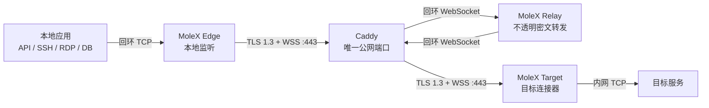

# MoleX 使用手册

[English](user-guide.md) | **简体中文** | [繁體中文](user-guide.zh-TW.md) | [Español](user-guide.es.md) | [Português (Brasil)](user-guide.pt-BR.md) | [Français](user-guide.fr.md) | [Deutsch](user-guide.de.md) | [日本語](user-guide.ja.md) | [한국어](user-guide.ko.md) | [Русский](user-guide.ru.md) | [العربية](user-guide.ar.md) | [हिन्दी](user-guide.hi.md)

本手册面向第一次部署 MoleX 的使用者，也可作为日常运维速查。文中的截图来自真实 WebUI 演示环境，地址、路由标识和流量数字仅用于说明；密钥与令牌始终保持遮罩。

> 当前能力边界：MoleX 是安全的 **TCP** 转发工具。HTTP、HTTPS、API、SSH、RDP 和数据库等基于 TCP 的服务均可转发。MoleX 当前不原生支持 UDP、QUIC/HTTP/3 或 ICMP；[UDP 章节](#udp-现状与替代方案)说明了原因和替代方案。

## 1. 项目介绍

MoleX 是一个 Go 编写的单二进制安全 TCP 传输枢纽。Edge 和 Target 都主动连接公网 Relay 的同一个 WSS 地址，通常由 Caddy 在唯一的公网 `443/tcp` 端口终结 TLS。Relay 只会合双方并转发不透明密文，拿不到端到端载荷密钥，也不能解密业务数据。

主要特性：

- 一个公网 WSS 入口承载任意数量的独立路由；同一 `channel + secret` 可有多个 Edge 和 Target，Relay 按到达顺序一对一 FIFO 配对。
- Target 可通过 `tunnel.pool` 启动 1–64 条独立 WSS 会话；默认值为 1，设置为 2 或更高时，一个 Target 进程可以服务多个 Edge。
- 每条路由在一条 WSS 会话中通过 yamux 承载最多 256 条并发 TCP 流。
- TLS 1.3 内层再使用 X25519、HKDF-SHA256 和 AES-256-GCM。
- Relay 准入令牌与 Edge/Target 端到端密钥相互独立。
- Relay、Edge、Target 共用 CLI 和浏览器 WebUI，不需要桌面环境。
- WebUI 支持英语和简体中文，并提供浅色、深色和跟随系统主题。
- 客户端自动重连，退避从约 1 秒增长到最多 15 秒并带随机抖动。
- Relay 控制台显示节点名称、可信来源 IP、角色、端点、配对关系、平台、在线时长及密文流量。Node name 只是展示标签，多个 Edge/Target 可以同名，临时 peer ID 用于区分连接。

### 1.1 MoleX 名称与品牌含义

`MoleX` 读作 `/moʊl ɛks/`，可以理解为 “Mole + X”：

- **Mole**：鼹鼠在不可见的地下打通隧道，呼应软件在受限网络之间建立安全路径。
- **Xfer / Transfer**：`X` 是传输与交换的缩写意象。
- **Cross / Exchange**：`X` 也表示两端通过会合枢纽交叉连接。
- **X factor**：保留扩展性和工程探索的含义，而不是某一种固定网络协议。

推荐品牌说明：**MoleX - The single-port secure transit hub. One port. Two peers. One secure route.**

名称与图标只是项目识别，不构成匿名性、不可检测性或绝对安全的承诺。MIT 许可证授权软件代码，但不会自动授予商标、项目名或图标的专有权；公开发行前应单独完成名称和商标可用性核查。

## 2. 三端角色和流量路径



| 角色 | 放置位置 | 行为 | 是否接受公网入站 |
| --- | --- | --- | --- |
| Relay | 有公网域名的服务器 | 等待 Edge 与 Target，会合后复制密文帧 | 只由 Caddy 暴露 `443/tcp` |
| Edge | 使用服务的机器 | 路由就绪后开放本地 TCP 监听 | 默认只监听 `127.0.0.1` |
| Target | 能访问目标服务的机器 | 为每条 yamux 流连接 `tunnel.local` | 否，只主动拨出 WSS |

每个本地 TCP 连接对应一条 yamux 流：

```text
应用 TCP -> Edge -> yamux -> AES-GCM -> WebSocket -> Relay
         -> WebSocket -> AES-GCM -> yamux -> Target -> 目标 TCP 服务
```

Relay 可观察来源 IP、连接时间、密文帧长度、流量计数和相同匿名路由的重连，但无法看到应用明文。MoleX 不是匿名网络，也没有流量填充或抗流量分析能力。

## 3. 开始前准备

### 3.1 所需环境

- 一台可被 Edge 和 Target 访问的公网服务器，用于 Relay 与 Caddy。
- 一台运行 Edge 的本地入口机器。
- 一台能够访问目标 TCP 服务的 Target 机器。Edge 与 Target 可以是不同网络中的设备。
- 公网域名，例如 `molex.example.com`，DNS 指向 Relay 服务器。
- 仅开放公网 `443/tcp`；Relay 数据端口和管理端口保持回环监听。

源码构建需要 Go 1.25+ 和 Node.js 20+：

```bash
cd frontend
npm ci
npm run build
cd ..
go build -trimpath -ldflags "-s -w -X main.version=0.2.0" -o bin/molex .
```

Windows 可把输出改为 `bin/molex.exe`。发布包用户只需一个对应平台的 MoleX 二进制。

### 3.2 四类值不要混淆

| 值 | 哪些节点使用 | 作用 | 注意事项 |
| --- | --- | --- | --- |
| Web 管理密码 | 每个 WebUI 节点单独设置 | 登录管理页面 | 不应写入 `molex.json` |
| Relay token | Relay、Edge、Target 三端相同 | 拒绝未授权的 WSS 接入 | Relay 和 Caddy 回环链路可见，不是载荷密钥 |
| End-to-end secret | 只在配对的 Edge 与 Target 相同 | 端到端握手和载荷加密 | Relay 不应获得此值 |
| Channel | 配对的 Edge 与 Target 相同 | 逻辑会合名称 | 不是公网端口；不要放凭据或敏感名称 |

不要把密码、令牌、密钥、API Key、Cookie 或 CSRF 值写入截图、日志、工单或公开仓库。

## 4. 五分钟快速部署

下面使用 `molex.example.com`、通道 `home-ssh` 和本地端口 `2222`。所有占位符都必须替换。

### 4.1 Relay 配置

先生成安全的 Relay 模板：

```bash
molex config init --mode relay --config relay.json
```

检查 `relay.json`，保持 Relay 只监听回环：

```json
{
  "mode": "relay",
  "token": "mx1_REPLACE_WITH_RANDOM_RELAY_TOKEN",
  "listen": "127.0.0.1:8080",
  "tunnel": {}
}
```

Relay token 至少 16 个字符。把同一个值安全地交给 Edge 和 Target，但不要公开。

### 4.2 Caddy 只发布一个公网端口

```caddyfile
molex.example.com {
    tls operator@example.com

    @molex_session {
        path /ws/session
        header Connection *Upgrade*
        header Upgrade websocket
    }

    handle @molex_session {
        reverse_proxy 127.0.0.1:8080
    }

    handle {
        respond "Hello, world." 200
    }

    header {
        Strict-Transport-Security "max-age=31536000; includeSubDomains"
        X-Content-Type-Options nosniff
        Referrer-Policy no-referrer
        -Server
    }
}
```

不要添加通配 CORS，也不要手工强制上游 `Upgrade`/`Connection` 头。Caddy 会自动处理 WebSocket 升级和可信来源地址。

### 4.3 Edge 配置

先生成一次客户端密钥：

```bash
molex config init --mode punch --role edge --config edge.json
```

编辑为：

```json
{
  "mode": "punch",
  "role": "edge",
  "secret": "mx1_SAME_END_TO_END_SECRET_ON_BOTH_CLIENTS",
  "token": "mx1_SAME_RELAY_TOKEN_ON_ALL_THREE_NODES",
  "listen": "127.0.0.1:2222",
  "remote": "wss://molex.example.com/ws/session",
  "tunnel": {
    "remote": "home-ssh",
    "name": "office-edge"
  }
}
```

### 4.4 Target 配置

复制 Edge 生成的端到端密钥，不能再生成另一个：

```json
{
  "mode": "punch",
  "role": "target",
  "secret": "mx1_SAME_END_TO_END_SECRET_ON_BOTH_CLIENTS",
  "token": "mx1_SAME_RELAY_TOKEN_ON_ALL_THREE_NODES",
  "remote": "wss://molex.example.com/ws/session",
  "tunnel": {
    "local": "127.0.0.1:22",
    "remote": "home-ssh",
    "name": "home-target"
  }
}
```

Edge 与 Target 的 `secret`、`token`、`remote` 和 `tunnel.remote` 必须匹配，角色必须互补。只有 Target 使用 `tunnel.local`；只有 Edge 使用 `listen`。同一通道可以运行多个 Edge/Target；Relay 会把每个 Edge 与最早等待的 Target 配成独立会话。`tunnel.name` 仅用于 WebUI 标识，允许重复。

### 4.5 验证并启动

分别检查配置：

```bash
molex config check --config relay.json
molex config check --config edge.json
molex config check --config target.json
```

每台机器创建一个至少 12 个字符、仅服务账户可读的 Web 密码文件，然后启动：

```bash
molex web --config relay.json  --password-file ./web-password --autostart
molex web --config target.json --password-file ./web-password --autostart
molex web --config edge.json   --password-file ./web-password --autostart
```

每条命令在对应机器运行。管理页面默认位于 `http://127.0.0.1:9090`，只允许回环监听。远程管理使用 SSH 转发：

```bash
ssh -N -L 9090:127.0.0.1:9090 user@molex-host
```

然后在本机打开 `http://127.0.0.1:9090`。如需长期远程管理，请用独立 HTTPS 域名反向代理 WebUI。

## 5. WebUI 图解

### 5.1 登录和全局控件


1. 输入当前节点的 Web 管理密码。
2. 右上角语言按钮在英语与简体中文之间切换。
3. 主题按钮依次切换跟随系统、浅色和深色。
4. 登录后右上角退出按钮会结束当前管理会话。

### 5.2 Relay 控制台


- 顶部路径图的箭头表示 Edge 到 Relay 再到 Target 的转发方向。
- “监听地址”是 Relay 数据面地址，不是 Web 管理地址。
- 运行中必须先点击“停止”，才能修改配置；修改后点击“保存”和“启动”。
- “已连接客户端”数量应为互补的一对或多对 Edge/Target。


客户端卡片字段：

| 字段 | 用途 |
| --- | --- |
| 节点名称 | 来自 `tunnel.name` 的展示标签，允许多个客户端同名；连接由 peer ID 区分 |
| Target 会话池 | `tunnel.pool`，Target 的独立出站会话数量，范围 1–64，默认 1 |
| 来源 IP | 直接 Socket 地址，或可信回环代理转发的真实 IP |
| 角色/状态 | Edge 或 Target；等待中或已配对 |
| 转发端点 | Edge 的本地监听或 Target 的目标服务 |
| 路由标识 | 匿名、截短的稳定标签，不是 channel 或密钥 |
| 配对节点 | 当前互补客户端 |
| 中继端点/平台 | 客户端所用 WSS 地址和操作系统架构 |
| 在线/最近流量 | 会话年龄与最后一次密文活动 |
| RX/TX | Relay 观察到的密文字节和帧数，不是明文统计 |

### 5.3 Edge 配置


Edge 负责向本机应用提供入口。只有与 Target 完成认证配对后，`本地监听` 才真正开放；断线时显示“未监听”是保护行为，不是 UI 故障。

### 5.4 Target 配置


Target 的“目标服务”填写它能够访问的 TCP 地址。通常使用回环或内网地址，例如 `127.0.0.1:22`、`10.0.0.25:5432` 或 `api.openai.com:443`。

## 6. 常用场景速查

| 场景 | Target `tunnel.local` | Edge `listen` | 本地使用方式 |
| --- | --- | --- | --- |
| SSH | `127.0.0.1:22` | `127.0.0.1:2222` | `ssh -p 2222 user@127.0.0.1` |
| Windows RDP | `127.0.0.1:3389` | `127.0.0.1:13389` | `mstsc /v:127.0.0.1:13389` |
| HTTP API | `127.0.0.1:8080` | `127.0.0.1:18080` | `curl http://127.0.0.1:18080/health` |
| PostgreSQL | `127.0.0.1:5432` | `127.0.0.1:15432` | `psql -h 127.0.0.1 -p 15432` |
| MySQL | `127.0.0.1:3306` | `127.0.0.1:13306` | `mysql -h 127.0.0.1 -P 13306` |
| Redis | `127.0.0.1:6379` | `127.0.0.1:16379` | `redis-cli -h 127.0.0.1 -p 16379` |
| HTTPS/OpenAI | `api.openai.com:443` | `127.0.0.1:18443` | 使用保留 TLS 主机名的方法，见下节 |

每个场景都应使用独立的 `tunnel.remote` 通道名称。不要在通道或节点名称中放用户名、API Key、客户名称等敏感信息。

### 6.1 HTTP API

假设 Target 能访问 `127.0.0.1:8080` 的内部 API：

```text
Target tunnel.local = 127.0.0.1:8080
Edge   listen       = 127.0.0.1:18080
Both   channel      = internal-api
```

路由就绪后：

```bash
curl http://127.0.0.1:18080/health
```

MoleX 不解析 HTTP，不修改 Host、路径、Header 或 Body；WebSocket 只用于 MoleX 自己的数据通道。应用仍然建立普通 TCP/HTTP 连接。

### 6.2 HTTPS 与 OpenAI API 端点

把 Target 指向：

```text
tunnel.local  = api.openai.com:443
tunnel.remote = openai-api
```

把 Edge 设置为：

```text
listen        = 127.0.0.1:18443
tunnel.remote = openai-api
```

HTTPS 证书验证依赖原始主机名和 SNI，因此不要直接请求 `https://127.0.0.1:18443`。快速测试可让 curl 保留 `api.openai.com`，但把底层 TCP 连接改到 Edge：

```bash
curl --connect-to api.openai.com:443:127.0.0.1:18443 \
  https://api.openai.com/v1/models \
  -H "Authorization: Bearer $OPENAI_API_KEY"
```

PowerShell：

```powershell
curl.exe --connect-to api.openai.com:443:127.0.0.1:18443 `
  https://api.openai.com/v1/models `
  -H "Authorization: Bearer $env:OPENAI_API_KEY"
```

关键点：

- OpenAI API Key 只放在调用程序的环境变量或密钥管理器中，绝不能写进 MoleX 配置。
- `--connect-to` 只改变 TCP 连接目标，URL、TLS SNI 和证书主机名仍是 `api.openai.com`。
- 对 SDK，可让应用的传输层连接到 Edge，同时保持 URL 主机名为 `api.openai.com`；也可在受控机器上使用本地域名映射并让 Edge 监听相应端口。
- 不要把 SDK 的 base URL 简单改成 `https://127.0.0.1:18443`，否则通常会发生证书主机名不匹配。
- 出口 IP 是 Target 所在网络的公网 IP。使用时仍须遵守服务商条款、地区限制和组织安全策略。

MoleX 对 OpenAI 没有专用集成；这是标准的 TLS-over-TCP 转发，因此同样适用于其他 HTTPS API。

### 6.3 SSH

Target 指向 SSH 服务，Edge 开本地高位端口：

```text
Target tunnel.local = 127.0.0.1:22
Edge   listen       = 127.0.0.1:2222
Both   channel      = home-ssh
```

```bash
ssh -p 2222 user@127.0.0.1
scp -P 2222 ./file user@127.0.0.1:/tmp/
```

SSH 自身仍负责用户认证和主机密钥验证；MoleX 不替代它。

### 6.4 RDP

```text
Target tunnel.local = 127.0.0.1:3389
Edge   listen       = 127.0.0.1:13389
Both   channel      = office-rdp
```

```powershell
mstsc /v:127.0.0.1:13389
```

保持网络级身份验证和强 Windows 凭据。不要为了方便把 Edge 监听改成 `0.0.0.0`，除非已有防火墙和访问控制。

### 6.5 数据库

数据库客户端直接连接 Edge 本地端口。数据库账户、TLS 和权限控制仍由数据库负责。生产环境建议：

- Edge 只监听回环地址。
- 使用只读或最小权限账户。
- 数据库自身支持 TLS 时继续启用 TLS。
- 连接池要能在 MoleX 重连后重建失效连接。

### 6.6 同时转发多个服务

一个 MoleX 客户端进程管理一条 Edge/Target WebSocket 路由。同一 `secret` 与 `tunnel.remote` 可以启动多个 Edge 或 Target 进程；Relay 按 FIFO 把每个 Edge 与最早等待的 Target 配成独立加密会话。需要多个服务时，为每条服务准备独立配置和进程：

```text
ssh:      channel=home-ssh      edge=127.0.0.1:2222
postgres: channel=home-pg       edge=127.0.0.1:15432
api:      channel=internal-api  edge=127.0.0.1:18080
```

所有进程仍连接同一个 `wss://molex.example.com/ws/session`，公网依旧只使用 Caddy 的 `443/tcp`。如果每个进程都启用 WebUI，必须给管理监听分配不同的回环端口，例如 `9090`、`9091`、`9092`。

## 7. UDP 现状与替代方案

### 7.1 当前不支持

当前 MoleX 的 Edge 使用 TCP Listener，每个连接映射到 yamux 字节流；Target 再建立 TCP 连接。它没有 UDP Socket、数据报边界、来源地址映射或 UDP 空闲会话管理。因此以下协议不能直接转发：

- 普通 UDP DNS；
- QUIC 和 HTTP/3；
- 游戏、语音、视频和其他实时 UDP；
- UDP syslog、SNMP Trap、NTP；
- ICMP/ping。

### 7.2 可用替代方案

| 需求 | 建议 |
| --- | --- |
| DNS | 使用支持 TCP/53 或 DoH/DoT 的客户端/代理，再通过 MoleX 转发该 TCP 服务 |
| HTTP/3 API | 强制客户端回退到 HTTPS over TCP（HTTP/1.1 或 HTTP/2） |
| Syslog | 把发送端和接收端配置为 TCP syslog |
| 少量自有 UDP 协议 | 在两端部署明确保留数据报边界的 UDP-over-TCP 网关，再把它的 TCP 端口交给 MoleX |
| 游戏、VoIP、QUIC、实时媒体 | 使用 WireGuard、Tailscale 或其他原生 UDP 隧道 |

不要用简单的字节流复制假装透明 UDP：它会丢失数据报边界、来源地址和丢包语义。

### 7.3 未来可实现的边界

MoleX 可以在未来增加 `tunnel.protocol: "udp"`：Edge 按 UDP 来源地址建立有空闲超时的逻辑流，在加密 yamux 流内使用长度帧保留数据报，Target 再使用 UDP Socket 发往 `tunnel.local`。Relay 仍只看到密文。

但外层仍是 WSS/TCP，所以丢包会造成队头阻塞。这种实现只适合 DNS、监控和低速请求/响应，不应宣传为 QUIC、游戏或实时音视频解决方案。在正式发行说明明确宣布支持前，应始终视为不支持 UDP。

## 8. CLI 模式

无需浏览器时可以直接运行：

```bash
molex serve --config relay.json
molex connect --config edge.json
molex connect --config target.json
```

也可用参数覆盖客户端配置：

```bash
molex connect \
  --remote wss://molex.example.com/ws/session \
  --role edge \
  --name office-edge \
  --listen 127.0.0.1:2222 \
  --channel home-ssh \
  --secret "$MOLEX_SECRET" \
  --token "$MOLEX_RELAY_TOKEN"
```

命令行参数可能进入 shell 历史和进程列表，长期运行优先使用受保护的配置文件。`molex web` 与 CLI 使用同一运行时，不会启动子进程。

## 9. 运行与重连行为

- Edge 和 Target 都只发起出站 WSS。
- 配对成功前 Edge 不开放本地监听。
- Relay 或 Target 断开时，Edge 关闭监听并清除“正在监听”状态。
- 客户端持续重试，等待约从 1 秒指数增长到 15 秒，并带 20% 随机抖动。
- 健康会话持续 30 秒后退避重置。
- 已存在的 TCP 连接在路由中断后会关闭；应用应在“加密路由已就绪”后重试或重连。
- 每条路由最多 256 条并发流，超过后新连接会安全失败并显示指导信息。

## 10. 故障排查

| WebUI/日志提示 | 操作 |
| --- | --- |
| HTTP `401`/`403` | 让 Relay、Edge、Target 的 `token` 完全一致 |
| HTTP `404` | 确认 URL 以 `/ws/session` 结尾，Caddy matcher 正确转发 |
| HTTP `502`/`503`/`504` | 启动 Relay，检查 Caddy 上游 `127.0.0.1:8080` |
| DNS 失败 | 检查域名、客户端 DNS 和网络出口 |
| Connection refused | 检查 Caddy/Relay 是否运行、端口和防火墙 |
| TLS verification failed | 检查证书域名、证书链和系统时间 |
| Pairing timeout | 启动另一端；核对 channel、secret、token 与互补角色 |
| 同角色客户端等待 | 同一通道允许多个 Edge/Target；等待互补角色加入，Relay 会按 FIFO 自动配对 |
| Edge address in use | 停止占用进程或更换 `listen` 端口 |
| Target service unavailable | 启动目标服务，检查 `tunnel.local` 与 Target 网络权限 |
| Not listening / 未监听 | 等待安全路由就绪；这是断线时的预期保护状态 |

本地健康检查：

```bash
curl --fail http://127.0.0.1:8080/healthz
curl --fail http://127.0.0.1:9090/healthz
```

## 11. 安全上线清单

- 公网只开放 Caddy 的 `443/tcp`。
- Relay 数据面监听 `127.0.0.1:8080`；管理面监听 `127.0.0.1:9090`。
- 远程 WSS 必须使用有效 TLS 证书；明文 `ws://` 只用于回环测试。
- Relay token 与 payload secret 分别生成至少 32 字节随机值，并分开轮换。
- 每个节点使用不同的强 Web 管理密码和最小权限服务账户。
- 配置文件仅允许服务账户读取；Windows 使用私有目录 ACL。
- Edge 默认监听回环；改为 `0.0.0.0` 会把服务暴露给本地网络，必须额外使用防火墙和应用认证。
- 不在 `tunnel.name`、channel、URL 查询参数或错误截图中放敏感信息。
- 定期更新 MoleX、Caddy、操作系统和前端依赖。
- 为客户端应用启用断线重连；MoleX 不会让旧 TCP 流在底层路由重建后无缝续传。

更多细节见[架构与协议](architecture.md)、[Caddy 部署](deployment-caddy.md)和[安全模型](security.md)。

## 12. MIT 许可证

MoleX 采用 [MIT License](../LICENSE)。在保留版权声明和许可证文本的前提下，任何人都可以使用、复制、修改、合并、发布、分发、再许可和销售软件副本。

软件按“原样”提供，不附带任何明示或暗示担保。MIT 许可证适用于软件代码，不自动授予项目名称、Logo 或第三方商标权利，也不替代使用者对网络、数据、服务条款和当地法律的合规责任。
