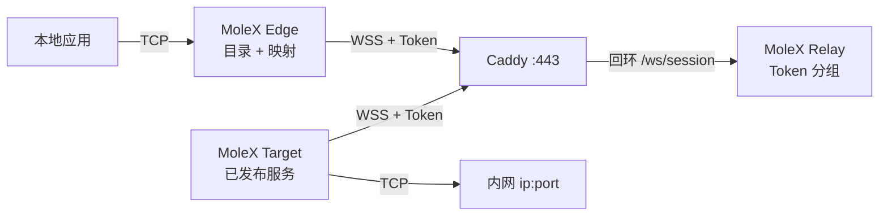
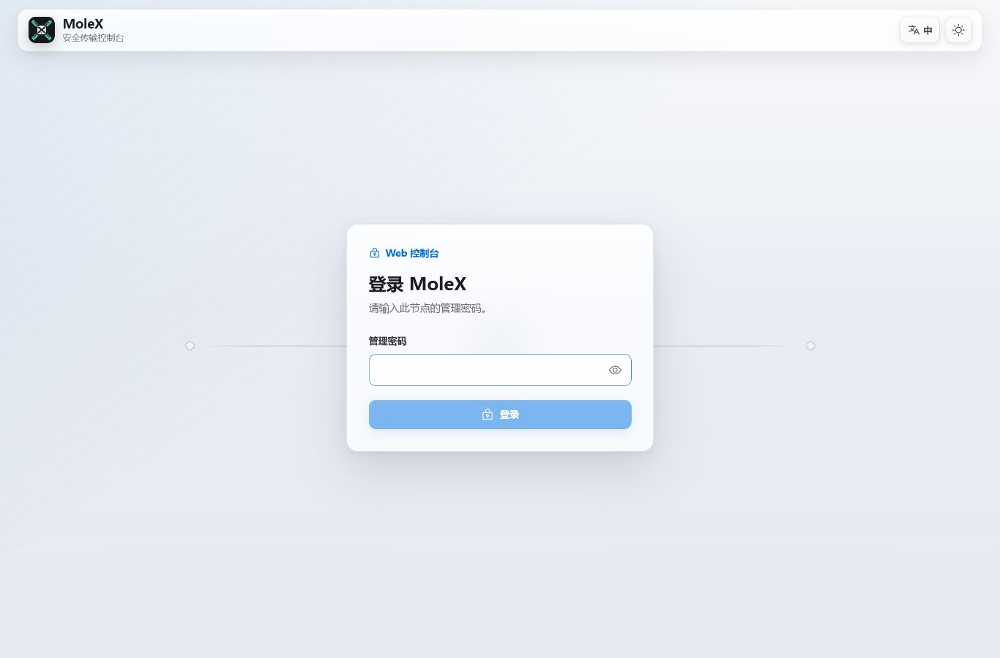
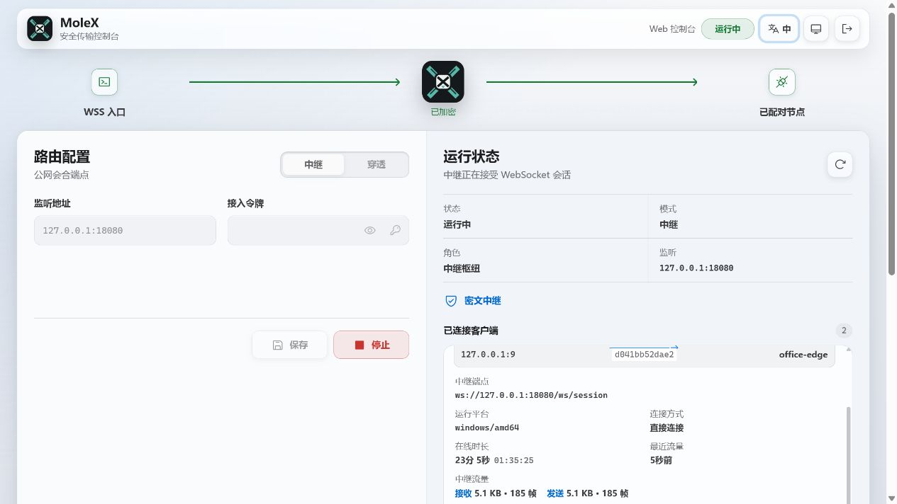
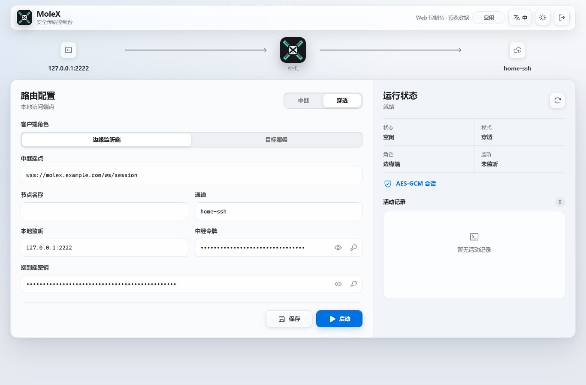

# MoleX 使用手册

[English](user-guide.md) | **简体中文** | [繁體中文](user-guide.zh-TW.md) | [Español](user-guide.es.md) | [Português (Brasil)](user-guide.pt-BR.md) | [Français](user-guide.fr.md) | [Deutsch](user-guide.de.md) | [日本語](user-guide.ja.md) | [한국어](user-guide.ko.md) | [Русский](user-guide.ru.md) | [العربية](user-guide.ar.md) | [हिन्दी](user-guide.hi.md)

本手册面向第一次部署和日常运维。截图来自真实控制台，地址、路由标识和计数仅作说明；Token 始终遮罩。

> MoleX 只转发 **TCP**：HTTP、HTTPS、API、SSH、RDP、数据库。不原生支持 UDP、QUIC/HTTP/3 或 ICMP。见[UDP 现状](#7-udp-现状与替代方案)。

v1（`mode: "punch"` 以及 `role` / `secret` / `channel` / `tunnel`）不会被接受。请用 `molex config init --mode relay|target|edge` 重建配置。详见[升级指南](upgrade-guide.zh-CN.md)。

## 1. 项目介绍

MoleX 是单二进制安全 TCP 传输枢纽。一个接入 Token 定义一组：严格一个 Target，Edge 数量不限。Target 发布内网 `ip:port` 服务，各 Edge 勾选后映射到本机端口。Edge 与 Target 都主动连接同一个公网 WSS。Caddy 通常只开放 `443/tcp`。

Relay 按 Token 准入、分组并复制不透明密文。发行版 Relay 永不解密载荷。持有 Token 的运营者属于信任边界，请把 Token 视同 SSH 私钥。详见[安全模型](security.md)。

主要特性：

- 一个 Token、一个 Target、任意数量 Edge。同 Token 第二个 Target 会被拒绝。
- 一台 Target 或 Edge 可用单个进程加入多组 Token；服务可按组限制可见性。
- 目录实时同步。映射监听只在路由就绪且服务仍发布时开放。
- 载荷保护为 TLS 1.3 内的 X25519 + HKDF-SHA256 + AES-256-GCM。PSK 由 Token 派生。
- Relay 控制台：密码登录、Token 创建/有效期/轮换/停用/删除、审计落盘、在线客户端。
- Target / Edge 控制台：免登录、仅回环、同源与 CSRF 防护。
- 客户端重试：约 1 秒到 15 秒上限，带抖动。

品牌说明：**MoleX — The single-port secure transit hub.**

## 2. 三端角色和流量路径



| 角色 | 放置位置 | 行为 | 公网入站 |
| --- | --- | --- | --- |
| Relay | 有公网域名的服务器 | Token 准入，1 Target + N Edge 分组，复制密文 | 仅 Caddy `443/tcp` |
| Target | 能访问后端的机器 | 发布目录，只拨号已发布地址 | 无；只出站 WSS |
| Edge | 使用服务的机器 | 把已发布服务映射到本地端口 | 默认回环；可选局域网绑定 |

```text
应用 TCP -> Edge 映射 -> yamux（服务 id 寻址头）-> AES-256-GCM -> WSS
        -> Relay 密文复制 -> Target 白名单拨号 -> 后端 TCP
```

## 3. 开始前准备

- 一台公网服务器跑 Relay 与 Caddy，域名例如 `molex.example.com`。
- 一台能访问内网服务的 Target。
- 一台或多台 Edge。
- 公网只开放 `443/tcp`。Relay 数据面和所有 Web 控制台保持回环。

源码构建需要 Go 1.25+ 和 Node.js 20+：

```bash
cd frontend
npm ci
npm run build
cd ..
go build -trimpath -ldflags "-s -w -X main.version=0.4.0" -o bin/molex .
```

Windows 输出为 `bin/molex.exe`。

### 3.1 凭据

| 值 | 使用者 | 作用 |
| --- | --- | --- |
| Web 管理密码 | 仅 Relay 控制台（≥12 字符） | 登录管理页。不写入 `molex.json`。 |
| 接入 Token | Relay 签发；Target / Edge 出示 | 准入、分组，并作为端到端密钥源（`mx2_` + 32 字节随机）。 |

不要把密码、Token、API Key、Cookie 或 CSRF 写入截图、日志、节点名或公开仓库。审计只记录 token id。

## 4. 五分钟快速部署

### 4.1 Relay

```bash
molex config init --mode relay --config relay.json
molex web --config relay.json --password-file ./web-password --autostart
```

登录后创建 Token（备注如 `office-nas`），显示并复制。数据面监听 `127.0.0.1:8080`，控制台优先 `127.0.0.1:9090`。

```json
{
  "mode": "relay",
  "listen": "127.0.0.1:8080",
  "tokens": [
    { "id": "tok-example", "token": "mx2_generated-value", "note": "office" }
  ]
}
```

### 4.2 Caddy

```caddyfile
molex.example.com {
    @molex_session {
        path /ws/session
        header Connection *Upgrade*
        header Upgrade websocket
    }
    handle @molex_session {
        reverse_proxy 127.0.0.1:8080
    }
    handle {
        respond "Hello, world." 200
    }
}

admin.molex.example.com {
    reverse_proxy 127.0.0.1:9090
}
```

不要添加通配 CORS。完整示例见[Caddy 部署](deployment-caddy.md)。

### 4.3 Target

在能访问后端的机器上：

```bash
molex web
```

选择 **Target**，粘贴 WSS 地址和 Token 并启动，然后添加服务（例如 `10.188.200.16:30927`）。保存即发布。

```json
{
  "mode": "target",
  "remote": "wss://molex.example.com/ws/session",
  "token": "mx2_generated-value",
  "name": "home-target",
  "services": [
    { "id": "svc-web", "name": "web", "address": "10.188.200.16:30927" },
    { "id": "svc-ssh", "name": "ssh", "address": "127.0.0.1:22" }
  ]
}
```

单进程加入两组时，用 `tokens` 代替 `token`，并用 `services[].groups` 限制可见性：

```json
{
  "mode": "target",
  "remote": "wss://molex.example.com/ws/session",
  "tokens": [
    { "id": "office", "token": "mx2_office-token" },
    { "id": "lab", "token": "mx2_lab-token" }
  ],
  "services": [
    { "id": "svc-web", "name": "web", "address": "10.188.200.16:30927", "groups": ["office"] }
  ]
}
```

`groups` 为空表示对该 Target 已加入的全部组可见。

### 4.4 Edge

```bash
molex web
```

选择 **Edge**，粘贴同一 WSS 与 Token 并启动。勾选已发布服务，控制台会建议空闲本地端口。仅在局域网其他设备需要访问时开启「局域网可见」（绑定 `0.0.0.0`）。

```json
{
  "mode": "edge",
  "remote": "wss://molex.example.com/ws/session",
  "token": "mx2_generated-value",
  "name": "office-edge",
  "mappings": [
    { "service": "svc-web", "port": 28080 },
    { "service": "svc-ssh", "port": 2222 }
  ]
}
```

加入多组时，每条映射必须填写 `group`。

### 4.5 无浏览器校验与启动

```bash
molex config check --config relay.json
molex config check --config target.json
molex config check --config edge.json

molex serve   --config relay.json
molex connect --config target.json
molex connect --config edge.json
```

Target / Edge 控制台无需密码。远程访问任何控制台请用 SSH 或 HTTPS：

```bash
ssh -N -L 9090:127.0.0.1:9090 user@molex-host
```

## 5. Web 控制台图解

### 5.1 Relay 登录



只有 Relay 控制台需要密码；首次运行会引导创建。语言和主题在三种控制台都可用。Target / Edge 跳过此页。

### 5.2 Relay：Token 与客户端


- 可创建、显示/复制、停用、删除和**轮换** Token。创建时可选择有效期（1 / 7 / 30 / 90 天、1 年或无限），之后可在同一行改期。轮换后旧值在 1–30 天内并行有效（默认 3 天）。
- 管理操作写入配置旁的 JSONL 审计文件（只记 token id）。
- 「监听地址」是数据面，不是 Web 控制台。
- 已连接客户端显示名称、角色、token id、平台、在线时长和密文 RX/TX。「N services / N mappings」会随目录或映射变更刷新。



「断开」会踢掉单个客户端；除非 Token 已停用或过期，否则它会按退避重连。

### 5.3 Target


填写 WSS 和一组或多组 Token。服务填 `名称` + `host:port`。多组时勾选各服务对哪些组可见。保存即时生效。拨号错误只记在该服务上。

### 5.4 Edge



启动后出现目录。勾选服务即可映射。监听只在路由就绪且服务仍发布时存在。故障期间显示「等待中」是预期行为。

## 6. 常用场景速查

在 Target 发布后端，再在 Edge 勾选映射。下面所有服务可以放在同一个 Target 进程里。

| 场景 | Target 服务地址 | Edge 本地端口 | 本机用法 |
| --- | --- | --- | --- |
| SSH | `127.0.0.1:22` | `2222` | `ssh -p 2222 user@127.0.0.1` |
| Windows RDP | `127.0.0.1:3389` | `13389` | `mstsc /v:127.0.0.1:13389` |
| HTTP API | `127.0.0.1:8080` | `18080` | `curl http://127.0.0.1:18080/health` |
| PostgreSQL | `127.0.0.1:5432` | `15432` | `psql -h 127.0.0.1 -p 15432` |
| MySQL | `127.0.0.1:3306` | `13306` | `mysql -h 127.0.0.1 -P 13306` |
| Redis | `127.0.0.1:6379` | `16379` | `redis-cli -h 127.0.0.1 -p 16379` |
| HTTPS API | `api.openai.com:443` | `18443` | 保留 TLS 主机名（见下） |

不要在服务名或节点名里放用户名、API Key 或客户名称。

### 6.1 HTTP API

```bash
curl http://127.0.0.1:18080/health
```

MoleX 不解析 HTTP。WebSocket 只用于 MoleX 自己的数据通道。

### 6.2 HTTPS / OpenAI 兼容 API

不要直接打开 `https://127.0.0.1:18443`，证书主机名会失败。让 TCP 走到 Edge，同时保留原主机名：

```bash
curl --connect-to api.openai.com:443:127.0.0.1:18443 \
  https://api.openai.com/v1/models \
  -H "Authorization: Bearer $OPENAI_API_KEY"
```

API Key 只放在应用环境变量里，不要写入 MoleX 配置。出口 IP 是 Target 所在网络的公网地址。请遵守服务商条款。

### 6.3 SSH 与 RDP

```bash
ssh -p 2222 user@127.0.0.1
scp -P 2222 ./file user@127.0.0.1:/tmp/
```

```powershell
mstsc /v:127.0.0.1:13389
```

认证仍由 SSH / Windows 负责。没有防火墙方案时不要把 Edge 绑到 `0.0.0.0`。

### 6.4 多服务、单进程

在一个 Target 上发布全部后端，各 Edge 只勾选需要的服务。所有会话仍走 `wss://molex.example.com/ws/session`，公网依旧只有 `443/tcp`。同机多个控制台会从 `9090` 起自动错开回环端口；需要稳定 SSH 转发时请显式指定。

## 7. UDP 现状与替代方案

MoleX 没有 UDP Socket 或数据报分帧，不能直接转发 UDP DNS、QUIC/HTTP/3、游戏、语音、NTP 或 ICMP。

| 需求 | 建议 |
| --- | --- |
| DNS | TCP/53、DoH 或 DoT，再转发该 TCP 服务 |
| HTTP/3 API | 强制回退 HTTP/1.1 或 HTTP/2 over TCP |
| Syslog | TCP syslog |
| 游戏、VoIP、QUIC | WireGuard、Tailscale 或其他原生 UDP 隧道 |

## 8. CLI

```bash
molex serve   --config ./relay.json
molex connect --config ./target.json
molex connect --config ./edge.json --remote wss://molex.example.com/ws/session --token "$MOLEX_TOKEN"
molex web     --config ./molex.json --password-file ./web-password --autostart
molex config init  --config ./molex.json --mode relay|target|edge
molex config check --config ./molex.json
molex version
```

命令行 Token 可能进入 shell 历史。长期运行请用受保护的配置文件。Linux 用 `deploy/molex-relay.service` 保活数据面；没有 systemd 时用 `deploy/molex-keepalive.sh`。

## 9. 运行与重连

- Edge 与 Target 只发起出站 WSS。
- 映射监听只在路由就绪且服务仍发布时存在。
- 退避约 1 秒 → 15 秒，±20% 抖动，健康 30 秒后重置。
- 路由中断会关闭已有 TCP；应用必须重试。
- 每个 Edge 进程 / Target 会话最多 256 条并发流。
- 重复 Target 会被拒绝。停用/删除/过期 Token 会断开整组。轮换宽限期内旧值仍可用。

## 10. 故障排查

| 结果 | 操作 |
| --- | --- |
| HTTP `401` | 从 Relay 控制台复制当前 Token。轮换后请在宽限期结束前完成迁移。 |
| HTTP `403` | Token 已停用或过期。请管理员启用、延长有效期或签发新 Token。 |
| HTTP `404` | URL 必须以 `/ws/session` 结尾，且 Caddy 转发该路径。 |
| HTTP `502`/`503`/`504` | 启动 Relay，检查 Caddy 上游 `127.0.0.1:8080`。 |
| 重复 Target | 停止另一个 Target，或改用其他 Token。 |
| 配对超时 | 启动此 Token 对应的 Target。两端都必须是 MoleX v2 且 Token 相同。 |
| 映射等待中 | Target 离线或服务已下架；恢复后自动重开。 |
| 端口占用 | 停止占用进程或换端口；只影响该条映射。 |
| 服务不可用 | 启动后端或修正 Target 地址。 |
| 未监听 | 空闲、连接中或停止中的预期状态。 |

```bash
curl --fail http://127.0.0.1:8080/healthz
curl --fail http://127.0.0.1:9090/healthz
```

## 11. 安全上线清单

- 公网只开放 Caddy `443/tcp`。
- Relay 数据面 `127.0.0.1:8080`，控制台 `127.0.0.1:9090`。
- 远程 WSS 必须使用有效证书。明文 `ws://` 仅回环。
- 在 Relay 控制台生成 Token。用轮换宽限迁移，再更新所有 Target 和 Edge。
- 一组信任关系使用一个 Token。单进程服务多组时用 `groups` 限制可见性。
- 最小权限服务账户；私有配置 ACL。
- 默认回环映射；仅在必要时按条开启局域网可见。
- 为应用启用断线重连。底层路由重建后，旧 TCP 流不会续传。

详见[架构与协议](architecture.md)、[Caddy 部署](deployment-caddy.md)和[安全模型](security.md)。

## 12. MIT 许可证

MoleX 采用 [MIT License](../LICENSE)。软件按「原样」提供。许可证覆盖代码，不自动授予项目名、Logo 或第三方商标权利，也不替代运营者的法律与服务条款责任。
