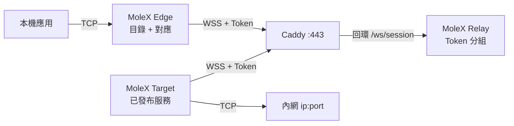

# MoleX 使用手冊

[English](user-guide.md) | [简体中文](user-guide.zh-CN.md) | **繁體中文** | [Español](user-guide.es.md) | [Português (Brasil)](user-guide.pt-BR.md) | [Français](user-guide.fr.md) | [Deutsch](user-guide.de.md) | [日本語](user-guide.ja.md) | [한국어](user-guide.ko.md) | [Русский](user-guide.ru.md) | [العربية](user-guide.ar.md) | [हिन्दी](user-guide.hi.md)

本手冊面向第一次部署與日常維運。截圖來自真實控制台，位址、路由識別與計數僅作說明；Token 始終遮罩。Web 控制台介面目前提供 English 與简体中文；本文件是繁體中文操作說明。

> MoleX 只轉發 **TCP**：HTTP、HTTPS、API、SSH、RDP、資料庫。不原生支援 UDP、QUIC/HTTP/3 或 ICMP。見[UDP 現況](#7-udp-現況與替代方案)。

v1（`mode: "punch"` 以及 `role` / `secret` / `channel` / `tunnel`）不會被接受。請用 `molex config init --mode relay|target|edge` 重建設定。詳見[升級指南](upgrade-guide.md)。

## 1. 專案介紹

MoleX 是單一執行檔的安全 TCP 傳輸樞紐。一個接入 Token 定義一組：嚴格一個 Target，Edge 數量不限。Target 發布內網 `ip:port` 服務，各 Edge 勾選後對應到本機連接埠。Edge 與 Target 都主動連線同一個公網 WSS。Caddy 通常只開放 `443/tcp`。

Relay 依 Token 准入、分組並複製不透明密文。發行版 Relay 永不解密載荷。持有 Token 的營運者屬於信任邊界，請把 Token 視同 SSH 私鑰。詳見[安全模型](security.md)。

主要特性：

- 一個 Token、一個 Target、任意數量 Edge。同 Token 第二個 Target 會被拒絕。
- 一台 Target 或 Edge 可用單一程序加入多組 Token；服務可按組限制可見性。
- 目錄即時同步。對應監聽只在路由就緒且服務仍發布時開放。
- 載荷保護為 TLS 1.3 內的 X25519 + HKDF-SHA256 + AES-256-GCM。PSK 由 Token 衍生。
- Relay 控制台：密碼登入、Token 建立/輪替/停用/刪除、稽核落盤、線上用戶端。
- Target / Edge 控制台：免登入、僅回環、同源與 CSRF 防護。
- 用戶端重試：約 1 秒到 15 秒上限，帶抖動。

品牌說明：**MoleX — The single-port secure transit hub.**

## 2. 三端角色與流量路徑



| 角色 | 放置位置 | 行為 | 公網入站 |
| --- | --- | --- | --- |
| Relay | 有公網網域的伺服器 | Token 准入，1 Target + N Edge 分組，複製密文 | 僅 Caddy `443/tcp` |
| Target | 能存取後端的機器 | 發布目錄，只撥號已發布位址 | 無；只出站 WSS |
| Edge | 使用服務的機器 | 把已發布服務對應到本機連接埠 | 預設回環；可選區域網路繫結 |

```text
應用 TCP -> Edge 對應 -> yamux（服務 id 定址頭）-> AES-256-GCM -> WSS
        -> Relay 密文複製 -> Target 白名單撥號 -> 後端 TCP
```

## 3. 開始前準備

- 一台公網伺服器跑 Relay 與 Caddy，網域例如 `molex.example.com`。
- 一台能存取內網服務的 Target。
- 一台或多台 Edge。
- 公網只開放 `443/tcp`。Relay 資料面與所有 Web 控制台保持回環。

原始碼建置需要 Go 1.25+ 與 Node.js 20+：

```bash
cd frontend
npm ci
npm run build
cd ..
go build -trimpath -ldflags "-s -w -X main.version=0.4.0" -o bin/molex .
```

Windows 輸出為 `bin/molex.exe`。

### 3.1 憑證

| 值 | 使用者 | 作用 |
| --- | --- | --- |
| Web 管理密碼 | 僅 Relay 控制台（≥12 字元） | 登入管理頁。不寫入 `molex.json`。 |
| 接入 Token | Relay 簽發；Target / Edge 出示 | 准入、分組，並作為端到端金鑰來源（`mx2_` + 32 位元組隨機）。 |

不要把密碼、Token、API Key、Cookie 或 CSRF 寫入截圖、日誌、節點名或公開倉庫。稽核只記錄 token id。

## 4. 五分鐘快速部署

### 4.1 Relay

```bash
molex config init --mode relay --config relay.json
molex web --config relay.json --password-file ./web-password --autostart
```

登入後建立 Token（備註如 `office-nas`），顯示並複製。資料面監聽 `127.0.0.1:8080`，控制台優先 `127.0.0.1:9090`。

```json
{
  "mode": "relay",
  "listen": "127.0.0.1:8080",
  "tokens": [
    { "id": "tok-example", "token": "mx2_generated-value", "note": "office" }
  ]
}
```

### 4.2 Caddy

```caddyfile
molex.example.com {
    @molex_session {
        path /ws/session
        header Connection *Upgrade*
        header Upgrade websocket
    }
    handle @molex_session {
        reverse_proxy 127.0.0.1:8080
    }
    handle {
        respond "Hello, world." 200
    }
}

admin.molex.example.com {
    reverse_proxy 127.0.0.1:9090
}
```

不要加入萬用 CORS。完整範例見[Caddy 部署](deployment-caddy.md)。

### 4.3 Target

在能存取後端的機器上：

```bash
molex web
```

選擇 **Target**，貼上 WSS 位址與 Token 並啟動，然後新增服務（例如 `10.188.200.16:30927`）。儲存即發布。

```json
{
  "mode": "target",
  "remote": "wss://molex.example.com/ws/session",
  "token": "mx2_generated-value",
  "name": "home-target",
  "services": [
    { "id": "svc-web", "name": "web", "address": "10.188.200.16:30927" },
    { "id": "svc-ssh", "name": "ssh", "address": "127.0.0.1:22" }
  ]
}
```

單一程序加入兩組時，用 `tokens` 代替 `token`，並用 `services[].groups` 限制可見性：

```json
{
  "mode": "target",
  "remote": "wss://molex.example.com/ws/session",
  "tokens": [
    { "id": "office", "token": "mx2_office-token" },
    { "id": "lab", "token": "mx2_lab-token" }
  ],
  "services": [
    { "id": "svc-web", "name": "web", "address": "10.188.200.16:30927", "groups": ["office"] }
  ]
}
```

`groups` 為空表示對該 Target 已加入的全部組可見。

### 4.4 Edge

```bash
molex web
```

選擇 **Edge**，貼上同一 WSS 與 Token 並啟動。勾選已發布服務，控制台會建議空閒本機連接埠。僅在區域網路其他裝置需要存取時開啟「區域網路可見」（繫結 `0.0.0.0`）。

```json
{
  "mode": "edge",
  "remote": "wss://molex.example.com/ws/session",
  "token": "mx2_generated-value",
  "name": "office-edge",
  "mappings": [
    { "service": "svc-web", "port": 28080 },
    { "service": "svc-ssh", "port": 2222 }
  ]
}
```

加入多組時，每條對應必須填寫 `group`。

### 4.5 無瀏覽器校驗與啟動

```bash
molex config check --config relay.json
molex config check --config target.json
molex config check --config edge.json

molex serve   --config relay.json
molex connect --config target.json
molex connect --config edge.json
```

Target / Edge 控制台無需密碼。遠端存取任何控制台請用 SSH 或 HTTPS：

```bash
ssh -N -L 9090:127.0.0.1:9090 user@molex-host
```

## 5. Web 控制台圖解

### 5.1 Relay 登入


只有 Relay 控制台需要密碼；首次執行會引導建立。語言與主題在三種控制台都可用。Target / Edge 跳過此頁。

### 5.2 Relay：Token 與用戶端


- 可建立、顯示/複製、停用、刪除與**輪替** Token。輪替後舊值在 1–30 天內並行有效（預設 3 天）。
- 管理操作寫入設定旁的 JSONL 稽核檔（只記 token id）。
- 「監聽位址」是資料面，不是 Web 控制台。
- 已連線用戶端顯示名稱、角色、token id、平台、上線時長與密文 RX/TX。「N services / N mappings」會隨目錄或對應變更重新整理。


「中斷」會踢掉單一用戶端；除非 Token 已停用，否則它會依退避重連。

### 5.3 Target


填寫 WSS 與一組或多組 Token。服務填 `名稱` + `host:port`。多組時勾選各服務對哪些組可見。儲存即時生效。撥號錯誤只記在該服務上。

### 5.4 Edge


啟動後出現目錄。勾選服務即可對應。監聽只在路由就緒且服務仍發布時存在。故障期間顯示「等待中」是預期行為。

## 6. 常用情境速查

在 Target 發布後端，再在 Edge 勾選對應。下面所有服務可以放在同一個 Target 程序裡。

| 情境 | Target 服務位址 | Edge 本機連接埠 | 本機用法 |
| --- | --- | --- | --- |
| SSH | `127.0.0.1:22` | `2222` | `ssh -p 2222 user@127.0.0.1` |
| Windows RDP | `127.0.0.1:3389` | `13389` | `mstsc /v:127.0.0.1:13389` |
| HTTP API | `127.0.0.1:8080` | `18080` | `curl http://127.0.0.1:18080/health` |
| PostgreSQL | `127.0.0.1:5432` | `15432` | `psql -h 127.0.0.1 -p 15432` |
| MySQL | `127.0.0.1:3306` | `13306` | `mysql -h 127.0.0.1 -P 13306` |
| Redis | `127.0.0.1:6379` | `16379` | `redis-cli -h 127.0.0.1 -p 16379` |
| HTTPS API | `api.openai.com:443` | `18443` | 保留 TLS 主機名（見下） |

不要在服務名或節點名裡放使用者名稱、API Key 或客戶名稱。

### 6.1 HTTP API

```bash
curl http://127.0.0.1:18080/health
```

MoleX 不解析 HTTP。WebSocket 只用於 MoleX 自己的資料通道。

### 6.2 HTTPS / OpenAI 相容 API

不要直接開啟 `https://127.0.0.1:18443`，憑證主機名會失敗。讓 TCP 走到 Edge，同時保留原主機名：

```bash
curl --connect-to api.openai.com:443:127.0.0.1:18443 \
  https://api.openai.com/v1/models \
  -H "Authorization: Bearer $OPENAI_API_KEY"
```

API Key 只放在應用環境變數裡，不要寫入 MoleX 設定。出口 IP 是 Target 所在網路的公網位址。請遵守服務商條款。

### 6.3 SSH 與 RDP

```bash
ssh -p 2222 user@127.0.0.1
scp -P 2222 ./file user@127.0.0.1:/tmp/
```

```powershell
mstsc /v:127.0.0.1:13389
```

驗證仍由 SSH / Windows 負責。沒有防火牆方案時不要把 Edge 繫到 `0.0.0.0`。

### 6.4 多服務、單程序

在一個 Target 上發布全部後端，各 Edge 只勾選需要的服務。所有工作階段仍走 `wss://molex.example.com/ws/session`，公網依舊只有 `443/tcp`。同機多個控制台會從 `9090` 起自動錯開回環連接埠；需要穩定 SSH 轉發時請明確指定。

## 7. UDP 現況與替代方案

MoleX 沒有 UDP Socket 或資料報分框，不能直接轉發 UDP DNS、QUIC/HTTP/3、遊戲、語音、NTP 或 ICMP。

| 需求 | 建議 |
| --- | --- |
| DNS | TCP/53、DoH 或 DoT，再轉發該 TCP 服務 |
| HTTP/3 API | 強制回退 HTTP/1.1 或 HTTP/2 over TCP |
| Syslog | TCP syslog |
| 遊戲、VoIP、QUIC | WireGuard、Tailscale 或其他原生 UDP 隧道 |

## 8. CLI

```bash
molex serve   --config ./relay.json
molex connect --config ./target.json
molex connect --config ./edge.json --remote wss://molex.example.com/ws/session --token "$MOLEX_TOKEN"
molex web     --config ./molex.json --password-file ./web-password --autostart
molex config init  --config ./molex.json --mode relay|target|edge
molex config check --config ./molex.json
molex version
```

命令列 Token 可能進入 shell 歷史。長期執行請用受保護的設定檔。Linux 用 `deploy/molex-relay.service` 保活資料面；沒有 systemd 時用 `deploy/molex-keepalive.sh`。

## 9. 執行與重連

- Edge 與 Target 只發起出站 WSS。
- 對應監聽只在路由就緒且服務仍發布時存在。
- 退避約 1 秒 → 15 秒，±20% 抖動，健康 30 秒後重設。
- 路由中斷會關閉既有 TCP；應用必須重試。
- 每個 Edge 程序 / Target 工作階段最多 256 條並行串流。
- 重複 Target 會被拒絕。停用/刪除 Token 會中斷整組。輪替寬限期內舊值仍可用。

## 10. 故障排除

| 結果 | 操作 |
| --- | --- |
| HTTP `401` | 從 Relay 控制台複製目前 Token。輪替後請在寬限期結束前完成遷移。 |
| HTTP `403` | Token 已停用。請管理員啟用或簽發新 Token。 |
| HTTP `404` | URL 必須以 `/ws/session` 結尾，且 Caddy 轉發該路徑。 |
| HTTP `502`/`503`/`504` | 啟動 Relay，檢查 Caddy 上游 `127.0.0.1:8080`。 |
| 重複 Target | 停止另一個 Target，或改用其他 Token。 |
| 配對逾時 | 啟動此 Token 對應的 Target。兩端都必須是 MoleX v2 且 Token 相同。 |
| 對應等待中 | Target 離線或服務已下架；恢復後自動重開。 |
| 連接埠占用 | 停止占用程序或換連接埠；只影響該條對應。 |
| 服務不可用 | 啟動後端或修正 Target 位址。 |
| 未監聽 | 閒置、連線中或停止中的預期狀態。 |

```bash
curl --fail http://127.0.0.1:8080/healthz
curl --fail http://127.0.0.1:9090/healthz
```

## 11. 安全上線清單

- 公網只開放 Caddy `443/tcp`。
- Relay 資料面 `127.0.0.1:8080`，控制台 `127.0.0.1:9090`。
- 遠端 WSS 必須使用有效憑證。明文 `ws://` 僅回環。
- 在 Relay 控制台產生 Token。用輪替寬限遷移，再更新所有 Target 與 Edge。
- 一組信任關係使用一個 Token。單程序服務多組時用 `groups` 限制可見性。
- 最小權限服務帳戶；私有設定 ACL。
- 預設回環對應；僅在必要時按條開啟區域網路可見。
- 為應用啟用斷線重連。底層路由重建後，舊 TCP 串流不會續傳。

詳見[架構與協定](architecture.md)、[Caddy 部署](deployment-caddy.md)與[安全模型](security.md)。

## 12. MIT 授權

MoleX 採用 [MIT License](../LICENSE)。軟體按「原樣」提供。授權涵蓋程式碼，不自動授予專案名、Logo 或第三方商標權利，也不取代營運者的法律與服務條款責任。
