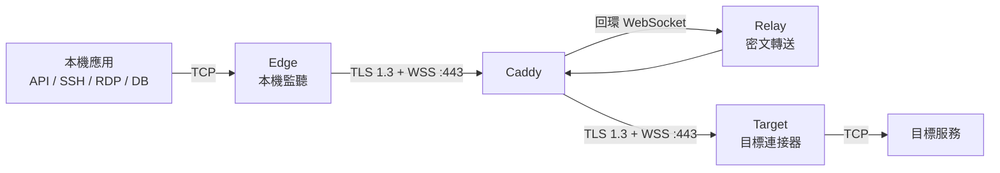

# MoleX 使用手冊（繁體中文）

[English](user-guide.md) | [简体中文](user-guide.zh-CN.md) | **繁體中文** | [Español](user-guide.es.md) | [Português (Brasil)](user-guide.pt-BR.md) | [Français](user-guide.fr.md) | [Deutsch](user-guide.de.md) | [日本語](user-guide.ja.md) | [한국어](user-guide.ko.md) | [Русский](user-guide.ru.md) | [العربية](user-guide.ar.md) | [हिन्दी](user-guide.hi.md)

> MoleX 目前是 **TCP** 安全轉送工具。HTTP、HTTPS/API、SSH、RDP 與資料庫可直接使用；UDP、QUIC/HTTP/3 與 ICMP 目前不支援。WebUI 目前只提供 English 與简体中文，本文件是繁體中文說明文件。

## 1. 專案與品牌

MoleX 是以 Go 編寫的單一執行檔安全 TCP 傳輸樞紐。Edge 與 Target 都主動連線至同一個 Relay WSS 端點；Caddy 通常只在公網開放 `443/tcp`。Relay 只複製不透明密文，不持有端對端 payload secret，也無法解密應用資料。

`MoleX` 讀作 `/moʊl ɛks/`：`Mole` 象徵鼴鼠在不可見處建立隧道；`X` 同時代表 Xfer/Transfer、交叉連接與交換。建議品牌句：**The single-port secure transit hub. One port. Two peers. One secure route.** 名稱並不承諾匿名或不可偵測；MIT 授權程式碼，但不自動授予名稱、Logo 或商標權利，公開發行前應另行檢查商標可用性。

## 2. 架構



| 角色 | 功能 |
| --- | --- |
| Relay | 在公網會合 Edge 與 Target，只轉送密文 |
| Edge | 路由認證完成後開放本機 TCP 連接埠 |
| Target | 接收 yamux stream，連線到 `tunnel.local` |

每個 Edge TCP 連線對應一條 yamux stream。外層是 TLS/WSS，內層以 X25519、HKDF-SHA256、AES-256-GCM 保護。每條路由最多 256 條同時 stream。

## 3. 憑證和值

| 值 | 使用位置 | 用途 |
| --- | --- | --- |
| Web 密碼 | 每個節點個別設定 | WebUI 登入，不寫入 `molex.json` |
| Relay token | Relay、Edge、Target 相同 | WSS 准入；不是 payload key |
| End-to-end secret | 配對的 Edge/Target 相同 | 握手與 payload 加密；Relay 不取得 |
| Channel | 配對的 Edge/Target 相同 | 邏輯會合名稱，不是公網 port |

不要在截圖、日誌、channel、節點名稱或公開儲存庫放入密碼、Token、Secret、API Key、Cookie 或 CSRF 值。

## 4. 快速部署

### Relay

```bash
molex config init --mode relay --config relay.json
```

```json
{
  "mode": "relay",
  "token": "mx1_REPLACE_WITH_RANDOM_RELAY_TOKEN",
  "listen": "127.0.0.1:8080",
  "tunnel": {}
}
```

Caddy：

```caddyfile
molex.example.com {
    @molex_session {
        path /ws/session
        header Connection *Upgrade*
        header Upgrade websocket
    }
    handle @molex_session {
        reverse_proxy 127.0.0.1:8080
    }
    handle {
        respond "Hello, world." 200
    }
}
```

不要加入 wildcard CORS，也不要手動強制 upstream Upgrade headers。

### Edge

```json
{
  "mode": "punch",
  "role": "edge",
  "secret": "mx1_SAME_END_TO_END_SECRET_ON_BOTH_CLIENTS",
  "token": "mx1_SAME_RELAY_TOKEN_ON_ALL_THREE_NODES",
  "listen": "127.0.0.1:2222",
  "remote": "wss://molex.example.com/ws/session",
  "tunnel": {
    "remote": "home-ssh",
    "name": "office-edge"
  }
}
```

### Target

```json
{
  "mode": "punch",
  "role": "target",
  "secret": "mx1_SAME_END_TO_END_SECRET_ON_BOTH_CLIENTS",
  "token": "mx1_SAME_RELAY_TOKEN_ON_ALL_THREE_NODES",
  "remote": "wss://molex.example.com/ws/session",
  "tunnel": {
    "local": "127.0.0.1:22",
    "remote": "home-ssh",
    "name": "home-target"
  }
}
```

Edge 與 Target 的 `secret`、`token`、`remote`、`tunnel.remote` 必須相同；角色必須互補。

```bash
molex config check --config relay.json
molex config check --config edge.json
molex config check --config target.json
```

在各自機器啟動：

```bash
molex web --config relay.json  --password-file ./web-password --autostart
molex web --config target.json --password-file ./web-password --autostart
molex web --config edge.json   --password-file ./web-password --autostart
```

管理介面優先使用 `127.0.0.1:9090`，占用時自動選擇其他回環 port，監聽成功後開啟預設瀏覽器。伺服器、SSH forwarding 或反向代理請固定使用 `--listen 127.0.0.1:9090 --open-browser=false`。遠端使用 SSH forwarding：

```bash
ssh -N -L 9090:127.0.0.1:9090 user@molex-host
```

## 5. WebUI 圖解


登入後可切換 English/简体中文、系統/淺色/深色主題。執行中必須先 Stop 才能修改，再 Save、Start。


Relay 的 client card 顯示節點名稱、可信來源 IP、角色、配對狀態、forward endpoint、匿名 Route ID、平台、上線時間與密文 RX/TX。Route ID 不是 channel 或 secret。


Edge 只在安全配對完成後監聽；斷線時 `Not listening` 是預期保護。


Target service 填寫 Target 主機可存取的 TCP 位址。

## 6. 場景速查

| 場景 | Target | Edge | 用法 |
| --- | --- | --- | --- |
| SSH | `127.0.0.1:22` | `127.0.0.1:2222` | `ssh -p 2222 user@127.0.0.1` |
| RDP | `127.0.0.1:3389` | `127.0.0.1:13389` | `mstsc /v:127.0.0.1:13389` |
| HTTP API | `127.0.0.1:8080` | `127.0.0.1:18080` | `curl http://127.0.0.1:18080/health` |
| PostgreSQL | `127.0.0.1:5432` | `127.0.0.1:15432` | `psql -h 127.0.0.1 -p 15432` |
| OpenAI HTTPS | `api.openai.com:443` | `127.0.0.1:18443` | 保留 TLS hostname，見下節 |

### OpenAI / HTTPS

Target 使用 `api.openai.com:443`，Edge 使用 `127.0.0.1:18443`，兩端 channel 設為 `openai-api`。不可直接請求 `https://127.0.0.1:18443`，否則 TLS hostname 不符。

```bash
curl --connect-to api.openai.com:443:127.0.0.1:18443 \
  https://api.openai.com/v1/models \
  -H "Authorization: Bearer $OPENAI_API_KEY"
```

`--connect-to` 只改變 TCP 目的地，URL、SNI 與 certificate hostname 仍是 `api.openai.com`。API Key 只放在應用的環境變數或 secret manager，絕不放入 MoleX config。Target 網路是實際出口；仍須遵守供應商條款與區域政策。

### 多服務

一個 client process 管理一條 route。多服務使用不同 config、channel、本機 port 與 process，但都連線到同一個 `/ws/session`，所以公網仍只有 `443/tcp`。多個 WebUI 會自動選擇不同回環管理 port；需要穩定代理位址時請明確指定 9090、9091、9092。

## 7. UDP

目前不支援原生 UDP，因為現行 Edge/Target 與 yamux 都使用 TCP byte stream，沒有 datagram boundary、來源 mapping 或 idle flow 管理。普通 UDP DNS、QUIC/HTTP/3、遊戲、VoIP、NTP、SNMP Trap 與 ICMP 不能直接轉送。

- DNS：改用 TCP/53、DoH 或 DoT。
- HTTP/3：讓 client fallback 到 HTTP/1.1 或 HTTP/2。
- Syslog：改用 TCP syslog。
- 遊戲、VoIP、QUIC：使用 WireGuard/Tailscale 等原生 UDP tunnel。

未來可增加 `tunnel.protocol: "udp"` 並在加密 stream 內保留 datagram boundary，但 WSS/TCP 仍會產生 head-of-line blocking，只適合 DNS、監控等低速流量。正式 release note 宣布前，一律視為 TCP-only。

## 8. 重連與故障排除

- 重試約由 1 秒增至 15 秒，含 20% jitter；健康 30 秒後 reset。
- Route 中斷會關閉舊 TCP connection；應用需重新連線。
- HTTP 401/403：三端 token 不一致。
- HTTP 404：確認 `/ws/session` 和 Caddy matcher。
- HTTP 502/503/504：檢查 Relay 與 Caddy upstream。
- Pairing timeout：確認另一端、channel、secret、token 與互補 role。
- Edge address in use：釋放或更換 local listen。
- Target unavailable：啟動服務並檢查 `tunnel.local`。

## 9. 安全與 MIT

只開放 Caddy `443/tcp`；Relay data 與 Web management 維持 loopback。遠端必須用 WSS/TLS。使用獨立隨機 Relay token 與 payload secret，保護 config ACL，Edge 預設只監聽 loopback。

MoleX 採用 [MIT License](../LICENSE)：保留 copyright 與 license notice 後，可使用、複製、修改、合併、發布、散布、再授權與銷售。軟體按原樣提供，無任何保證；授權不自動授予專案名稱、Logo 或第三方商標權利。
